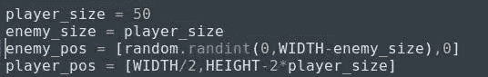
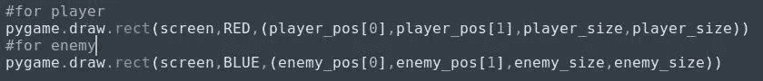
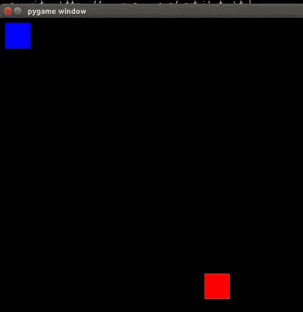
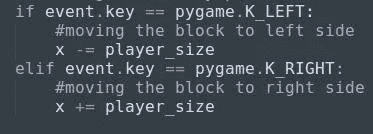

# Python 中的基本二维游戏(第三部分)

> 原文：<https://medium.datadriveninvestor.com/basic-2-d-game-in-python-part-3-f6f8910ff972?source=collection_archive---------22----------------------->

文章的第三部分，我们将画出敌人在哪里。

*在更进一步之前，如果你想看这场比赛的原视频，请点击* [*这里*](https://www.youtube.com/watch?v=-8n91btt5d8&lc=z22dzrcysrrsd5yvmacdp435unyj5zbexr0inn5bewhw03c010c.1571697702780616) *。*[*Keith Galli*](https://medium.com/u/d4ac622fea59)*做得非常出色，请访问他的频道，以防你有兴趣通过游戏学习编码。*

现在敌人应该在玩家之上。到目前为止，画敌人是最简单的事情，你只需要重用画图播放器的代码。请记住，敌人应该来自屏幕的顶部，因此要恰当地使用这个位置。试试这里，根据你的知识，看看我的代码。

> > **pygame.draw.rect(screen，(0，0，255)，(10，10，50，50))**

(注意:-如果我们再次将这些值赋给一些全局变量，效果会更好)

enemy_and_player declaration

enemy and player declaration

blue-enemy and red-player

(注意:-如果我们将玩家移动到一个街区而不是一个像素，这将是令人放松的。否则游戏会超级无聊。)
要做到这一点，我们只需要用玩家的尺寸来更新机芯，即 50px。怎么会？

moving one block

在继续之前，我需要在这里提一下，我们画的敌人可以来自顶部的任何随机位置。可以是极左，极右，也可以是任何地方。为此，我们需要给敌人设置一些随机的位置值。为此，我们必须首先在程序中导入 [***随机***](https://www.geeksforgeeks.org/random-numbers-in-python/) 模块，然后给它分配随机值。

随机模块用于生成给定范围内的随机数。该模块通常用在游戏应用中。

**> >随机导入**

**> >敌国 _pos = [random.randint(0，WIDTH)，0]**

**‘WIDTH’**是我们赋给值 800 的全局变量。

**randint** '是从 random 模块生成 0 到 800 之间的随机数的方法。每次代码运行时，敌人的位置可能在 0 到 800 之间。

*(注意:-这里我们给第二个值等于零，因为直到现在敌人都出现在控制台的顶部。在那里，y 坐标永远是零。)*

第三部分结束了，直到这一点我们制造了敌人，并为玩家设定了固定的位置。
第四部分请点击 [*此处*](https://medium.com/@asishraz/basic-2-d-game-in-python-part-4-81e8e53e86c4) 。如果你还没有读到第二部分，点击 [*这里*](https://medium.com/@asishraz/basic-2-d-game-in-python-part-2-5b1b75b24ac8) 。如果你觉得这篇文章很有趣，请鼓掌并分享给你的朋友。