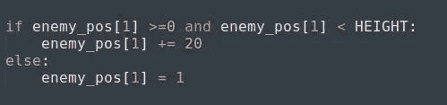
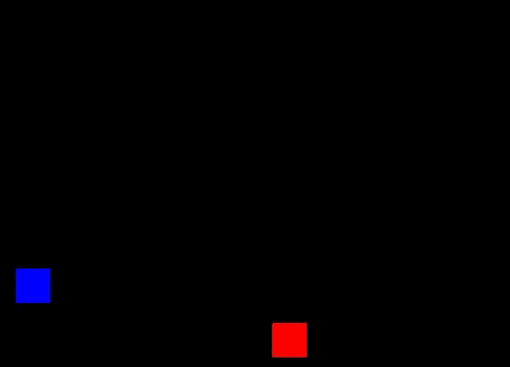
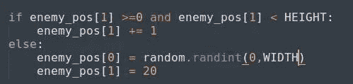

# Python 中的基本二维游戏(第 4 部分)

> 原文：<https://medium.datadriveninvestor.com/basic-2-d-game-in-python-part-4-81e8e53e86c4?source=collection_archive---------23----------------------->

这是文章的第四部分，我们将从上到下把敌人放下来。

*在更进一步之前，如果你想看这场比赛的原视频，请点击* [*这里*](https://www.youtube.com/watch?v=-8n91btt5d8&lc=z22dzrcysrrsd5yvmacdp435unyj5zbexr0inn5bewhw03c010c.1571697702780616) *。*[*Keith Galli*](https://medium.com/u/d4ac622fea59)*做得非常出色，请访问他的频道，以防你有兴趣通过游戏学习编码。*

要把敌人从上到下扔下去，这里需要理解简单的数学。敌人的方块会从上到下移动，这意味着它的 y 坐标在增加，它会移动到屏幕的高度。我们只需要更新 y 坐标，也就是' *enemy_pos[1]'。*

enemy_dropping from top

在这里，我们将检查 y 坐标是否在游戏屏幕的范围内，如果是，我们将其位置向下移动 20px 单位。
如果块超出屏幕，我们将再次将其值更新为零。所以，它会从零开始。
一旦运行这段代码，您将会看到如下内容:

enemy coming down

(*我捕捉不到敌人从上到下的快速移动)*

敌人格挡的速度超级快。我们赢不了它。我们必须让它慢一点，才能看到并拯救我们的街区。为此，我们必须减少每秒帧数，为此，我们必须使用 pygame 的一个模块，它负责监控时间，[***【py game . time】***](https://www.pygame.org/docs/ref/time.html#pygame.time.Clock)***。***

然后我们将创建一个跟踪时间的对象。为此，我们要用一个方法:'[***【pygame . time . clock()***](https://www.pygame.org/docs/ref/time.html#pygame.time.Clock)***'***

***>>clock = py game . time . clock()***

这里，' ***时钟*** '是一个跟踪时间的对象，现在我们必须用帧速率更新时钟。为此，我们需要使用一种负责更新时间的方法:'[***【pygame . time . clock . tick(frame rate)***](https://www.pygame.org/docs/ref/time.html#pygame.time.Clock.tick)***'***

当你想降低游戏中某些功能的速度时，这种方法很有用。在这里，我们想减慢敌人的速度，为此，我们将分配一些帧速率，并根据这一点，块将出现。这个方法应该每帧调用一次。

> > **clock.tick(30)**

程序永远不会以超过每秒 30 帧的速度运行。

写下上面的代码并执行它，你会注意到速度的不同。如果你有任何疑问或问题，请让我知道。

如果你注意到，块只来自一个位置，但是我们希望块来自屏幕内的任意位置。

我们到底要更新什么，才能看到方块从随机位置掉落？

答案太简单了。一旦块离开屏幕，我们只需要更新块的 x 坐标。就是这样。

enemy dropping from top

在这里，你会看到，每当敌人越过屏幕*(向下方向)*，我们就将 ***的值更新为 **1** 。但是我们没有提到随机的 x 坐标。所以我们也必须更新 x 坐标。(*想想，我们要写什么，我已经给过你提示了)****

只有一句话，那就是:

每一次，敌人会离开屏幕，x 坐标会为方块生成一些随机位置。*(我告诉过你，真的很简单；))*

现在我们来到了第四部分的结尾，直到这一点我们从顶部放下了敌人，我们能够减慢敌人的速度。

第五部分请点击 [*此处*](https://medium.com/@asishraz/basic-2-d-game-in-python-part-5-e6f5aff1cf5c) 。如果你还没有看完第三部分，点击 [*这里*](https://medium.com/@asishraz/basic-2-d-game-in-python-part-3-f6f8910ff972) 。如果你觉得这篇文章很有趣，请鼓掌并分享给你的朋友。