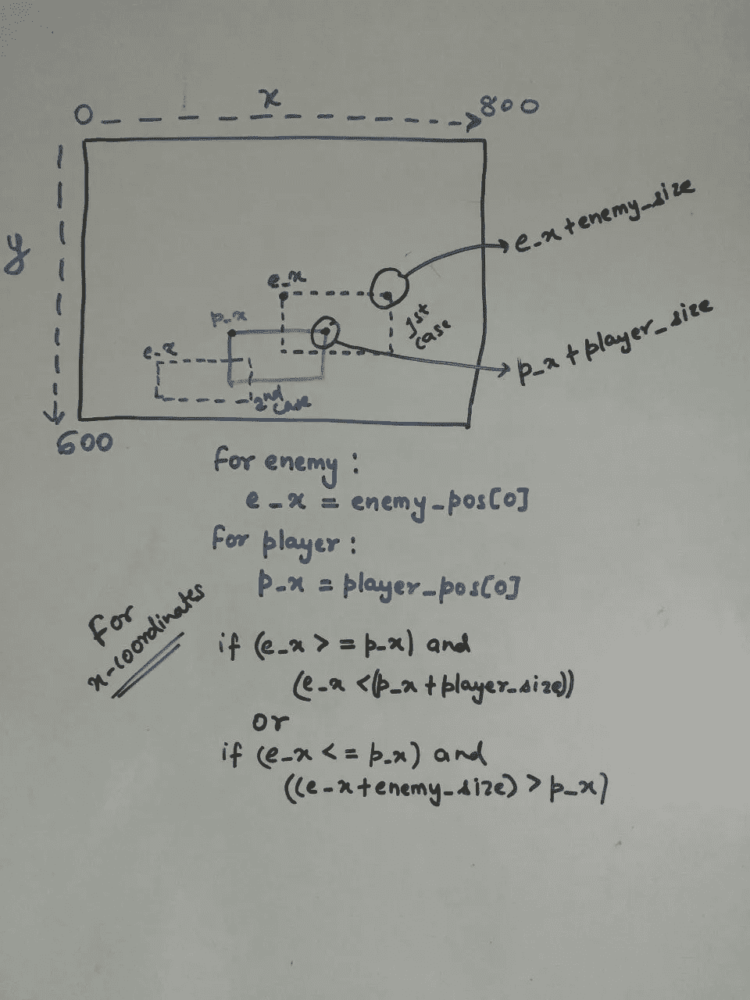
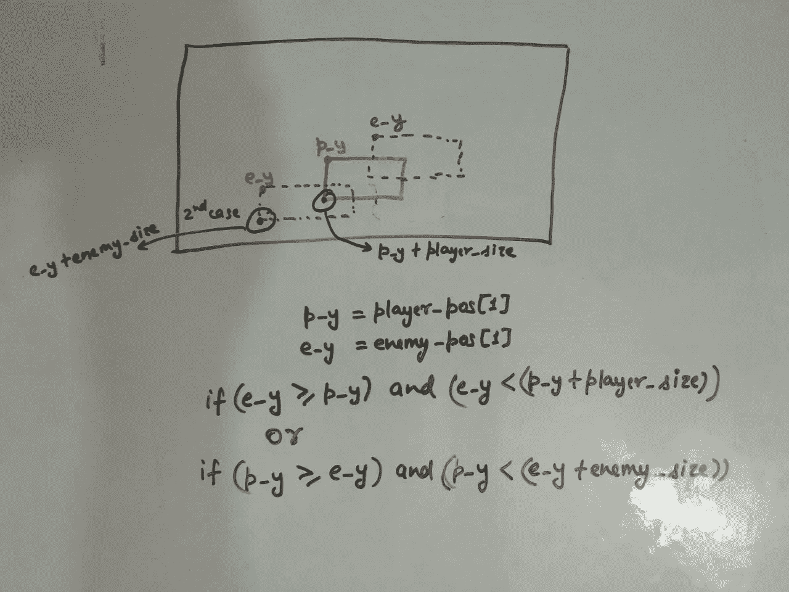
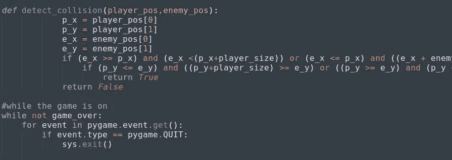
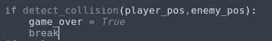

# Python 中的基本二维游戏(第 5 部分)

> 原文：<https://medium.datadriveninvestor.com/basic-2-d-game-in-python-part-5-e6f5aff1cf5c?source=collection_archive---------19----------------------->

文章的第五部分，这里我们将重点讨论敌人和玩家之间的碰撞。

*在更进一步之前，如果你想看这场比赛的原视频，请点击* [*这里*](https://www.youtube.com/watch?v=-8n91btt5d8&lc=z22dzrcysrrsd5yvmacdp435unyj5zbexr0inn5bewhw03c010c.1571697702780616) *。*[*Keith Galli*](https://medium.com/u/d4ac622fea59)*做得非常出色，请访问他的频道，以防你有兴趣通过游戏学习编码。*

现在游戏的主要部分，也就是碰撞。为此，我们需要理解简单的数学。

math

(*抱歉图像质量…)*

这里，红色方块是玩家，蓝色方块是敌人。我举了两个碰撞的例子。首先，我们将处理 x 坐标。

在一种情况下，敌人的块将很少向前到玩家块。在这种情况下，**敌人 _ 位置[0]** ，即 **e_x** 将大于 **p_x** ，也将小于**玩家 _ 位置[0]** + **玩家 _ 大小**，即**p _ x+玩家 _ 大小。**在简单的等式中，我们可以这样写:

> > **if (e_x ≥ p_x)和(e_x < (p_x+player_size))**

第二种情况，敌人的格挡在玩家的格挡后面。在这种情况下， **p_x** 将大于 **e_x** ，并且它也将小于**e _ x+敌人 _ 大小**。在一个简单的等式中，我们可以这样写:

> > **if (e_x ≤ p_x) and ((e_x +敌国 _size) > p_x)**

好吧，这是为了 x 坐标。对于 y 坐标，我不会解释，因为它很容易写。

for y-coordinates

最好将上述场景写在一个函数下，从现在开始，我们将在特定函数下编写所有案例。在编写完整个场景后，在一个函数下，它将看起来像这样:

detect_collision

记住，在 while 循环之外编写这个函数，因为我们必须为这个函数设置一个条件，它将在循环之外进行检查。

我已经将该函数命名为' **detect_collision** '，它将采用两个参数作为***player _ position***和 ***敌国 _position*** 。现在写完这段代码后，需要添加一个小东西。如果上述条件成立，那么结束游戏。这意味着，如果碰撞发生，退出游戏。为此，我们必须在 while 循环下编写一个条件:

collision_will_end_the_game

到目前为止，如果在执行过程中还有什么困惑或问题，请在评论区告诉我。到目前为止，我们已经做了些什么。创造了一个游戏主机
2。创造了我们的玩家
3。使玩家可以左右移动
4。创造了我们的敌人
5。使敌人上下移动
6。使敌人随机出现在 x 坐标
7。写了碰撞的条件
现在只剩下几件事了。然后，你就可以开始你的第一次游戏体验了，这将是你自己创造的。哇！！！！

第五部分已经结束，直到这一点，我们对玩家碰撞敌人。
第六部分请点击 [*此处*](https://medium.com/@asishraz/basic-2-d-game-in-python-part-6-21a7807af2cf) 。如果你还没有看完第四部分，点击 [*这里*](https://medium.com/@asishraz/basic-2-d-game-in-python-part-4-81e8e53e86c4) 。如果你觉得这篇文章很有趣，请鼓掌并分享给你的朋友。