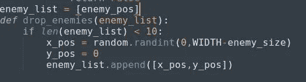
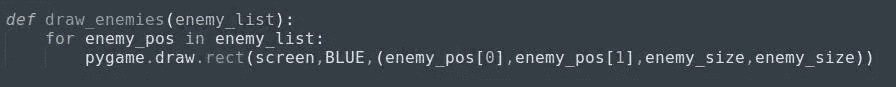
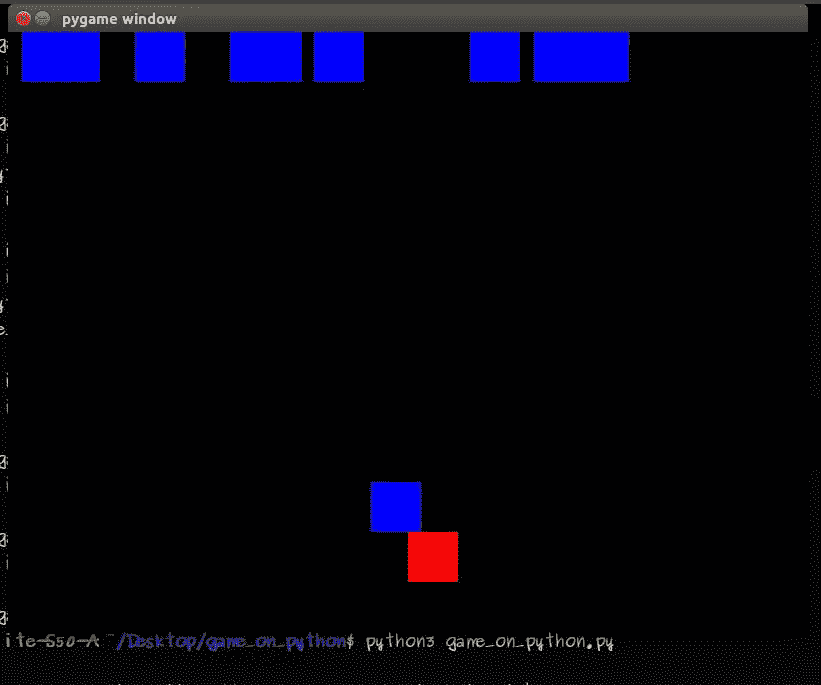
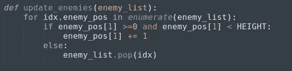
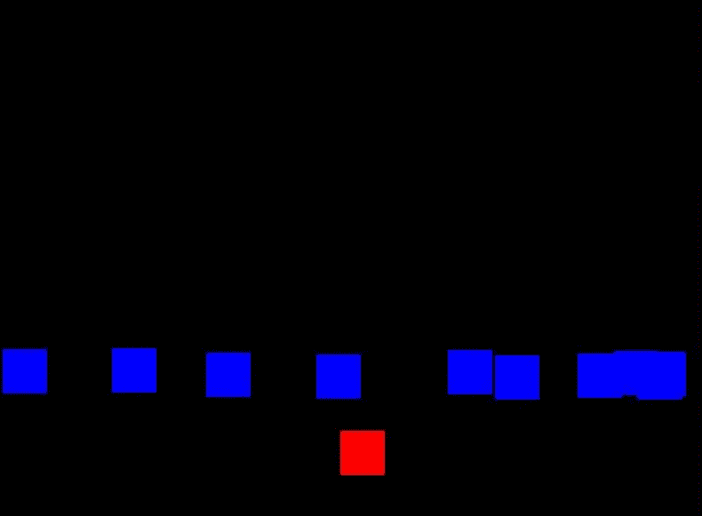

# Python 中的基本二维游戏(第 6 部分)

> 原文：<https://medium.datadriveninvestor.com/basic-2-d-game-in-python-part-6-21a7807af2cf?source=collection_archive---------20----------------------->

这是文章的第六部分，我们将在这里添加更多的敌人。

*在更进一步之前，如果你想看这场比赛的原视频，请点击* [*这里*](https://www.youtube.com/watch?v=-8n91btt5d8&lc=z22dzrcysrrsd5yvmacdp435unyj5zbexr0inn5bewhw03c010c.1571697702780616) *。*[*Keith Galli*](https://medium.com/u/d4ac622fea59)*做得非常出色，请访问他的频道，以防你有兴趣通过游戏学习编码。*

如果从上到下只有一个敌人来的话会超级无聊。我们将添加块的数量，使它变得有趣。

我们可以有任何数量的块，这将下降。但是如果我们有大约 10 个街区，它会看起来不错。

我们必须观察到，所有这些块都来自顶部，即 y 坐标将为零，并且它可以来自任何宽度范围，即 x 坐标将在范围(0，800)下变化。

我们将创建一个函数来添加这些敌人:

drop_enemies

我们将创建一个只有一个敌人的列表。然后我们会把这个列表作为一个函数参数，我们会把我们的随机块添加到这个列表中。第一次，名单上只有一个敌人。那么如果列表小于 10，也就是说，如果块数小于 10，那么在 x 坐标上随机添加一些块，添加到列表中。

现在，我们必须画出所有这些我们在上面创造的敌人。为此，我们将创建一个函数(*比方说 draw _ anthonies*)，它将遍历敌人列表，每次迭代，它将在那个随机坐标上创建一个敌人。

draw_enemies

这里我们迭代的是' ***敌人 _ 列表'*** ，其中长度或敌人数量为 9。正如我们借助'**drop _ anthonies()'**函数添加敌人一样，现在'**draw _ anthonies()'**每次迭代 ***敌人列表时都会画出一个敌人。***

现在，我们必须在代码的最后调用这些函数。

***> >【掉落 _ 敌人(敌人 _ 列表)
> >吸取 _ 敌人(敌人 _ 列表)***

当您执行上面的代码时，它看起来会像这样:

drawing_enemies

为什么这样？(思考几分钟，你会有一个想法，为什么会这样)
原因是，我们没有更新块的位置。我们添加了块的数量，我们正在绘制这些块的数量，但是我们仍然没有更新所有这些块的位置。我们将创建一个函数，它将更新敌人的街区:

updating enemies

几件事:

***idx***’——我们刚刚为 index 取了一个变量名，它将遍历敌人列表。

[***枚举***](https://www.geeksforgeeks.org/enumerate-in-python/) ***-*** 这是一个用于统计一个链表发生的迭代次数的函数。

上面的代码，我们已经写了，我们从上到下放下了敌人。只要把整个代码放在这个函数中，我们就必须改变 else 条件。如果块超出了屏幕尺寸，那么我们必须从列表中弹出那个块。**就是这么个‘T11’。**[***pop()***](https://www.geeksforgeeks.org/python-list-pop/)‘做。别忘了调用这个函数。

> >**更新 _ 敌人(敌人 _ 列表)**

如果我们在同一个盘子上，那么一旦你运行代码，你将得到下面的输出。

all enemies at a time

第六部分已经结束了，到目前为止我们增加了一些敌人。
第七部请点击 [*此处*](https://medium.com/@asishraz/basic-2-d-game-in-python-part-7-f5411e5078bd) 。如果你还没看完第五部，点击 [*这里*](https://medium.com/@asishraz/basic-2-d-game-in-python-part-5-e6f5aff1cf5c) 。如果你觉得这篇文章很有趣，请鼓掌并分享给你的朋友。