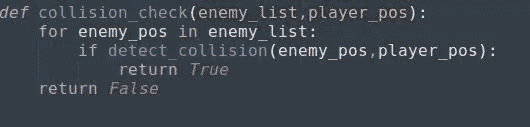
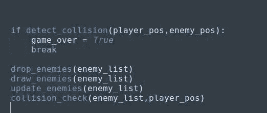
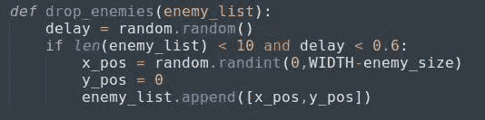

# Python 中的基本二维游戏(第 7 部分)

> 原文：<https://medium.datadriveninvestor.com/basic-2-d-game-in-python-part-7-f5411e5078bd?source=collection_archive---------21----------------------->

文章的第七部分，我们将检查碰撞并相应地退出游戏。

*在更进一步之前，如果你想看这场比赛的原视频，请点击* [*这里*](https://www.youtube.com/watch?v=-8n91btt5d8&lc=z22dzrcysrrsd5yvmacdp435unyj5zbexr0inn5bewhw03c010c.1571697702780616) *。*[*Keith Galli*](https://medium.com/u/d4ac622fea59)*做得非常出色，请访问他的频道，以防你有兴趣通过游戏学习编码。*

从上一部分你会注意到，所有的敌人都聚集在一起，没有碰撞发生。太好了。那你就走对了。；)
我们必须创建一个函数来检查碰撞，不管它是否发生。如果碰撞正在发生，退出游戏。

collision check w.r.t player_pos

这里，我们正在创建一个带有参数**敌人列表**的函数，对于碰撞，玩家位置很重要。就是这个原因，我们把 **player_position** 作为一个参数。然后我们将遍历列表，函数' **detect_collision** '将向函数' **collision_check** '返回值，如果值为真，上述函数将返回 **TRUE** 。不要忘记在代码中调用这些函数。

all function calling

这里你可能会有一个困惑，那就是已经' **detect_collision()** '正在检查条件真/假，那么' **collision_check()** '有什么用呢？这就是为什么我们必须删除上面的' *if* '条件，现在我们必须检查' **collision_check()** '。如果是真的，那我们就结束游戏。

checking collision_check function

一切都很完美。不是吗？如果你说“是”，那么你错过了更大的图景。那就是:所有的块同时到来
我们必须对此做些什么。

drop_enemies function

如果你在这里看到，每当列表少于 10，我们在同一时间添加所有的敌人，因此，所有这些敌人都在同一时间到来。我们现在要做的，是拖延敌人的出现。我们必须将每个区块错开几分之一秒。

***'***[***random . random()'***](https://www.geeksforgeeks.org/random-numbers-in-python/)会生成一个小于 1 且大于等于 0 的浮点数**。**现在，代码将检查，如果列表的长度小于 10，并且随机生成的‘**delay**的值小于 0.6，则出现第一个块，这样，所有的块将出现在屏幕上，延迟从 0 秒到 0.6 秒。

(*注:-在这种情况下，你不会发现任何块下落的差异。您可以将延迟条件减少 0.1 或根据您自己的需要。)*

我们几乎到达了终点，在这一部分，我们检查了碰撞并错开了所有敌人的时间。
最后一部分请点击 [*此处*](https://medium.com/@asishraz/basic-2-d-game-in-python-part-8-2be123196e54) 。如果你还没看完第六部，点击[T22 这里 。如果你觉得这篇文章很有趣，请鼓掌并分享给你的朋友。](https://medium.com/@asishraz/basic-2-d-game-in-python-part-6-21a7807af2cf)