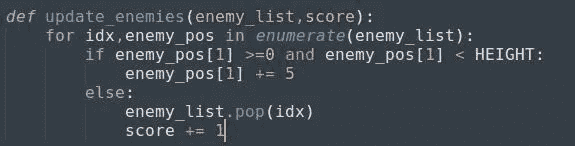
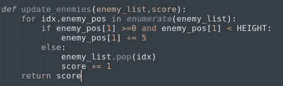
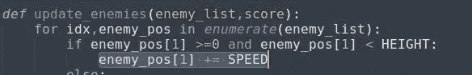
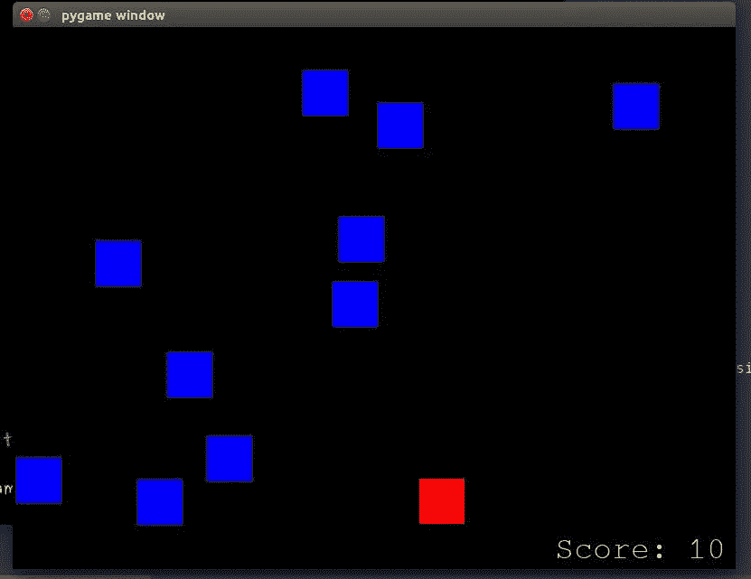

# Python 中的基本二维游戏(第 8 部分)

> 原文：<https://medium.datadriveninvestor.com/basic-2-d-game-in-python-part-8-2be123196e54?source=collection_archive---------16----------------------->

这是文章的最后一部分，我们将添加一个记分卡，增加游戏的级别。

*在更进一步之前，如果你想看这场比赛的原视频，请点击* [*这里*](https://www.youtube.com/watch?v=-8n91btt5d8&lc=z22dzrcysrrsd5yvmacdp435unyj5zbexr0inn5bewhw03c010c.1571697702780616) *。*[*Keith Galli*](https://medium.com/u/d4ac622fea59)*做得非常出色，请访问他的频道，以防你有兴趣通过游戏学习编码。*

现在我们几乎到达了游戏的结尾。*但是没有记分卡的游戏就像没有错误的编码员。:P*

现在我们将在屏幕上添加一个记分卡，这将使这个游戏更加真实。

要实现这一点，我们需要使用 pygame 的一个模块，就是'[***py game . font***](https://www.pygame.org/docs/ref/font.html)***'。*** 这个模块负责渲染各种要在屏幕上显示的字体。我们将使用本模块的一种方法来显示记分卡。

> >***my font =***[***pygame . font . sys font(" monospace "，35)***](https://www.pygame.org/docs/ref/font.html#pygame.font.SysFont)

[***py game . font . sys font(****name，* ***，*** *bold=False，italic = False****)***](https://www.pygame.org/docs/ref/font.html#pygame.font.SysFont)*将从系统字体中创建一个字体对象。该方法有 4 个参数，但其中两个是可选的(粗体、斜体)。*

*但是在我们继续之前，我们应该初始化一个 score 变量来存储分值。*

*> > ***得分= 0****

*现在，我们将创建一个变量来打印带有“score”标签的分值。*

*> >***text = " Score:"+str(Score)****

*这将显示“分数”以及分数(用数字表示)。但这不会在屏幕上绘制文本。为此，我们需要使用' pygame.font.SysFont()'的' ***render'*** 方法。*

*> >***label =***[***myfont . render(text，1，(0，255，0))***](https://www.pygame.org/docs/ref/font.html#pygame.font.Font.render)*

*该方法将在新的表面上绘制文本。pygame 从不允许在现有的表面或屏幕上绘制文本。上述方法的工作原理:*

***。render()** '将获取文本并在新屏幕上绘制文本图像，然后我们必须将该图像移动到现有屏幕上我们想要的任何位置。*

***文本** -它将文本作为第一个参数，*

***1** - *抗锯齿*，这将采用一个布尔值。如果为真，那么字符将有平滑的边缘。*

*(0，255，0) —它将颜色作为第三个参数，并且应该在元组中。*

*但是我们还没有提到记分卡的位置，应该在哪里显示分数。对于我们将使用的另一个函数:*

*> > ***screen.blit(label，(600，500))****

*这个方法负责用提到的位置值将字符作为图像绘制在屏幕上。*

***标签** -获取渲染的文本或字符*

***(600，500)** —将位置作为字符的宽度和高度。*

*但是等等，为什么分数没有更新呢？*

*因为我们没有更新分数。哇哦。简单明了。*

*我们首先要考虑的是，分数会在什么基础上增加。唯一的条件是，当砖块落下时，穿过低于屏幕的线。这意味着，我们必须在'**update _ answers()'的 else 部分将' **score** 变量更新 1。这意味着，我们必须在函数中再包含一个参数“score ”,因为我们在函数中引用了这个变量。***

**

*adding score on the function*

*此外，无论我们在哪里调用这个函数，我们都必须向它传递“score”变量。*

*> > ***更新 _ 敌人(敌人 _ 列表，分数)****

*还是不能增加‘分数’的值？别担心，我们在同一轨道上。*

*原因是，' **score** '是一个整数变量，本质上是不可变的。我们不能只增加+= 1 的值。为此，我们必须重置“分数”值并将其指向新值。首先，我们必须从函数'**update _ answers()**'中返回' **score** '变量。*

**

*return ‘score’*

*上面的代码将重置' **score** '变量，然后我们必须用新值进行更新。*

*> >**得分=更新 _ 敌人(敌人 _ 列表，得分)** > > **【打印(得分)***

*就是这样。重置' **score** '变量，然后用新值更新，最后在屏幕上打印出来。*

*一切都搞定了！对吗？*

*但是在整个比赛中用同样的节奏拦网会导致无聊。我们应该在游戏中加入一些刺激的元素。我们必须提高这个游戏的水平，根据分数提高速度。简单来说，我们应该在分数的每个区间上设置一些级别。*

*相信我，这将是这款游戏最后的功能。*

*首先，我们将设置一个全局变量' **SPEED** '来分配速度值。然后我们将创建一个函数 **'set_level()'** ，在这里我们将把**分数**和**速度**作为自变量。*

*然后对于每一个得分区间，我们都会提高速度。但在此之前，我们要把这个**速度**值赋给敌人的 y 坐标。*

**

*speed variable*

*现在是最后一段代码:*

**

*set_level_function*

*不要忘记在代码中调用这个函数。
> > **速度=设定 _ 等级(分数，速度)***

*答对了。！！你做到了。轻拍你的肩膀，休息一下…因为我也是这样做的。；)
恭喜你，你已经走到最后了。请随时询问任何疑问或任何澄清。*

**

*final display*

*参考资料:-*

* [## 关于-维基

### 你好，网络旅行者，欢迎来到我们小小的(有点奇怪的)万维网。让我给…

www.pygame.org](https://www.pygame.org/wiki/about?source=post_page-----38574c339c50----------------------)  [## Pygame 首页- pygame v2.0.0.dev5 文档

### 关于 pygame 的基本信息:它是什么，谁参与其中，在哪里可以找到它。在…上编译 pygame 所需的步骤

www.pygame.org](https://www.pygame.org/docs/?source=post_page-----38574c339c50----------------------) 

# 如果你喜欢我的作品，请鼓掌并与你的朋友分享。我会发表更多关于游戏和编码的文章。

> 如果你想阅读更多关于游戏的文章，请访问我的简介 [*这里*](https://medium.com/@asishraz) *。我也写了几篇关于* [网络搜集](https://medium.com/@asishraz/scraping-data-from-imdb-top-35-movies-using-python-48d1986dc6c9) *的文章。如果你有兴趣的话，一定要来看看。*

*特别感谢* [*语法上的*](https://app.grammarly.com/ddocs/610768762) *，没有它我连一个句子都写不出来**