# Python 中的基本二维游戏

> 原文：<https://medium.datadriveninvestor.com/basic-2d-game-in-python-38574c339c50?source=collection_archive---------3----------------------->

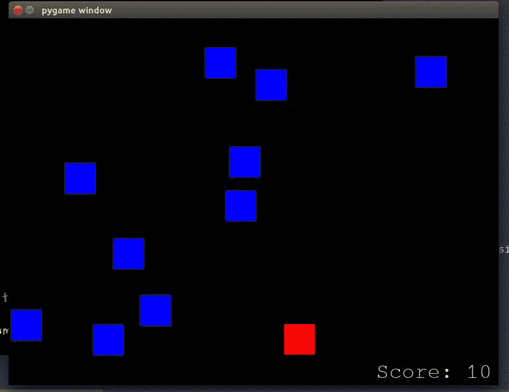

main_image

*(附言:-我知道，太长了，看不下去。我将把这篇文章分成不同的短文。那么大家阅读理解起来就会非常容易。)
(点击此处查看*[*part 1*](https://medium.com/@asishraz/basic-2-d-game-in-python-part-1-5547e8f5e4b7)*[*part 2*](https://medium.com/@asishraz/basic-2-d-game-in-python-part-2-5b1b75b24ac8)*[*part 3*](https://medium.com/@asishraz/basic-2-d-game-in-python-part-3-f6f8910ff972)*[*part 4*](https://medium.com/@asishraz/basic-2-d-game-in-python-part-4-81e8e53e86c4)*[*part 5*](https://medium.com/@asishraz/basic-2-d-game-in-python-part-5-e6f5aff1cf5c?sk=db2b658b11f2c9b635bea903b5a3a858)******

***过了很长时间，我决定通过游戏来提高我的 python 技能。我已经写了最后一篇仅与游戏相关的文章。如果你想看，点击*这里。****

**在更进一步之前，如果你想看这个游戏的原视频，请点击 [*这里*](https://www.youtube.com/watch?v=-8n91btt5d8&lc=z22dzrcysrrsd5yvmacdp435unyj5zbexr0inn5bewhw03c010c.1571697702780616) 。Keith Galli 做得非常好，如果你有兴趣通过游戏学习编码，请访问他的频道。**

**这篇文章是写给对编程和 python 有一点了解的人的。我将尽可能用最简单的方式来说明。**

**让我们开始吧…**

**我在这段代码中使用的主库或模块是'[***py game***](https://www.pygame.org/wiki/about)'。这是一个开源的 python 库，负责制作像游戏这样的多媒体应用。我们必须在代码中导入这个库。但在此之前，我们必须在我们的系统中安装这个库，以便在我们的代码中使用它。**

**> > **pip3 安装 pygame** (针对 linux 用户)> > **pip 安装 pygame** (针对 window 用户)**

**现在我们可以在代码中导入它。之后，我们必须初始化所有导入的 pygame 模块，因为即使模块失败也不会出现异常:**

**> >**导入 py game**
>>**py game . init()****

**如果你执行这段代码，如果你会得到一个类似于:pygame 社区的
***py game 1 . 9 . 6
Hello。***[***https://www.pygame.org/contribute.html***](https://www.pygame.org/contribute.html)**

**你走对了。如果你有一些错误，请在线检查或在这里评论。**

**现在，我们必须设计一个游戏控制台，我们的迷你游戏将发生。对此，我们在 pygame 中有一个模块，即[***py game . display***](https://www.pygame.org/docs/ref/display.html#pygame.display.set_mode)***。*** 这个模块负责来控制显示窗口和屏幕。**

**但是我们必须初始化一个窗口或屏幕来显示我们的游戏。为此，我们将使用:[***【pygame . display . set _ mode()***](https://www.pygame.org/docs/ref/display.html#pygame.display.set_mode)**

**这个函数将创建一个显示屏幕，我们必须在里面传递一些参数。据此，屏幕尺寸将出现在我们的系统中。
>>**py game . display . set _ mode((800，600))**
以上函数将取 [*元组*](https://www.geeksforgeeks.org/tuples-in-python/) 中的参数。这里(800，600)将是屏幕的尺寸。800 宽和 600 高，单位是像素。**

**现在，如果你运行代码，在上面提到的维度中会出现一秒钟的黑屏。**

**重要的是，'**' py game '**是一个基于事件的模块，它将跟踪我们所有的事件。同样，在游戏世界里，游戏会一直运行，直到游戏结束。为此，我们必须设置一个 while 条件，当条件为真时，游戏将运行，当条件为假时，游戏将退出。**

**早些时候，游戏控制台出现了一秒钟，然后关闭。我们将通过更新屏幕直到条件为真来解决这个问题。
>>**py game . display . update()****

**[***【pygame . display . update()***](https://www.pygame.org/docs/ref/display.html?highlight=pygame%20display%20update#pygame.display.update)*将更新整个屏幕或部分屏幕。如果在 *update()* 内部没有传递参数，它将更新整个屏幕。***

**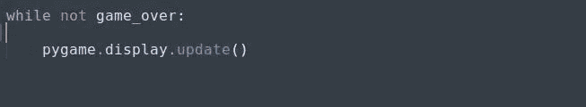**

**pygame.display.update()**

**该方法将持续更新屏幕，直到条件为假。**

**(*注:——我把一个变量'****game _ over****'赋值为****False****。因此，上面的循环将运行并向我们显示游戏控制台***

**(我知道，你在关闭游戏机时遇到了问题。为此，您可以通过任务管理器终止应用程序。)**

***或者要克服，我们可以这样做:***

**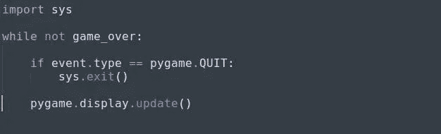**

**sys.exit()**

**这里，我们导入'[***sys***](https://docs.python.org/2/library/sys.html)'库，它负责提供 python 解释器的常量、方法和函数的信息。**

**我们在这里检查事件类型是否为 [***pygame。退出***](https://inventwithpython.com/pygame/chapter2.html) ，这意味着如果你点击关闭按钮，那就和执行 pygame 一样。退出事件，那么控制台或终端将通过'[***【sys . exit()***](https://docs.python.org/2/library/sys.html)'得到关闭。**

**[**pygame。'退出**](https://inventwithpython.com/pygame/chapter2.html) '与' **pygame.init()'** 正好相反。它停用了 python 库，所以应该在' **sys.exit()** '之前提到。否则，你的 IDLE 会挂起，因为程序会在没有停用程序中使用的 python 库的情况下终止。**

**现在，我们将捕捉事件，这是这个游戏最重要的部分。我们将使用'[***【pygame . event】***](https://www.pygame.org/docs/ref/event.html?highlight=pygame%20event#module-pygame.event)'模块来与事件进行交互。无论我们将执行什么事件或活动，它都会通过'[***py game . event . get()***](https://www.pygame.org/docs/ref/event.html#pygame.event.get)'捕获并显示在终端中。它从队列中取出事件，并遍历它，打印动作，你将看到我们所有的事件。**

**事件是指移动光标、按键和点击按钮等。**

**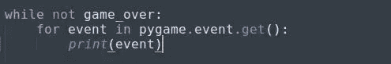**

**pygame.event.get()**

**我们将获得以下信息:**

**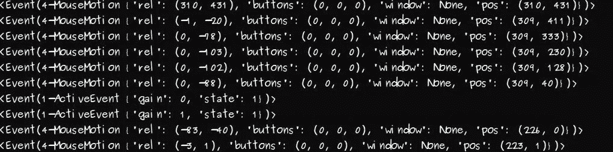**

**event capture**

**我们所有的鼠标移动和鼠标或键盘的任何事件都通过这个模块被捕获。**

**现在我们进入游戏的第一步，那就是制造玩家。我们将制作一个出现在游戏屏幕上的矩形方块。为此，我们使用了[***‘pygame . draw***](https://www.pygame.org/docs/ref/draw.html?highlight=pygame%20draw#module-pygame.draw)’模块。在这个模块的帮助下，我们可以在屏幕上画出任何形状。在这里，我们将绘制一个矩形，为此，我们将使用'[***pygame . draw . rect()***](https://www.pygame.org/docs/ref/draw.html#pygame.draw.rect)'方法。它需要 3 个参数，第 4 个是可选的:***py game . draw . rect(surface，color，rect_position，width=0)*** 。**

****表面** -在哪些表面上绘制(这里，它将是屏幕)
**颜色** -它将采用 RGB 格式，这意味着对于红色，值将是(255，0，0)
**rect _ position**-将采用 x，y 坐标和矩形的厚度，即- (left_position，top_position，width and height)
**width = 0-**this 如果 width = 0，您将会看到一个彩色的矩形，但是如果 width=1，矩形将会有线条。默认情况下，宽度= 0。**

**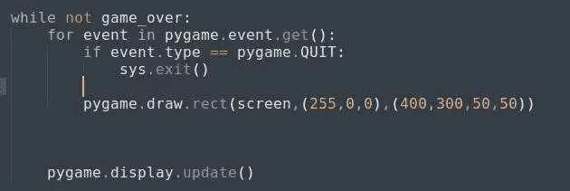**

**pygame.draw.rect()**

**我已经采取了表面作为一个屏幕，颜色在 RGB 格式和矩形的位置。如果您运行上面的代码，您会看到类似这样的内容:**

**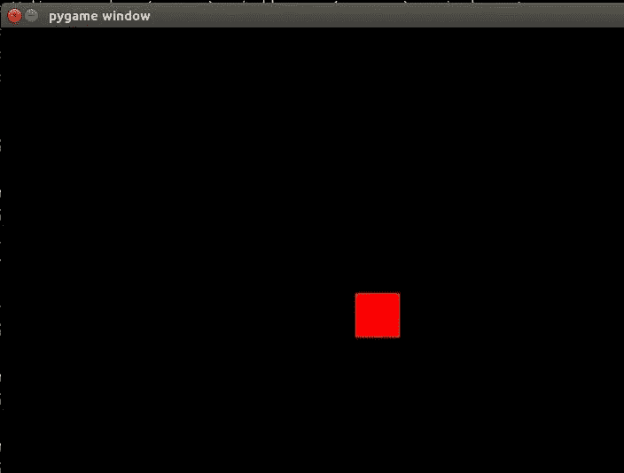**

**our player in rectangular form**

**我希望，你也一样。万一你发现什么错误，一定要告诉我。**

## **(注意:-我们必须将所有可重用的值赋给全局变量，以便将来可以很容易地修改它。否则，我们必须在许多地方，在我们使用这些价值观的地方，进行变革。)**

**我按照我的理解做了。**

**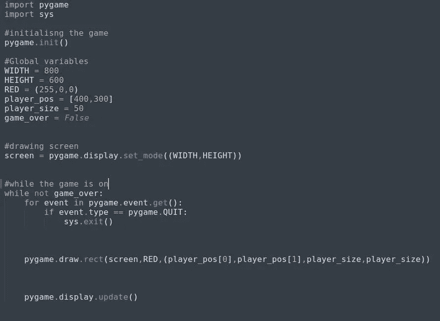**

**assigning reusable values to global variables**

**现在游戏的第二步是让玩家可以左右移动。这也是我们必须控制的一类事件。对于左右移动，我们通过按下左右箭头键来进行键盘事件。要执行它，我们得看看 pygame 中负责按键事件处理的模块，那就是 [***pygame。KEYDOWN***](https://stackoverflow.com/questions/25494726/how-to-use-pygame-keydown)*负责捕捉按键是否被按下。这是一种事件类型，因此我们将使用“event.type”方法进行检查。记住我们正在迭代游戏中的所有事件:***

***> >**for py game . event . get()中的事件:*****

***现在，我们将检查特定事件是否是按键按下，如果是，那么我们将进一步检查按键是向左还是向右按下，据此我们将移动块。记住，我们是在左右方向移动方块，也就是 x 坐标。然后我们将分配一个变量，它将取矩形块的 x 坐标，我们将改变这个变量的位置。
**>>x = player _ pos[0]
>>y = player _ pos[1]*****

***为了更好的理解 [***关键事件***](https://www.pygame.org/docs/ref/key.html) ，可以参考本页面。***

**对于左箭头键和右箭头键，我们必须分别用 **K_LEFT** 和 **K_RIGHT** 进行检查。如果按下的键是左，移动到左边，按下的键是右，移动到右边。就是这样。非常非常简单。**

****

**moving the key left or right**

**运行代码，你会看到这个物体在两个方向上移动，但是(*我知道*)它没有离开原点。我们不希望木块像这样移动。如果您对这部分代码有任何疑问或问题，请随时发表评论。**

**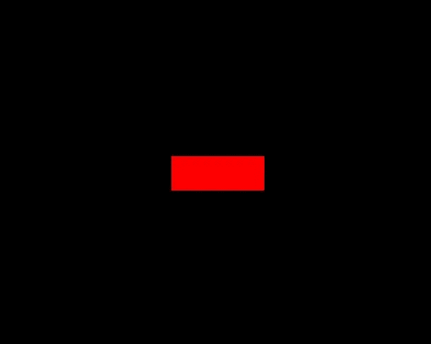**

**block not leaving the origin**

**好的，木块不会离开原点。怎么办？解决这个问题非常简单。相信我。**

**[***screen . fill((color))***](https://sites.cs.ucsb.edu/~pconrad/cs5nm/topics/pygame/drawing/)*是用上述颜色填充整个屏幕的方法。***

***例如:- screen.fill((0，0，0))。每当方块离开它先前的位置(在整个游戏屏幕中)，它就会将颜色从红色变为黑色。***

***好了，现在我们有了播放器，它正在按照我们的指令移动。是时候把这个方块放在屏幕下方了，这样我们就可以从上方迎接我们的敌人了。***

***还是那句话，你可以根据自己的方便来放置播放器(块)。我是这样放置的:***

******

***player position***

***为了让你更好地理解坐标，我将画出游戏机的复制品。***

***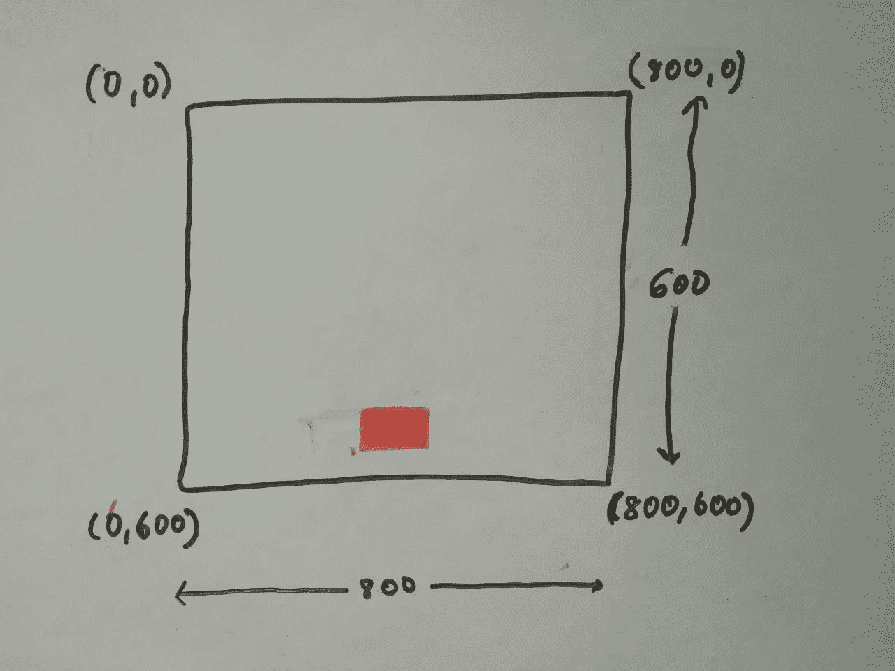***

***coordinates***

***现在第三步是吸引敌人。而敌人应该在玩家之上。到目前为止，画敌人是最简单的事情，你只需要重用画图播放器的代码。请记住，敌人应该来自屏幕的顶部，因此要恰当地使用这个位置。试试这里，根据你的知识，看看我的代码。***

***> > **pygame.draw.rect(screen，(0，0，255)，(10，10，50，50))*****

***(注意:-如果我们再次将这些值赋给一些全局变量，效果会更好)***

***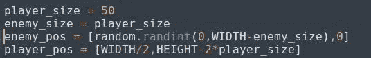***

***enemy_and_player declaration***

***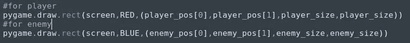***

***enemy and player declaration***

******

***blue-enemy and red-player***

***(注意:-如果我们将玩家移动到一个街区而不是一个像素，这将是令人放松的。否则游戏会超级无聊。)
要做到这一点，我们只需要用玩家的尺寸来更新机芯，也就是 50px。怎么会？***

***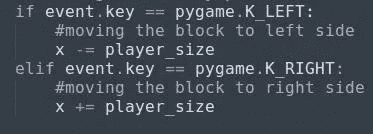***

***moving one block***

***在继续之前，我需要在这里提一下，我们画的敌人可以来自顶部的任何随机位置。可以是极左，极右，也可以是任何地方。为此，我们需要给敌人设置一些随机的位置值。为此，我们必须首先在程序中导入 [***随机***](https://www.geeksforgeeks.org/random-numbers-in-python/) 模块，然后给它分配随机值。***

**随机模块用于生成给定范围内的随机数。该模块通常用在游戏应用中。**

****> >随机导入****

****> >敌国 _pos = [random.randint(0，WIDTH)，0]****

****‘WIDTH’**是我们赋给值 800 的全局变量。**

****randint** '是随机模块产生 0 到 800 之间的随机数的方法。每次代码运行时，敌人的位置可能在 0 到 800 之间。**

***(注意:-这里我们给第二个值等于零，因为直到现在敌人都出现在控制台的顶部。在那里，y 坐标永远是零。)***

**第四步，从上到下把敌人放下，然后游戏才开始。要把敌人从上到下扔下去，这里需要理解简单的数学。**

**敌人的方块会从上到下移动，这意味着它的 y 坐标在增加，它会移动到屏幕的高度。我们只需要更新 y 坐标，也就是' *enemy_pos[1]'。***

**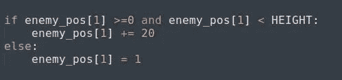**

**enemy_dropping from top**

**在这里，我们将检查 y 坐标是否在游戏屏幕的范围内，如果是，我们将其位置向下移动 20px 单位。
为了以防万一，如果块超出了屏幕，我们再次将它的值更新为零。所以，它会从零开始。
一旦运行这段代码，您会看到类似这样的内容:**

**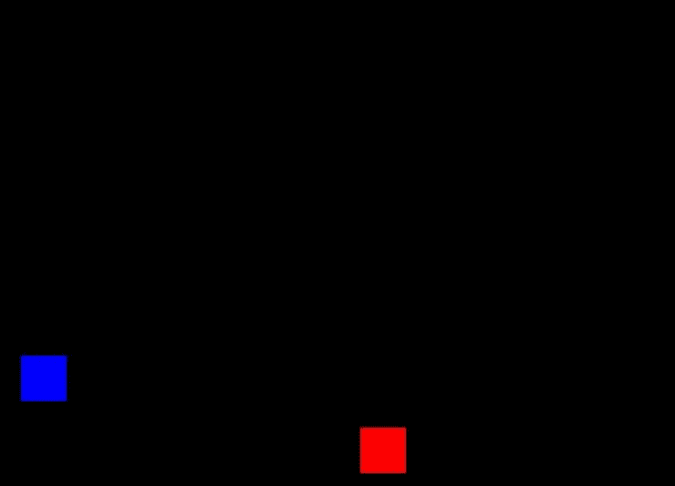**

**enemy coming down**

**(*我捕捉不到敌人从上到下的快速移动)***

**敌人格挡的速度超级快。我们赢不了它。我们必须让它慢一点，才能看到并拯救我们的街区。为此，我们必须减少每秒帧数，为此，我们必须使用 pygame 的一个模块，它负责监控时间，[***【py game . time】***](https://www.pygame.org/docs/ref/time.html#pygame.time.Clock)***。*****

**然后我们将创建一个跟踪时间的对象。为此，我们不得不使用一种方法:'[***pygame . time . clock()***](https://www.pygame.org/docs/ref/time.html#pygame.time.Clock)***'*****

*****>>clock = py game . time . clock()*****

**这里，' ***时钟*** '是一个跟踪时间的对象，现在我们必须用帧速率更新时钟。为此，我们需要使用一种负责更新时间的方法:'[***【pygame . time . clock . tick(frame rate)***](https://www.pygame.org/docs/ref/time.html#pygame.time.Clock.tick)***'*****

**当你想降低游戏中某些功能的速度时，这种方法很有用。在这里，我们想减慢敌人的速度，为此我们将指定一些帧速率，并根据这一点，块将出现。这个方法应该每帧调用一次。**

**> > **clock.tick(30)****

**程序永远不会以超过每秒 30 帧的速度运行。**

**写下上面的代码并执行它，你会注意到速度的不同。如果你有任何疑问或问题，请让我知道。**

**如果你注意到，块只来自一个位置，但是我们希望块来自屏幕内的任意位置。**

**我们到底要更新什么，才能看到方块从随机位置掉落？**

**答案太简单了。一旦块离开屏幕，我们只需要更新块的 x 坐标。就是这样。**

****

**enemy dropping from top**

**这里，如果你会看到，每当敌人越过屏幕*(向下方向)*，我们就将 ***敌人 _ 位置*** 的值更新为 **1** 。但是我们没有提到随机的 x 坐标。所以我们也必须更新 x 坐标。(*想一想，我们要写什么，我已经给过你提示了)***

**只有一句话，那就是:**

**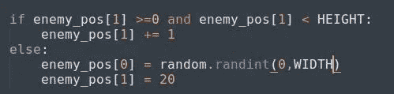**

**每一次，敌人会离开屏幕，x 坐标会为方块生成一些随机位置。*(我告诉过你，真的很简单；))***

**现在游戏的主要部分，也就是碰撞。为此，我们需要理解简单的数学。**

****

**math**

**(*抱歉图像质量…)***

**这里，红色方块是玩家，蓝色方块是敌人。我举了两个碰撞的例子。首先，我们将处理 x 坐标。**

**在一种情况下，敌人的块将很少向前到玩家块。在这种情况下，**敌人 _ 位置[0]** ，即 **e_x** 将大于 **p_x** ，并且也将小于**玩家 _ 位置[0]** + **玩家 _ 大小**，即**p _ x+玩家 _ 大小。**在简单的等式中，我们可以这样写:**

**> >**if(e _ x≥p _ x)and(e _ x<(p _ x+player _ size))****

**第二种情况，敌人的格挡在玩家的格挡后面。在这种情况下， **p_x** 将大于 **e_x** ，并且它也将小于**e _ x+敌人大小**。在一个简单的等式中，我们可以这样写:**

**> > **if (e_x ≤ p_x) and ((e_x +敌方 _ 大小)> p_x)****

**好吧，这是为了 x 坐标。对于 y 坐标，我不会解释，因为它很容易写。**

**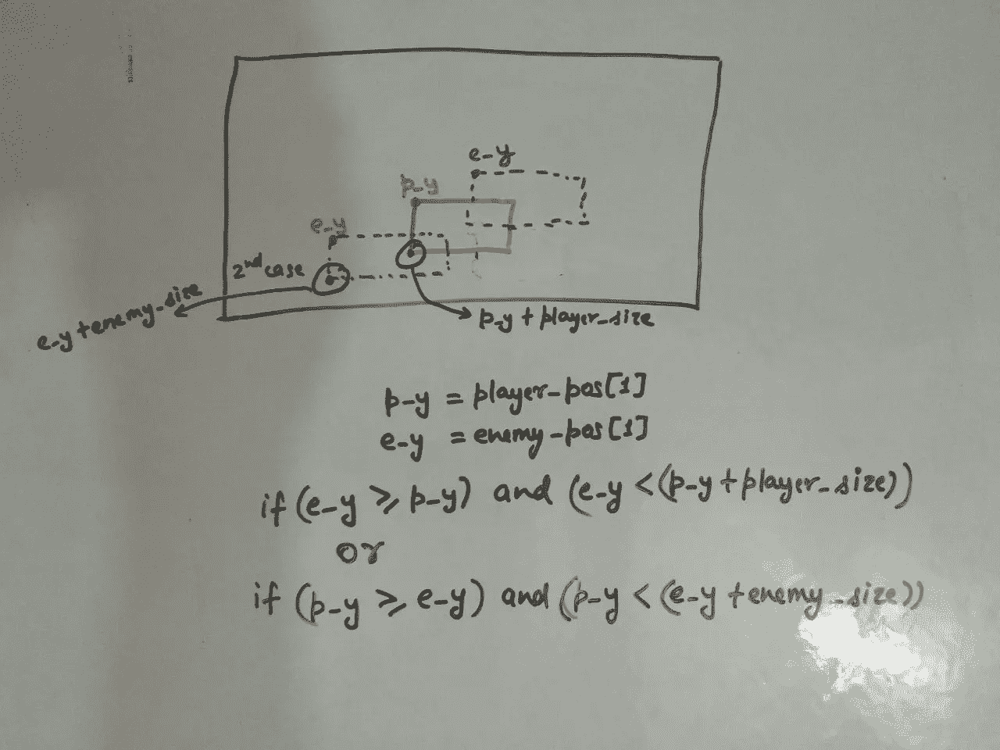**

**for y-coordinates**

**最好将上述场景写在一个函数下，从现在开始，我们将在特定函数下编写所有案例。在编写完整个场景后，在一个函数下，它将看起来像这样:**

**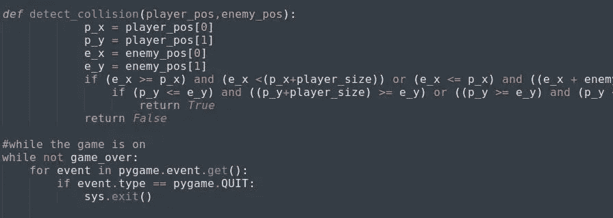**

**detect_collision**

**记住，在 while 循环之外编写这个函数，因为我们必须为这个函数设置一个条件，它将在循环之外进行检查。**

**我已经将函数命名为' **detect_collision** '，它将采用两个参数作为***player _ position***和 ***敌人 _position*** 。现在写完这段代码后，需要添加一个小东西。如果上述条件成立，那么结束游戏。这意味着，如果碰撞发生，退出游戏。为此，我们必须在 while 循环下编写一个条件:**

**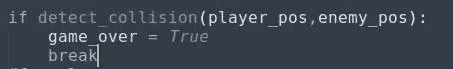**

**collision_will_end_the_game**

**到目前为止，如果在执行过程中还有什么困惑或问题，请在评论区告诉我。到目前为止，我们已经做了些什么。创造了一个游戏主机
2。创造了我们的玩家
3。使玩家可以左右移动
4。创造了我们的敌人
5。使敌人上下移动
6。使敌人随机出现在 x 坐标
7。写了碰撞的条件
现在只剩下几件事了。然后，你就可以开始你的第一次游戏体验了，这将是你自己创造的。哇！！！！
如果从上到下只有一个敌人来，会超级无聊。我们将添加块的数量，使它变得有趣。
我们可以有任何数量的块，它会下来。但是如果我们有大约 10 个街区，它会看起来不错。
我们必须注意，所有这些块都来自顶部，即 y 坐标将为零，并且可以来自任何宽度范围，即 x 坐标将在范围(0，800)下变化。
我们将创建一个添加这些敌人的函数:**

**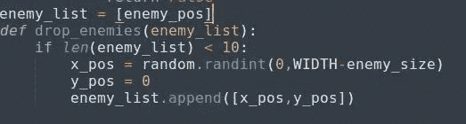**

**drop_enemies**

**我们将创建一个只有一个敌人的列表。然后我们会把这个列表作为一个函数参数，我们会把我们的随机块添加到这个列表中。第一次，名单上只有一个敌人。那么如果列表小于 10，也就是说，如果块数小于 10，那么在 x 坐标上随机添加一些块，添加到列表中。**

**现在，我们必须画出所有这些我们在上面创造的敌人。为此，我们将创建一个函数(*比方说 draw _ anthonies*)，它将遍历敌人列表，每次迭代，它将在那个随机坐标上创建一个敌人。**

**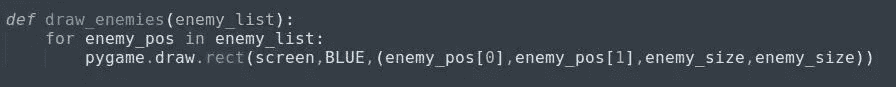**

**draw_enemies**

**这里我们迭代的是' ***敌人 _ 列表'*** ，其中长度或敌人数量为 9。正如我们借助'**drop _ anthonies()'**函数添加敌人一样，现在'**draw _ anthonies()'**每次迭代 ***敌人列表时都会绘制一个敌人。*****

**现在，我们必须在代码的最后调用这些函数。**

*****> >【掉落 _ 敌人(敌人 _ 列表)
> >【吸取 _ 敌人(敌人 _ 列表)*****

**当您执行上面的代码时，它看起来会像这样:**

**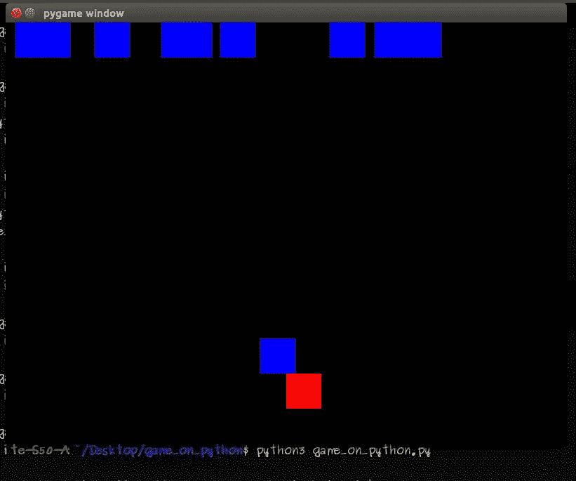**

**drawing_enemies**

**为什么？(思考几分钟，你会有一个想法，为什么会这样)
原因是，我们没有更新块的位置。我们添加了块的数量，我们正在绘制这些块的数量，但是我们仍然没有更新所有这些块的位置。我们将创建一个函数，它将更新敌人的街区:**

**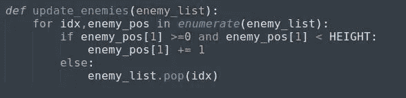**

**updating enemies**

**几件事:**

*****idx***’-我们刚刚为 index 取了一个变量名，它将遍历敌人列表。**

**[***枚举***](https://www.geeksforgeeks.org/enumerate-in-python/) ***-*** 这是一个用于统计一个链表发生的迭代次数的函数。**

**上面的代码，我们已经写了，我们从上到下放下了敌人。只要把整个代码放在这个函数中，我们就必须改变 else 条件。如果块超出了屏幕尺寸，那么我们必须从列表中弹出那个块。**就是这么个‘T11’。**[***pop()***](https://www.geeksforgeeks.org/python-list-pop/)‘做。别忘了调用这个函数。**

**> >**更新 _ 敌人(敌人 _ 列表)****

**如果我们在同一个盘子上，那么一旦你运行代码，你将得到下面的输出。**

**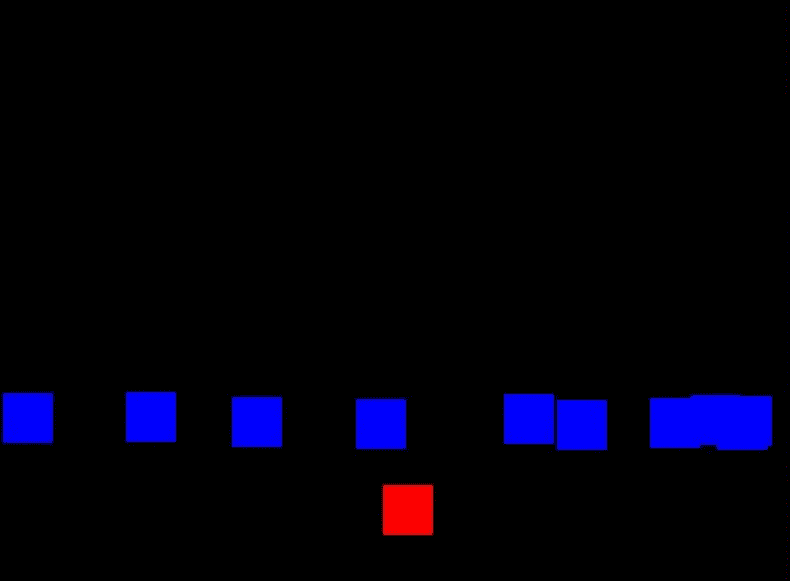**

**all enemies at a time**

**你会注意到，所有的敌人都聚集在一起，没有碰撞发生。太好了。那你就走对了。；我们必须创建一个函数来检查碰撞，不管它是否发生。如果碰撞正在发生，退出游戏。**

**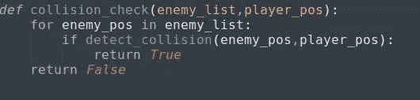**

**collision check w.r.t player_pos**

**这里，我们正在创建一个带有参数**敌人列表**的函数，对于碰撞，玩家位置很重要。就是这个原因，我们把 **player_position** 作为一个参数。然后我们将遍历列表，函数' **detect_collision** '将向函数' **collision_check** '返回值，如果值为真，上述函数将返回 **TRUE** 。不要忘记在代码中调用这些函数。**

**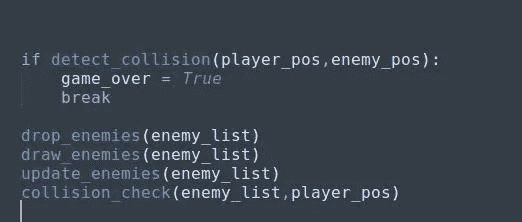**

**all function calling**

**这里你可能有一个困惑，那就是已经' **detect_collision()** '在检查条件真/假，那么' **collision_check()** '有什么用呢？这就是为什么我们必须删除上面的' *if* '条件，现在我们必须检查' **collision_check()** '。如果是真的，那我们就结束游戏。**

**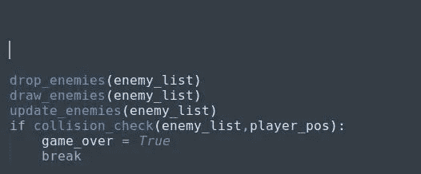**

**checking collision_check function**

**一切都很完美。不是吗？如果你说“是”，那么你错过了更大的图景。那就是:所有的障碍同时到来
我们必须对此做些什么。**

****

**drop_enemies function**

**如果你在这里看到，每当列表少于 10，我们在同一时间添加所有的敌人，因此，所有这些敌人都在同一时间到来。我们现在要做的，是拖延敌人的出现。我们必须将每个区块错开几分之一秒。**

**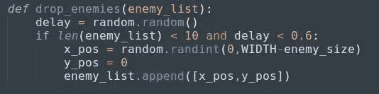**

*****'***[***random . random()'***](https://www.geeksforgeeks.org/random-numbers-in-python/)会生成一个小于 1 且大于等于 0 的浮点数**。**现在，代码将检查，如果列表的长度小于 10，并且随机生成的‘**delay**的值小于 0.6，则出现第一个块，这样，所有的块将出现在屏幕上，延迟从 0 秒到 0.6 秒。**

**(*注:-在这种情况下，你不会发现任何块下落的差异。您可以将延迟条件减少 0.1 或根据您自己的需要。)* 现在我们差不多到了游戏的尾声。但是没有记分卡的游戏就像没有错误的编码员。:P

要实现这个，我们需要使用 pygame 的一个模块，就是'[***py game . font***](https://www.pygame.org/docs/ref/font.html)***'。*** 这个模块负责渲染各种要在屏幕上显示的字体。我们将使用本模块的一种方法来显示记分卡。**

**> >***my font =***[***pygame . font . sys font(" monospace "，35)***](https://www.pygame.org/docs/ref/font.html#pygame.font.SysFont)**

**[***py game . font . sys font(****name，* ***，*** *bold=False，italic = False****)***](https://www.pygame.org/docs/ref/font.html#pygame.font.SysFont)*将从系统字体中创建一个字体对象。该方法有 4 个参数，但其中两个是可选的(粗体、斜体)。***

***但是在我们继续之前，我们应该初始化一个 score 变量来存储分值。***

***> > ***得分= 0******

**现在，我们将创建一个变量来打印带有“score”标签的分值。**

**> >***text = " Score:"+str(Score)*****

**这将显示“分数”以及分数(用数字表示)。但这不会在屏幕上绘制文本。为此，我们需要使用' pygame.font.SysFont()'的' ***render'*** 方法。**

**> >***label =***[***myfont . render(text，1，(0，255，0))***](https://www.pygame.org/docs/ref/font.html#pygame.font.Font.render)**

**该方法将在新的表面上绘制文本。pygame 从不允许在现有的表面或屏幕上绘制文本。上述方法的工作原理:**

****。render()** '将获取文本并在新屏幕上绘制文本图像，然后我们必须将该图像移动到现有屏幕上我们想要的任何位置。**

****文本** -它将文本作为第一个参数，**

****1** - *抗锯齿*，这将采用一个布尔值。如果为真，那么字符将有平滑的边缘。**

**(0，255，0) —它将颜色作为第三个参数，并且应该在元组中。**

**但是我们还没有提到记分卡的位置，应该在哪里显示分数。对于我们将使用的另一个函数:**

**> > ***screen.blit(label，(600，500))*****

**这个方法负责用提到的位置值将字符作为图像绘制在屏幕上。**

****标签** -获取渲染的文本或字符**

****(600，500)** —将位置作为字符的宽度和高度。**

**但是等等，为什么分数没有更新呢？**

**因为我们没有更新分数。哇哦。简单明了。**

**我们首先要考虑的是，分数会在什么基础上增加。唯一的条件是，当砖块落下时，穿过低于屏幕的线。这意味着，我们必须在'**update _ answers()'的 else 部分将' **score** 变量更新 1。这意味着，我们必须在函数中再包含一个参数“score ”,因为我们在函数中引用了这个变量。****

**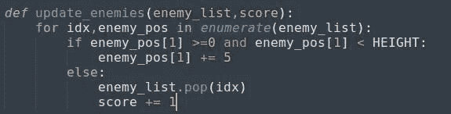**

**adding score on the function**

**此外，无论我们在哪里调用这个函数，我们都必须向它传递“score”变量。**

**> > ***更新 _ 敌人(敌人 _ 列表，分数)*****

**还是不能增加‘分数’的值？别担心，我们在同一轨道上。**

**原因是，' **score** '是一个整数变量，本质上是不可变的。我们不能只增加+= 1 的值。为此，我们必须重置“分数”值并将其指向新值。首先，我们必须从函数'**update _ answers()**'中返回' **score** '变量。**

**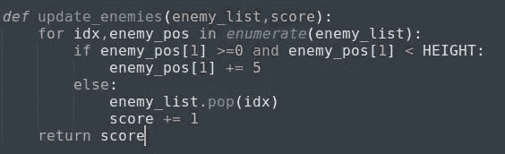**

**return ‘score’**

**上面的代码将重置' **score** '变量，然后我们必须用新值进行更新。**

**> >**得分=更新 _ 敌人(敌人 _ 列表，得分)** > > **【打印(得分)****

**就是这样。重置' **score** '变量，然后用新值更新，最后在屏幕上打印出来。**

**一切都搞定了！对吗？**

**但是在整个比赛中用同样的节奏拦网会导致无聊。我们应该在游戏中加入一些刺激的元素。我们必须提高这个游戏的水平，根据分数提高速度。简单来说，我们应该在分数的每个区间上设置一些级别。**

**相信我，这将是这款游戏最后的功能。**

**首先，我们将设置一个全局变量' **SPEED** '来分配速度值。然后我们将创建一个函数 **'set_level()'** ，在这里我们将把**分数**和**速度**作为自变量。**

**然后对于每一个得分区间，我们都会提高速度。但在此之前，我们要把这个**速度**值赋给敌人的 y 坐标。**

**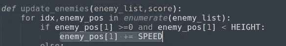**

**speed variable**

**现在是最后一段代码:**

**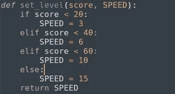**

**set_level_function**

**不要忘记在代码中调用这个函数。
> > **速度=设定 _ 等级(分数，速度)****

**答对了。！！你做到了。轻拍你的肩膀，休息一下…因为我也是这样做的。；)
恭喜你，你已经走到最后了。请随时询问任何疑问或任何澄清。**

****

**final display**

**参考资料:-**

** [## 关于-维基

### 你好，网络旅行者，欢迎来到我们小小的(有点奇怪的)万维网。让我给…

www.pygame.org](https://www.pygame.org/wiki/about)  [## Pygame 首页- pygame v2.0.0.dev5 文档

### 关于 pygame 的基本信息:它是什么，谁参与其中，在哪里可以找到它。在…上编译 pygame 所需的步骤

www.pygame.org](https://www.pygame.org/docs/) 

# 如果你喜欢我的作品，请鼓掌并与你的朋友分享。我会发表更多关于游戏和编码的文章。

> 如果你想阅读更多关于游戏的文章，请访问我的简介 [*这里*](https://medium.com/datadriveninvestor/game-through-python-part-1-12b56dede735) *。我也写了几篇关于* [网络搜集](https://medium.com/@asishraz/scraping-data-from-imdb-top-250-movies-page-with-fields-name-year-and-rating-using-python-567dd2459fb9) *的文章。如果你有兴趣的话，一定要来看看。***