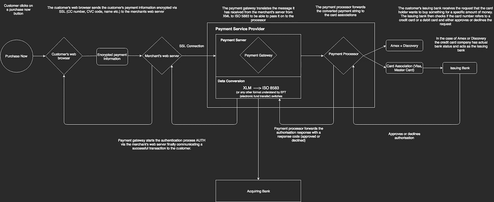

# 基本支付交易流程

> 原文：<https://medium.datadriveninvestor.com/basic-payment-transaction-process-98d9f76644ed?source=collection_archive---------9----------------------->

我想以一个关于支付如何工作的非常基本的故事开始我的媒体页面。有大量的信息在那里，因此你将要看到的是没有什么突破性的。附加价值更多的是，我结合了几个不同的关于支付如何工作的来源，用我自己的话(非常简单的语言)解释它们，并且通常添加可视化。我的目标是确保这是你必须阅读的第一篇，也可能是最后一篇关于支付如何工作的文章。

你可以看到从在任何电子商务网站上按下“立即购买”按钮到授权你的信用卡并向商家播放回复的整个过程的可视化。

This is standard payment process which takes about 2 seconds to complete

简而言之，当你点击任何“立即购买”按钮时，这个过程就开始了。您所在的电子商务网站会要求您提供付款细节(付款方式和卡号、姓名、地址等)。).然后，你的浏览器会将这些加密的数据点传输到商家(卖家)的网络服务器，该服务器除了将你的详细信息传递给与卖家合作的支付提供商之外，什么也不做。

# 现在，我们正在进入支付服务提供商的领域

最常见的支付提供商(PSP)有:Adyen、Ingenico、WorldPay、Amazon Pay、Stripe 等等。

事实上，许多新的创业公司正在进入这一领域，挑战大型巨头，如 [*【莫莉】*](https://www.mollie.com/en/) *。*

由 PSP(支付网关)托管的支付服务器只有两个功能。第一，提供一个整体的 API 连接到多个发卡银行(将卡交给客户的银行)和收单银行(商户的银行)。第二，将客户的交易数据(卡号、姓名、地址)从 XML 字符串转换成一种称为 ISO 8583 的格式，以便 EFT 交换机能够读取。

EFT 交换机是一种电子资金转账系统，它只允许处理交易数据。为此，它需要以支持的格式接收数据。ISO 8583 就是这样一种格式。为了简单起见，创建这种格式是为了让卡发起的消息传递有一个标准。这意味着，每次有人用卡支付时，传输的数据都需要标准化，以便银行处理。如果你想知道更多关于这个话题的信息，这里有一个很好的深度解释[https://www.quora.com/What-is-ISO-8583](https://www.quora.com/What-is-ISO-8583)

数据转换过程完成后，支付处理器通过客户使用的卡网络与发卡行联系。假设客户用 VISA 信用卡支付，那么支付处理器将联系 VISA，反过来 VISA 将帮助定位发卡银行。银行需要提供客户资金的信息。换句话说，银行需要告诉卖家客户是否没有超出他的限额，是否有足够的钱支付他/她想要购买的商品。

如果客户使用 AMEX 或 Discovery 信用卡，则卡网络已经充当发卡银行，因为这些公司拥有完全的银行地位。

一旦信息被收集，它将通过相同的过程循环回商家，客户有希望能够购买。

简而言之就是这样。

我希望这个解释有意义。如果你有任何反馈，请让我知道。