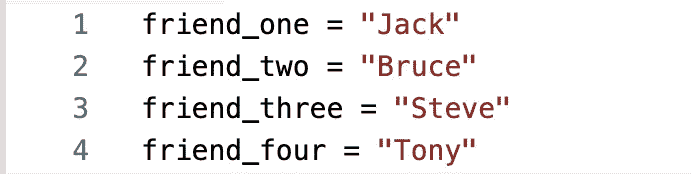
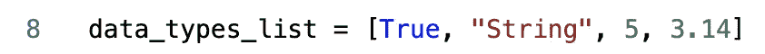
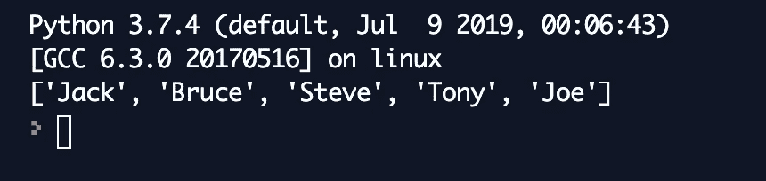
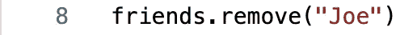
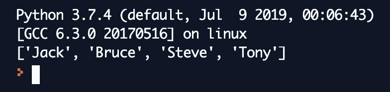
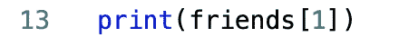
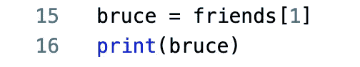
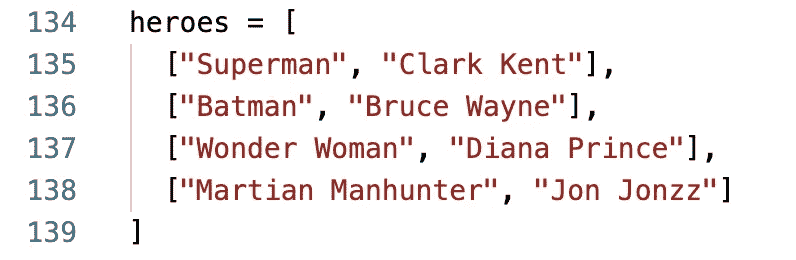
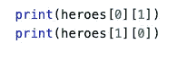

# 基本 Python 数据结构:列表

> 原文：<https://medium.datadriveninvestor.com/basic-python-data-structures-lists-c49591cbb1af?source=collection_archive---------12----------------------->

假设你有所有这些数据，你想列出你所有的朋友，但是你会像这样一个一个地写下来:

虽然这是列出你的朋友的一种方法，但它不节省内存，而且非常耗时。如果有办法让一个变量包含所有的朋友呢？我们可以用列表、元组、集合甚至字典来做这件事。但是我将首先从这个*基本 Python 数据结构*系列中的列表开始。

 [## 2019 年最值得学习的编码语言|数据驱动的投资者

### 在我读大学的那几年，我跳过了很多次夜游去学习 Java，希望有一天它能帮助我在…

www.datadriveninvestor.com](https://www.datadriveninvestor.com/2019/02/21/best-coding-languages-to-learn-in-2019/) 

# 目录

列表，也称为数组，是一种允许存储许多值的数据结构，所以如果我创建了一个名为“friends”的变量，我会让它包含我所有朋友的名字。

列表的值总是在左右大括号([])之间，每个值用逗号分隔。列表不必包含相同数据类型的值，例如上面包含所有字符串的列表。具有不同类型值的列表示例如下所示。

正如你在上面看到的，一个列表可以包含多种数据类型，但是我建议不要创建包含不同数据类型的列表。您希望数据与您的变量名相关，所以如果您有一个名为“friends”的列表，并且其中有数字，那么就很难知道您的“friends”变量意味着什么。

## 列表操作

列表是可变的数据结构，这意味着列表中的内容可以改变。如果你交了一个新朋友，想把他/她添加到你的好友列表中，该怎么办？您可以使用**追加**方法来实现。

您调用您的列表变量并使用 **append** 方法添加您的新朋友。然后，我们可以通过键入 **print(friends)** 来打印该列表，它将打印出以下内容:

如果您在添加 Joe 之前打印了该列表，则该列表只会显示给 Tony。

现在，如果你想除掉一个你很久没有联系的人，该怎么办呢？你认为你可以用什么方法把一个朋友从名单中删除？我的答案在我之前的问题里😉。没错。移除！

输出将显示‘Joe’已经从朋友列表中删除。

很漂亮吧？“朋友”列表可以随时改变，如果有任何变化，您不必创建另一个变量。相反，您可以使用**追加**和**移除**方法。

在许多情况下，您会想要访问列表中的特定元素。假设我想从朋友列表中打印出“Bruce”。为了做到这一点，你首先要记住，任何编程语言中的索引都是从 0 开始的。因此，如果您想要检索第二个元素“Bruce”，您需要从朋友列表中访问索引 1。

为了访问该元素，首先调用列表的名称，后跟方括号，然后包含要检索的索引。我们甚至可以将“Bruce”赋给一个变量，并从朋友列表中将他赋给自己的名字。

变量“bruce”首先被实例化，并被赋予一个来自朋友列表的值。然后‘布鲁斯’就可以打印出来了。

这是一个更大的挑战，但是如果你在一个列表中包含列表呢？如果我想创建一个超级英雄列表，在他们的名字旁边分别列出他们的别名，会怎么样？

这看起来有点棘手，但是列表的优点是你可以嵌套它们，并且在它们里面有不同的数据结构。我们将看到这在元组、集合和字典中是如何工作的。当你想访问上面列表中的某个元素时，例如，heroes[0]，它会打印出['超人'，'克拉克·肯特']。如果你只想得到“克拉克·肯特”元素呢？这是它变得棘手的地方，但是当你理解嵌套时，它是有意义的。

你认为第一个声明会打印什么？我们做的第一件事是查看元素 0，它是列表项[“超人”、“克拉克·肯特”]。然后我们看索引 1，它是“克拉克·肯特”，所以“克拉克·肯特”将被打印出来。在第二个打印语句中，我们查看索引 1 处的列表项，即[“蝙蝠侠”、“布鲁斯·韦恩”]。然后我们看元素 0，它是“蝙蝠侠”，因此“蝙蝠侠”将被打印出来。列表允许我们嵌套其他列表，这很好，正如你将在以后的文章中看到的，它也可以嵌套不同的数据结构。