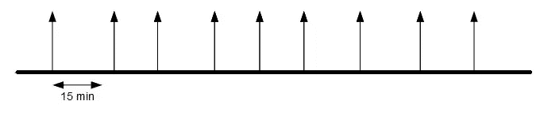
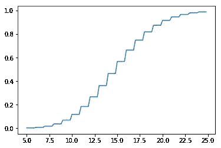
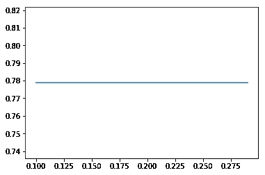
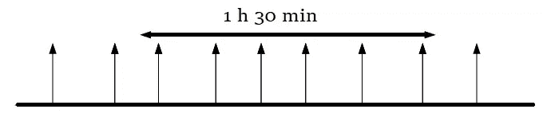
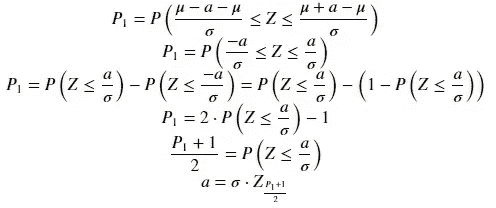

# 事件的基本统计

> 原文：<https://medium.datadriveninvestor.com/basic-statistics-of-events-18c1e6ba38a?source=collection_archive---------14----------------------->

[](http://www.track.datadriveninvestor.com/1B9E)

Photo by [Julian Lau](https://unsplash.com/photos/SMw4vYPtcwY?utm_source=unsplash&utm_medium=referral&utm_content=creditCopyText) on [Unsplash](https://unsplash.com/search/photos/bus-stop?utm_source=unsplash&utm_medium=referral&utm_content=creditCopyText)

## 珍惜我们的时间

在概率论中，一个 [**事件**](https://en.wikipedia.org/wiki/Event_(probability_theory)) 是一个概率被赋予的实验的一组结果。这些结果是在一段时间内发生的，有趣的是 Python 如何轻松地解决最典型的问题。

为了更好地理解统计模型是如何工作的，我将以链接不同模型的方式来说明同一个案例。而且，考虑到我目前工作的地方靠近一个公交车站，我将从一些事情到日常生活来说明这些事件。

[](https://www.datadriveninvestor.com/2019/02/21/best-coding-languages-to-learn-in-2019/) [## 2019 年最值得学习的编码语言——数据驱动的投资者

### 在我读大学的那几年，我跳过了很多次夜游去学习 Java，希望有一天它能帮助我在…

www.datadriveninvestor.com](https://www.datadriveninvestor.com/2019/02/21/best-coding-languages-to-learn-in-2019/) 

让我们从每隔 15 分钟就要在某一站停靠的常规公交线路说起。

也许我们对常规公交线路的第一个想法是，它就像一个周期性脉冲响应:


显然，**的统计数据**更像是基于这样的东西:



所以，我们可以提出的第一个问题是:*我们需要什么工具来猜测我们的结果？*

# 安装库

我们将在 Python 下工作。而且有趣的是安装 numpy 和如果你想画简单的图形 matplotlib。所以，

```
pip install numpy
pip install matplotlib
```

之后，我们将使用一些名称空间:

```
import numpy as np
import scipy.stats as st
```

现在，让我们考虑第一个统计模型。

# 泊松/伽马分布

你刚刚错过了公交车，你在公交车站，25 分钟后你要去参加一个工作面试。公共汽车将需要 5 分钟，那么下一辆公共汽车将在 20 分钟内出现在 15 分钟的常规线路中的概率是多少？

## 事件在μ分钟内有规律地发生，t 分钟内下一个事件发生的概率是多少？

考虑到 mu=μ和 timeMax = t，下一个代码将使用泊松的累积分布来给出响应。

```
maxWaitNext = lambda mu: lambda timeMax: st.poisson.cdf(timeMax, mu)
```

所以，我们可以这样使用函数:

```
>>> timeToWait = 17
>>> print("There is %.2f%% next bus will appear in %d minutes "%(round(100*maxWaitNext(15)(timeToWait),2),timeToWait))
There is 74.89% next bus will appear in 17 minutes
```

泊松分布识别在一个范围(秒、分、天)内以可预测的周期发生的所有情况，但是不能控制事件的质量。在公共汽车的例子中，无论一个多么好的工人，司机都不能控制天气、交通等等。

如果我们想说明我们的函数是如何工作的，这里我给出了制作图表的代码

```
X = np.arange(5, 25, .2)
Y = maxWaitNext(15)(X)
fig, ax = plt.subplots()
ax.plot(X, Y)
plt.show()
```



Probability to find a bus after waiting X minutes in a regular line of 15 minutes

如您所见，15 分钟和 16 分钟之间的差异在该图中非常重要，但如果我们以小时为单位研究相同的结果，该图将是一个常数:



Probability* to find a bus after waiting X hours in a regular line of 15/60 hours

这意味着规模很重要，每个模型都在一个范围内工作。但是改变范围的最好方法是计数事件组。

泊松模型的**概率质量函数**更适合研究一段时间内发生的事件数量。也就是说，如果我们知道在 1 小时 30 分钟内有 6 辆公共汽车经过这个车站，那么正好有 5 辆公共汽车经过这个车站的概率是多少？



## 一个事件在时间上有规律地发生，恰好同时得到 K 个事件的概率是多少？

对于下一个模型，我们使用 tipicalEv = A 和 otherEv = K。

```
probEvents = lambda tipicalEv: lambda otherEv: st.poisson.pmf(otherEv, tipicalEv)
```

所以我们可以这样使用代码:

```
>>> expectedBuses = 5
>>> print("There is %.2f%% in a 1 hour 30 min. appear %d buses exactly " %(round(100*probEvents(6)(expectedBuses),2), expectedBuses))There is 16.06% in a 1 hour 30 min. appear 5 buses exactly
```

## 一个事件定期在μ分钟内发生，在 t 分钟内预计会发生多少个事件？

在这种情况下，我们将使用泊松模型的希望。其中 averageTi = μ，newTi = t。

```
expectedInTime = lambda averageTi, tipicalEv: lambda newti: tipicalEv*newTi/averageTi
```

如果我们在 1 小时 30 分钟内看到 6 辆公共汽车经过，一小时内有多少辆？

```
time = 1
print("There will be expected %.0f buses in %d hours"%(round(expectedInTime(1.5, 6)(time),1),time))
```

## 考虑到 A 事件在μ分钟内有规律地发生，那么在接下来的 t 分钟内接下来的 K 事件发生的概率是多少？

*   一小时内经过的公共汽车数量可以用泊松来描述。
*   通过 K 条总线所需的时间可以用γ(K，μ/A)来描述

考虑到*接下来的 t 分钟*是累积的，有必要使用其**累积分布函数**用一个参数设定形状来确定接下来的事件。

```
probEvInTime = lambda averageTi, tipicalEv: lambda nextTi, nextEv: st.gamma.cdf(nextTi/(averageTi/tipicalEv), a=nextEv)
```

那么，如果我们知道通常在一个半小时内看到 6 辆公共汽车经过，那么在一个小时内看到 5 辆公共汽车的概率是多少？

```
>>> timeToWait = 1
>>> print("There is %.2f%% next 5 buses will appear in %d hours "%(round(100*probEvInTime(1.5, 6)(timeToWait, 5),2),timeToWait))
There is 37.12% next 5 buses will appear in 1 hours
```

# 正态分布

当我们能够以这样一种方式积累不同的事件时，我们可以通过我们的管理、我们使用的技术等来考虑我们工作的质量，那么我们已经可以使用正态分布了。

一旦用正态分布找金矿石没有意义，就不会把它和抓琵琶鱼联系起来。然而，就平均使用大量的鱼来说，用网捕鱼可以归因于正态分布。

正是由于这个原因，在公共汽车站等待时间的管理可以每年进行研究，通过方差来确定其质量。差异越小，管理越好。

事实上，Python 提供了猜测模型参数的简单方法

```
>>> st.norm.fit([15,16,17,14,15,14])
(15.166666666666666, 1.0671873729054748)
```

考虑到方差与误差幅度相关，如果我们的管理用参数μ(平均值)、σ(标准偏差)来评估，那么在概率 P1 下产生的偏差是多少？

## X ~ N(μ，σ): P1 = P(μ-a ≤ X ≤ μ+a)的偏差 a 值



Requesting for a; X ~ N(μ, σ): P1 = P(μ-a ≤ X ≤ μ+a); Z ~ N(0, 1)

于是就推导出了下一个代码:

```
devA = lambda dev, P1 : dev*st.norm.ppf((P1+1)/2)
```

方法。ppf 是累积密度函数的**倒数，P1 参数是我们的容忍度:我们愿意接受的病例比例。如您所见，μ param 不是必需的。**

## 通常，所有成功的事件都需要μ分钟才能发生，偏差为σ分钟。一个月中有多少天会发生在 timeMin 和 timeMax 之间？

在这种情况下，我们将使用 cdf(累积密度函数)来求解方程天数= 30⋅p(mint≤x≤maxt)=p(x≤maxt)−p(x≤mint)

```
days = lambda mu, dev, minT, maxT: round(30*(\
    st.norm.cdf(maxT, loc = mu, scale = dev) \
    - st.norm.cdf(minT, loc = mu, scale = dev)),0)
```

就在这个时候，我们可以给自己弄一把瑞士军刀来解决几个可能性。如果我们有一队 *N* 公共汽车，它们通常经过 *mu* 分钟，标准偏差为 *dev* ，我们可以构造一个依赖于时间间隔的函数( *minT* ， *maxT* )。

```
buses = lambda N, mu, dev: lambda minT, maxT: round(N*(\
    st.norm.pdf(minT, loc = mu, scale = dev) if minT==maxT \
    else (                                                    
        st.norm.cdf(maxT, loc = mu, scale = dev) \
            if maxT is not None else 1 \
        - st.norm.cdf(minT, loc = mu, scale = dev) \
            if minT is not None else 0
    )
    ),1) 
```

因此，我们可以将其用于 500 辆公交车，其延迟为 15 分钟，标准差为 1:

```
f1 = est(500, 15, 1)
print("Buses arriving between 10 and 20 minutes: ", f1(10, 20))
print("Buses that take more than 30 minutes: ", f1(30, None))
print("Buses arriving within 10 minutes: ", f1(None, 10))
print("Buses arriving in 15 exact minutes: ", f1(15, 15))
```

# 威布尔/冈贝尔/弗雷歇分布

想象一下，我们有三位在交通管理方面有经验的议员。每位议员都收到了他们各自城市的管理事件。三个里面哪个最好？

有时事件位于连锁故障过程的前室(如人体内的感染工作)。在其他时候，此类事件有助于消除新事件的可能性(例如在速度方面获得高分)。有时，连锁故障会以可控的方式增长(就像加热一台高效运转的机器)。

根据[Fisher-Tippett-gne denko](https://en.wikipedia.org/wiki/Fisher%E2%80%93Tippett%E2%80%93Gnedenko_theorem)定理，所有由一个极值产生的事件(比如在纽约证券交易所登记火山爆发或火山爆发)都会收敛于三个统计模型之一:**威布尔**、**冈贝尔**(对数威布尔)或**弗雷歇**(逆威布尔)。

# 结论

第一种方法可以帮助程序员更好地理解统计模型之间的部分通信。然而，永远不要忘记，对数据的统计研究并不能确保结果的确定性，而是向更安全的值收敛的确定性。