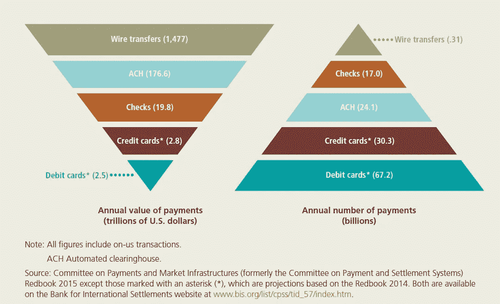

# 第一代区块链的基础知识及其在金融支付系统中的应用

> 原文：<https://medium.datadriveninvestor.com/basics-of-1st-generation-blockchain-and-its-applications-in-financial-payment-system-6bcca0d36976?source=collection_archive---------12----------------------->

# 区块链基础知识

区块链，也称为分布式账本技术(DLT)，是一个开放的分布式数据库，可以高效地以可验证和永久的方式记录各方之间的交易(Lansiti & Lakhani，2017)。许多研究(Nakamoto，2009 年) (Schneider 等人，2016 年)(布雷纳德，2018 年)(Lansiti & Lakhani，2017 年)(国际清算银行，2017 年)(加拿大支付，加拿大银行& R3，2017 年)证明，区块链是一项革命性的技术，具有极大的潜力来提高金融交易的透明度、效率、速度和安全性，并通过消除传统的可信托管人来降低交易成本。调解成本增加了交易成本，限制了最小实际交易规模，切断了小额临时交易的可能性，而且丧失为不可逆服务进行不可逆支付的能力会带来更广泛的成本(Nakamoto，2009)。

例如，一项研究(Schneider 等人，2016 年)估计，通过将区块链应用于现金证券(特别是股票、回购和杠杆贷款)的清算和结算，该行业可以通过转向更短的、可能定制的结算窗口，在全球范围内节省 110 亿至 120 亿美元的费用、运营支出和资本费用。区块链还可能通过缩短结算时间和降低对账成本，消除外汇、大宗商品和场外衍生品的大量额外成本。尽管股票等证券的交易成本相对较低，但高达 10%的交易会出现各种错误，导致人工干预并延长交易结算所需的时间(Schneider 等人，2016)。区块链可以帮助提高美国现金股票市场的效率，主要是通过简化交易后结算和清算流程(Schneider，et al .，2016)。

# 第一代区块链介绍

比特币是第一个被广泛采用的全球分布式公共交易账本。它是一种基于密码证明而非信任的电子支付系统，允许任何两个自愿方直接相互交易，而不需要可信的第三方(Nakamoto，2009)。在 2009 年推出后，比特币证明了它的稳定性、可靠性、效率、简单性和安全性，可以保留所有权记录，并直接将所有权从一个用户转移到另一个用户。

正在探索区块链的应用，特别是在支付、清算和结算活动中的应用，因为该技术可能会提高效率，例如跨境支付。其他协议，如 litecoin (Litecoin Foundation，2012 年)、比特币现金(Bitcoin Cash，2017 年)、Dash ( Duffield & Diaz，2018 年)、Monero (GetMonero.org，2014 年)等。都在努力提高功能的可扩展性、速度和私密性。但是，为了获得可伸缩性和提高每秒事务数，牺牲了安全级别和分散性。

要建立一个基于区块链的安全、分散、可扩展的支付系统来更好地服务于经济，单靠一个区块链协议无法真正实现这一目标，但由不同区块链和侧链组成的生态系统可以实现这一目标。在新的基于区块链的数字支付系统中，不同的区块链和侧链将具有不同的可扩展性、分散性和安全级别，以及各自的专业特性和功能，以分别满足个人和企业的不同支付需求。不同的区块链和侧链需要在没有任何人工或可信第三方参与的情况下自动或无缝地相互交互。

# 当前金融支付系统的基础

*Figure. 1\.* Total noncash payments (Federal Reserve and private sector), 2014.

在当前的支付系统中，借记卡、信用卡、支票和 ACH 服务一般提供零售支付服务，而 Fedwire 基金和证券服务以及国家结算服务(NSS)一般提供批发服务。如图 1 所示，以年度总值衡量，电汇、自动票据交换所(ACH)支付和支票是美国的主要支付方式。然而，以年度总数衡量，借记卡、信用卡和 ACH 支付是主要的支付方式。美联储的非现金支付和结算服务通常被归类为零售或批发支付服务(美联储银行，2018 年)。

# 未来分散的财政支付体系

高安全性、高分散性和低可扩展性像比特币这样的区块链将更像当前的电汇服务(Fedwire、SWIFT 和 CHIPS)那样运作，以处理高价值支付或转账，但交易量较低。相对低安全性、低分散性和高可扩展性的区块链或侧链将更像当前的零售支付服务(借记卡、信用卡、支票和 ACH)来处理低价值支付或高交易量的转账。随着数字支付生态系统的发展，这为小额支付打开了大门。人们可以按阅读文章付费订阅报纸，按观看的分钟付费收看电视节目，或按即时使用的每兆字节手机数据付费，几乎是零成本。

现在的技术挑战是如何在没有可信第三方的情况下，同时平稳地连接不同的区块链和侧链，以形成数字生态系统。随着技术的发展，如闪电网络(Poon & Dryja，2016)、智能合约(Szabo，1997)、元协议、加密身份和其他原子跨链交换(Atomic cross-chain trading，2018)等。，同步自动交叉区块链交互成为可能。例如，跨链原子交换可以在链外立即发生，具有不同的区块链共识规则。只要链可以支持相同的加密哈希函数，就有可能在不信任第三方托管人的情况下在区块链进行交易(Poon & Dryja，2016)。交易可以在链外执行，没有第三方在支付资金之前收集所有资金——只有与不合作的渠道交易方的交易才会在区块链上自动裁决(Poon & Dryja，2016)。

基于区块链的数字支付系统将带来低成本、高效率的解决方案，为未来的数字经济服务，确保人们能够以安全、即时的方式交换价值，而不需要可信的保管清算所或托管服务。通过低廉的费用和快速的交易，将有可能建立可扩展的小额支付，甚至在物联网应用或单位小额计费等高频系统中也是如此(Poon & Dryja，2016)。传统金融体系的另一个非常重要的支柱是资本储蓄和投资。然而，与目前加密数字支付和交易的成就相比，分散数字投资系统的进展远远落后。有很多工作需要做，以建立一个自动管理的加密数字资产投资系统。随着支付交易和投资系统的建立，加密数字资产将成为一种更具吸引力的资产类别，并作为一种重要的价值存储介质。

保持联系:

[Twitter @ JasonWuDeFiner](https://twitter.com/JasonWuDeFiner)/Linkedin:[JasonWuDeFiner](https://www.linkedin.com/in/jasonwudefiner/)

Twitter @[definer org](https://twitter.com/DeFinerOrg)/Linkedin:[definer org](https://www.linkedin.com/company/definerorg/)

[Https://DeFiner.Org](http://Https://DeFiner.Org)

*参考文献:*

路易斯安那州布雷纳德市(2018)。加密货币、数字货币和分布式账本技术:我们在学习什么？*解码数字货币大会。*旧金山联邦储备银行。检索自[https://www . federal reserve . gov/news events/speech/files/brain ard 2018 05 15a . pdf](https://www.federalreserve.gov/newsevents/speech/files/brainard20180515a.pdf)

杜菲尔德和迪亚兹博士(2018 年)。 *Dash:一种专注于支付的加密货币。*检索于 2018 年 8 月 1 日

萨博，N. (1997 年 1 月)。公共网络上关系的形式化和安全化。*第一个星期一*，2(9)。从 http://ojphi.org/ojs/index.php/fm/article/view/548/469[取回](http://ojphi.org/ojs/index.php/fm/article/view/548/469)

(2018).*原子跨链交易。*2018 年 8 月 4 日检索，来自[https://en.bitcoin.it/wiki/Atomic_cross-chain_trading](https://en.bitcoin.it/wiki/Atomic_cross-chain_trading)

国际清算银行。(2017).*支付、清算和结算中的分布式总账技术。国际清算银行。从 https://www.bis.org/cpmi/publ/d157.pdf[取回](https://www.bis.org/cpmi/publ/d157.pdf)*

比特币现金。(2017).*比特币现金:点对点电子现金。*Bitcoincash.Org。检索于 2018 年 8 月 1 日，来自[https://www.bitcoincash.org/](https://www.bitcoincash.org/)

美联储银行。(2018).*促进支付结算系统的安全和效率。*2018 年 8 月 3 日检索，来自[https://www.federalreserve.gov/aboutthefed/files/pf_6.pdf](https://www.federalreserve.gov/aboutthefed/files/pf_6.pdf)

GetMonero.org(2014 年)。 *Monero:私人数字货币。GetMonero.org。2018 年 5 月 6 日检索，来自[https://getmonero.org/resources/research-lab/](https://getmonero.org/resources/research-lab/)*

Lansiti 和 k . lak Hani(2017 年)。区块链的真相。*哈佛商业评论*，118–127 页。从 https://hbr.org/2017/01/the-truth-about-blockchain[取回](https://hbr.org/2017/01/the-truth-about-blockchain)

莱特币基金会。(2012).*基于区块链技术的支付加密货币。*检索于 2018 年 7 月 30 日，来自[https://litecoin.org/](https://litecoin.org/)

中本聪(2009 年)。比特币:一种点对点的电子现金系统。白皮书。2018 年 3 月 21 日检索，来自 https://bitcoin.org/bitcoin.pdf

加拿大付款公司、加拿大银行和 R3。(2017).*加拿大利用分布式分类账技术进行国内银行间支付结算的试验。*检索自[https://www . payments . ca/sites/default/files/29-Sep-17/jasper _ report _ eng . pdf](https://www.payments.ca/sites/default/files/29-Sep-17/jasper_report_eng.pdf)

Poon 和 t . dry ja(2016 年)。*比特币闪电网络:可扩展的链外即时支付。*2018 年 6 月 20 日检索，来自[https://lightning . network/lightning-network-paper . pdf](https://lightning.network/lightning-network-paper.pdf)

施耐德，j .，布洛斯坦，a .，李，b .，肯特，s .，格罗尔，I .，和比尔兹利，E. (2016)。*区块链:将理论付诸实践。*高盛股票研究。