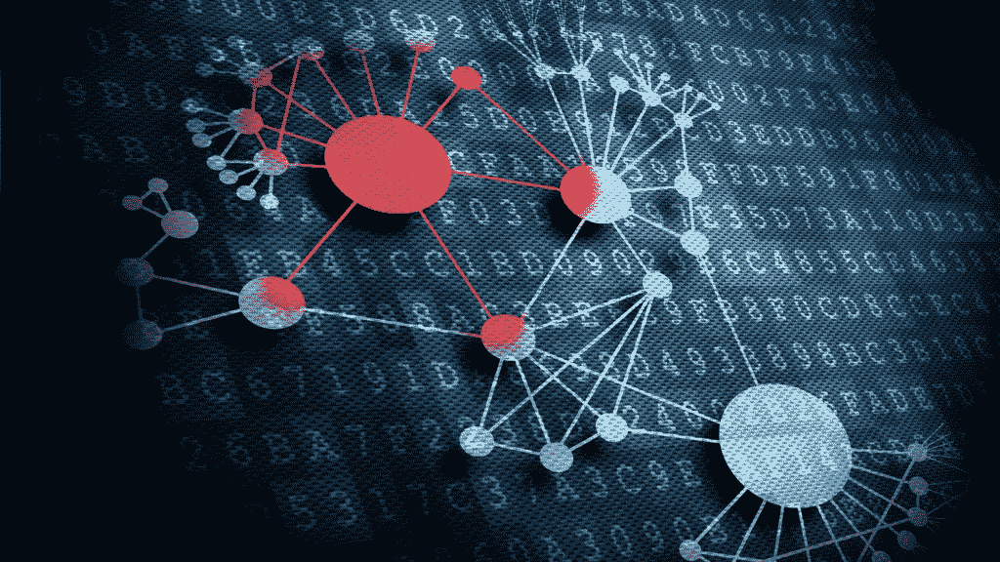

# 加密数字资产的基础

> 原文：<https://medium.datadriveninvestor.com/basics-of-crypto-digital-assets-70cfe32e357c?source=collection_archive---------4----------------------->

数字资产是一类可编程资产，以电子数据的形式存在，代表基础资产的所有权和价值。随着[第一代](https://medium.com/datadriveninvestor/basics-of-1st-generation-blockchain-and-its-applications-in-financial-payment-system-6bcca0d36976)和[第二代区块链、智能合约和 DApp](https://medium.com/datadriveninvestor/basics-of-second-generation-blockchain-and-its-applications-in-capital-market-244f75ce72ff) 的发展，发行和管理数字资产的摩擦明显减少。加密数字资产是数字资产的一个子类，它是在一个分散的计算网络中创建、存储、交换和管理的，没有中介。加密数字资产的形式可能不同于传统资产，但任何加密数字资产的核心与传统资产并无不同，传统资产是用于获取和存储价值的实体。

## 数字资产的类别

通常，基于采用区块链技术的难度，加密数字资产可以分为 6 个不同的类别。它们是加密货币、数字化传统金融资产、数字化法定货币、数字化无形资产、数字化有形资产和数字化传统服务和产品。

加密货币是一种由企业家发行的数字资产，用于资助区块链相关平台的创业成本。通常，初始硬币发行(ICO)用于发行加密货币，并承诺只接受该加密货币作为未来访问数字平台的支付。有时，平台可能有一个分散的治理主体，那么它也代表了平台的所有权。发行加密货币的其他形式，如工作证明挖掘和预挖掘、股份证明挖掘和预挖掘等。也是创业公司常用的。在加密货币的核心，它是一种新型的资产，代表了利用区块链技术开发的承诺服务的价值和权利。ICO 机制允许企业家产生对代币的买方竞争，这反过来揭示了消费者的价值，而企业家不必事先知道消费者的支付意愿。此外，通过揭示消费者需求的关键方面，加密令牌可以增加创业回报，超过传统股权融资所能实现的回报(Catalini & Gans，2018 年)。

数字化传统金融资产是股票、固定收益、ETF、REITs、衍生品等传统金融资产的数字化形式。数字化金融资产允许任何人在开放的金融网络中拥有和转移金融资产，而不需要可信的第三方，这将简化金融资产的创建、交换、清算、结算和治理。例如，在股票交易的整个生命周期中，需要许多金融中介:股票交易所和交易场所(纳斯达克、纽约证券交易所)、经纪人-交易商、托管银行和存托公司。区块链可以通过消除重复的确认或确认步骤，缩短结算周期，降低交易风险，进一步简化贸易周期的交易后部分，从而降低行业的成本和资本需求。

数字化法定货币是法定货币的数字形式，如美元、欧元、日元等。，它存在于分布式分类帐网络上；并且可以被拥有、转移和交换，而不需要像零售银行那样的受信任的保管人的参与。几家央行一直在积极研究如何利用区块链技术发行央行数字货币(布雷纳德，2018)(加拿大银行，2016)。同时，其他私有实体如[系绳](https://tether.to/)、[信任令牌](https://www.trusttoken.com/)、[和双子座](https://gemini.com/)等。为发行 USDT、TUSD、GUSD 等数字化法定货币提供托管服务。随着监管制度的进步和区块链识别技术的发展，数字化法定货币呈指数增长，并成为法定货币的一个非常重要的类型。

数字化无形资产是通过区块链发布和管理的数字化形式的无形资产。无形资产，如奖励卡、版税、版权、专利、商标、游戏点数、信用评分等。可以很容易地用区块链技术数字化。如今，由于所有权追踪的困难，以及知识产权交易和支付系统的高成本，执行知识产权对知识产权所有者来说始终是一个挑战。考虑到网络上内容的激增和易于分发，无形资产如软件、音乐、图像等。总是在未经许可的情况下使用。区块链有其固有的优势，如不变性、透明性、可追溯性、即时和低成本的交换和所有权转移。使用区块链可以更容易地跟踪所有权、权利和许可交易，以保护知识产权，并让创作者更好地控制许可和执行版权。

数字化有形资产是指通过区块链对有形资产的所有权和权利进行数字化、发行、分配和管理的数字化形式。有形资产，如房地产、商品、林地等。可用作基础资产来支持由受信任的保管人发行的数字令牌。这些代币的价格将与基础资产挂钩，代币可以在区块链进行交易、清算和结算，以消除交易场所、交易商和经纪人等中介。此外，数字化有形资产的高度可分割性使其很容易被分解为更小的单元，这些单元可以用于交换和透明地转移所有权，这将增加高价值资产的流动性和融资效率。像汽油硬币、金币等稳定硬币的流行。证明数字化有形资产的巨大潜在增长。

数字化常规服务和产品是由区块链上的公司或个人发布的代表其产品或服务的服务和产品的数字形式。一旦产品和服务被数字化，在区块链上进行交易和即时结算非常容易，从而显著降低交易成本和销售点的交易结算周期。此外，区块链的可追溯性和透明度有助于解决假冒产品问题。更重要的是，区块链的高度可及性将有助于服务和产品所有者接触更广泛的人群和客户，以扩大其市场。

## 数字资产是价值存储媒体的未来

我们相信，区块链的透明性、可访问性、可追溯性、可分性、即时支付、低成本、安全性、可靠性和分散化设计使其成为重塑金融服务、零售和供应链等传统业务的绝佳选择。

在区块链发生的交易可以通过一个开放的网络轻松监控和追踪，参与者之间的这种透明度和可追溯性将彻底改变制造和零售供应链。高可达性是区块链的另一项创新，这使其成为促进金融包容性和民主化以及无国界社会的完美技术。数字资产是一种电子数据形式的可编程资产，这使其具有高度可分割性和即时可转让性，结算成本较低。这将彻底改变价值交换、清算和结算方面的金融服务；资本筹集和分配；和支付系统等。其分布式网络架构设计解决了单点故障问题，显著提高了网络安全级别和可靠性。

数字资产是未来数字和智能经济的基石。随着人工智能、机器学习和物联网等技术的智能革命的发展，区块链将在没有任何人类参与的情况下作为价值交换渠道发挥关键作用。数字化资产是简化、自动化和加速商品、服务和价值交易和结算过程的秘密关键。然而，在区块链发展的早期阶段，有许多挑战等待人们去解决，例如网络的可扩展性、令人困惑和复杂的用户界面、缺乏法律地位、较差的社会意识和认可度以及极端的价格波动。这些挑战最终将通过技术开发、资本投资、成熟的生态系统、教育、强有力的监管制度以及广泛的采用和意识来解决。

区块链的流行和 Dapp 的发展引发了新一轮的金融革命，如加密货币的兴起，最初的硬币发行(ICO)热潮和代币经济的演变。加密数字资产现在正成为一种新兴的新型资产，并呈指数级增长。有数以千计的加密数字资产(CoinMarketCap，2018)通过利用区块链技术发行和管理，并且每天都在增加。与此同时，数字资产资本市场尚不成熟，一些人认为，如果一种成功的央行数字货币得到广泛使用，它可能会成为零售银行存款的替代品。这可能会限制银行为生产性经济活动发放贷款的能力，并产生更广泛的宏观经济后果(布雷纳德，2018)。因此，开发下一代分散式借贷平台以促进数字资产利用和分配的需求日益增加。这种更高水平的效率将增加市场流动性，降低交易对手风险，并优化资本利用(Schneider 等人，2016)。

几十年来，一个复杂的金融中介系统已经发展起来，用于存储、管理、转移、借贷、投资和风险管理这些用于私人和公共部门的巨额资金。金融中介是一项回报丰厚的业务，每年的收入池约为 5 万亿美元(相当于管理的资产约为 190 个基点)(McKinney，2017)。随着越来越多的资产被数字化，当前的金融中介系统在不久的将来将面临根本性的改变，并继续提高效率和降低系统成本。

保持联系:

[Twitter @ JasonWuDeFiner](https://twitter.com/JasonWuDeFiner)/Linkedin:[JasonWuDeFiner](https://www.linkedin.com/in/jasonwudefiner/)

Twitter @[definer org](https://twitter.com/DeFinerOrg)/Linkedin:[definer org](https://www.linkedin.com/company/definerorg/)

【Https://DeFiner.Org 

# 参考

路易斯安那州布雷纳德市(2018)。加密货币、数字货币和分布式账本技术:我们在学习什么？*解码数字货币大会。旧金山联邦储备银行。检索自[https://www . federal reserve . gov/news events/speech/files/brain ard 2018 05 15a . pdf](https://www.federalreserve.gov/newsevents/speech/files/brainard20180515a.pdf)*

加拿大银行。(2016 年 6 月 17 日)。*数字货币和金融科技*。从加拿大银行检索:[https://www . bankofcanada . ca/research/digital-currences-and-fin tech/fin tech-experiments-and-projects/](https://www.bankofcanada.ca/research/digital-currencies-and-fintech/fintech-experiments-and-projects/)

Catalini 和 j . s . Gans(2018 年)。*初始硬币发行和加密代币的价值*。检索 2018 年 9 月 28 日，来自[http://nber.org/papers/w24418](http://nber.org/papers/w24418)

*CoinMarketCap* 。(2018 年 8 月 20 日)。从 CoinMarketCap 检索:[https://coinmarketcap.com/](https://coinmarketcap.com/)

麦肯锡。(2018).旧游戏的新规则:金融中介变化世界中的银行。麦肯锡全球银行年度回顾。

尼奥。(2016).NEO White Ppaer:智能经济的分布式网络。2018 年 8 月 8 日从[http://docs.neo.org/en-us/whitepaper.html](http://docs.neo.org/en-us/whitepaper.html)检索

施耐德，j .，布洛斯坦，a .，李，b .，肯特，s .，格罗尔，I .，和比尔兹利，E. (2016)。*区块链:将理论付诸实践。*高盛股票研究。