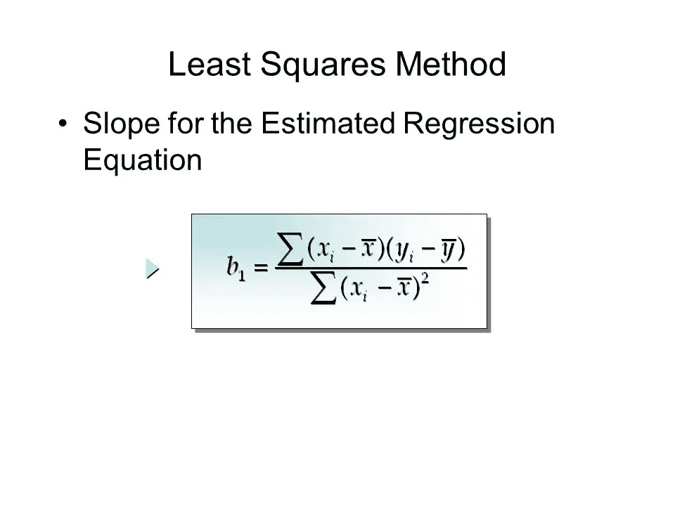
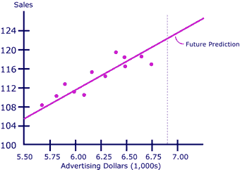

# 线性回归基础

> 原文：<https://medium.datadriveninvestor.com/basics-of-linear-regression-9b529aeaa0a5?source=collection_archive---------1----------------------->

*线性回归。*你可能在学习统计学课程或浏览 YouTube 上关于机器学习的视频时遇到过这个术语。线性回归是最流行的机器学习算法之一，也是最容易学习和最古老的机器学习算法类型。这是学习更复杂的机器学习算法的基础，学习这种算法是深入机器学习的好方法。

# 什么是线性回归？

线性回归是一种简单的线性方法，用来模拟自变量和因变量之间的关系。这意味着，假设我们有一个散点图，上面有一些点，线性回归的目标是绘制一条尽可能接近所有点的线。

Figure 1\. This is an example of what linear regression looks like and aims to achieve

线性回归最常见的用途是预测给定数据集的结果。例如，我们有三栋房子，面积分别为 400、800 和 1200 平方英尺，这三栋房子的成本分别为 100、200 和 300 美元。假设我们想买一栋 600 平方英尺的房子，我们想知道它的价格。它的价格最有可能在 100 或 200 之间，最有可能是 150，因为 600 平方英尺在 400 平方英尺和 800 平方英尺之间，它们的成本都是 100 和 200，那么 600 平方英尺的房子的价格就是 150 美元。

线性回归的一般方程是 y = mx +b。但在这两种情况下，左边的值始终是因变量，它取决于自变量乘以斜率(m)并加上或减去 b 的值。

# 线性回归的优势

当我们知道自变量和因变量之间的关系是线性关系时，这种算法是最好的，因为与其他试图寻找自变量和因变量之间关系的算法相比，它是最不复杂的。

# 线性回归的缺点

在现实生活中，世界上没有多少问题显示出自变量和因变量之间的明确关系。例如，让我们回到尺寸 v 成本的例子。通常还有许多其他因素在决定成本时发挥作用。然而，话虽如此，有人可能会说我们只需要添加更多的独立值，如交通便利程度、犯罪率等。但是，即使这样说，我们也没有办法确定一个 600 平方英尺的房子会花费 150 美元，因为在它发生之前没有什么是不可避免的。我记得在一个实验报告中使用了普通的最小二乘法来确定摆的长度和它的周期之间的关系。使用 OLS I 与使用公式计算的值相差 0.1。机器学习中的 0.1 是一个很大的数字。

此外，线性回归大多数时候只能在我们处理图形上看起来像一条线的关系时使用，因为“线性”意味着根据数学图形定义是一条直线。异常值是使线性回归在使用方面更受限制的其他因素，因为线性回归总是考虑最频繁的情况。例如，如果我们比较一个人的智商和他们在 SAT 考试中的分数，我们假设智商越高，SAT 分数越高。但是一个智商为 160 的自大学生在 SAT 考试中得了 400 分，这对我们的模型来说是灾难性的，线性回归将忽略这一点。

# 我们如何创造这种最佳拟合线？

创建这条最佳拟合线的最常见方法是使用一种称为最小二乘法的估计技术。等式如下所示，其中和 yi 是数据集中的特定值，上面带破折号的 x 和 y 是所有 x 或 y 值的平均值。

The equation for the least square method

# **应用程序**

线性回归有许多应用，如机器学习、趋势估计和经济学。最常见的监督学习机器学习算法是线性回归，因为它简单，而且它已经存在了一段时间。趋势估计也广泛使用线性回归，因为毕竟回归是对连续输出结果的预测。可以使用线性回归的例子有预测未来的石油或股票价格。在经济学中，许多事情也可以用线性回归来预测，如劳动力供求、消费支出等。

Linear regression is really useful for trend estimation

# 要点

这是我第一篇关于机器学习算法的文章，希望你喜欢。

以下是一些要点:

线性回归是最流行的机器学习算法之一，用于在给定一组特定值的情况下预测值。线性回归是一种建模自变量和因变量之间关系的线性方法。

优点包括它有多简单和易于实现，缺点包括缺乏实用性和现实世界中的大多数问题不是“线性”的。

您可以使用最小二乘法来创建最适合数据的直线。线性回归的一些应用可以在机器学习、经济学和需要估计的地方找到。