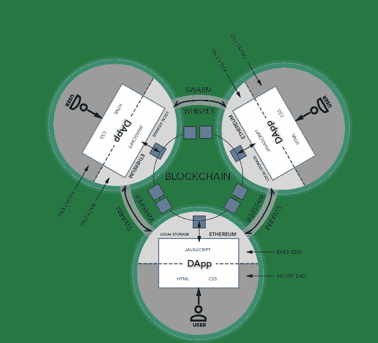
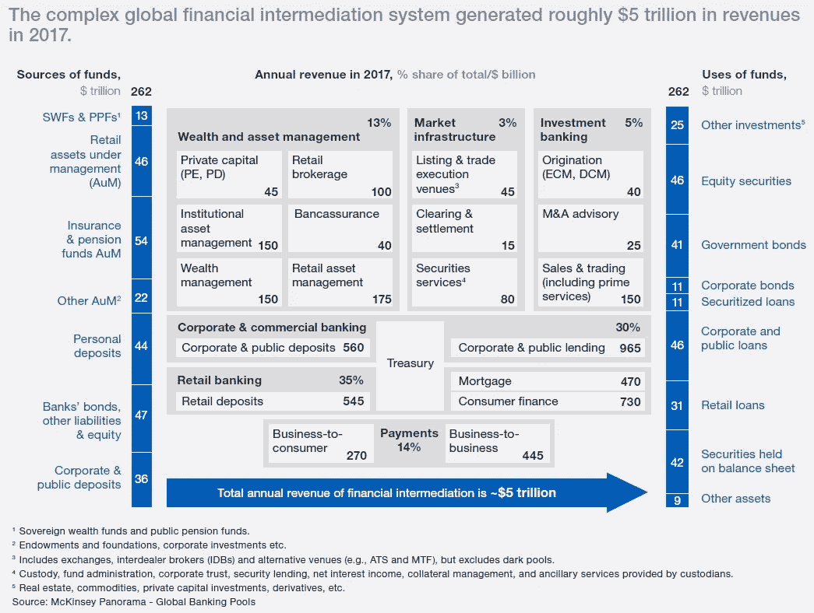

# 第二代区块链的基础知识及其在金融中介系统中的应用

> 原文：<https://medium.datadriveninvestor.com/basics-of-second-generation-blockchain-and-its-applications-in-capital-market-244f75ce72ff?source=collection_archive---------20----------------------->

具有支持复杂智能合同的内置功能的分布式总账网络通常被认为是第二代区块链。今天这些区块链的例子包括以太坊*(布特林，2015)* 、尼奥*(尼奥，2016)* 和图标*(图标基金会，2017)* 。通常，第二代区块链的特点是分布式应用程序(DApps ),它们构建在区块链层之上，形成一个服务生态系统，如预测、投票和借贷。智能合约和分散应用是第二代区块链的两个最显著的特征，因为它们代表了区块链技术在改变和改善日常生活方面的颠覆性潜力。

[“第一代区块链基础知识及其在金融支付系统中的应用”](https://medium.com/datadriveninvestor/basics-of-1st-generation-blockchain-and-its-applications-in-financial-payment-system-6bcca0d36976)讨论了第一代区块链的概念及其在金融交易和支付中的用例。然而，由于[第一代区块链](https://medium.com/datadriveninvestor/basics-of-1st-generation-blockchain-and-its-applications-in-financial-payment-system-6bcca0d36976)技术(即比特币)的功能有限，开发者和用户需要能够在区块链上执行更复杂交易的解决方案。这对于进一步推进区块链的采用是必要的，示例包括支持业务合同、未来协议和有条件协议的交易。现在，第二代区块链的引入使得通过利用被称为智能合约的创新功能来支持这些复杂的交易类型成为可能。

## 智能合同简介

智能合同是一组以数字形式规定的承诺，其中包括协议，各方在协议中履行这些承诺 *( Szabo，1997)* 。区块链技术允许在一个分散的、安全的、不可变的和可靠的计算系统内编写、部署和执行智能合同。在第二代区块链中，以前使用法律语言编写的合同条款现在可以用计算机语言编写，并随后部署在计算网络中，以通过分布式分类帐系统自动执行操作。

以太坊是第一个被广泛采用的支持智能合约功能的第二代区块链，它比比特币脚本(第一代区块链的前身)承载了更多的功能。这是因为新的增强功能增强了功能，包括图灵完备性、值感知、区块链感知和状态 *(Buterin，2015)。*以太坊的目的是为构建去中心化的应用程序创建一个替代协议，并提供一组不同的折衷方案，为大范围的用例创造价值。考虑用例时的关键标准包括需要快速开发时间的情况，以及不同应用程序高效、安全地相互交互的能力 *(Buterin，2015)。*

虽然第二代区块链的采用还处于起步阶段，但可扩展性方面的问题已经在推动未来几年向潜在的第三代区块链的进一步创新..

## 引入分散应用程序(DApp)

虽然第二代区块链为分散式应用构建了最终的抽象基础层，但它们也为现有的非区块链软件和应用系统带来了挑战。然而，开发人员可以轻松地编写智能合同，其中可以包含所有权、交易格式和状态转换功能的任意规则。这使得缓解这些挑战成为可能。

Figure 1 General Structure of Decentralized Application

分散式应用程序(dApp、Dapp 或 DApp)是在分散式对等网络上运行其后端代码的应用程序。这与在集中式服务器上运行后端代码的传统应用形成对比*(什么是 DApp？，2017)* 。通常，DApps 的一个关键组件是一个实用程序令牌，通常用于奖励用户提供计算能力或其他服务*(“分散应用”，未注明)。*与传统的 web 应用程序类似，DApps 的前端使用众所周知的脚本语言，如 HTML、CSS 和 JavaScript 来呈现页面。此外，DApp 的前端代码和用户界面可以用任何语言编写，因此它的功能就像一个调用后端的应用程序。它的前端也可以托管在分散存储解决方案上，如 [Swarm](https://github.com/ethersphere/swarm-guide/blob/master/contents/introduction.rst) *(SWARM-GUIDE，2018)* 或 [IPFS](https://github.com/ipfs/ipfs) *(IPFS:分布式网络，2018)* 。DApp 和应用程序之间的主要区别在于，应用程序使用 API 连接到数据库，而 DApp 使用智能合约来连接区块链并与之交互。DApps 将作为主流用户和区块链技术之间的桥梁，在帮助建立一个去中心化的社会中发挥至关重要的作用。

## 数字资产简介

具有第二层 DApps 的第二代区块链的发布极大地减少了发布和管理数字资产的摩擦。数字资产，或通常称为加密资产，被定义为以电子数据形式存在的可编程资产。借助区块链技术，资产的数字化现在可以是去中心化的、可信的、可追踪的、高度透明的，并且没有中介 *(NEO，2016)。*数字资产的形成可能不同于传统资产，但它们都有一个共同的目的，即有效地获取和存储价值。

通常，根据资产类别采用区块链技术所需的难度，数字资产可以分为 6 个不同的类别。这些类别包括加密货币、数字化传统金融资产、数字化法定货币、数字化无形资产、数字化有形资产和数字化传统服务和产品。请继续关注即将发表的一篇文章，在这篇文章中，我将进一步深入讨论数字资产。

## 金融中介= 5 万亿美元

根据麦肯锡的数据，2017 年全球所有金融中介机构的年收入总额为 5 万亿美元。这相当于我们全球金融体系总 262 万亿美元资金的 1.9%左右*(麦肯锡，2018)* 。你可能会想，“有没有更好的服务或解决方案可以显著降低这 1.9%的数字？”答案是肯定的——自动化。自动化将来自于采用区块链、人工智能(AI)、5G、物联网(IoT)和量子计算(仅举几例)等创新技术。如前所述，区块链的固有特性——透明度、可及性、可追溯性、可分性、即时结算、安全性、可靠性和权力下放——使其成为整合各种技术以重塑传统金融体系的绝佳选择。

Figure 2 Global Market of Capital Management and Allocation

数字资产将是未来数字智能经济的基石。随着数字革命在新兴技术(即人工智能、机器学习、物联网)中加速发展，区块链将作为一个价值交换渠道发挥关键作用，消除对集中式人工中介的需求。数字资产是简化、自动化和加快商品和服务贸易结算流程的关键。就像水总会找到到达目的地的最短路径一样，全球资金将通过最符合其目的的中介层流动。不过，重要的是要认识到，我们目前正处于区块链发展的非常早期的阶段，像所有新的创新一样，进步需要时间。有许多重要的挑战必须解决，其中一些包括网络可扩展性、简化用户体验、获得监管清晰度、提高社会意识和减少极端价格波动。然而，如果我们保持耐心并共同努力，这些挑战将通过持续的技术开发和成熟、额外的资本投资、强有力的监管制度和广泛采用来解决。

保持联系:

[推特@ JasonWuDeFiner](https://twitter.com/JasonWuDeFiner)/Linkedin:[JasonWuDeFiner](https://www.linkedin.com/in/jasonwudefiner/)

Twitter @[definer org](https://twitter.com/DeFinerOrg)/Linkedin:[definer org](https://www.linkedin.com/company/definerorg/)

[Https://DeFiner.Org](Https://DeFiner.Org)

# 参考

萨博，N. (1997 年 1 月)。公共网络上关系的形式化和安全化。*第一个星期一*，2(9)。从 http://ojphi.org/ojs/index.php/fm/article/view/548/469[取回](http://ojphi.org/ojs/index.php/fm/article/view/548/469)

(未注明)。*“分散式应用”，未注明出处*维基百科。2018 年 8 月 12 日从[https://en.wikipedia.org/wiki/Decentralized_application](https://en.wikipedia.org/wiki/Decentralized_application)检索

(未注明)。*“大到不能倒”，未注明*在维基百科。检索于 2018 年 5 月 25 日，来自[https://en . Wikipedia . org/wiki/Too _ big _ to _ fail # cite _ note-n 000333-13](https://en.wikipedia.org/wiki/Too_big_to_fail#cite_note-N000333-13)

Buterin，V. (2015 年)。*下一代智能合同和分散式应用平台。*白皮书。检索于 2018 年 3 月 5 日，来自[https://github.com/ethereum/wiki/wiki/White-Paper](https://github.com/ethereum/wiki/wiki/White-Paper)

CGAP。(2008).*让小额信贷机构的资金转移发挥作用。*DC 华盛顿州:援助穷人协商小组/世界银行。检索自[http://www . CGAP . org/sites/default/files/CGAP-Technical-Guide-Making-Money-Transfers-Work-for-Microfinance-Institutions-A-Technical-Guide-to-Developing-and-deliver-Money-Transfers-Mar-2008 . pdf](http://www.cgap.org/sites/default/files/CGAP-Technical-Guide-Making-Money-Transfers-Work-for-Microfinance-Institutions-A-Technical-Guide-to-Developing-and-Delivering-Money-Transfers-Mar-2008.pdf)

德米尔克-昆特公司、克拉珀公司、辛格公司和奥德休斯登公司(2015 年)。*2014 年全球 Findex 数据库:衡量全球金融包容性(英文)。*华盛顿特区:世界银行集团。检索自[http://documents . world bank . org/curated/en/187761468179367706/The-Global-Findex-Database-2014-measuring-financial-inclusion-around-The-world](http://documents.worldbank.org/curated/en/187761468179367706/The-Global-Findex-Database-2014-measuring-financial-inclusion-around-the-world)

图标基金会。(2017).图标:超级连接世界。检索于 2018 年 8 月 10 日，来自[https://docs.icon.foundation/ICON-Whitepaper-EN-Draft.pdf](https://docs.icon.foundation/ICON-Whitepaper-EN-Draft.pdf)

(2018).IPFS:分布式网络。检索于 2018 年 8 月 16 日，来自[https://ipfs.io/](https://ipfs.io/)

拉加德，C. (2018)。*评估金融部门的网络风险。*网络日志帖子:国际货币基金组织。2018 年 6 月 22 日检索，来自[https://blogs . IMF . org/2018/06/22/estimating-cyber-risk-for-the-financial-sector/](https://blogs.imf.org/2018/06/22/estimating-cyber-risk-for-the-financial-sector/)

麦肯锡。(2018).*旧游戏的新规则:金融中介变化世界中的银行。*麦肯锡全球银行年度回顾。

尼奥。(2016).NEO White Ppaer:智能经济的分布式网络。2018 年 8 月 8 日检索，来自[http://docs.neo.org/en-us/whitepaper.html](http://docs.neo.org/en-us/whitepaper.html)

(2018).*群导。*2018 年 8 月 15 日检索，来自[https://github . com/ether sphere/swarm-guide/blob/master/contents/introduction . rst](https://github.com/ethersphere/swarm-guide/blob/master/contents/introduction.rst)

(2017).*什么是 DApp？*2018 年 8 月 15 日检索，来自[https://ether eum . stack exchange . com/questions/383/what-is-a-dapp](https://ethereum.stackexchange.com/questions/383/what-is-a-dapp)