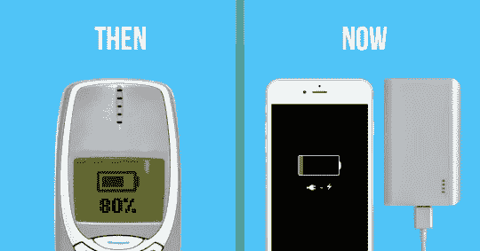
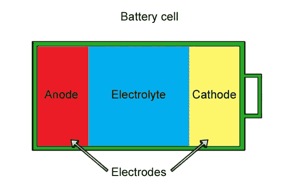
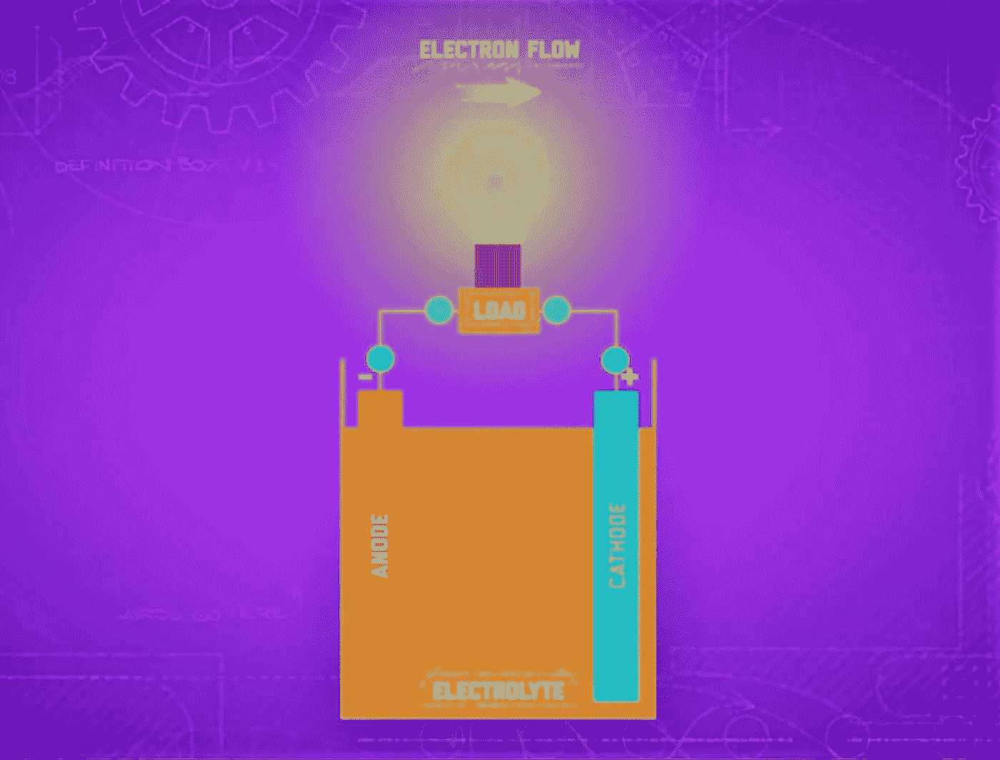

# 电池过去和现在

> 原文：<https://medium.datadriveninvestor.com/battery-then-and-now-7dcf854e837e?source=collection_archive---------12----------------------->

这最终会发生在我们所有人身上。你拿出手机，也许是为了给你的朋友看那个很棒的新视频，但是当你要开始看手机上那些你一直忽视的警告信息时，它们最终又回来纠缠你了。屏幕变暗，手机没电了。我的意思是，也许你昨天忘了给手机充电，但在最近的工程壮举之后，我们已经有了自动驾驶汽车，可重复使用的宇宙飞船，但我们仍然必须每天给手机充电，所以为什么没有人已经在研究更好的电池了。事实证明，这比听起来难多了。

电池的工作是提供电压或能量，以负电荷电子的形式推动电流通过电路。当它不能再为电路提供足够的电压时，电池就没电了。电池有 3 个决定寿命的主要组件，分别是阳极*、负极*、阴极*、正极*和电解液*T5，它们让电荷在两者之间流动。*

现在，在电池内部，阳极发生氧化，阳极中的电子浓度变得更高，然后还原反应开始，电子从阳极移动到阴极，将电能传递给与之连接的任何东西。

最终，氧化和还原的速率降低，这反过来又降低了电压，直到它最终达到不能再为通过电路的电流供电的程度，换句话说，电池没电了。我们能塞进电池的电量主要取决于它的类型。根据需求和使用场合的不同，电池也有很多种。显然，我们不希望每次汽车电池放电时都把它换掉，即使一次性电池充一次电可以运行更长时间。在整合到自动化无人机或机器人时，还有一些不太明显的例子，电池的设计应该考虑到重量和形状，同时生物工程师需要考虑哪些化学物质会进入电池，当你将电池供电的医疗设备植入某人的身体时，电池中的化学物质经常会与人的血液密切接触。因此，确保它们不会在外壳破裂时造成伤害非常重要。一些工程师实际上正在研究生物传感胶囊，这种胶囊将利用胃酸作为电解质来发电。这些肯定需要对人体安全。

# 锂离子电池

锂离子电池是最常用的二次电池(可充电电池)，广泛用于手机和笔记本电脑。锂离子实际上描述了一整类电池，但它们都倾向于具有基于锂化合物的阴极或阳极。当电池放电时，锂离子在电解液中交换，因此得名。这些类型的电池变得流行有几个原因。尽管它们非常昂贵，但它们是可充电的，并且能量密度很高。这使得它们非常适合在相对较小的空间内提供高电压和大量电力。尽管如此，在中午还是很容易耗尽电量，因为当我们找到让强大的组件变得更小的方法时，电池技术还没有跟上同样的步伐，不要误解我的意思，人们正在尝试，公司已经尽可能地投入大量精力来制造高能量密度和高效率的锂离子电池。只是很难做得比我们已经做的更多。工程师还必须考虑安全问题，因为当锂离子电池破裂时，它们可能会造成真正的安全隐患。购买 Galaxy Note 7 的人付出了惨痛的代价才明白这一点。锂离子电池中发现的某些叫做碳酸盐的化学物质非常易燃。同样令人不安的是，随着电池的重复使用，电解质中的锂会越来越少。这些链被称为树突，如果它们堆积过多并连接阳极和阴极，它们会使电池短路，甚至引起火灾。因此，除了一些小的调整，锂离子电池似乎已经达到了极限。如今，当手机或笔记本电脑公司吹嘘电池寿命更长时，通常是因为他们设计了其他组件来降低功耗，而没有找到让电池提供更多电量的方法。

> 在电池工程的前沿，研究人员正在试验新的化学组合。

例如，将大多数锂离子电池中使用的碳基阳极换成硅基阳极，可以在给定的体积内储存更多的能量。这可能意味着更长的电池寿命。将微小的二氧化硅颗粒引入电解液中，可以阻止枝晶在电池中进一步移动，从而阻止其快速生长，使其长期使用更加安全。然而，到目前为止，还没有人能够让这些改变在商业规模上发挥作用。但这些只是目前正在测试的几个想法，还有很多正在进行中，因为几乎所有主要的汽车公司都启动了绿色倡议，我们将看到更多对电池技术的研究。我们确实知道，科学发现和技术确实会随着时间的推移而改进，所以我们可以肯定，像特斯拉这样使用锂离子电池及其专利技术的公司，他们能够在汽车中实现更高的输出和效率，甚至找到了减少枝晶形成的方法。

作为一个科学爱好者，我希望看到电池技术发展得更快，我不傲慢也不无知地说，电池技术现在很糟糕，但让我们面对事实，电池技术正在迎头赶上，而几乎所有的工程领域，如太空，机械或电子，都在相互追赶和超越，而电池技术没有以同样的速度推进，我希望的是，也许只是也许我们不必在一天内强制性地给手机充电两次。

***参考文献***

 [## 麻省理工工程学院|“电池是如何工作的？

### 你的手表、笔记本电脑和激光笔都是由同一个东西驱动的:化学...由玛丽贝茨有很多…

engineering.mit.edu](https://engineering.mit.edu/engage/ask-an-engineer/how-does-a-battery-work/)  [## 电池是如何工作的？

### 电池中的化学反应导致电子在阳极聚集。这导致了电…

www.qrg.northwestern.edu](http://www.qrg.northwestern.edu/projects/vss/docs/power/2-how-do-batteries-work.html)  [## 电池是如何工作的？简单的介绍

### 作者克里斯·伍德福德。最后更新:2018 年 3 月 27 日。没有手机，笔记本电脑，或手电筒。没有电动汽车或机器人…

www.explainthatstuff.com](https://www.explainthatstuff.com/batteries.html) 

【https://web.mst.edu/~gbert/BATTERY/battery.html 

 [## 从胃酸中获取能量的可吞咽传感器

### 一种能够从体内传输信息并由胃酸提供能量的微型传感器已经由……公司推出

www.thenakedscientists.com](https://www.thenakedscientists.com/articles/science-news/swallowable-sensors-sustain-power-stomach-acid)  [## 更好的电池:特斯拉改进锂离子电池技术

### 特斯拉[纳斯达克:TSLA]在改进锂离子技术和减少电池方面并没有停滞不前…

evannex.com](https://evannex.com/blogs/news/making-batteries-better-how-tesla-could-improve-electric-vehicle-lithium-ion-battery-technology)