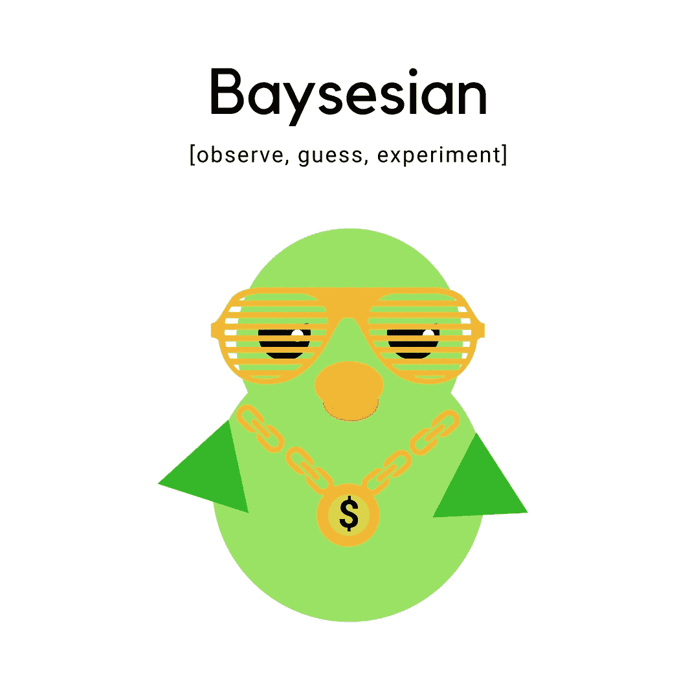

# 贝叶斯与频繁主义者对假人

> 原文：<https://medium.datadriveninvestor.com/bayesian-vs-frequentist-for-dummies-58ce230c3796?source=collection_archive---------10----------------------->

也许你也在学习统计学 101，并试图记住贝叶斯统计和频率统计之间的区别。

以下是我对这两者的看法:

[Frequentist Statistics: Conclusions are made based on the probability of an event]

Frequentist Statistics 就是那个痴迷于数字并且“精确”的可爱小书呆子。它严重依赖于固定的参数和一遍又一遍地重复这个过程。如果你问他是如何得出结论的，他可以一步一步地向你介绍这个过程。

> 频率主义推断是一种统计推断，通过强调数据的频率或比例，从样本数据中得出结论([维基百科](https://en.wikipedia.org/wiki/Frequentist_inference))。

[Bayesian Statistics: Applies probabilities to statistical problems to draw conclusions]

贝叶斯统计是坏的，考虑未知因素，同时根据以前的观察进行猜测，以得出结论。也许他会做对，也许不会，但他不太关心精确——这更像是一种“随波逐流”、“凭直觉”的方法。参数不是固定的。未知被视为概率，如果发生任何事情，“没什么大不了，我得到了这个”的更新。

> *贝叶斯分析(Bayesian analysis)，一种统计推断方法，允许人们将关于人口参数的先验信息与来自样本中包含的信息的证据相结合，以指导统计推断过程* ( [《大英百科全书》](https://www.britannica.com/science/Bayesian-analysis))。

随着我对这一主题的了解越来越多，这篇文章将会更新，但目前为止这是我对这两位的印象。**关键的区别在于它们如何处理参数。**一个人更刻板，而另一个人更容易接受未知因素和/或数据集的变化。