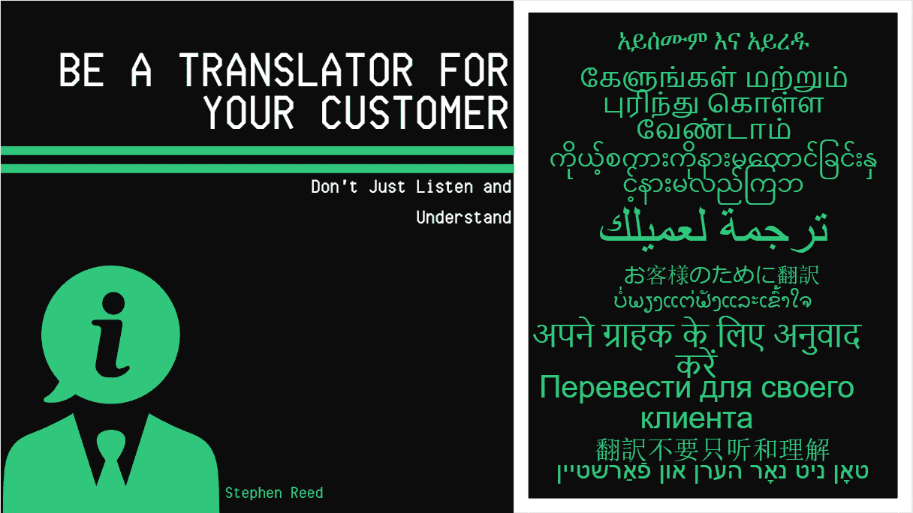

# 做你客户的翻译

> 原文：<https://medium.datadriveninvestor.com/be-a-translator-for-your-customer-acc6789e587d?source=collection_archive---------6----------------------->

无论你在什么组织中，你都可能会在职业生涯的某个阶段与客户打交道。这些客户的需求会因行业而异，但他们希望与你一起获得的体验总是完全相同的。

他们希望它是无缝和简单的。他们希望事情变得友好，当他们和你说话时，他们希望被听到。当给出反馈时，他们希望在未来的互动中看到改进。

这听起来是显而易见的，但是很难坚持做下去。事实是，客户体验的游乐场(CX)正在快速变化。顾客比以往任何时候都更加苛刻，期望得到最好的，否则他们就会离开。根据 Zendesk 的一项调查，95%的消费者因为糟糕的客户体验而采取了行动。糟糕的客户服务是客户流失率上升的主要原因之一。你的竞争对手非常渴望得到他们的关注和忠诚，如果你不能创造独特和吸引人的客户体验，他们就会偷走你的关注和忠诚。

由于所有垂直行业的竞争加剧，维持稳定的客户关系与提供创新产品同样重要。根据 [MarketsandMarkets 的分析](https://www.marketsandmarkets.com/Market-Reports/customer-experience-management-cem-market-543.html)，全球客户体验管理市场预计将从 2017 年的 59.8 亿美元增长到 2022 年的 169.1 亿美元(年复合增长率为 23.1%！！！).为了确保您不会落后，您必须保证您的组织能够满足客户的期望。

网飞、Spotify 和亚马逊是客户依赖的公司，因为它们通过完整的体验建立了联系。无论接触点在哪里，用户的体验总是无缝和个性化的。据[商业记者](https://www.marketsandmarkets.com/Market-Reports/customer-experience-management-cem-market-543.html)报道，超过一半的顾客表示，如果零售商提供个性化服务，他们更有可能选择零售商。为了让某人花掉他们辛苦赚来的钱，他们需要确信他们不断变化的期望会得到满足。

没有高级分析，几乎不可能满足这些期望。

# 选择如何聆听

你和你的竞争对手很可能已经在收集、分析并试图理解客户数据。有许多创造性的方法来获得关于你的客户的数据。你可以让他们填写一份调查，监控他们的社交媒体行为，或者拔他们的头发，这样你就可以测试他们的 DNA(出于合法性原因，我推荐前两个数据源，而不是第三个)。

在您一头扎进技术解决方案池之前，您必须首先解决您组织中的员工参与度问题。员工是您最重要的客户体验管理解决方案。最近的一项盖洛普调查报告称，散漫的员工会损害与十分之一客户的互动，阻碍他们继续做生意。解决员工脱离的一个办法是让他们成为组织中的变革者。赋予他们翻译客户体验的能力，可以激发他们积极参与公司发展的愿望。

因此，与其渴望新的热门语音或文本分析技术，不如评估一下你和客户之间的个人互动。根据相同的[市场和市场分析](https://www.marketsandmarkets.com/Market-Reports/customer-experience-management-cem-market-543.html)，呼叫中心是客户体验管理市场中最大的部分(20.8%的份额)，并且它将继续增长。

我在一家名为 Zacoustic 的创新公司工作，该公司允许员工成为他们与之互动的客户的翻译。员工使用我们的工具预测每次互动的顾客情绪。当客户对组织的现有调查作出回应时，通过与同一互动的实际客户反馈进行彻底比较，员工预测的准确性得到提高。我们创建实时数据，让员工成为积极的参与者，而不会妨碍客户的体验。

收集和创建数据对于数据驱动的 CX 战略至关重要，但这仅仅是开始。

# 理解他们在说什么

数据是复杂的，有很多噪音需要筛选。很难收集和组合来自不同接触点的所有数据，并根据客户的需求和期望对其进行分类。组织投入时间和金钱来分析和综合数据至关重要。通过了解如何预测、识别结构化和非结构化数据并确定改进的优先级，您可以开始讲述一个能够产生高投资回报的故事。

即使您的组织中有人知道如何分析和综合数据，一些决策者也会认为他们需要等到数据完美。你的工作是说服他们不要等待，在为时已晚之前采取行动。总会有数据丢失，而且通常是一团乱麻。这可能会导致犹豫，但关键是要卷起袖子，尽最大努力收集数据，以便尽快洞察客户的行为。

大数据可能是秘方，但你仍然需要人和他们的分析技能来烹饪完美的菜肴。您可能已经有了可以解释数据的人，但是真正的力量在于您如何与组织中的决策者分享这些见解。

# 翻译你所听到的

无论您选择通过什么数据源来倾听和解释您的客户，在您能够创建可操作(且可重复)的步骤来帮助提高 CX 和您的底线之前，这都没有任何意义。这不是顾客告诉你什么，而是你听了多少次并对顾客所说的做出反应。这对于公司来说往往不容易做到。在 SAS 最近的[研究中，只有 23%的公司能够实时整合客户洞察。](https://www.sas.com/en_us/offers/display/2017/maximizing-moments-of-truth.html)

为了真正改变一个组织，你必须说服决策者关注浮出水面的丑陋的发现。如果你想作为团队成员开始创造价值，确保你能够将这些发现转化为机会和行动。

做一个能够理解你的顾客并快速准确地讲述他们的故事的人。成为你的客户的声音的来源会让你的组织中的每个部门在你每次说话时都专注地倾听。许多人可以停下来听听数据，确保你是少数几个能真正将其转化为公司创新 CX 的人之一。

*原载于 2018 年 6 月 3 日*[*【https://www.linkedin.com*](https://www.linkedin.com/pulse/translator-your-customer-stephen-reed/)*。*