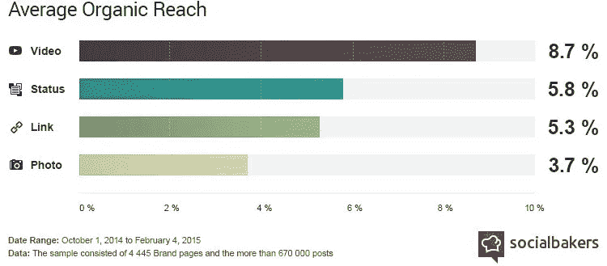

# 发挥创造力，改变世界

> 原文：<https://medium.datadriveninvestor.com/be-creative-and-change-the-world-55288cce7184?source=collection_archive---------1----------------------->

## 视觉叙事和社交媒体联合起来创造不同

Besides social media content creation, David Pepper founded the World Says What project.

社区经理和内容创建者忙得不可开交。社交媒体每天都变得越来越拥挤，创作者必须处理不断变化的算法。不管他们朝哪个方向走，他们都必须跟上。

他们的目标是有机参与，这是[大卫·佩珀](https://twitter.com/davepepper01)的专长。他在社交媒体战略和内容创作方面与品牌合作。这包括网络系列、商业广告、企业形象、纪录片和一部艾美奖获奖电视剧。

他还创立了[世界说什么](http://davidpepper9.wixsite.com/mysite-1/participate-in-something-good)项目。它结合了视觉叙事和社交媒体的力量，以促进跨文化的更好理解和积极变化。

佩珀与销售和营销专家艾伦·基尔比谈论了他让世界变得更美好的热情。

 [## 无论在线还是离线，社区建设都是一个立竿见影的方法

### 不成为昙花一现的奇迹需要努力

blog.markgrowth.com](https://blog.markgrowth.com/online-and-off-community-building-is-a-quick-win-f8006bcb1958) 

与其他社区管理者和内容创作者一样，Pepper 一直忙于保持领先地位。如果他落后了，他的竞争对手将会领先。

“像大多数社交上的成功一样，从倾听开始，”他说。“倾听您可以通过创建的内容解决的问题、难点或未得到满足的需求。”

随着各种各样的内容争夺注意力，需要有一个挑剔的眼睛来看看什么是最好的。

# **消费和参与**

“你花多少钱和参与度之间几乎没有关联，”佩珀说。“从可爱的小猫、有趣的 gif 到精致的机构视觉故事，一切都可以在社交媒体上取得成功。

 [## 不开玩笑:营销是为了搞笑|数据驱动的投资者

### 当你把幽默和营销结合在一起时，这是一件有趣的事情。当然，马克·安德森希望如此。别叫他雪莉。相反…

www.datadriveninvestor.com](https://www.datadriveninvestor.com/2019/02/25/no-fooling-marketing-goes-for-laughs/) 

“多样性和一致性是需要记住的两件事，”他说。“使用幽默、“马上就来”、用户生成的内容和执行良好的制作技术的组合，为您的受众量身定制。建立一个定期的时间表，并保持内容管道填满。”

当有机流量下降时，专家们不得不尝试新的策略。一切顺其自然。为此，Pepper 提供了一个解决方案。

“走在变化的前面，”他说。“练习订婚前的内容。内容创作者知道“发布并祈祷”不是一种策略。通过使用参与优先的策略，让你的所有内容都有最大的成功机会。”

这意味着“在内容创作之前有一个战略并完全实施它”

你可以通过抓住每一个机会与你的目标受众互动，在获得内容之前获得参与度。这可能是在聊天或正常的谈话流。保持在场，让人们对你可能说的话感兴趣。

# **社会公民**

“这听起来很老套，但是，成为你希望服务的社区的一部分，”佩珀说。“作为有价值信息的可靠来源，在您有内容供他人分享之前，请先成为一名优秀的‘社会公民’。

“当你提供价值时，服务不足的小众受众会产生高参与度，”他说。“听，评论，分享。然后交付。”

Pepper 记录了使用各种社交媒体工具时的平均有机接触范围(如上)。知道视频占主导地位有助于引导内容创作。

“找出迎合你所在社区的脸书团体、Instagram 账户和 twitter 标签，”他说。“投入你的时间和精力去喜欢、分享和评论别人的内容。为自己塑造想要的社交行为。"

投资于技术、人员和内容的首席执行官和首席营销官在没有实现业务目标时会感到失望。尽管很痛苦，他们需要听到真相。获得信任是无价的。

“我理解高管们在社交媒体上寻求投资回报的挫败感，但不要责怪内容，”佩珀说。“这几乎总是因为参与战略，或者说缺乏参与战略。

“即使有策略，也没有保证，”他说。"如果你不完全执行这一策略，内容仍然会变得平淡无奇."

# **对所有人都好**

幸运的是，Pepper 说，参与优先策略可以应用于任何内容。

“找到你真正的粉丝，”他说。“成为有价值信息的可靠来源，以产生最一致的结果。”

他还提出了一个有效的策略。

“使用与事件相关的内容的创作者应该在你的内容被分享之前很久就参与对话，”Pepper 说。“做一个好的社会公民。在你要求别人使用你的内容之前，提升你的个人形象和个人品牌。

“即使是在电影节上获得大量关注并赢得奖项的视频，也可能无法在社交平台上获得牵引力，除非你采取下一步措施成为对话的一部分，”他说。“为他人着想，他们也会为你着想。”

 [## 视频创造了令人感动的差异

### 图像会留下不可磨灭的印象

medium.com](https://medium.com/datadriveninvestor/video-creates-a-moving-difference-ec43f8dd16f9) 

最重要的是，大声说出来。

“如果你不问，答案总是否定的，”佩珀说。“有行动号召。当你参与、倾听和分享时，美好的事情就会发生。”

# **重新开始**

参与优先策略可能最适合新社区，因为那里的每个人以前都没有参与过。没有坏习惯或关系需要处理。

“我创立了世界说什么项目，与愿意提供帮助的社交媒体策略师和内容创作者一起测试‘参与优先’，”佩珀说。

在这个项目中，参与者记录一个问题的答案。答案编辑完成后，Pepper 和他的团队将在全国和全世界同步分享成品。

“结果将是创建一个独立的内容创作者网络，保证高有机物，”他说。

佩珀邀请任何感兴趣的人加入[世界说什么](http://davidpepper9.wixsite.com/mysite-1/participate-in-something-good)。

“如果我们证明有机参与是通过社区建立起来的，我们就能有所作为，”他说。“希望大家考虑帮助我们的项目。”

**关于作者**

吉姆·卡扎曼是[拉戈金融服务公司](http://largofinancialservices.com)的经理，曾在空军和联邦政府的公共事务部门工作。你可以在[推特](https://twitter.com/JKatzaman)、[脸书](https://www.facebook.com/jim.katzaman)和 [LinkedIn](https://www.linkedin.com/in/jim-katzaman-33641b21/) 上和他联系。