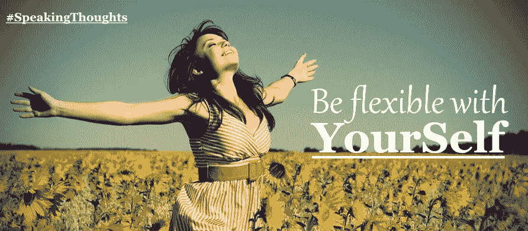
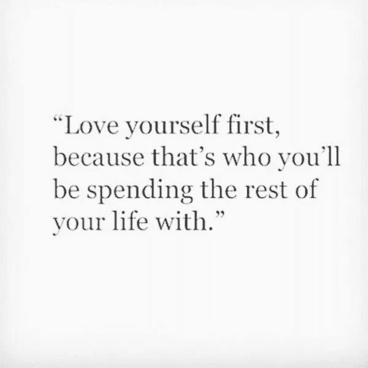
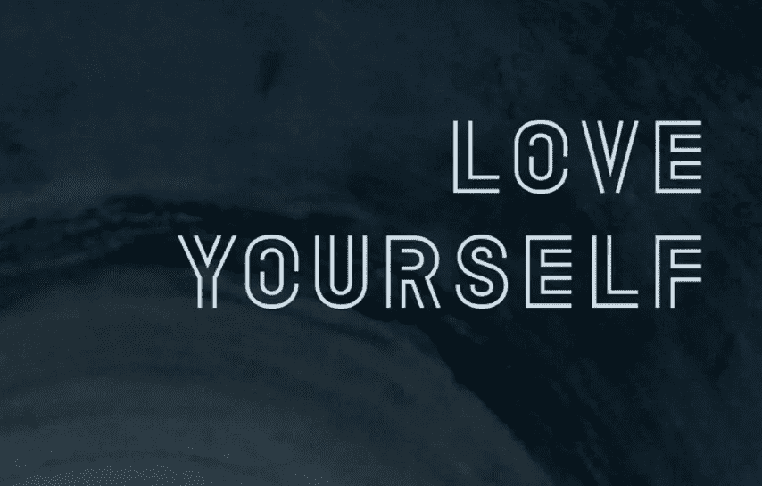

# 灵活对待自己

> 原文：<https://medium.datadriveninvestor.com/be-flexible-with-yourself-9036be326153?source=collection_archive---------9----------------------->

你还不累吗？你在人生的旅途中一直在挣扎，战斗，奔跑。你是唯一的幸存者，你幸存了下来，即使你可能已经输掉了很多场战斗。但是现在让自己冷静下来，休息一下，给自己一个微笑，因为你比任何人都更值得拥有它。告诉你自己，你不在乎别人对你的看法。

你是这个世界上最重要的人，所以，照顾好自己。

当我坐在角落里，看着这场生活秀时，我意识到并找到了许多问题的答案。因此，我们今天的下一个体会是“对自己灵活一点”。

请微笑，善意的静下心来放松，没事，完全没事；你一直在对其他人说这些话，但是你也应该说这些话。让我们带着微笑开始这篇文章，并大声说，“嘿，我，请反思这篇文章”。为自己做点什么，你会感觉更好。那在你身上创造了积极的能量，那是缺失的。今天，我们将寻找你和你自己身上的积极因素。

你是一名战士，唯一的幸存者，也是一名奋斗者，你一直在为自己和他人战斗，为了你的能力，为了你的自尊、荣誉和尊严。你相信在这个世界上生存的唯一方法就是跑得比任何人都快，不达目的誓不罢休，变得苛刻，把自己逼得更紧，把自己紧紧绑在目标上，忽视自己的愿望和生活事件，为自己犯下的所有错误惩罚自己。

你不觉得你厌倦了这一切吗？而你厌倦了取悦别人而忽略自己？你不觉得你现在需要休息一下吗？所以，告诉自己，最后一切都会好的。放松对自己的控制，原谅自己和所有人，感受爱之风进入你的内心。这种生活意味着我们要和自己以及周围的人一起生活。当我坐在角落里的时候，我在想，每天努力奋斗，我会得到什么？没什么，只是我会伤害自己。

然而，对自己要有弹性。你可以和自己交朋友，而不是和自己斗争。不要犹豫地要求自己，微笑地做你喜欢做的事情。

要足够灵活，告诉自己这样就可以了；是的，如果你失败了，如果你没有实现你承诺的目标，这完全没关系。宇宙会奖励你另一个明天去做你喜欢做的事。

足够尊重你自己，认识到早上叫醒你的目的，原谅你所犯的错误。放下它，继续前进。比起去想一些我们甚至无法改变的事情，还有数以百万计的其他事情要做。

深入思考，知道这是你的人生，你宝贵的人生。它已被授予你，并保证随时可以完成。所以它不是一个我们每个人都在甚至不知道目的的情况下跑步的比赛平台；你现在已经厌倦了这种没有目标的生活。所以，让自己平静下来，微笑，开始承认自己的错误和品质，并向自己承诺，你会得到一个更好的自己。

要足够明智地相信，无论过去发生了什么或现在正在发生什么，无论你现在正在经历什么痛苦，都将结束。会有明天，一个新的太阳会出现，它的光芒会照耀在你的脸上，希望它会为你而改变。

爱你自己，要意识到你是这个星球上重要的人，你的选择和决定很重要，因为最终，你只会和你自己在一起。所以，尊重你的存在。不要把时间浪费在不值得的事情或人身上。多接触可敬善良谦逊积极向上的人。

你知道吗，无论今天的你是什么，都不是真正的你。这是你为了让别人接受而建立的形象。做真正的你是值得的。

我们的思想就像天空中的鸟。让他们飞向世界各地；除了你自己，没有人限制你的思想，所以放松吧。先对自己灵活，再对别人灵活。

如果你真的想尊重自己，那么你必须接受自己，努力成为你一直梦想成为的人。采取措施，知道如何对自己感到快乐。不要满足于你应得的，你是唯一知道你有能力做什么的人。积极评价自己；只有你才能在周围产生正能量。不要拿自己和别人比较，你没有可比性。通过自我对抗来增加对自己的了解，这就是你每天进步的方法。