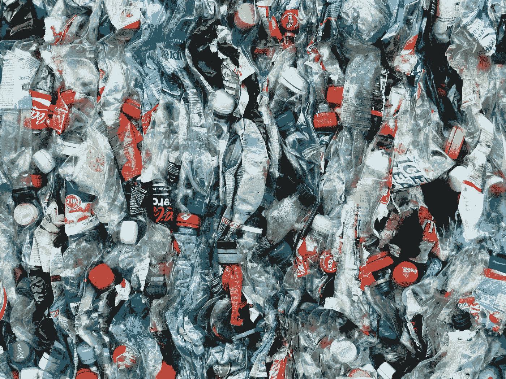

# 是塑料的

> 原文：<https://medium.datadriveninvestor.com/be-plastic-5191b3c14335?source=collection_archive---------36----------------------->

我并不提倡整形手术。

我也不是建议我们在生活中戴上“面具”(尽管说实话，我们每个人在某个时候都戴着面具)。

我在研究塑料是如何被回收的，发现塑料是不可摧毁的，通常会碎成很小的碎片。这让我开始思考“坚不可摧”和“牢不可破”的区别。

在生活中，我们会有失败的时候。许多激励信息说“不要放弃”。但是我们失败的因素和原因有很多。有时候，我们不够好。在这种情况下，我们更加努力，变得更好。其他时候，这可能是由于环境因素，或者只是时机不对，或者这根本不是我们的天赋所在。我们需要学会何时放弃。

放弃的时候我们可能会被失败“击垮”。我们也可能因为信任的人的背叛，或者失去爱的人等等而“崩溃”。我们不是牢不可破的，我们也不应该试图成为牢不可破的。

重要的是要坚不可摧。我们不会被失败、背叛或损失摧毁。我们可以被“回收”并回到正轨。

当我们相信自己“坚不可摧”的时候，我们会更愿意冒险(当然是算计好的)。无论结果如何，我们都将展示出“玩家”的态度，自豪地宣称“好游戏！”。

要塑料的。