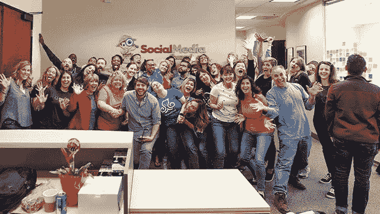

# 忠于你的团队

> 原文：<https://medium.datadriveninvestor.com/be-true-to-your-group-f99f6aca6bca?source=collection_archive---------9----------------------->

## 忠诚的社区成员是最好的学习对象

Social Media Examiner sets the standard as a tight-knit community.

社交媒体不仅仅是得了便宜还卖乖。事实上，这种方法会让犯罪者被踢出任何值得尊敬的网络社区。

关于与团队互动的最佳方式，[艾丽卡·洛夫格林](https://twitter.com/eelovegreen/)有一些建议。她在全球最大的社交媒体管理机构 [ICUC](https://twitter.com/ICUC) 负责数字战略。她的订婚基石是忠诚。

“建造它，”她说。“忠诚的社区成员是那些关心你所说的话的人。他们有可能一次又一次地回来。没有比这更好的学习团体了。

洛夫格林说:“*信任*是我们在所有载体和行业中都需要的一个巨大的词。“我们需要重建信任。潜力如此之大。”

数字营销专家 Madalyn Sklar 同意这一观点，并将这一理念应用于在线和离线网络。

“建立一个社区非常重要，”她说。“这是你与追随者联系和成长的方式。这是任何伟大企业的真正支柱。”

 [## 无论在线还是离线，社区建设都是一个立竿见影的方法

### 不成为昙花一现的奇迹需要努力

blog.markgrowth.com](https://blog.markgrowth.com/online-and-off-community-building-is-a-quick-win-f8006bcb1958) 

正如 Jen Cole 指出的那样，建立和维持关系需要持续一整年的努力。她是社交媒体专家，也是社交媒体审查员的社区经理，是描绘媒体的联合创始人，也是播客的主持人。

她说，“尽管在整个节日期间与你的品牌保持联系尤为重要，但一定要让你的社区随时了解你的品牌或公司的动态。”“向他们展示你的关心。”

社区建设从邀请人开始。

“我很惊讶有这么多大品牌错过了这一步，”洛夫格林说。“在寻找成员时，要知道你所在社区的目标。

“你想从中得到什么？”她说。“你的粉丝能从中得到什么？招募品牌倡导者。永远不要忘记你的*为什么*

Sklar 特别重视注意力:“除非你听，否则你将一事无成。”

# **伸手吸引**

多样性将有助于社区领袖找到合适的受众。

洛夫格林说:“让你的内容多样化，从数据中学习。”。“这将有助于指导你了解哪些对你的受众有效，哪些无效。分析，分析，分析。

“不要对你的人做假设，”她说。“那是菜鸟的错误。”

Sklar 有一些搜索观众的技巧要记住:

*   [先听后说](https://blog.markgrowth.com/listen-for-good-vibrations-6cfa76efe031)。
*   研究研究研究。
*   结识你所在行业的重要人物，并与他们交谈。推特对此很有帮助。
*   知识就是力量。

 [## 一次一个对话地建立社区

### 了解什么是新的，什么不是，以及为什么它很重要

blog.markgrowth.com](https://blog.markgrowth.com/build-communities-one-conversation-at-a-time-a3c2feb071af) 

有很多社交媒体平台可供选择。正确的取决于社区的性质。

“建立人物角色，”洛夫格林说。“然后对它们进行细分，并按平台进行优先排序。提前考虑你现在在哪里，你要去哪里，这样你才能有战略眼光。*永远不要忘记客户*

科尔说专业化提供了巨大的回报。

“每个社交频道都是它自己的社区，应该被如此对待，”她说。“对于社交媒体审查员，我们的人在大多数频道上，但我们主要坚持 LinkedIn、脸书、Twitter、Instagram 和 YouTube。这是我们的观众最感兴趣的地方。

“我们只需要为每个社区使用正确的格式和信息，”科尔说。“知道他们想从你的品牌中看到和体验什么。”

一般来说，理想的平台就是观众所在的地方。

“如果他们在一个社交媒体网站上，去拥有那个网站，”Sklar 说。“如果他们是一人多项或者全部*项，学习你需要知道的一切。然后你就可以撼动平台。”*

寻求证明自身价值的营销人员希望衡量社交媒体上的社区参与度。他们应该知道不是所有的人生来平等。

洛夫格林说:“跟踪情感是了解你的内容如何为你的观众服务的一种方式。”。“根据你的关键绩效指标，深入研究[网站分析](https://blog.markgrowth.com/stripping-away-the-layers-of-algorithms-a5471874ca3e)不会有坏处。

“给你一个专业建议:远离虚荣指标，”她说。"一次实实在在的订婚比 20 个赞更有价值."

# **不止一个数字游戏**

统计数据不应该统治社区。

“定期查看你的分析，但要知道这是关于与人联系，而不是大的花哨数字，”Sklar 说。“你建立的每一个联系都是金子。

“自从我全押在定制 gif 上后，我的订婚就一飞冲天了，”她说。“人们喜欢它们。我想出了如何在一条推文中拥有多达四张 gif。”

关于 gif 的更多信息，[见 Sklar 关于 gif 和在 Twitter 上创建自定义 gif 的帖子](https://twitter.com/MadalynSklar/status/1205177254583685123)。

 [## 最棒的 GIF 是转瞬即逝的

### 尝试简单、醒目的视觉效果来赋予你的品牌个性

medium.com](https://medium.com/datadriveninvestor/the-greatest-gif-of-all-is-fleeting-868d6220f69a) 

“我一直致力于通过鼓励我的社交媒体审查员社区对我们的帖子发表评论来吸引他们，”科尔说。“你会注意到，我们的大多数 Instagram 帖子都包含某种问题。我们从这种参与中从观众那里学到了很多东西。”

尽管许多社交媒体平台很诱人，但时间管理还是有很多值得一提的地方。洛夫格林有以下几点:

*   创建一个内容日历并优化它。
*   将内容组合作为策略的一部分。[有的能常青吗](https://www.datadriveninvestor.com/2019/02/01/evergreens-sprout-new-life/)？如果有，什么时候，占多大比例？
*   平衡常青树与本地化内容。

“在各种社交媒体平台上管理时间的最佳方式是制定一个计划，”Sklar 说。“每天抽出时间联系和回复你所在社区的人。对重要信息、资源和常青内容使用调度。”

在整体调度中，对各个站点进行排序。

科尔说:“我在[体式](https://twitter.com/asana)工作管理平台上把每个频道列为每天的单独任务。“这真的帮助我记住了要继续前进和参与。

“我还通过我们的社交媒体审查员社交倾听和日程安排工具，每天多次监控参与度，”她说。“这是一个优秀的系统。”

# **锁定专家**

授权是任何企业的一个重要方面，社交媒体管理也不例外。这包括知道何时雇佣外部帮助。

洛夫格林说:“一旦危及质量，就马上行动。”“永远不要危及这一点。帮助可以以支持、管理或战略的形式出现。”

 [## 掌握生产力可以缓解焦虑

### 一致性是成功在线互动的关键

medium.com](https://medium.com/datadriveninvestor/mastering-productivity-eases-anxiety-97bb78e776fa) 

试图做太多最终什么也做不了。

“当你处理太多事情时——你对每个平台的关注和你制定战略的能力下降了——寻求帮助，”科尔说。

洛夫格林喜欢用几种工具来吸引观众。

“我是斯普林克尔和 T2 萌芽社交网站所做的改变的忠实粉丝，”她说。"我更喜欢我的公司开发的名为 ICUC 中心的工具."

**关于作者**

吉姆·卡扎曼是拉戈金融服务公司的经理，曾在空军和联邦政府的公共事务部门工作。你可以在[推特](https://twitter.com/JKatzaman)、[脸书](https://www.facebook.com/jim.katzaman)和 [LinkedIn](https://www.linkedin.com/in/jim-katzaman-33641b21/) 上和他联系。