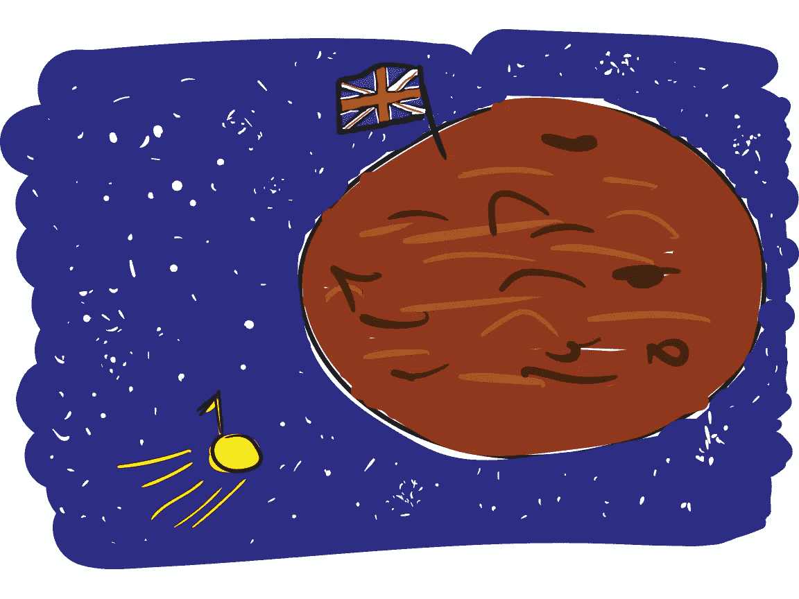
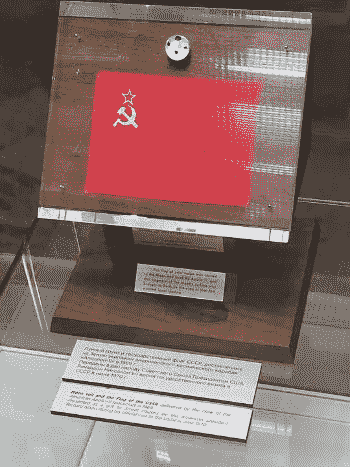
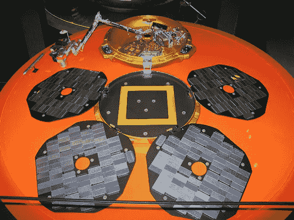
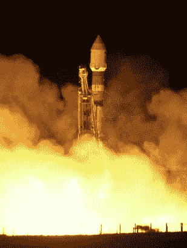

# 小猎犬 2 号:被送往火星的英国宇宙飞船

> 原文：<https://medium.datadriveninvestor.com/beagle-2-the-britpop-spacecraft-sent-to-mars-a7640bb3ffa7?source=collection_archive---------6----------------------->

## 在英国流行乐队 Blur 的帮助下，英国成为唯一一个首次尝试到达火星的国家。

世界最近纪念了尼尔·阿姆斯壮和巴兹·奥德林登月 50 周年。在那个令人难以置信和前所未有的人类成就的时刻，美国表现得很优雅。一个参与阿波罗 11 号任务的人有一个非常好的想法，把 135 个国家的国旗放在飞船上，这样他们就可以和宇航员一起去月球并返回。后来，宇航员返回地球后，尼克松总统将这些挂在匾上的旗帜，连同挂在玻璃珠上的一些月球岩石碎片，送给了 135 个国家的领导人，包括苏联、中国和古巴。这些善意的礼物一经收到，就遭遇了不同的命运。在西班牙的情况下，佛朗哥将军把石头和旗帜作为对他个人的礼物，而不是对他的国家的礼物，并把它们放在家里。今天，这些岩石被认为已经消失了。似乎在独裁者死后搬家时，他的女儿就把它们扔了。

***The USSR’s moon rocks from Apollo 11***

联合王国的月球岩石份额得到了更好的利用。27 岁的行星地质学家科林·皮林杰在布里斯托尔大学帮助 T2 分析月球岩石。科林和他的同事在岩石中寻找月球生命的迹象，无论是过去还是现在。他们什么也没找到。但他们的研究确实产生了一些当时行星地质学方面的杰出论文，证明了那里存在甲烷。对于年轻的科林·皮林杰来说，这是他毕生雄心的开端，他要从地球之外获取并分析更多的岩石；去更远的地方调查。

 [## 2019 年即将改变世界的技术|数据驱动的投资者

### 很难想象一项技术会像去年的区块链一样受到如此多的关注，但是……

www.datadriveninvestor.com](https://www.datadriveninvestor.com/2019/01/17/the-technologies-poised-to-change-the-world-in-2019/) 

几年后，在可卡因引发的 90 年代中期，英国摇滚乐队 Blur 在美国巡回演出。在休士顿的一天，鼓手戴夫·罗恩特里和贝斯手阿莱克斯·詹姆斯参观了航天中心，那天晚上，喝了几杯啤酒后，他们不禁问自己——为什么英国没有像美国那样的太空计划？此时，科林·皮林格已经是开放大学的行星科学教授，他已经从研究月球岩石转向研究 T2 火星岩石。三个人组织了一次会议，科林带着其中一块石头来到了会场。这是迄今为止发现的 224 块在太阳系早期作为陨石坠落到地球的岩石之一；物体之间碰撞的结果，将它们抛向太空。科学家们认为他们在其中一块岩石中发现了细菌化石，科林正在帮助分析它。关于如何证明火星上有生命，他也有自己的想法。一个探测器可能比分析一小撮岩石揭示更多关于火星的信息。它可以收集关于遥远星球的地质学、矿物学、地球化学、氧化状态、气象学和气候的数据，并搜索生物特征。

但是科林缺少资金。他估计这将花费 2500 万美元——这是一笔不小的数目，尽管远远低于其他许多类似的航行。美国宇航局最近的火星漫游任务耗资 21 亿美元。当时，美国国家航空航天局最近花费了大约同样的数字重新设计一个螺丝刀，因为科林是他整个任务的报价。戴夫和亚历克斯同意帮助他争取资金和公众支持。怎么能对一个口袋里装着火星石头的人说不呢？

英国政府同意匹配来自私营企业的任何资金。事实上，私营企业的许多捐赠都是实物捐赠。例如，探测器需要一个碳纤维外壳，因此一个 F1 车队帮助设计了它。F1 赛车上使用的相同耐热材料可以用来保护探测器，当它穿过火星大气层时。降落伞和弹射座椅制造商马丁-贝克公司设计了进入、下降和着陆系统。

然后名人也参与进来了。与英国流行音乐运动有关的后现代主义艺术家达米安·赫斯特(Damian Hirst)绘制了用于校准探测器摄像头的[校准目标板](https://www.reddit.com/r/museum/comments/2swo8c/damien_hirst_beagle_2_calibration_target_plate/)。浑浑噩噩地组成了这次任务的[呼号。当探测器在火星着陆并启动其通讯系统时，这将被传送到地球。科林·皮林杰决定将探测器命名为贝格尔 2 号，以英国皇家海军贝格尔号命名，查尔斯·达尔文乘坐这艘船环游世界，观察自然并发展理论，改变了我们对地球上生命的认识。皮林杰希望他勇敢的宇宙飞船能为我们了解火星做同样的事情。](https://www.youtube.com/watch?v=yAsh_dc1Z0k)

***伦敦科学博物馆的小猎犬 2 号复制品***

在与欧洲航天局的协议中，小猎犬 2 号将被安装在火星快车上，这是一个火星轨道飞行器，用于从上方分析火星表面。2003 年 6 月 2 日，火星快车从哈萨克斯坦的拜科努尔航天发射场发射升空；第一颗人造卫星 Sputnik 1 号和搭载尤里·加加林的东方 1 号离开地球的地方。12 月 19 日，在距离地球和伊拉克战争 5600 万公里的背景下，火星快车轨道飞行器释放了小猎犬 2 号，沿着轨道向火星进发。探测器滑行了六天，然后以 20，000 公里/小时的速度进入火星大气层。那是圣诞节的早晨。这是世人最后一次听说小猎犬 2 号。侠影的呼号从未响彻宇宙，达米安·赫斯特的靶板也从未投入使用。小猎犬 2 号本应在着陆当天与美国宇航局的火星奥德赛号(另一个轨道飞行器)取得联系，但没有。1 月 12 日，当小猎犬 2 号被预编程为与火星快车联系时，也悄无声息地来了又去。2 月 6 日，由科林·皮林格主持的“小猎犬 2 号”管理委员会宣布“小猎犬 2 号”正式失联。

***The Mars Express is launched into space by a Soyuz FG booster rocket***

火星任务失败并不罕见。截至 2010 年，在 38 次尝试中，只有 19 次成功抵达地球表面。皮林格认为，火星大气中大量的灰尘导致了大气变热和密度降低，这意味着探测器的降落伞无法充分减缓其速度以安全着陆。它会垂直落下，重重地撞在火星表面，使它失去效用。科林·皮林杰于 2014 年去世，享年 70 岁，永远不知道小猎犬 2 号的命运。但是不到一年后，来自火星勘测轨道飞行器的高分辨率图像捕捉到了一个不寻常的白色斑点，显示出该行星暗淡的表面。放大后，这个点变成了小猎犬 2 号的形状。它终于安全着陆了。但由于某种原因，它的四块太阳能电池板中只有两块完全展开，没有展开的那块挡住了探测器无线电发射器的信号。利用两块展开电池板的能量，小猎犬 2 号可能已经完成了它被派去做的工作。

但是，如果没有能力将它传输到地球，它收集的数据将仍然是一个秘密。

2015 年英国航天局宣布小猎犬 2 号不再失踪。这给了英国一个奇怪的荣誉:它现在是唯一一个首次成功登陆火星的国家。而且花费的钱比 NASA 设计一把螺丝刀还少。

[*怪异的西班牙*](https://weirdspain.substack.com/) *是一份时事通讯，面向那些想要更深入地了解他们的第二故乡及其人民的移民，以及世界各地想要更多地了解这个神奇的国家正在发生的事情及其原因的西班牙爱好者。* [*订阅这里，在你的收件箱里收到这些文章。*](https://weirdspain.substack.com/subscribe)