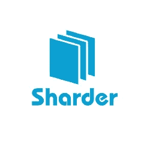
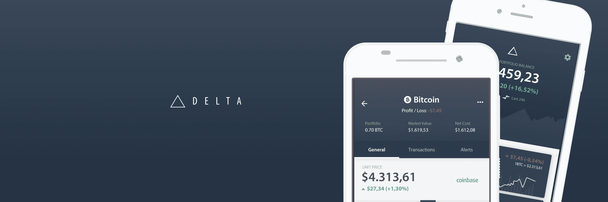
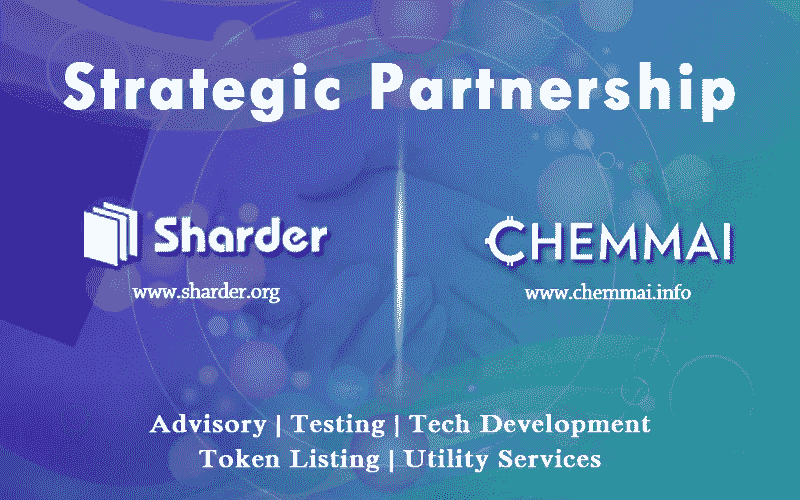

# Bean Cloud 和杰出的发展:Sharder 的伙伴关系收购

> 原文：<https://medium.datadriveninvestor.com/bean-cloud-and-the-distinguished-developments-sharders-acquisition-of-partnerships-351cf668d9f9?source=collection_archive---------27----------------------->

**豆云:简要说明**

**The Sharder Protocol Enables D’apps To Be Built On Its Platform For Free!**

Bean Cloud 是 Sharder 生态系统中的四个原创应用之一。Bean Cloud 的服务强调数据存储、认证和安全平台，服务于点对点金融、小额贷款、消费金融、电子商务和 ERP 系统。Bean Cloud 的技术使商业、企业、组织和政府能够在 d'app 中存储各种类型的数据:电子合同、支付文件和投资记录都记录在链上，从而保持不变性和透明度。Bean Cloud 还基于区块链的可追溯和不可改变的特性，为存储在 Bean Cloud 上的数据提供经过公证的安全证书和法律证据记录。在本新闻稿发布时，Bean Cloud 服务超过 257 个用户，287，308 份认证数据嵌入到 Bean Cloud 中，超过 1300 份合同签证通过认证并嵌入到 d'app 中。从这个角度来看，自 Sharder 的 Bi Weekly XIX 于昨天发布以来，已有超过 7000 份认证数据嵌入 Bean Cloud。豆云的块高也在 12318！

补充一下，Bean Cloud 的产品包括数据保存、电子签名和基于区块链技术的分布式云存储。数据安全性、完整性和保存是在线数据存储的重要组成部分。Bean Cloud 提供的数据安全性位于区块链，并与 Born Soft Group 合作开发。Bean Cloud 为照片、文档、合同等提供在线存储。Bean Cloud 在存储重要文档、原创作品、合同、专利等时，为企业和个人提供数据安全。Bean Cloud d'app 中的所有存储数据都使用基于区块链的技术加密，从而建立安全的用户体验。如果发生侵权，将颁发认证，以保护在 Bean Cloud 上存储其数据的用户的权利。Bean Cloud 通过司法认证对文档进行公证，利用集中的合法性为存储在 Bean Cloud 上的文档获得公证的有效性。Bean Cloud 上的完整节点是稳定的，并且在测试阶段表现得非常好！提供了一个豆云官方网站的链接【https://yuncunlian.com/index.htm 

**豆子的错综复杂**

Bean Cloud 是基于 Sharder 链的，Sharder 链是 Sharder 生态系统的基石。鲨鱼链是嵌入鲨鱼生态系统的区块链。豆云专注于解决传统存储的各种痛点。使用 Bean Cloud 的优点是区块链可追踪性和不变性，以防止侵权；这反过来为存储在 Bean Cloud 中的所有数据提供了司法有效性。签署的合同不可更改，并有时间戳以保护知识产权、投资记录等不受侵犯。数据本身是加密的，不会受到时间或数据存储位置的限制。在 Bean Cloud 内部，也有一个 API 访问过程。Bean Cloud 在存储重要文档、原创作品、合同、专利等时，为企业和个人提供数据安全。如果出现侵权行为，将颁发认证，以保护用户的权利。还为个人或公司设置了演示，以查看 d'app 的最新更新！Bean Cloud 的营销发展正在以极快的速度加速，营销团队已经访问了超过 24 所教育机构，并收到了大量的机构反馈。Bean Cloud 的定制产品将面向这些行业，这些产品将根据他们的需求和要求进行更新、调整和改进。

优势:

~连接司法机关、仲裁机构、互联网法院和版权局，可以给出法律意见，有仲裁按钮(意思是你签完一个电子合同后，你可以点击一个叫“仲裁”的按钮)；然后所有的证明都送到仲裁机构)。

最近的伙伴关系和发展:集体合作的成功！

**Sharder Is Now Listed On Delta Direct!**

Sharder 协议正在全世界范围内建立业务联系；就在最近，在俄罗斯 GT 投资公司的帮助下，Sharder 的技术白皮书被翻译成了俄文。Delta Direct 还增加了 Sharder 协议:Delta 是一种加密货币投资组合跟踪应用程序，类似于 Blockfolio。正如 Blockfolio 拥有“Blockfolio Signals”一样，Delta 拥有“Delta Direct”功能，该功能使项目能够列出有关该特定项目的新闻和即将到来的信息或事件。在 Delta 上跟踪该项目的个人将会得到该消息的提醒！这为 Sharder 协议向国际观众发布事件和事件提供了全球范围。

**Sharder And Chemmai Have Entered Into A Strategic Partnership!**

Sharder Protocol 已与 Chemmai 达成多层次的战略合作伙伴关系。Sharder Protocol 和 Chemmai 的合作始于项目咨询和平台测试的各个领域，随后是产品开发和钱包上市，最后是未来跨链和数据存储的利用。这种伙伴关系已经发展了三个多月，当时 Sharder 和 Chemmai 最初互相联系。Chemmai 表达了对用 Bean Cloud 存储他们的数据的直接兴趣。Chemmai 认为，Bean Cloud 有潜力成为他们项目的完美数据存储解决方案，特别是关于 Bean Cloud 提供的数据存储、数据安全和电子签名公证服务！Chemmai 是一个致力于媒体内容的项目；Chemmai 可以充分利用 Bean Cloud 的存储功能！随着 Chemmai 用户群的增长，对额外存储和数据安全性的需求对 Chemmai 项目变得越来越重要！Bean Cloud 完美地满足了 Chemmai 项目的需求，迎来了集体合作的战略伙伴关系！

Chemmai 是一个具有高质量内容的信息娱乐应用引擎，可以帮助人们(特别是在这种情况下的创作者)通过数据(他们选择实现的任何内容)表达他们的想法，然后同时以适合他们的方式将他们的想法货币化。Chemmai 有能力将创作者与全球的广告商、用户、媒体机构和媒体公司联系起来，并通过释放其在一个集体战线上连接数十亿数据和数百万有才华的内容提供商和买家的潜力，为整个内容引擎做出贡献。

**结论:Sharder 在加密货币大萧条期间收购战略合作伙伴**

**The Four D’apps Built Within The Sharder Ecosystem!**

对于一个项目来说，在可怕和残酷的市场条件下，获得合作伙伴关系，开发主流采用和发布的技术以及乐观情绪是很有意义的。那些利用困难时期并将其转化为机遇的项目应该得到人们的尊重、尊严和荣誉。Sharder 是在 2018 年的大熊市期间发布的，尽管有悲观的情绪，加密货币市场长达一年的投降以及加密货币社区内的报复风气，Sharder 仍在努力实现其愿景，即成为实施区块链技术和数据分片创新的主流分布式数据存储解决方案！#鲨鱼之国

*有兴趣了解加密货币和区块链技术吗？报名参加我在 Udemy 上的课程吧！*[*https://www . udemy . com/cryptocurrency-investment-a-初学者-指南/学习/v4/*](https://www.udemy.com/cryptocurrency-investment-a-beginners-guide/learn/v4/)

*免责声明:加密货币投资需要大量的风险，不要投资超过你能承受的损失！我不是金融顾问，也不对你的任何交易负责。我是 Sharder Token 的投资者，本文中的信息代表我自己的想法和观点。在* [*投资任何东西之前，你都要做好自己的调研，这是义不容辞的！*](http://wegobusiness.com/trading-a-unified-front-the-amalgamation-of-decentralization-and-centralization-bean-cloud/)