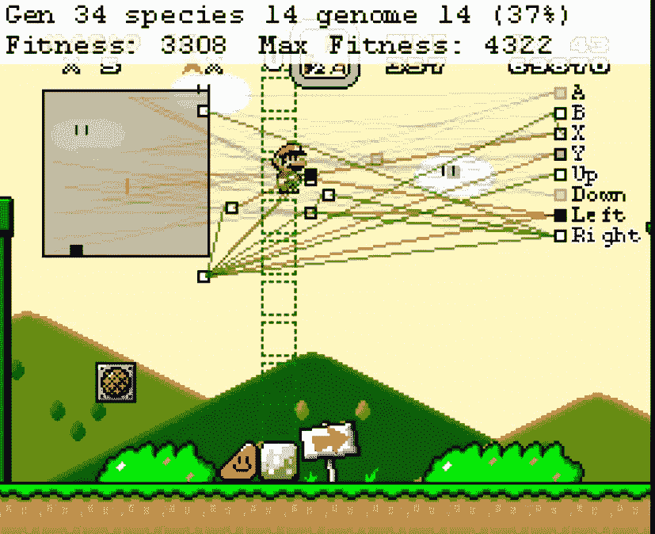
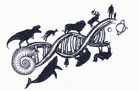
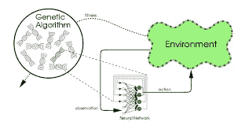
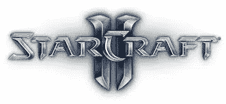
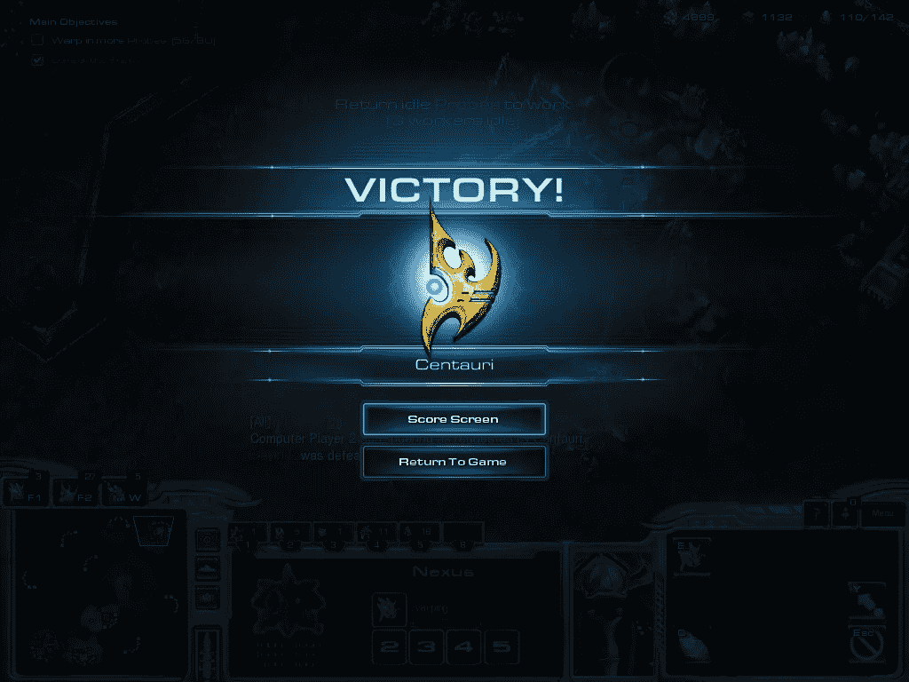
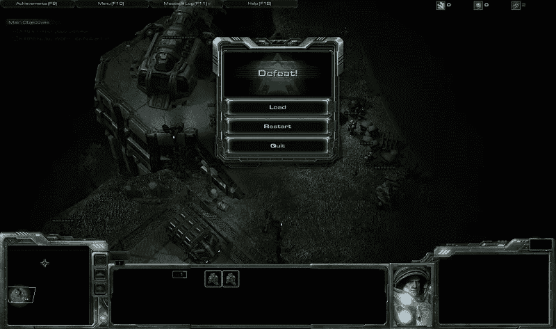

# 用神经进化和神经网络打败星际争霸 2

> 原文：<https://medium.datadriveninvestor.com/beating-starcraft-ii-using-neuroevolution-and-neural-networks-406511bef2f?source=collection_archive---------4----------------------->

Seth Bling’s Marl/O Program — [https://youtu.be/qv6UVOQ0F44](https://youtu.be/qv6UVOQ0F44)

# 马里/奥

在 YouTube 上研究强化学习的时候，我发现了这个 [SethBling](https://www.youtube.com/user/sethbling) 的视频。因此，Seth 实际上创建了一个程序，它帮助机器学习大脑实际上完成了超级任天堂电脑游戏“超级马里奥世界”中的一个级别。

程序本身是由一堆神经网络和遗传算法组成的，帮助它真正完成这一关。

 [## 用 7 个步骤解释深度学习——数据驱动投资者

### 在深度学习的帮助下，自动驾驶汽车、Alexa、医学成像-小工具正在我们周围变得超级智能…

www.datadriveninvestor.com](https://www.datadriveninvestor.com/2019/01/23/deep-learning-explained-in-7-steps/) 

最初，在 Seth 的程序中，Mario 在开始时几乎不能移动。大脑严重受限于它能做什么和如何做。这可以被认为是进化的早期阶段。我不想对猴子们太刻薄，但它们不是最聪明的。就像模拟开始时的马里奥角色一样。马里奥根本没有发现与游戏相关的许多东西。他不知道还有跳跃功能，双跳功能，甚至还有行走功能。他完全不知道自己所处的环境，就像人类(进化中的第一个生物)第一次来到地球一样。

神经网络使用绿色、红色和神经元来帮助马里奥在平台上移动。在模拟开始时，只有极少量的这种类型的连接。那么它们是如何随着时间增长的呢？嗯，答案是**神经进化。**

**神经进化**可以被定义为一种形式的人工智能，它使用进化算法来生成**人工神经网络**。

Seth 的机器学习大脑使用这些**遗传算法**来学习如何完成游戏。每当马里奥在游戏中向右跑，他的健康水平就会上升。这些健康水平衡量马里奥实际移动了多远，以及他实际花费了多长时间。只有具有最高适应水平的神经网络被选择或被选择来繁殖，成为下一代。通过这个独家育种计划，Seth 能够使用具有最高健康水平的神经网络，使 Mario 更接近游戏的结尾。

# 神经进化

**神经进化**是变异和选择最佳神经网络的过程。这个过程最近导致网络能够创作音乐，控制机器人，正如我上面提到的，玩像超级马里奥这样的游戏。

第一个神经进化算法出现在 20 世纪 80 年代。当时，它被认为是反向传播的替代方案。在早期阶段，研究人员将自己决定神经架构，(哪些神经元与哪些神经元连接)，并简单地让进化来决定权重，而不是使用梯度下降。因为结构不能被进化改变，这个过程被称为固定拓扑神经进化。

A diagram showing the process of neuroevolution

在**固定拓扑神经进化**中，进化**神经**的基因对它们自己的权重进行编码，使其成为一种不同类型的方法。人工神经网络“生来”就知道他们将要知道的一切，并且在他们的一生中不能再学习任何东西。考虑到人类在一生中通常会学到一些东西，这种情况可能会有所不同。然而，在这些系统中发生的**繁殖**实际上是学习。换句话说，当父母让孩子更好地适应一项任务时，一种跨代学习正在发生。

# 在星际争霸里用这个？

那么，一个人实际上应该如何进化一个人工大脑来解决问题呢？嗯，很简单，这真的很像动物繁殖。假设你想进化出一个神经网络来玩星际争霸 2(我就是这么做的)。在这项任务中，我们需要一些人工神经网络来启动一切。

一开始，我们实际上不知道如何教大脑玩星际争霸，所以我们只是生成一个随机人工神经网络群体。预定结构的权重将在群体中 100 个个体的每一个中被随机化。现在，我们只需要执行选择，这意味着培育更好的网络来进化。

为了评估当前群体，我们首先从活动群体中抽取一个 ANN 样本。我们让人工神经网络自己玩游戏，其中执行的动作被认为是输出。计算机只是观察人工神经网络在控制时做什么。以这种方式测试群体中的所有人工神经网络，并给出一个称为“适应性”的分数。**健康水平**是根据人工神经网络的性能质量创建的。

显然，初始的一组随机生成的网络不会表现得很好。考虑到他们是第一组，他们不知道实际上该做什么。这些最初的网络可能除了四处挥舞之外什么都不会做。这实际上被认为是可以的，因为我们实际需要的唯一东西是一个网络比其他的更好，即使只是好一点点。实际上在神经进化阶段表现出改善的网络将被选为下一代的父母。该算法将通过略微改变人工神经网络的权重来产生**后代**。有些后代可能比他们的父母更糟糕，但大多数时候，有些会比他们的父母表现得更好，使他们成为下一代的父母。正如你所看到的，有一种趋势正在发展，最好的网络只被选择用于进化。主要目标是继续选择越来越健康的个体作为父母。

过了一段时间，这组神经网络就可以熟练地玩这个游戏了。

现在使用这个程序，我们会看到更多这样的情况:

The victory screen in Starcraft II

更少的是:

多亏了神经进化，胜利从未如此简单。这种技术的使用可以推动强化学习的想法，以提供更好的模拟结果，为我们玩视频游戏，以及其他无数的事情！

**喜欢这篇文章吗？看看下面和我联系吧~**

*   在 [Linkedin](https://www.linkedin.com/in/noumaan-kaleem-a13948159/) 上与我联系
*   跟我来这里，[中型](https://medium.com/@nakaleem2003)
*   **留点掌声:)**