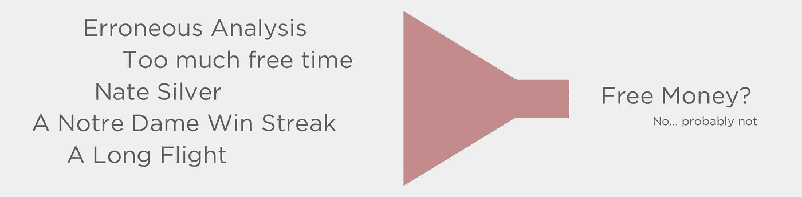
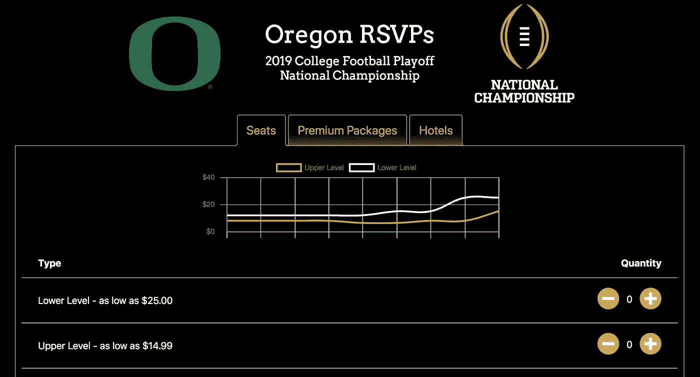
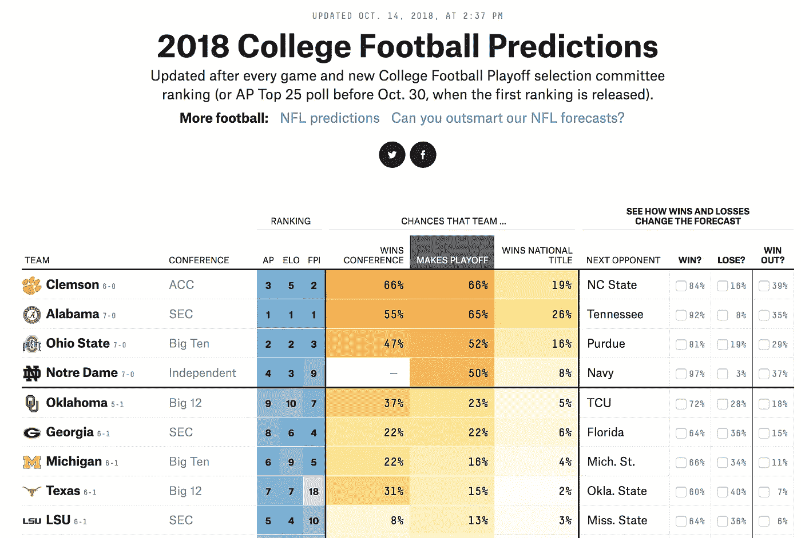
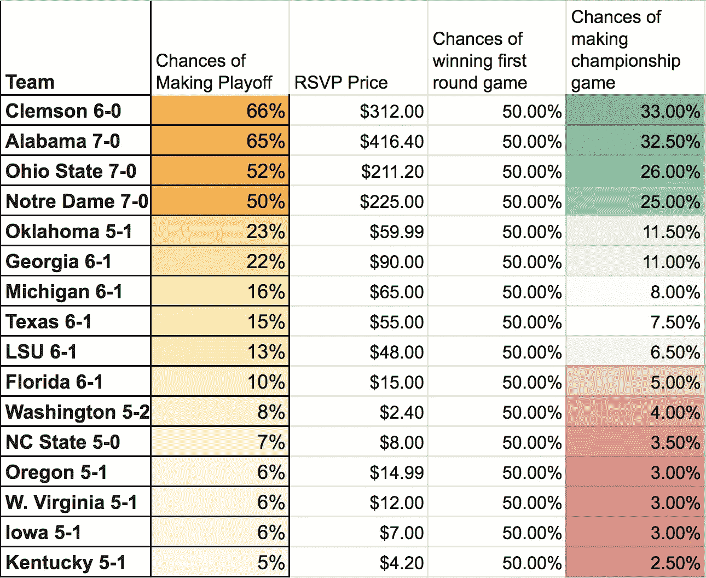
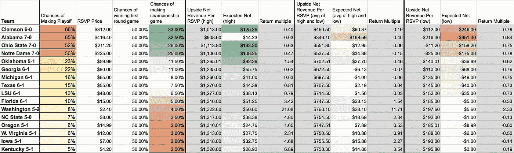

# 用大学足球票期货打败维加斯(也许)

> 原文：<https://medium.datadriveninvestor.com/beating-vegas-with-college-football-ticket-futures-maybe-981b82f8e7a?source=collection_archive---------14----------------------->

## 只是一个完全不专业的人在做一些简单的数学计算，试图赚钱

我不想吹牛，但我今年在大学橄榄球赛上下注已经赚了**超过 162** 美元。使用我的系统，你可以像我一样享受未来的损失。

每个赛季，大学橄榄球季后赛都会围绕其 [CFP RSVP 系统](https://cfp-rsvp.com/)上演一场有趣而独特的比赛。有了这个系统，你就有机会购买和出售大学橄榄球决赛门票(现在还有保龄球比赛门票)的**和**期货。

[cfp-rsvp.com](http://cfp-rsvp.com)

因此，例如，如果你认为俄勒冈鸭子队将参加 2019 年在圣何塞举行的全国冠军赛，你必须支付 14.99 美元，才能享受支付 475 美元的上层门票(575 美元的下层门票)的特权。当然，当鸭子没有成功时，你的 14.99 美元就不值钱了。

至少对我来说，最酷的部分是这是一个市场。你可以在粉丝市场上出售你的期货，因为它们增值了(因为那个特定的团队使游戏成功的机会增加了)

请记住，上个赛季全国冠军赛的门票攀升至 1000 美元的高价位，在某些情况下甚至超过了 2000 美元。

我决定运行这些数字…

## 获得冠军的几率

我从内特·西尔弗和他神奇的数字机器——FiveThirtyEight.com 对季后赛的预测开始。你可以随意用你喜欢的任何预测来重复我的分析…但是你可能不会，所以让我们继续假设这些是最好的预测(试着说服我不要这样)。

538 大学橄榄球季后赛模型给出了每个队进入季后赛的百分比机会，每周更新。这也给了一个机会来看看一个团队的机会如何在涉及任何给定团队的下一场比赛的潜在场景中变化，以及假设该团队获胜，但我跑题了。

不用说，当我说:这些预测非常准确时，我不认为我是不合时宜的，这不仅仅是因为我是圣母大学的球迷。

现在，由于 CFP RSVP 计划也提供季后赛半决赛的期货，你可以继续使用这些赔率来确定这些期货的预期回报，但因为这些门票的价值低于大卡哈纳，我决定将我的分析仅限于冠军赛。

这里是我做出许多重大假设的第一个地方。我将假设任何进入季后赛第一轮的球队都有 50%的机会进入冠军赛。对于那些嗤之以鼻的人，请随意调整我的 [CFP RSVP 计算器](https://docs.google.com/spreadsheets/d/1sYn0H_5HJNP-ihUzfv_UzkjTOyO2JGeRCpouldY6-zs/edit?usp=sharing)中的相应值，然后去镇上吧。

*旁注:不管你认为阿拉巴马在这个市场上有多大的潜力，他们的价格都被高估了。*

有了这些，我就有了每支球队进入季后赛机会的列表(根据最近的预测)

Taken from all teams with a >5% chance of making the playoff, according to FiveThirtyEight.com

## RSVP 的价值

这些票的价值波动很大。不用说，它们的价值几乎肯定超过 475 美元的面值，就像我们之前确定的那样。你可以自由编辑你对这些门票转售价值的假设，但我的默认范围是 750-2000 美元。我已经根据高估值、低估值和两者的平均值生成了回报，让你对你的预期回报有个概念。

“成功的”RSVP 未来的回报是:

*Value_success* = (( *门票零售价* )*(1-( *转卖费百分比*))—(*门票面值* ) — ( *RSVP 价格*)

根据一些非常粗略的研究，我假设转售网站平均会收取 10%的服务费，你可以选择是否承担这笔费用。

“失败的”RSVP 未来的回报是

*Value _ failure*=-1 *(T18)RSVP Price

而这种事件组合的预期收益是它们的价值之和，每一个乘以每一个发生的可能性，所以…

*预期收益* = ( *值 _ 成功*)*(*p _ 成功* ) + ( *值 _ 失败*)*(*p _ 失败*)

其中 *p_success* 和 *p_failure* 是我们之前算出的值。

## 结果呢

把所有这些数学结合起来，你会得到这个:

在撰写本文时，这些数字是最新的，因此这些值将会改变。如果你想做你自己的分析，你只需要按照这篇文章中的链接来获取新的价值(或者你们中有进取心的人可能会写一些自动化的方法)，这只需要几分钟。

这是我的 [CFP 季后赛计算器](https://docs.google.com/spreadsheets/d/1sYn0H_5HJNP-ihUzfv_UzkjTOyO2JGeRCpouldY6-zs/edit?usp=sharing)的另一个链接

一眼就可以看出，这表明阿拉巴马州和克莱姆森被高估了，只有在最高门票转售价格(此处为 2000 美元)时才会产生正回报率。此外，这表明边缘球队，如华盛顿，肯塔基州和北卡罗来纳州是最好的投资，因为你相对较小的投资回报巨大的潜力。

好吧，去发财吧！

感谢你阅读我可能的错误分析。我要感谢 Grammarly 提供的广泛的编辑支持，以及我对发表未经编辑的文章的嗜好。我希望你熬过了我的错误。

*我的名字是* [*杰克摩尔*](https://medium.com/u/266c1c6aac8?source=post_page-----981b82f8e7a--------------------------------) *，我喜欢写各种各样的东西，从足球到产品管理，从梦幻足球到数据科学产品管理。再次感谢！*