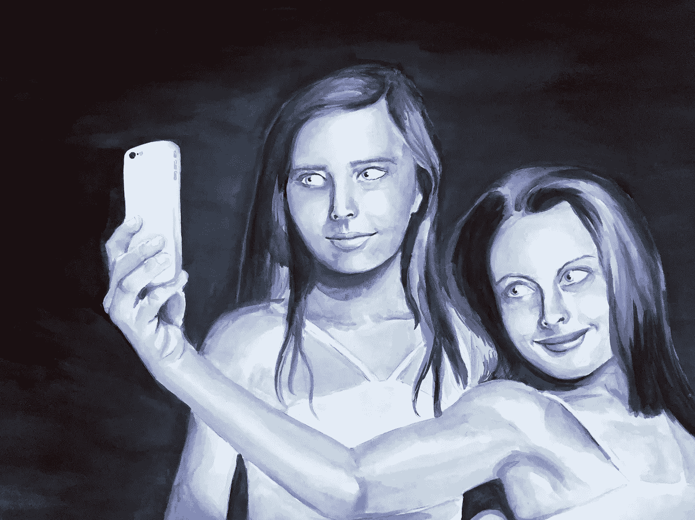

# 美丽存在于 iPhone 的 I 中

> 原文：<https://medium.datadriveninvestor.com/beauty-is-in-the-i-of-the-iphone-1d85af7038d7?source=collection_archive---------24----------------------->

*探索数字自我形象的力量*

**数字你**

社交媒体有许多美妙之处，从与朋友和家人即时联系和交流，无论他们身在何处，到分享记忆、事件、成就和想法。我们用它来寻找工作、家庭、爱人和慰藉。

但是，正如任何好事一样，也有一些缺点，其中之一就是你不能*完全*做你自己。相反，你需要通过一个人造的数字自我在数字世界中周旋。

社交媒体的一个关键条件是，数字自我需要表现得比你的非数字自我“更好”。这是一个问题，因为你的数字自我变成了一个精彩片段，给别人一种你过着那种生活的无意识幻觉——你*就是那种生活。社交媒体以其明显可见的“喜欢”和“关注者/朋友”系统，将无形变得有形。*

当 Y 一代还在上高中的时候，还不太清楚谁受欢迎，谁不受欢迎。我似乎记得受欢迎程度取决于响度、运动性、滑稽性或吸引力，这一年中有一个模糊的共识——但它肯定没有明确排名(这似乎很邪恶，令人想起' [The Burn Book'](http://meangirls.wikia.com/wiki/Burn_Book) )。

现在，你可以*看到*谁“受欢迎”——你甚至可以看到帮助他们受欢迎的帖子。数字说明了一切，在这个简单的世界里，5000 名粉丝意味着你比拥有 500 名粉丝的人更受欢迎。

(旁注:我们真的需要记住，在社交媒体上受欢迎的不一定是受欢迎的 IRL！)

例如，你的经典 Instagram 影响者。我们真的能从她在沙滩上、穿着健身服或喝着鸡尾酒的无休止的帖子中了解她吗？不，那是她的数字自我。但是人们确实喜欢她的数字自我！她在各种场景、姿势和服装中重复的阳光亲吻像素构成的 46.9K 喜欢就是明显的证据。

但是她的数字自我和她离线时的自我是一样的吗？不太可能。

她可能与母亲的关系非常紧张，或者有一种令人尴尬的愚蠢的幽默感，但很可能几乎没有她的 2M 忠实追随者会知道。因为她有长相，有生活方式，有审美——这是这个媒体上最重要的。图像才是最重要的。

然而，我们越是融合成一个持续的连接——数字和非数字的自我很难分开——它们就很容易成为一体。我们的 Insta 影响者的自我被捆绑在她的二维数字自我中，因为它试图*表现*她的眨眼、说话、微笑的三维自我。尤其是当她的全职工作是推广能强化她外表的品牌时。

但是数字和非数字的自我是两个不同的东西，以两种不同的形式！

**自拍**

对于我们这样的千禧一代来说，自拍似乎已经舒适地融入了我们的日常生活中。

在公共交通工具上，你几乎没有一天看不到一个通勤者狡猾地对着他们手中的小矩形眨眨眼睛或皱皱眉头，并将一张[图像](https://au.pinterest.com/pin/183873597260548438/)转换成数字永生。

同样，在社交媒体上，你几乎没有一天看不到某个你认识的人在你的新闻订阅中漫不经心地盯着你看。是的，早在那西塞斯沉浸在自己的思考中之前，我们就已经着迷地审视了自己的思考——但正如许多婴儿潮时期出生的保守派人士警告的那样，很明显，与我们每天在新闻提要上看到的越来越庞大的数据相比，“自恋流行病”将会持续下去。

我的一个好朋友最近说，她正在试验她的 instagram 个人资料，明确的目标是看看大多数人喜欢什么。或者说，人们最喜欢什么。

(或者说，人大多是什么样的。)

她不可避免地发现，当她发布自己的照片时，眼睛挑逗地盯着镜头的灵魂，手里拿着酒杯——她的喜欢增加了近三倍。比她其他更独特、更深思熟虑的帖子多三倍。

这对于今天的社会资本意味着什么？我们是在自己身上进行数字化滑动吗？此外，一个非数字化的自我有什么希望？

**问题**

为什么社交媒体会奖励自恋？

我退一步。既然社交媒体可以被视为社会的反映，那么为什么我们的社会会奖励自恋呢？

我不打算回答这个问题，因为这只是一个探索。

只是和自己讨论一下(..多么贴切)。

众所周知，我们生活在资本主义社会，这对我们的身份产生影响是不可避免的。

如果资本主义及其以精英主义和个人主义为主的价值观标志着我们在西方世界的生活方式，那么它当然会塑造我们的一切，包括我们在镜子中审视自己的方式。如果社会不断强化我们应该成为的样子或我们应该看起来的样子，那么我们不仅仅是在看镜子里的自己——我们也在看镜子里的自己。

**社会资本**

漂亮，或者酷，或者超级健康，或者身体健康，等等，这些都是社会资本。尽管其中一些类别相对较新，但像这样的东西在历史上一直是一种社会资本形式。(这是将资本主义冰冷饥饿的布里洛盒子世界与非常人性的、可原谅的对认可的需求融合在一起的奇怪混合结果吗？)

那么，千禧年社会资本与数字时代之前的社会资本有何不同，原因何在？

似乎现在不同的是,“漂亮、酷等”展示给所有人看，*。我可以在任何一个晚上的凌晨 3:30 跳到脸书上，仍然能够看到我同事从 2011 年开始的订婚派对相册的全部内容。*

*我们的身份不再仅仅存在于我们的三维身体和他人的头脑中。我们不再只是局限于特定时间、空间或记忆的物质。我们的身份也一直存在于网络空间的云端，而图像是这一媒介的主要货币。所以身份的概念通过它的无所不在而得到强调！*

*难怪现在感觉如此紧迫。*

***图像社会***

*任何以某种形式研究过后现代主义的人，你可能听说过居伊·德波的*景观协会*。尽管有 50 年的差距，他的思想与这个话题有一些非常清晰的联系。*

*德波 1967 年的书中最重要的概念之一是“存在到拥有……以及从拥有到出现的明显退化”。*

*他认为我们的身份不仅仅是“你是谁”——而是“你是什么”，因此是“你拥有什么。”所以他只是把你的*变成你的*拥有的*。你拥有你的美丽。你*有*它，所以你可以*使用*它。**

*然后下一部分引文，“从有到有”，直接阐述了图像的力量。你正在利用你看起来拥有的 T21 作为社会资本——所有这些都是通过图像来传达的……*

*这是你和你的女朋友们一起吃早午餐的画面，或者是你撅着嘴打新鼻中隔洞的画面，或者是你大腿内侧高高隆起的新纹身的画面。它们都是奇观——它们通过自己的身份信息在观众身上激起一些东西。他们向观众展示“这就是我(这些是我的资产)”。这是我的身份。这是我的个性。*

***回音室***

*个性可能会被认为是在一个有点尴尬的时刻。以 Instagram 为例，我们可以看到数百万人发表了数百万条不同的帖子。但是因为流行的东西总是被应用程序和它上面的人认可，用户倾向于被更流行的内容所吸引——那些已经有大量人发布的内容。当然，算法对此控制得更多。*

*当然，这就是我们看到趋势的方式，但总有一个愤世嫉俗的家伙，我前几天在史密斯街散步时无意中听到他边说边反复擦拭手机上的手指:“Instagram 上有两种人:为自己发布帖子的人和为他人发布帖子的人。你不觉得吗？”。他说得有道理，尽管界限相当模糊……(如果我张贴一个我引以为豪并想分享的插图，但我知道人们会觉得有趣，我是为他们还是为我自己张贴呢？)*

*……当个性如此受他人影响时，它是什么？*

*以牙还牙，以牙还牙。如果你喜欢这张我和我的孩子在咖啡馆的照片，作为回报，我也会喜欢你和你的孩子在咖啡馆的照片。比如这张我和我稍不漂亮的朋友在圣托里尼啜饮含羞草的照片，我肯定会喜欢这张你和你女朋友在 Rottnest 岛的船上晒日光浴的照片。#错了*

*德波说(我们将不得不原谅他在这里使用的性别歧视/顺性别代词):“个人越是接受在需求的主导形象中认识自己，他就越不理解自己的存在和自己的欲望”。*

*通过热情地认同流行的理想——在这种情况下——女性美，你们看起来完全一样。所以以一种奇怪的方式，当你喜欢她在圣托里尼的照片时，就好像你只是喜欢*自己。这个对等的东西就变成了一个回音室。增加了竞争的因素；每个回声都想比上一个回响得更响。这是个性吗？**

***表象/现实***

*形象是强大的。德波也暗示它有一种新宗教的性质。他认为这是“将人类力量放逐到一个超越的技术实现”。酷毙了。等等，什么？*

*嗯，在互联网自恋的案例中，这可能意味着对于观看者来说，我们身份的数字化覆盖了我们的*实际*身份。这尤其适用于那些“关注”我们但从未见过我们的人。这也很公平，因为他们没有别的东西可以对我们产生看法！*

*此外，我们的数字化身份是由我们自己策划的，通过我们希望如何被看到的框架。*

*一个例子:*

*你在一个聚会上给你的同伴拍了一张照片，他们穿着 60 年代的科幻太空服——有人在抽飞镖，另外两个人在用红色的杯子喝水，这张照片真他妈的好。当其他人浏览并看到张贴的照片时，他们看到的是你的夜晚/你的朋友/你的生活/你。这是一张很好的照片，但它只是你拍的十张照片中的一张，急于拍出完美的照片。你的朋友不耐烦了，你最喜欢的歌曲正在播放。你真的很想跳舞，但是(虽然不是有意识地)想要在网上展示你的生活，但这种渴望并没有被压倒。*

*所以来源(我们所代表的物质的、真实的现实；与你不耐烦的朋友在聚会上的时刻，你的歌跑出来了)因其策划的表现而被服从。现实被降级，被抛弃，希望观众会把我们看成——让我们面对现实吧——比我们真实的样子更好的*！**

*但前提是你的身份只能通过社交手段来验证。*

***孤独的人群***

*然而，因为“社交”的定义现在已经扩展到不仅仅是与物理存在的接近，我认为它有点复杂。是的，社交就是参加聚会。但也可能是当你独自一人在卧室浏览社交媒体的时候。*

*黛博拉认为，这种奇观是一种隔离的手段。它无意中构建了他所称的“孤独人群”。当人们试图通过一系列支离破碎的表象来理解自己时，他们无法连贯或平静地过自己的生活。因为奇观无处不在，观众没有一点宾至如归的感觉。*

*全天候运营的社交媒体对此没有帮助。由于网络空间是一个巨大的数字城市，从不睡觉，突突前进，每分钟积累数百万千兆字节的数据，我们感到有必要不断突突前进。为了跟上。因为我们的网络化身越来越与我们的物理自我融合，我们觉得我们必须不断发展。*

*那么，问题是‘发展’在很大程度上意味着*保持*和*提高。"*我需要在 9 月底之前获得更多关注者。"“我的目标是到 2018 年底将我的网络覆盖范围扩大两倍。”做到这一点的方法当然是自我推销。但是这种自我推销并不是推销我们真实的自我——而是推销我们制造出来的自我。这是宣传我们最好的发型，我们最有趣的状态，派对上最有艺术感的照片。与此相关的*问题是，相比之下，我们的真实自我显得苍白无力。我们最终会对自己和他人以及我们和我们的生活有着难以置信的高标准，而这并不会让我们轻易满足自我。**

*然而，无处不在的社交媒体越多，这种表象和现实就越融合。*

*所以看起来现实的*表现*现在就像……现实一样“真实”。*

***从这里到哪里***

*这篇文章的目的并不是明确回答为什么社交媒体奖励自恋。我只是在那里抛出一些想法——在寻求答案之前，围绕这个问题有太多的东西需要探索和讨论，对我来说，头脑风暴比答案本身更有趣。*

*作为一个社会，我们显然正在经历一场引人入胜的转变。不过，就我个人而言，我担心如果数字世界继续保持每天自拍的狂热，我们的集体自我意识将会如何终结。*

*当然，这并不是说我没有深陷其中——我绝不是一个超然的观察者。当然，这是尝试理解正在发生的事情的方法；置身事外。如果谷歌、脸书和 Instagram 不断想出新的方法让我们粘在智能手机上，如果这是我们的朋友和家人相互交流的主要方式，我们现在并没有太多的选择。*

*事实上，它不会很快停止。*

*但这真的是我们想要的吗？*

*被锁在我们孤立的屏幕和自我中，我们的星球在我们身后瓦解？*