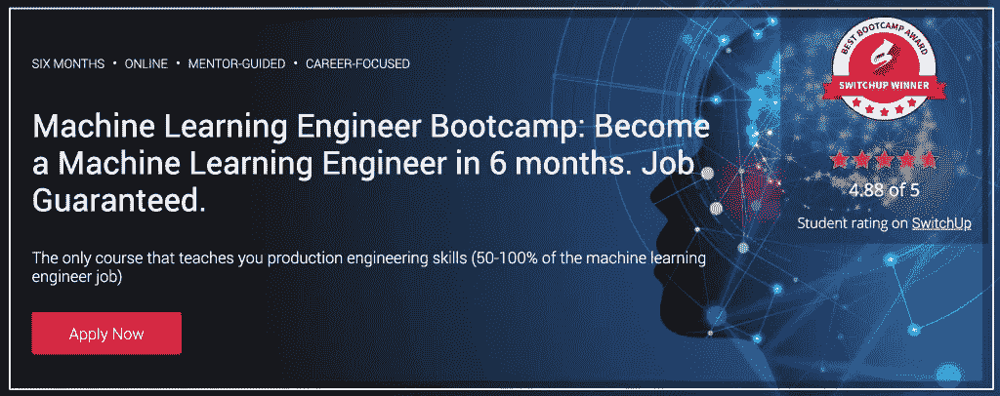

# 在 6 个月内成为一名机器学习工程师-工作有保证

> 原文：<https://medium.datadriveninvestor.com/become-a-machine-learning-engineer-in-6-months-job-guaranteed-b7520f90c686?source=collection_archive---------2----------------------->

[Machine Learning Bootcamp](https://sinxloud.com/machine-learning-tutorial-courses-specialization-beginner/)

这个强化的 [**机器学习工程职业轨道**](https://sinxloud.com/fly/become-a-machine-learning-engineer-springboard/)——第一个有**工作保障的**——将装备你过渡到一个机器学习工程师的角色。

广泛的课程由在 Airbnb 和英特尔等公司工作过的机器学习专家策划。

虽然你将学习机器学习工程师应该理解的高级概念，但你也将发展生产工程技能。

在课程结束时，您将设计一个机器学习系统，构建一个原型，并部署一个可以通过 API 或 web 服务访问的应用程序。

# 适合你吗？

这个[机器学习工程职业轨迹](https://sinxloud.com/fly/become-a-machine-learning-engineer-springboard/)是为有软件工程背景的人设计的。

这是一个自我引导的、导师引导的、以职业为中心的训练营，并有工作保障。

如果你在毕业后的六个月内没有找到工作，你将获得学费退款。

您将通过案例研究和项目学习应用机器学习和深度学习算法。

在你完成课程、构建项目和寻找工作的过程中，你将得到导师——一位经验丰富的机器学习工程师——的一对一指导。

Source: [SpringBoard](https://sinxloud.com/fly/become-a-machine-learning-engineer-springboard/)

## 你会学到什么？

*   人工智能和机器学习工程栈概述
*   人工智能的大规模数据争论和统计
*   监督和非监督机器学习算法
*   深度学习基础，包括神经网络原理
*   自然语言处理(人工智能案例研究)
*   计算机视觉和图像深度学习基础(人工智能案例研究)
*   构建和部署大规模人工智能系统(顶点工程)

***推荐准备:***

*   **学习**[**Python**](https://sinxloud.com/learn-data-science-with-python-track/)**或** [**R 编程**](https://sinxloud.com/learn-r-for-data-science-courses-classes/)
*   [**基本统计**](https://sinxloud.com/fly/basic-statistics-university-of-amsterdam-coursera/)

***用户评分:*** *评分* ***4.88*** *出局******5*******13k+****点评****

**教你生产工程技能的唯一课程(**50–100%**的机器学习工程师工作)**

# **转到[职业轨迹](https://sinxloud.com/fly/become-a-machine-learning-engineer-springboard/)**

**如果你喜欢这篇文章，请与你的朋友分享，并注册我们的时事通讯，每两周更新一次类似的内容。**

**你可能也有兴趣在网上阅读 9 个最好的机器学习课程**

# **干杯🍻**

***最初发布于*[*sinxloud.com*](https://sinxloud.com/machine-learning-tutorial-courses-specialization-beginner/)*-2019 年 1 月 3 日***