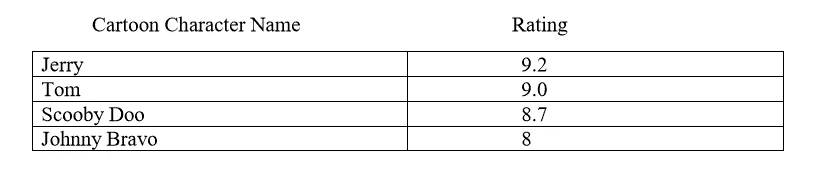

# Python 中的字典

> 原文：<https://medium.datadriveninvestor.com/become-expert-of-using-dictionary-in-python-f1c610922d45?source=collection_archive---------5----------------------->

这个博客由字典的概念和一个小字数统计应用程序组成。

字典是 Python 最突出的数据结构之一。无论你是在机器学习数据集上工作，还是在任何 RDBM 或 NoSQL 的数据库上工作，字典都将被频繁使用，以使你的代码更加简单和高效。

> 那么 Python 中的 Dictionary 是什么？？？？

最好将字典看作一组无序的键:值对，要求键是惟一的(在一个字典中)。字典是一组索引(称为键)和一组值之间的映射。每个键映射到一个值。键和值的关联称为键-值对，有时也称为项。

 [## 2019 年最值得学习的编码语言|数据驱动的投资者

### 在我读大学的那几年，我跳过了很多次夜游去学习 Java，希望有一天它能帮助我在…

www.datadriveninvestor.com](https://www.datadriveninvestor.com/2019/02/21/best-coding-languages-to-learn-in-2019/) 

如果您曾经使用过 JSON，那么您一定熟悉键:值对的概念。让我用下面的例子在 Python 的字典中演示相同的概念:

一对大括号创建一个空字典:{ }

让我们假设我们有一组卡通人物的名字作为关键字，他们的等级作为他们各自的值。

为了存储卡通的名字和他们的等级，我们可以使用如下的字典:

卡通= {}

动画片['杰瑞'] = 9.2

这里，“Jerry”是键，9.2 是分配给它的值。我们用方括号 **[ ]** 来指定字典的键。让我们看看下面的代码，在字典中添加更多的键:值对。

> 注意:键在字典中是不可变的，这意味着我们不能创建另一个同名的键，但是我们可以改变它的值。

**内置字典功能**

Dictionary 为我们提供了各种内置函数来处理键和值，一些最常用的方法及其代码如下:

len():这个函数返回 Python 的任何数据结构的长度，目前，它的字典:

items():当遍历字典时使用该方法，可以同时检索键和相应的值。

我们可以利用循环的**来使用 items()方法从字典中获取数据。**

在上面的代码中，“key，value”不是保留关键字。我们可以根据自己的选择重命名 for 循环中的 key，value，如下所示:

我们也可以在没有 items()方法的情况下遍历字典，只获取键。

我们还有 **key()** 方法来获取字典的键。

类似地，我们有 **values()** 方法返回字典的所有值。

要检查字典中是否存在该键，我们可以使用中的**或**操作符中的**。**

要删除字典中的一个键，我们可以使用 **del** 操作符。

让我们编写一个简单的应用程序来理解字典的概念。

*假设我们有一些文本数据，例如“彼得·派珀挑选了一佩克腌胡椒彼得·派珀挑选了一佩克腌胡椒如果彼得·派珀在彼得·派珀挑选了一佩克腌胡椒的地方挑选了一佩克腌胡椒”并且我们想要统计每个独特单词的出现次数。让我们开始吧。*

又一个用 Python 构建交互式词典应用的博客:[https://medium . com/@ diljeets 1994/Interactive-dictionaryapplication-in-Python-16899 Fe 5 AE 1d？postPublishedType=initial](https://medium.com/@diljeets1994/interactive-dictionaryapplication-in-python-16899fe5ae1d?postPublishedType=initial)

玩得开心，不断学习，一直坚持编码。

谢了。