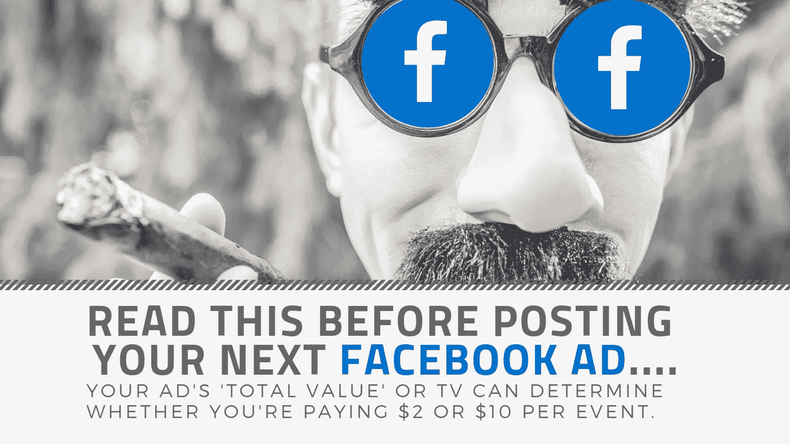

# 在你发布下一个脸书广告之前…

> 原文：<https://medium.datadriveninvestor.com/before-you-post-your-next-facebook-ad-fa0c5d4c52c6?source=collection_archive---------36----------------------->

你最终会考虑跨越社交媒体，点击“创建广告”按钮，希望它会把你带到另一边吗？或者你已经做过几次了，并且对此有复杂的感觉？好吧，如果你有能让人们受益的东西，把它放在那些人面前只会是件好事。

但是在你开始创作你的第一个、第三个或第五个脸书广告之前，有一些脸书广告幕后的东西你可以从中受益。

随着脸书受到全世界营销人员的青睐，广告不再只是让你付钱、出价，Facebook 把你展示在你挑选的观众面前。脸书现在比以往任何时候都更加关注为用户提供最相关的内容，甚至对脸书的广告也是如此。

脸书如何判断什么是相关的，什么是不相关的？这是一个叫做“总价值”的分数**你广告的“总价值”或电视节目可以决定你是为每项活动/事件支付 2 美元还是 10 美元**。那么是怎么计算的呢？简单来说就是-

> **总价值=出价+预计行动率+用户价值**

让我们稍微深入一下构成电视广告的这三个因素——出价、预计行动率和用户价值。

# **申办**

这是您同意为点击或查看等用户行为/事件支付的最高金额。有三种方式可以出价-

1.  ***最低成本投标(自动投标)-*** 你让脸书帮你投标。脸书让它的人工智能引擎来决定你应该做出的最佳出价。
2.  ***【最低成本与出价上限】-*** 您可以设置广告的最高出价。
3.  ***目标成本-*** 也称为“平均投标”，你设定一个目标成本，并要求脸书优化投标，使其稳定在你的目标成本内。

不同类型的广告可以从不同类型的竞价中获益，但在我看来，当你开始做广告时，自动竞价是最好的方式。相信我，脸书希望以尽可能低的成本给你更好的结果，原因很简单，他们希望你回来。因此他们开发了这些复杂的人工智能系统来让你得到最有效的出价。

# **预计行动率**

估计行动率是指用户看到你的广告后可能采取的行动。当你的广告是活跃的时候，这个分数形成。它考虑了各种因素，比如-

1.  ***你广告上的喜欢和评论*** 会对这个分数产生影响。你的广告越吸引人，这个分数就越高。
2.  任何 ***负面反馈*** 如有人隐藏了广告等。会严重影响你的广告表现。负面反馈的负面影响将远远超过一个赞或分享的正面影响。
3.  你的 ***账号的历史*** 也被脸书考虑进来发展这个分数。
4.  没人知道的事情。是的， ***黑盒*** 也是预计动作率的一部分。

“估计行动率”汇总成一个**相关性分数**，你可以在一周左右(有时更短)检查一个广告，因为这给了脸书足够的时间来收集信息，以确定这个数字。低相关性分数意味着你需要更好地微调你的广告。

# 用户价值

最后，用户价值决定了用户点击后体验的质量。如果客户在你的登陆页面上花了很多时间，用户价值就会上升。

举个例子，如果你的潜在客户转化了，在感谢页面上，你为用户提供了很多有价值的内容，而用户也进入了这些内容，用户价值将会飙升，你的转化成本将会下降。

总之，脸书想要控制你的广告之前、期间和之后的(出价、耳朵、紫外线)，以确保它的用户获得最相关的内容。如果我们能与他们携手提供这些，结果可能会更好。否则，我们最终可能会付出比我们想要的多得多的代价，或者说，比脸书希望我们付出的更多。

我是维加斯。我写所有关于社交媒体的东西，尤其是。对社交媒体内容和广告感兴趣。你可以在 vikas@docyoumentary.co.uk 找到我。如果你喜欢这篇文章，请抽出几个掌声，或者分享一下更好。