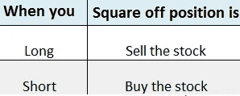

# 股票市场入门指南——理解基本术语

> 原文：<https://medium.datadriveninvestor.com/beginners-guide-to-stock-market-understanding-the-basic-terminology-e4e2751dfd77?source=collection_archive---------2----------------------->

## 在本文中，我将向您介绍与金融市场相关的 15 个常用术语以及每个初涉投资者都应该知道的相关概念。

Photo by [rawpixel.com](https://www.pexels.com/@rawpixel?utm_content=attributionCopyText&utm_medium=referral&utm_source=pexels) from [Pexels](https://www.pexels.com/photo/photo-of-person-holding-black-pen-990818/?utm_content=attributionCopyText&utm_medium=referral&utm_source=pexels)

# **1。上市公司诉私营公司**

上市公司是一种公司，其所有权通过股票交易所如纽约证券交易所(NYSE)、孟买证券交易所(BSE)等的股票自由交易分配给一般公众股东。

私人公司不同于上市公司，因为它的股票不在证券交易所交易。相反，私有公司的所有股份都只掌握在少数人手中，并在愿意投资的人之间私下交易。私人有限公司的大多数股东将由非常亲密的亲戚、朋友或大投资者组成。

# 2.股票和股份

股票(也称为“股份”或“股权”)是一种证券形式，表明股东在公司中的比例所有权。拥有某一特定公司的股份，所有者就有权分享该公司的资产和收益。

虽然“股票”和“股份”这两个词可以互换使用，但两者之间还是有细微的区别。一只股票可以指任何一家公司，但是当我们指一家特定的公司时,“股份”这个词是泛指。例如，你买了 10 家不同公司的“股票”，但你买了 ITC(一家特定公司)的“股票”。

# 3.公司为什么发行股票？

当一家公司成立时，除了从现有业务或传统银行贷款中筹集资金外，它还需要额外的资金来维持或扩大业务。它可以通过首次公开募股(也称为“上市”)向公众(即“股东”)出售股份来实现这一目标。这改变了公司的地位，从私人公司变成了上市公司。

# **4。股票市场**

股票市场是股票买卖发生的地方。与常规市场不同，这里的股票买卖(称为“股票交易”)是通过电子方式进行的。在美国，主要的金融证券市场是纽约证券交易所和纳斯达克。在印度，BSE(孟买证券交易所)和 NSE(国家证券交易所)是印度两家主要的大型证券交易所，在这里你可以交易一家公司的股票。

# **5。市值**

市场资本总额(简称“市值”)是对在股票市场交易的公司价值的衡量。它的计算方法是将总股数乘以当前股价。例如，一家公司拥有 500 万股股票，每股售价 400 美元，其市值将达到 20 亿美元。

 [## 算法交易的机器学习|数据驱动的投资者

### 当你的一个朋友在脸书上传你的新海滩照，平台建议给你的脸加上标签，这是…

www.datadriveninvestor.com](https://www.datadriveninvestor.com/2019/01/30/machine-learning-for-stock-market-investing/) 

投资者用这个数字来确定公司的规模，而不是销售额或总资产。根据市值，一家公司可以是大盘股、中盘股或小盘股。

# 6.股票和商品

从投资的角度来看，个人总是期望以最小的风险获得最大的投资回报。常见的方法之一是在银行开立定期存款(FD)账户。虽然风险很小，但存款人通常最终会获得约 6% — 7%的定期存款年利率。另一种方法是投资不同的资产类别。我们每天遇到的两种最常见的资产类别是——股票和大宗商品。

## **股票:**

股票及其衍生品统称为权益。股票投资包括购买上市公司的股票。股票在纽约证券交易所、孟买证券交易所、东京证券交易所等证券交易所交易。

当投资者投资股票时，与定期存款不同，这涉及到一定的风险。根据经验，回报越高，风险也就越大。然而，作为一种权衡，股权投资的回报可能非常有吸引力。过去 40 年，印度股票的回报率接近 16%(复合年增长率)。在过去的 15-20 年里，一些印度蓝筹股的 CAGR 超过了 20%。识别这样的投资机会需要综合分析思维、耐心和最近的一些真正优秀的数据技能。

## **商品:**

原油、黄金和贱金属投资是大宗商品投资者中最受欢迎的投资渠道。在印度，黄金和石油受到大宗商品投资者的欢迎。如果一个人能够正确地分析趋势，他可以通过投资原油发大财。与股票相比，大宗商品的购买价格更低，这也是将大宗商品加入你的投资组合、进行未来盈利交易的进一步理由。

以下节选自 [Livemint](http://livemint.com) 上的一篇文章，提供了 40 年间投资于股票、黄金(商品)和金融衍生产品的₹10,000 变量的比较分析。

> 如果你在 1979 年向代表 Sensex 指数的一篮子股票投资了₹ 10，000 英镑，并且每次 Sensex 指数发生变化时都会重新平衡，那么你今天的本金将超过₹450 万卢比。如果不考虑税收因素，同期投资黄金的相同金额相当于今天的 40 万₹，银行定期存款将增长到略高于 25 万₹。有了这些数字，就没有理由支持一个寻求增长但没有足够股票投资的投资组合。
> 
> 来源: [Sensex 的过山车之旅:从 100 到 39000](https://www.livemint.com/market/stock-market-news/sensex-s-roller-coaster-history-from-100-to-39-000-1554225243494.html)

(10 万卢比= 10 万英镑)

# 7.市场指数

我们经常会看到这样的新闻报道:标准普尔 500 上涨了 0.56 %，纳斯达克上涨了 16.7 点，收于 8012 点。在印度金融市场，人们经常听到像 Sensex 上涨 400 点或 Nifty 下跌 150 点这样的报道。这些标准普尔 500，纳斯达克，Sensex，Nifty 等。是全球不同股票市场的不同市场指数。

但它到底代表了什么？嗯，市场指数是股票市场表现的一个代表，或者是它的一个特定部分，投资者用它来比较投资的回报。例如，Nifty50 指数包括在国家证券交易所上市的主要工业部门的前 50 家公司的股票价格的加权平均值。如果这些公司中的大多数在上涨，我们可以说市场在上涨，如果大多数在下跌，我们可以说市场在下跌，如果有混合趋势，市场就是横向的。

# 8.牛市和熊市

## 牛市

如果市场在一个特定的时间段内大幅上涨，这被称为牛市。如果你认为股票价格可能会上涨，那么你就被认为是看涨股票价格。

## 熊市

熊市与牛市正好相反。如果市场在一个特定的时间段内下跌，那么它被称为熊市。如果你认为股价可能会下跌，那么你被认为是看跌股价。

上述市场的上涨或下跌是根据股票市场指数而言的。

Source: [sketchplanations.com](http://www.sketchplanations.com/post/103270521023/bull-market-bear-market-i-could-never-remember)

# 9.多头和空头

## 多头——低买高卖

买入股票的多头头寸是指预期股票价值会随着时间的推移而上涨而买入股票的行为。例如，如果您已经购买或打算购买 Raymond 股票，那么您就分别被称为做多 Raymond 或计划做多 Raymond。如果你买了 Nifty 指数，并预期该指数会走高，那么本质上你持有 Nifty 的多头头寸。

如果你做多一只股票或一个指数，你被认为是看涨的。

## 空头头寸——高卖低买

做空是指投资者借入股票，然后立即卖出，希望自己以后能以更低的价格买入(称为空头回补)，然后返还给贷款人，将差价收入囊中。

例如，你可以以 100 美元的价格卖出一支股票，然后以 95 美元的价格买回。通过这样做，你基本上获得了 5 美元的利润。如果你仔细想想，这就相当于在 95 美元买入，在 100 美元卖出。只是当你做空时，交易的顺序是相反的，你先以较高的价格卖出，然后以较低的价格买入。

# 10.把...做成方形

平仓是一个术语，用于表示您打算平仓现有头寸。如果你做多一只股票，平仓意味着卖出这只股票。请注意，当您卖出股票以平仓现有多头头寸时，您不是在做空股票！

当你做空股票时，平仓意味着回购股票。记住当你回购时，你只是平仓，而不是做多！

# 11. **OHLC**

一天结束时，OHLC 代表股价的开盘价、最高价、最低价和收盘价。开盘价是股票当天的开盘价，高价是股票当天交易的最高价，低价是股票当天交易的最低价，收盘价是股票的收盘价。例如，特斯拉公司 2019 年 10 月 25 日的 OHLC 为 297.72 美元、330.00 美元、296.11 美元和 328.13 美元。

# 12.交易量(总交易量)

在股票交易中，交易量通常是指某一天内交易的股票数量。成交量代表特定股票在特定一天的总交易量(包括买入和卖出的总和)。例如，2019 年 1 月 3 日，苹果公司(AAPL)的成交量为 91，312，200 股。

当股票价格变化时，交易量通常会增加。关于公司财务状况、产品或计划的消息，无论是正面的还是负面的，通常都会导致其股票交易量的暂时增加。总的来说，股票交易量和股价的涨跌是投资者对特定公司信心的指标。

# 13.投资组合和多样化

金融界的投资组合指的是股票、债券、商品、货币、现金以及共同基金等金融资产的组合。
投资者根据自己的财务目标投资于这些资产的组合，形成自己的投资组合。

> “不要把所有的鸡蛋放在一个篮子里”

一个熟练的投资者从来不会因为风险而将大笔资金投入任何一种金融资产，相反，投资者会分散投资，这样对任何一种资产的投资都是有限的。这种做法被称为多样化。

作为股票市场的投资者，你的投资组合应该包括不同行业和市值的股票。例如，如果你把所有的钱都放在一只股票上，或者所有的石油股票上，你就没有分散投资。

# 14.风险

风险绝对是投资的基础；如果不提及风险，任何关于回报或业绩的讨论都是没有意义的。在金融术语中，风险是投资的实际回报与其预期回报不同的可能性。就投资者而言，风险是指投资者愿意接受的、与他们期望从投资中获得的未来回报相关的不确定性程度。

根据经验，风险越高，投资回报越大。

# 15.波动性

如果一只股票的价值在很短的时间内发生巨大的变化，那么这只股票就具有很高的波动性。另一方面，较低的波动性意味着在一段时间内更稳定。从数学上来说，波动性是用一种叫做“标准差”的统计方法来衡量的，这种方法衡量的是资产与平均值的偏离程度。

波动性资产通常被认为比波动性较小的资产风险更大。这是因为与波动性较小的资产相比，波动性较大的资产的价格波动很快，因此不太容易预测。新手和低风险投资者通常倾向于投资低风险股票和共同基金等其他资产。

风险和波动性经常被初学者混淆；虽然这两个术语是相关的，但从根本上说它们是不同的。

这是我在最近的实习过程中遇到的一些与股票市场相关的常用术语的简要概述，在实习期间，我在学习将数据科学和机器学习技术融入股票技术分析的同时，对市场有了一些基本的了解。

*参考文献—*

1.  [*Investopedia*](https://www.investopedia.com/)
2.  [*Zerodha*](https://zerodha.com/)
3.  [*雅虎财经*](https://finance.yahoo.com/)
4.  