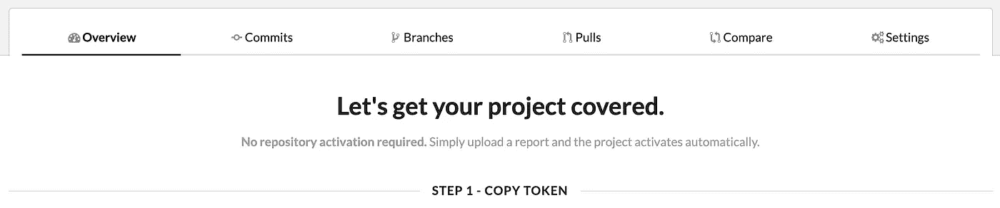

# 将 Codecov 用于 Python 和 Travis CI 的初学者指南

> 原文：<https://medium.datadriveninvestor.com/beginners-guide-to-using-codecov-with-python-and-travis-ci-c17659bb711?source=collection_archive---------0----------------------->

[](http://www.track.datadriveninvestor.com/1B9E)

[*Codecov*](https://codecov.io) *是一个用来测量你的代码库的测试覆盖率的工具。它通常通过检查在运行单元测试时执行了哪些代码行来计算覆盖率。*

那么，如何将它集成到使用 Travis 作为 CI 服务的 python 项目中呢？我是这样做的。我有一个类似于下图的项目结构。

[](https://www.datadriveninvestor.com/2019/02/21/best-coding-languages-to-learn-in-2019/) [## 2019 年最值得学习的编码语言|数据驱动的投资者

### 在我读大学的那几年，我跳过了很多次夜游去学习 Java，希望有一天它能帮助我在…

www.datadriveninvestor.com](https://www.datadriveninvestor.com/2019/02/21/best-coding-languages-to-learn-in-2019/) 

```
project_root_folder
|-------- module_folder
|      |----- __init__.py 
|      |----- module.py
|-------- test
       |----- __init__.py
       |----- test_module.py 
```

我使用测试发现特性一次自动运行所有的测试。这确实是 python `unittest`库的一个很棒的特性，

```
$ python -m unittest discover
```

有一天，当我开始怀疑我的代码库的测试质量时，我在我的项目中遇到了一些愚蠢的错误，我在这个设置上做得很好。然后我偶然发现了两个非常棒的工具，Codecov & Coverage。我将一步一步地告诉你如何使用它。

***从这里跟着我一起走***

1.  访问 [https://codecov.io](https://codecov.io) 并根据所需存储库的位置使用 Github/Gitlab/Bitbucket 登录。
2.  然后从“添加存储库”按钮向前移动，选择并添加要与 Codecov 集成的存储库。
3.  如果一切顺利，您可能会看到这样的页面，



4.这是所有混乱的开始。令牌或多或少总是难以维护。但是如果只要你在使用 Travis CI，你就完全不用担心。

5.在您的 *travis.yml* 文件的`install`部分添加一行，

```
pip install coverage
```

现在，你可能会猜测什么是覆盖率，对吗？ [Coverage](https://pypi.org/project/coverage/) 是一个工具，它完成了从您的代码库实际生成覆盖报告的所有艰苦工作，然后将报告上传到 Codecov，Codecov 跟踪所有与测试覆盖相关的度量和进度报告。

6.然后在 Travis 配置文件的`script`部分中，修改以下代码行

```
python -m unittest discover
```

到

```
coverage run -m unittest discover
```

就是这样，覆盖率将运行所有的测试并自动生成报告。您可以找到一个`.coverage`文件形式的报告，尽管它根本不可读。

7.最后，在 Travis 配置文件的`after_success`部分，添加以下行

```
bash <(curl -s https://codecov.io/bash)
```

这是 Codecov 开发的 bash uploader，用于简化从 CI 服务自动上传报告的过程。因为我们在 Travis CI 上，所以我们不需要设置任何环境变量，比如`CODECOV_TOKEN`之类的。

8.仅此而已。现在，您可以在 Codecov 仪表板上看到您的代码的详细覆盖率报告。没那么有趣。

如有任何疑问或如何改进这篇文章的建议，请随时向我提出。我非常乐意帮忙。非常感谢你宝贵的时间。