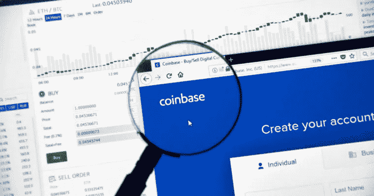
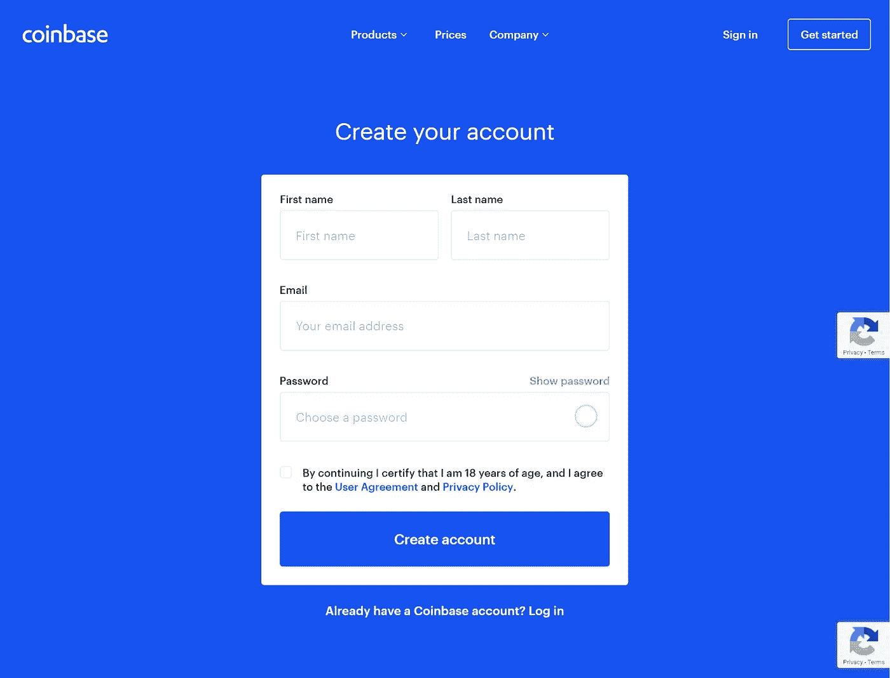
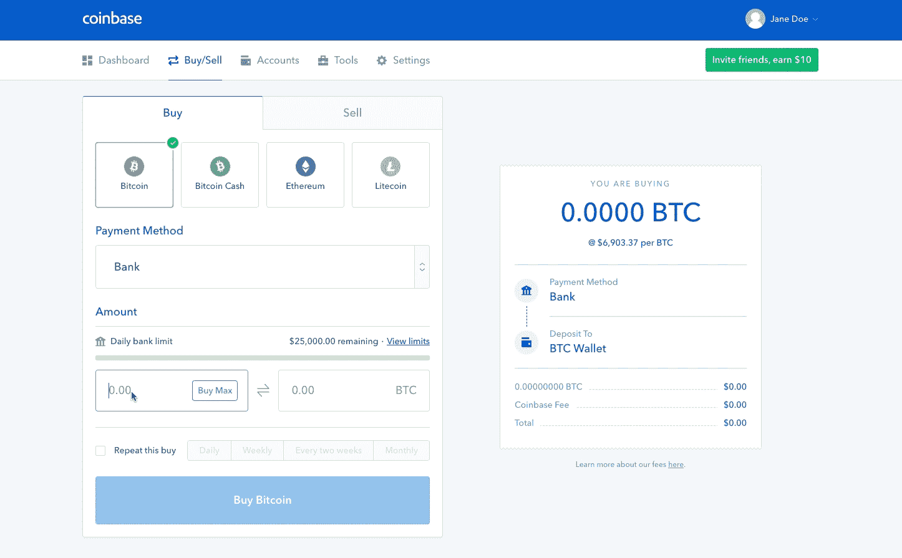
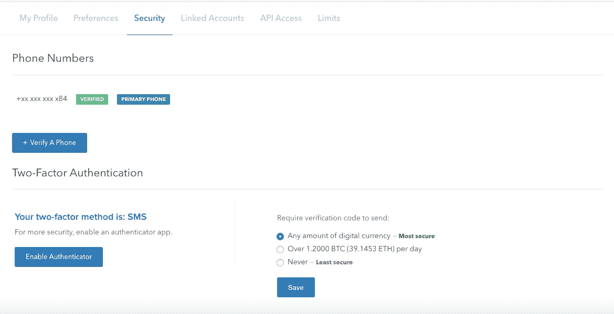
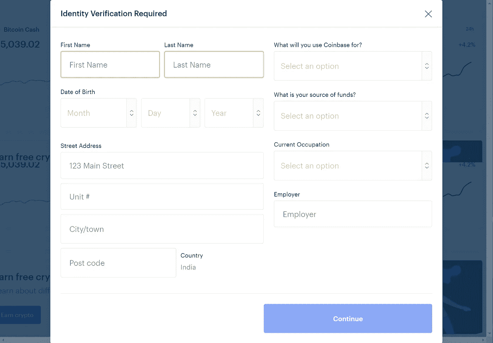

# 初学者一步一步指导如何在比特币基地交易

> 原文：<https://medium.datadriveninvestor.com/beginners-step-by-step-guide-on-how-to-trade-on-coinbase-dbd5c4357d9f?source=collection_archive---------2----------------------->

(披露:下面的一些链接可能是推荐链接，这将有助于支持作者的工作。)

*(免责声明:文章所表达的观点和意见仅属于作者，并不一定代表 DDI 的立场。这篇文章无意成为投资建议。我们建议你通过多种渠道进行自己的独立研究。)*

 [## 总部位于瑞士的 ETP 进入加密交易市场|数据驱动的投资者

### 虽然金融市场几乎没有沉闷的时刻，特别是在引入…

www.datadriveninvestor.com](https://www.datadriveninvestor.com/2019/03/10/swiss-based-etp-enters-the-crypto-trading-market/) 

有了 coinbase，加密货币交易就成了你的最爱！

比特币基地是由 Brian Armstrong 和 Fred Ersham 创建的加密货币交易所。它的基地在加利福尼亚州的旧金山。

在比特币基地交易有其优势。它将大部分数字资产存储在安全的离线存储中；其服务器上的加密货币有保险保障；它支持加密市场中最流行的数字货币；它使得通过安排每天、每周或每月的购买来逐步投资加密货币成为可能；也可以将资金存放在金库中，延时取款以增加安全性。所有这些因素都使它成为一个安全、轻松的地方来购买、出售和管理加密货币投资组合。界面友好，方便初学者。

在比特币基地交易是一个相当简单的过程。你必须创建一个帐户。您需要输入一些基本的个人信息，确认您已年满 18 岁，并同意用户协议和隐私政策。

使用我们的[推荐链接](http://coinbase-consumer.sjv.io/ov07E)注册，你可以获得价值 10 美元的免费比特币

要开始交易，您需要点击交易按钮，coinbase 特别要求您在首次购买前进行身份验证。

它会要求你选择你想要的支付方式，开始从交易所购买加密货币。您可以输入信用卡/借记卡详细信息。这一步不需要任何费用或购买。

您将被要求验证两个待定保留，您需要通过您的银行网站或应用程序来验证您的卡。

出于安全原因，需要注册一个手机号码。将向注册的手机号码发送验证短信以确认帐户。

在购买加密货币之前，您必须验证您的身份。这是为了您的交易安全和防止身份欺诈。

您可以设置双因素身份验证来增加安全性。当你第一次尝试交易时，它会提示你一个正式的身份证，可以是你的护照或驾驶执照。比特币基地强调 KYC 保护其用户。一旦完成这一步并验证了正式 ID，我们将向您发送一封电子邮件，通知您现在可以在比特币基地上进行交易了。

您可以投入当地法定货币的任意金额，并选择比特币基地支持的 9 种流行加密货币中的任何一种进行交易。您可以通过按当前汇率用法定货币支付金额来购买任何加密货币，加密货币将可供您交易或发送到其他地址。

出售涉及将特定数量的加密货币转换回法定货币。在与您的国家相关的交易所的钱包的帮助下，取款很容易。

在比特币基地进行加密货币交易简单、方便、安全。比特币基地是加入加密运动的完美平台。

新闻来源:[the confirpublic](https://www.thecoinrepublic.com/beginners-step-by-step-guide-on-how-to-trade-on-coinbase/)