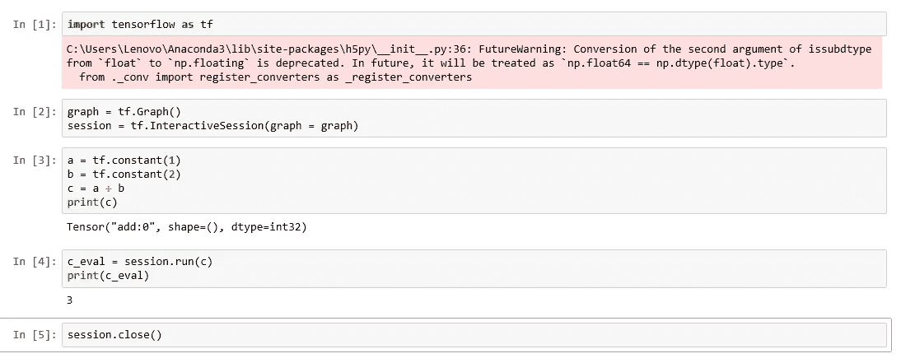
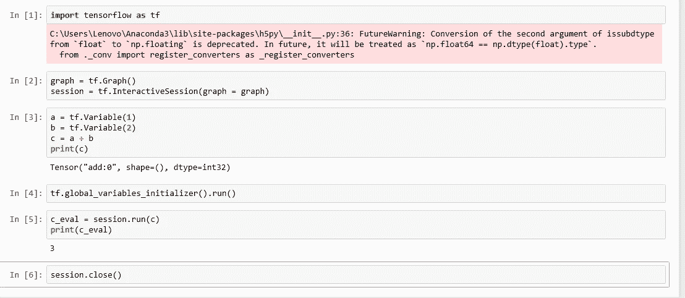
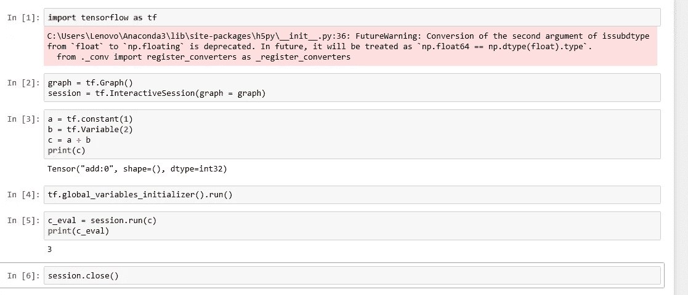
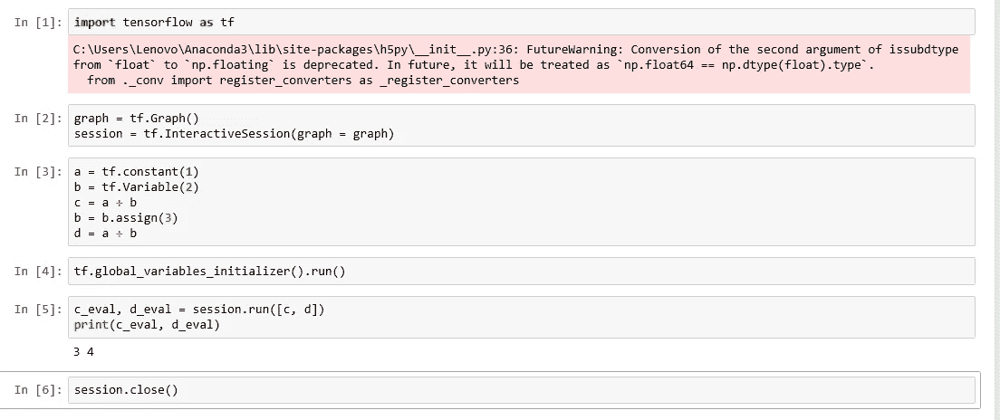
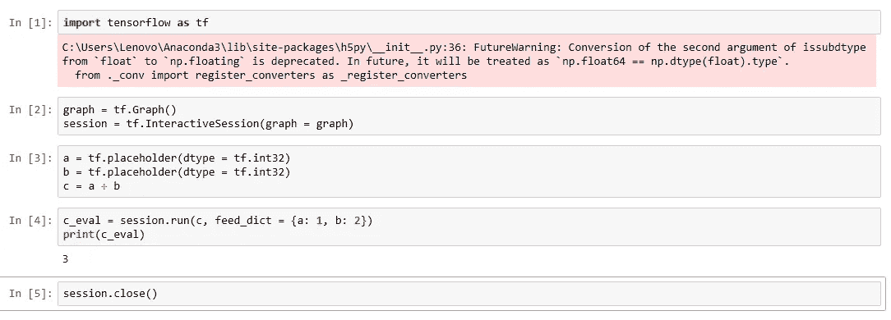
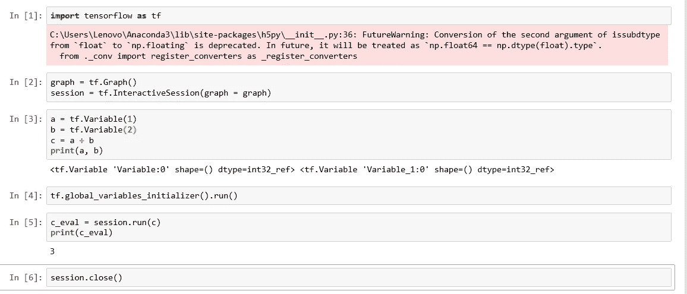
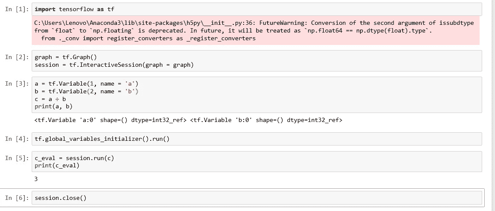

# 开始张量流

> 原文：<https://medium.datadriveninvestor.com/beginning-tensorflow-dc041fc23392?source=collection_archive---------8----------------------->

近年来，机器学习取得了很大进展，其中许多进展都是由于神经网络而成为可能的。TensorFlow 是一个强大的机器学习框架，它使创建神经网络变得更加容易。在这里，我们将开始理解张量流。在探索神经网络之前，我们将尝试一个简单的加法运算，以便更好地理解张量流。我们将假设您已经熟悉 Python 作为一种语言，并希望学习 Python 中的 TensorFlow。

Tensorflow 通过创建所谓的计算图来计算您的操作。你创建一个计算图来描述你想要执行的计算。然后，通过使用 TensorFlow 创建的会话来执行图形。

Our First TensorFlow Graph

您可以忽略我们在执行笔记本中的第一个单元格时得到的警告，这与我们的讨论无关。在第二个单元格中，您可以看到我们已经声明了该图以及将使用该图的会话。在之后的单元格中，我们在 TensorFlow 中创建了常量“a”和“b ”,并声明“c”为“a”和“b”的和。您可以看到，我们试图打印出“c”的值，但没有打印出 1 + 2 的计算值，即 3。与第四个单元格一样，我们需要运行会话。当您运行会话时，图形将被执行，然后我们可以在 Python 变量“c_eval”中看到图形变量“c”的计算结果。最后，您需要关闭会话，这是我们在第五个单元格中所做的。

TensorFlow with Variables

在上面的笔记本中，我们使用了变量而不是常数，检查单元格 3。现在因为有变量，你需要调用全局变量初始化器来初始化变量，我们已经在单元格 4 中完成了。代码的其余部分保持不变。

Constants and Variables

请注意，在上面笔记本的单元格 3 中，我们将“a”声明为常量，而将“b”声明为变量。在任何图中混合两者是可能的。

常量和变量的区别在于你可以改变变量的值，如下图所示。

Changing Variables

如果你注意上面笔记本中的单元格 3，检查在计算 c 后我们是否改变了变量 b 的值。现在‘d’使用了变量‘b’的新值。还要注意在单元格 5 中，我们如何在会话运行中获得“c”和“d”的评估值并打印它们。

除了将“a”和“b”声明为变量之外，您还可以将它们声明为占位符。这意味着在会话运行期间传递实际值之前，它们将一直是实际值的占位符。

Tensorflow Placeholders

请注意，在上面的单元格 3 中，我们是如何定义占位符的，在单元格 4 中，我们是如何在会话运行期间将值传递给占位符的。

在上面的例子中，“a”、“b”和“c”等等。是 Python 变量的名称。在张量流图中，它们可以有不同的名字。让我们拿下面另一个笔记本中的代码来理解这一点。

Variables and names

检查单元格 3 中打印出的值。我们将在代码中做一个小的改动，以便给图形变量命名。

Variables with Names

请注意，在单元格 3 中，我们已经将名称作为参数传递给了图形变量。在打印输出中，您可以看到我们初始化变量时显示的变量名称。在上一个笔记本中，我们没有给图形变量取任何名字，TensorFlow 已经给图形中的变量取了一些默认的名字。如果我们像现在这样在图中明确地命名我们的变量，这将是很好的，这将有助于我们以后调试我们的图的输出。

到目前为止，我们讨论的内容将帮助您阅读 TensorFlow 文档，并开始构建您自己的神经网络。请注意，这是一个初步的讨论，您将有一段距离来构建自己的机器学习应用程序，这些应用程序使用 TensorFlow 来构建基于神经网络的模型。