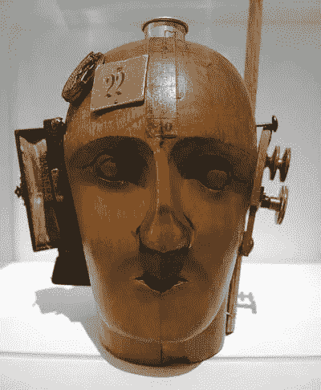

# 开始:思想的演变

> 原文：<https://medium.datadriveninvestor.com/beginning-the-evolution-of-ideas-7d3d0d1057b0?source=collection_archive---------18----------------------->

Sometimes all you need is a little prince to ask the right questions, but we never need to assume there is only one answer (©Ehud Heller)

> **“四十二！”伦克威尔尖叫道，“你需要 750 万年才能数到 42？!"。“我非常仔细地检查了一下，”深思说，“这可能是正确的答案，问题是，我认为，你们中没有人知道这个问题。”**

*原作者:埃胡德·海勒(@hellere)*

所以他们说技术是答案(“42”)，但问题是什么？如果我们不知道如何表述这个问题，我们可能不知道该做什么，也不知道这是否是正确的答案。技术，就其作为电子媒介的意义而言，确实改变了人类的面貌，将人类引向了一条不同于所有前辈的替代发展轴(例如，逃离马尔萨斯陷阱)，并肯定影响了对时间的感知，即时间转移装置的悖论，如 Judy Wajcman 所述(见 Postman、McLuhan 和 Inis)。所以，至少，我们倾向于相信和坚持。但我将尝试提出另一个论点，即支撑其发展的不是技术，而是哲学，而且是其预期用途的基础。经济吗？功能主义者？社交？或者人文主义者？同样重要的问题是，人类在多大程度上受到媒介信息的影响，媒介是作为创造者的哲学思考而产生的。

技术系统是文化-组织环境(隐藏的信息)的产物，它们是在这种环境中开发的，它们要回答的问题也是在这种环境中开发的。换句话说，它们是在“盒子”中开发的，并根据那些技术的思想者可用的概念字典来规定期望的结果。一般人并不精通技术的秘密；相反，在狭隘的经济利益和文化哲学的驱动下，他通过屏蔽过滤器和大众媒体营销来体验它。在我们这个充满挑战、刺激和激情的时代，很容易混淆使用技术的知识和从技术中学习的能力，混淆获取无限信息和构建有意义的知识。

The Spirit of Our Time — Mechanical Head, Raoul Hausmann (1919). As irony to the failed ideal of technology

“只有在心里，一个人才能看得清楚；本质的东西是肉眼看不见的。”狐狸对小王子说。因为当它，狐狸，为王子的离去感到悲伤的时候，像一张巨大的地毯一样展开的花朵正忙于培育它们的美丽，在它们的田野里行走的人没有感觉到什么，他的爪子也没有受伤。这就是安托万·德·圣埃克苏佩里试图告诉我们的，缩小可见活动的体验与只有通过对话才能产生的独特性的情感认同和欣赏之间的差距。不能承受之轻沉迷于无尽的滚动到新的火花变黄，因为春天是如此之短，与路中间的孤独者相遇之间的差距，与许多人随着噪音从一个到另一个下降到数据雾中的感觉异化的点。

在将计划淘汰经济神圣化的大众消费文化中，在人与机器的相遇中，只要有利润可实现，卖方(和房地产经纪人)就会系统地利用隐藏在人们视线之外的弱点来销售消费者认为他们需要的东西，而不是他们真正需要的东西。作为回应，我们需要一个新的灵活的社会操作系统，它将赋予个人权力，消除隐藏的障碍，扩大他可用的可能性，帮助他学习，解决问题，做出决定，弥合利益冲突，并回答他显然不知道如何制定或意识到对他来说有必要的问题。这种系统还将包括基于更准确的信息分析和更大的用户吸引力的共生和协作商业模式。这是一个更美好世界的下一个重大事件。

||这篇文章也有 PDF 版本，分别为[希伯来语](https://www.eitancapital.com/Docs/Beginning_The_evolution_of_ideas_Hebrew.pdf)和【T2 语】英语