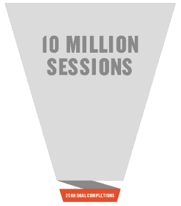
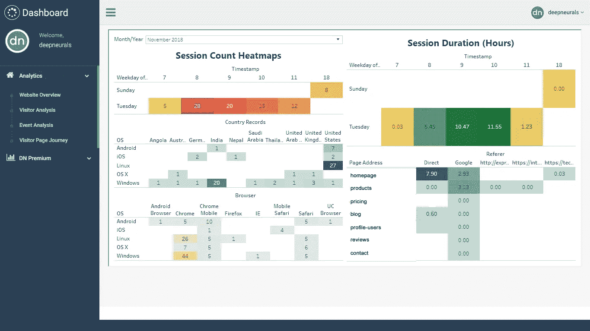

# 现代营销人员的行为营销

> 原文：<https://medium.datadriveninvestor.com/behavioral-marketing-for-the-modern-day-marketer-7eb769c1753c?source=collection_archive---------11----------------------->

Photo from [https://unsplash.com/](https://unsplash.com/)

> **更新:讨论中的工具(deepneurals)已被移除，不再可用**

现在是 2019 年，“自由”做任何事情的想法都达到了顶峰。虽然这对“消费者”来说是个好消息，但对“企业”来说却是个头疼的问题。

当我们执行多项活动时，我们在每个阶段都会表现出不同的行为。以你典型的工作日为例，你可能会在周一早上开始时情绪低落，结束时情绪高涨。

虽然这只是你的线下行为，但不知不觉中这影响了你的在线行为，行动，点击和几乎每一个互联网上的决定。

# 挑战

企业不知道你今天的感觉如何，你最近的周末过得如何，或者你线下发生的任何事情，但他们仍然希望向你出售他们的产品，因为你不同于他们的理想客户，所以跟踪你的在线活动对他们来说变得至关重要。

> 你今天点击的按钮可以很好地预测你明天的行动

你确实意识到这个问题正在被解决，但是最终，一个营销者，也就是你，正在解决增加****收入**的最基本的问题，只是解决你的问题的方式不同于传统的方式，那就是 ***广告*****

> **我们投入了大量资金来驱动我们的登陆页面的流量，但当它们真正登陆时，并没有真正投入**

# ****三点真理****

********

1.  ****你的广告渠道已经饱和了****
2.  ****你的重新定位是负投资回报率****
3.  ****你可以联系这个**近视漏斗******

# ****损害控制****

****从这一点上解释的方法对于那些经营小型公司，不能投资 1000 美元的 SAAS 营销工具，但想要体验行为营销的人来说是理想的****

****值得注意的是，由于数据合规性、预算或任何 *xyz* 原因，我们无法利用现有的花哨 SAAS 工具，因此我们将探索一种工具，它能够设置您的用例所需的**基础设施**，以在技术和运营上建立行为营销渠道。****

**** [## 一个企业在肚子上移动:如何照顾直觉|数据驱动的投资者

### 事实证明，直觉不仅仅是一种感觉。科学很清楚:你的直觉比你知道的更多…

www.datadriveninvestor.com](https://www.datadriveninvestor.com/2018/11/09/a-business-moves-on-its-stomach-how-to-make-allowances-for-gut-feelings/) 

就像任何其他分析工具一样，这些工具也以或多或少相同的方式运行。这个工具只是对你的网站进行行为营销的可能性的一个窥探。

# 有 USP 吗？

除了可以免费使用之外，其他工具的几个优势是:

*   完全的数据所有权，这可以在内部部署
*   事件的自动标记
*   用 SEO 活动映射用户旅程

# 介绍，[深度神经](http://deepneurals.com)！

一方面，这个工具允许你追踪访问者的行为事件。如果你是一个有经验的营销人员，你已经知道我在说什么，对于其他任何人，这个工具可以跟踪以下类型的数据点:

*   引荐:你是如何来到这里的？谷歌？脸书广告？其他网站吗？
*   滚动行为:你向下滚动了吗？多少钱？
*   你点击的链接
*   每页花费的时间
*   您使用的设备类型
*   你是从哪里退出网站的？
*   你填的所有表格
*   你在下一次治疗中的行为，是什么让你回来的？

这些是目前跟踪的一些数据点，因为您可以在内部部署，所以您可以开始跟踪自己的数据点，具体到您的业务

> 这里的独特之处在于，所有这些数据都是原始格式的！也就是说，这些数据可以像任何 csv 文件一样导出

与其他分析工具不同，这种灵活性允许小团队和早期创业公司实现描述性分析和机器学习，拥有完整的数据所有权，而无需花费一分钱！

# 以用例结尾

当然，你可以通过谷歌分析等工具轻松跟踪哪个广告、脸书邮报、推特或任何内容带来了最多的点击和转换。

Photo by [Patrick Perkins](https://unsplash.com/@pperkins?utm_source=medium&utm_medium=referral) on [Unsplash](https://unsplash.com?utm_source=medium&utm_medium=referral)

考虑这样一个场景，你运营一家内容发布初创公司，你看到非常具体的帖子的流量出现峰值。你开始深入了解是什么导致了这一高峰，并意识到这只是有机交通。

> 追踪你的第三方流量来源就像在公园散步一样。然而，当你想知道谷歌搜索带来了什么样的流量，并把它与用户旅程对应起来时，就变得很困难了

Deepneurals 将从你的谷歌搜索控制台和网站中提取数据，帮助你解释人们在特定的一天搜索了哪些关键词，他们登陆了哪个页面，当然，一旦他们进入，就会有用户跟踪。

虽然这种数据的能力是无穷无尽的，但是自从**引进了 GDPR** ，这个工具只能做这么多。这是我过去几个月一直在做的一个小项目，我已经决定用一个免费使用的**版本**上线。一定要检查一下，看看它是否适合您的用例****