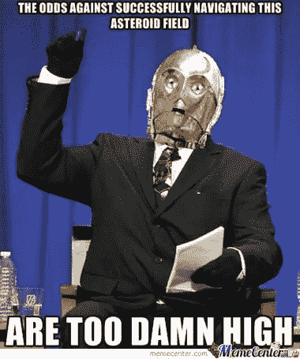
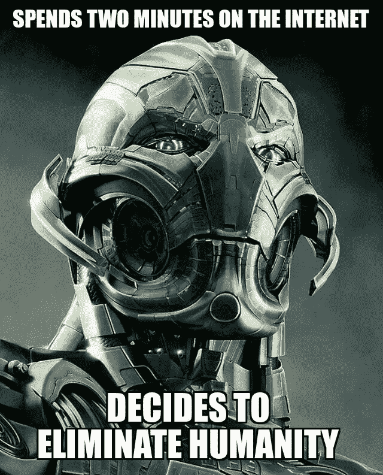
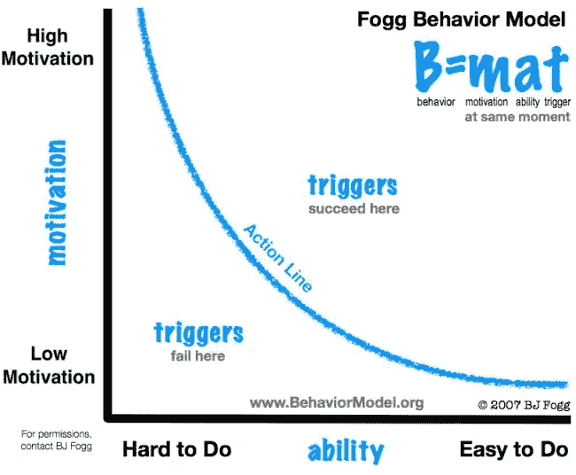
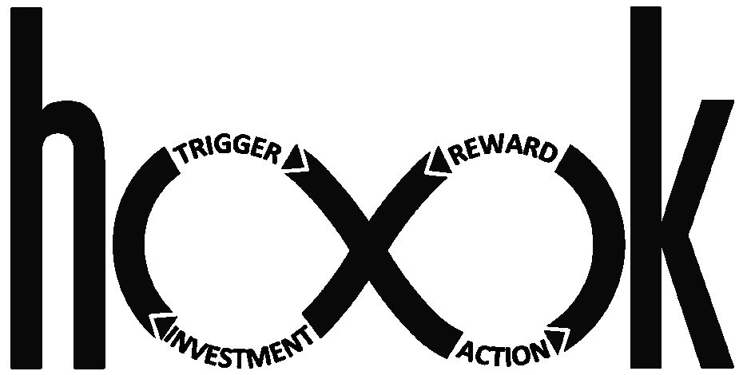
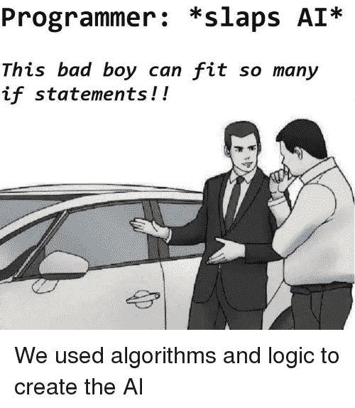

# 行为科学和人工智能:好的、坏的和丑陋的

> 原文：<https://medium.datadriveninvestor.com/behavioral-science-ai-the-good-the-bad-the-ugly-656d2312ce71?source=collection_archive---------5----------------------->

行为科学与人工智能及其关系初探。

The Gooood 😄

The Bad 😔

The Ugly ☹️😱

*行为科学？*那是什么？有没有一整个领域致力于人类行为的研究？你打赌有。这并不一定是新的东西，行为科学本身是一种跨学科的方法，通过人类学、社会学和心理学来理解人类行为。当应用于技术领域的应用程序设计时，这个领域非常有用，因为毕竟应用程序是为人类设计的。如果你作为一个程序员能够高度确定地预测用户将会如何行为，你就可以设计你的应用来利用这种行为。

行为科学的基石是 B=MAT 模型。

Behavior = Motivation + Ability + Trigger

B=MAT 的组成部分是行为、动机、能力和触发因素:

1.  **行为**——一个人在某些刺激面前的行为或举止。
2.  **动机**——某人做某事的一般愿望或意愿。
3.  能力——做某事的方法或技能。这与应用程序的易用性和易访问性直接相关。
4.  **触发**——引起某种行为的事件或情绪。

目前，大多数公司都在结合 B=MAT 使用一种叫做 hook 模型的东西。

钩子是什么？Hook 是一个循环模型，它遵循从触发到行动再到回报再到投资的流程。下面是模型各部分的分解。

1.  **触发器** —存在两种类型的触发器:外部和内部。外部触发器是基本上告诉你该做什么的东西，例如立即购买广告、点击这里、播放这个…本质上是点击诱饵。内部触发器比外部触发器更强大，它们存在于一个人的大脑内部。内部触发是通过人的大脑中的联想或记忆形成的。最常见的内在触发因素是情绪，尤其是负面情绪。
2.  **动作**——一个人基于触发器所能做的最简单的行为。这可能意味着在谷歌上搜索，在 youtube 视频中点击播放，在 Pinterest 上滚动。行动是为了期待回报。动作(行为)的可能性由 B=MAT 定义。
3.  **奖励** —一般来说，奖励是让你感觉良好的积极的东西，这是一个行动的直接结果(例如打开脸书或 Instagram)。这可能意味着在你的新闻订阅中看到某种类型的帖子(比如你喜欢猫，你可能会看到更多关于猫的帖子)。有 3 种不同类型的奖励:部落奖励，狩猎奖励，自我奖励。公司试图控制 hook 模型的奖励方面，以使受到奖励的行为根深蒂固，并形成一种习惯。拥有新闻源的社交媒体公司正在利用这一奖励。

*   部落奖励——感觉良好的东西，如“部落”成员之间的合作、竞争和伙伴关系。
*   狩猎的奖励——搜寻资源:例如，你可能从玩扑克或在一系列不利的帖子中看到你对你的新闻源最感兴趣的一个帖子而赢得的钱。
*   自我奖励——自我感觉良好的事情。完成待办事项清单上的项目，检查你电子邮件中的所有通知…让所有的绿色植物通过 learn.co 的实验室😅

4.**投资**—hook 模式的投资阶段是一个应用程序存在价值的阶段，即你的朋友越多，你就越受欢迎，你在 twitter 上的粉丝越多，你就能接触到越多的受众。开发者试图在他们的应用程序中提供累积价值，这样人们就会“上瘾”并回来购买更多。

尽管看起来很可悲，但“最佳”产品甚至不取决于其目标价值，而是利用挂钩模型和 B=MAT 的最佳产品。

*人工智能？*那是什么？在一个从微软 Word 回形针到 iRobot 的尺度上，AI 目前处于什么阶段？

在我讨论人工智能的现状，它是什么，它如何工作以及它的未来之前，我想讨论一下意识。

什么是*意识*？清醒并意识到周围环境的状态。我们意识的来源是什么？从历史上看，神经科学家无法确定意识的来源，只是将其归因于某种巫毒魔法。然而，最近，科学家们开始看到，在非常基础的水平上，意识只是一群神经元的放电和大脑中发生的化学反应。

大脑通过电脉冲来发现世界，而电脉冲只是间接与世界上的物体/动作有关。感知是一个知情猜测的过程，大脑根据以前的数据(存在于你的潜意识中)获取这些信号以及对世界的期望和信念，以找出是什么导致了这些信号。我们不是被动地感知现实，而是主动地创造现实。另一件要考虑的事情是，如果我们世界中的幻觉只是不受控制的感知，那么反过来，感知是受控制的幻觉。都是脑子里想的。

好的。我们正在坐过山车，但请相信我，这只会变得更好。

当我们说某物有感知能力时，我们的意思是什么？感知意味着当一个物体/人意识到自己并能独立思考时。这个术语几乎是意识的同义词。但是在什么层面上呢？在基本生命形式的层面上？比如一只狗知道它饿了，它需要食物才能生存？还是在人类的层面上？狗的智力水平和人一样吗？如果我们谈论人工智能时的智能，我们经常将人工智能与我们自己相比较作为基准。根据列纳德·蒙洛迪诺题为“潜意识”的书，有不同的“智力等级”,可以通过狗的例子来说明。作为人类，在第一层，我们能够想到如果一个家庭成员饿了，在第二层，我们可以想到这个家庭成员知道你知道他们饿了，下一层是你知道他们知道你知道他们饿了。它继续发展，变得越来越复杂，我们作为人类的智力可以通过我们在高抽象层次上的思考能力来客观地衡量。当我们开始定义人工智能时，这些都是需要记住的事情。

有一句很好的名言可以说明意识和智力之间的关系(或缺乏)，那就是“你不需要变得聪明来承受痛苦，但你可能必须活着。”意识产生智慧。

什么是*人工智能*？计算机系统的理论和发展，能够执行通常需要人类智能的任务，如视觉感知、语音识别、决策和语言之间的翻译。

人工智能的工作方式是通过机器学习。机器学习是向算法输入大量数据，以“教”它完成某项任务的过程。在一个非常基本的层面上，人工智能系统的算法可以判断一只狗的图像是否是一只狗。这种功能被称为计算机视觉，已经在今天的技术中使用，即特斯拉的自动驾驶汽车。这是一个非常酷但乏味的过程，因为所有输入 ML 算法的图像都必须手动标记，但经过多次迭代后，该算法将开始捕捉趋势并创建关联。错误标记会导致人工智能在其数据中创建错误的关联。

你的人工智能和你输入的数据一样好。这方面的一个很好的例子是谷歌的梦想项目。狗的图像被输入到 ML 算法中，现在它开始在它看到的任何图像中找到狗。

这类似于人类大脑对迷幻药的依赖，迷幻药打破了事先存在于我们大脑中的联想(同样，存在于你的潜意识中！).当你“兴奋”时，你会看到幻觉，因为这是你的大脑试图在它所看到的东西中找到模式，以在潜意识层面正确地识别它。

人工智能是非常数据驱动的，这意味着它的智能范围仅限于它的数据。人类的大脑在当前的历史点上是一千年进化的顶点。目前，你不可能通过人工智能教一个人工智能系统成为人类。即使有人跟踪一个人一生的数据并将其输入到 ML 算法中，这也是不够的，因为该算法并没有见证人脑执行的所有潜意识行为。原因是因为不是每个人都会在一生中遇到相同的刺激，所以向人工智能系统提供一个人的数据甚至一千个人的数据只会让系统收集这些人的集体偏见，而不会产生真正的感知。有时，我们甚至不能相信自己的感觉，这一点在麦葛克效应中有所体现，如下所示:

当 AI 达到更高阶的智能时会发生什么？我们不能完全确定，但是让我们希望它不会完全奥创在我们身上。让我们在下一节讨论行为科学和 AI 如何在好的用例与坏的用例中齐头并进。

# 好的和坏的

让我们先从坏案例开始:

1.  社交媒体是 hook 模型的大用户。社交媒体平台是一个好东西，也是一个用来联系全球朋友和家人的工具。然而，它们现在的实用性是值得怀疑的。赞、标签、转发和广告收入作为社交媒体应用的主要收入模式所形成的反馈循环，促使公司让你沉迷于钩子模型的无限循环中。
2.  人工智能可以与行为科学结合使用，因为人工智能可以用于根据与您的人口统计数据确定单个用户的触发点。这使得开发人员可以更有效地瞄准目标，因为现在他们不仅控制了 B=MAT 的动机和能力部分，还控制了导致行为的整个框架！
3.  人工智能不切实际的应用的一个例子是，警察辖区使用人工智能软件来预测哪些街区需要巡逻。你应该已经猜到这不会有好结果。该算法基于输入的数据，向以非洲裔美国人为主的社区派遣警察。根据美国的数据，我们知道当涉及到警察互动时，存在着对有色人种/少数民族的隐性(或显性)偏见。因此，你可以想象为什么人工智能是种族主义者…错误的，有偏见的数据！
4.  两者的另一个糟糕的用例是黑客可能会从社交媒体网站侵入用户数据，并使用这些信息有效地预测你未来的动向，并可能将这些信息出售给犯罪分子，特别是如果你是一个富人。
5.  糟糕的情况已经够多了，我可以永远继续下去。孤立的 B=MAT 的一个很好的用例是使用模型的知识来打破坏习惯。人们可以调整 B=MAT 模型的 x 轴和 y 轴(从你的手机中删除 FB，关闭通知，等等。)
6.  一个基本但很酷的用途是使用计算机视觉来确定杂货店的产品是否腐烂。这可能会减少某些工作岗位，降低公司成本。
7.  我要提到的最后一个好的使用案例是 is…learn.co！熨斗学校在设计其平台时肯定考虑了行为科学。记得绿灯吗？这是让你上瘾的一种方式。我们正在学习并最终受益于这种更高层次的关注！

用户/客户数据的保护是一个非常重要的话题，我将在下一篇文章中深入探讨！

**来源:**

“潜意识”——列纳德·蒙洛迪诺

“上瘾:如何打造形成习惯的产品”——Nir Eyal

[https://www . ted . com/talks/Anil _ Seth _ how _ your _ brain _ disciplies _ your _ conscious _ reality/抄本？language=en](https://www.ted.com/talks/anil_seth_how_your_brain_hallucinates_your_conscious_reality/transcript?language=en)

[https://www . Smithsonian mag . com/innovation/artificial-intelligence-is-now-use-predict-crime-is-it-biased-180968337/](https://www.smithsonianmag.com/innovation/artificial-intelligence-is-now-used-predict-crime-is-it-biased-180968337/)