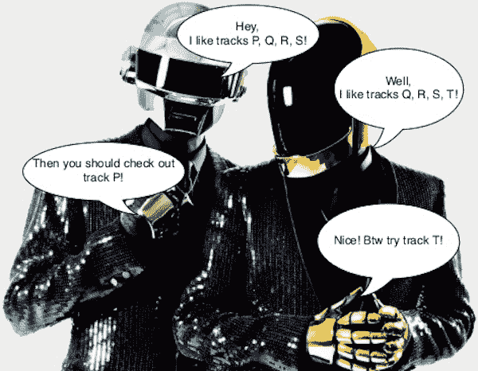
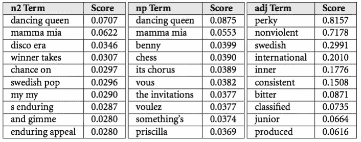

# Spotify 的推荐引擎

> 原文：<https://medium.datadriveninvestor.com/behind-spotify-recommendation-engine-a9b5a27a935?source=collection_archive---------0----------------------->

## Spotify《发现周刊》背后的模式

> 音乐不像新闻，重要的是 5 分钟前甚至 10 秒钟前发生的事情。对于音乐来说，一首 20 世纪 60 年代的歌曲可能和最新的 Ke$ha 歌曲一样与今天的人相关。
> 
> —丹尼尔·埃克

与其他领域一样，音乐行业也受益于机器学习，为每一位听众提供个性化的播放列表。Spotify 是这种技术的一个典型例子。每周一，超过 1 亿 Spotify 用户会收到一个为他们量身定制的新播放列表——Discover Weekly。这个自定义播放列表包含大约 30 首他们以前从未听过但可能会喜欢的歌曲。许多人喜欢并依赖这项服务来增加他们接触新音乐的机会。

# **音乐策展的历史**

在 21 世纪初，Songza 开发了一个自动化音乐管理的产品。手动监管意味着一组音乐专家手工整理他们认为好听的播放列表。Songza 建立了一个值得尊敬的用户群，但他们方法的主要缺点是没有考虑到每个听众个人音乐品味的细微差别。

像 Songza 一样，Pandora 也是音乐流媒体业务的首批参与者之一，但他们使用了不同于管理播放列表的方法。取而代之的是，音乐专家为每首歌手动标记属性。他们听每首歌，并添加描述性标签，如“民谣”、“慢歌”、“说唱”或“爱情”。有了这些信息，Pandora 创建了包含相似歌曲的播放列表，即带有相关标签的歌曲。

最后。Fm 致力于另一种叫做协同过滤的方法来识别用户可能喜欢的歌曲。我将在本章后面讨论这种方法的细节。

然而，Spotify 开发了一个使用三种不同推荐模型的引擎。他们的策略随着时间的推移而改变，但 Spotify 用来创建 Discover Weekly 播放列表的算法之一是其竞争对手使用的最佳策略的混合。Spotify 结合了三种不同的模型来分析歌曲的相似性:

1.  **协同过滤**检查并比较一个人的行为与其他人的品味。
2.  **自然语言处理** (NLP)分析每首歌中的文本。
3.  **音频建模**使用歌曲的原始音频来理解歌曲的曲调，并将其与其他歌曲进行比较。

# **协同过滤**

当网飞将协同过滤用于推荐引擎时，它变得流行起来。他们使用客户的电影评级来确定向其他类似用户推荐什么电影。在网飞成功部署它之后，它的使用迅速扩展到各个行业，现在经常被认为是任何试图创建推荐引擎的人的起点。

与网飞不同，Spotify 的歌曲没有星级。相反，Spotify 的数据是隐性反馈，即不是基于评分，而是基于用户与其软件的互动。Spotify 使用人们听的歌曲的流计数以及其他数据点，如用户是否将歌曲添加到播放列表或转到艺术家的页面。

**那么，协同过滤是如何工作的呢？**

该算法通过收集许多用户的偏好(协作)来预测用户的兴趣(过滤)。

Collaborative filtering explained

协同过滤的工作原理是比较品味相似的人。在图 27.1 中，左边的人 1 喜欢歌曲 1、4、8 和 10，右边的人 2 喜欢歌曲 2、3、4 和 8。两个消费者都同意歌曲 4 和 8。因为他们都喜欢歌曲 4 和 8，那么他们很可能会喜欢他们还没有听过的其他歌曲。例如，人 1 可能喜欢歌曲 2 和 3，而人 2 可能喜欢歌曲 1 和 4。

定义一个用户何时与另一个用户相似的方法是看他们是否听过另一个用户听过的一些相同的歌曲。协同过滤分析来自许多用户的数据，确定相似用户的模式，并根据相似用户的收听内容预测用户的口味。

# **自然语言处理**

Spotify 在网上搜索关于音乐的博客帖子和文字，以了解人们对特定歌曲和艺术家的看法。他们决定使用哪些形容词和语言来描述他们，以及哪些艺术家和歌曲与他们一起被讨论。

Song titles with adjectives and scores

然后，它分析描述特定歌曲或艺术家的顶级术语。每一位艺术家和每一首歌曲都有成千上万个术语来描述它们。每一个都有一个相关的分数，它描述了这个描述对一首歌/一个艺术家有多重要。这些标签或单词被添加到每首歌曲和艺术家的模型中，然后用于建模向用户推荐什么歌曲。

# **原始音频模型**

Spotify 使用的第三种模式不仅提高了系统的准确性，它还有一个非常重要的次要目的，那就是寻找新歌。如果 Spotify 只推荐相同的歌曲，那么新歌就永远不会被推荐或听。这种模式解决了这个问题，向播放列表添加新歌。

假设有人上传一首歌到 Spotify。它只有 25 个听众，在互联网上没有提及。为了让这首歌出现在某人的 Discover Weekly 播放列表中，Spotify 必须使用 raw audio 模型，该模型分析一首歌的音频，以查看其他歌曲之间的相似之处。这种方法平等地分析每首歌曲，无论是旧的还是新的。因此，当发现新歌与你喜欢的其他歌曲相似时，Spotify 会将其添加到你的播放列表中。

为了分析原始音频，音轨要经过与分析图像相同的神经网络，称为卷积神经网络。它处理原始音频并产生特征，如拍号、调、模式、速度和响度。经 CNN 处理后，产生使相似歌曲归入同一类别的度量。这种理解使 Spotify 能够根据这些关键指标来比较歌曲。例如，喜欢重金属的人可能喜欢更“响亮”的歌曲通过结合这三种模型，Spotify 分析了不同歌曲和艺术家的相似性，并每周向用户的播放列表推荐新的、未听过的歌曲。这些模式使得《发现周刊》成为 Spotify 最受欢迎的功能之一。

# **未来**

但是音乐和人工智能不仅仅是决定播放列表。该领域已经发展到包括音乐创作平台，如 IBM Watson Beat 和谷歌的 [NSynth](https://nsynthsuper.withgoogle.com/) Super。这项技术为任何人打开了创作音乐的大门，不管他们的音乐天赋如何。对大多数人来说，这可能是他们第一次亲身体验人工智能。一些人认为，我们所知道的音乐产业将会消失。然而，我欢迎新的可能性。