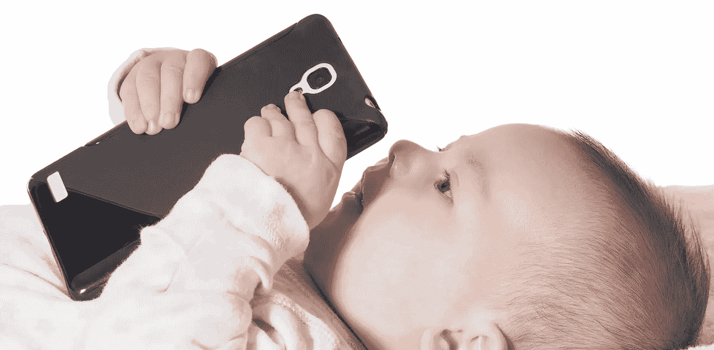
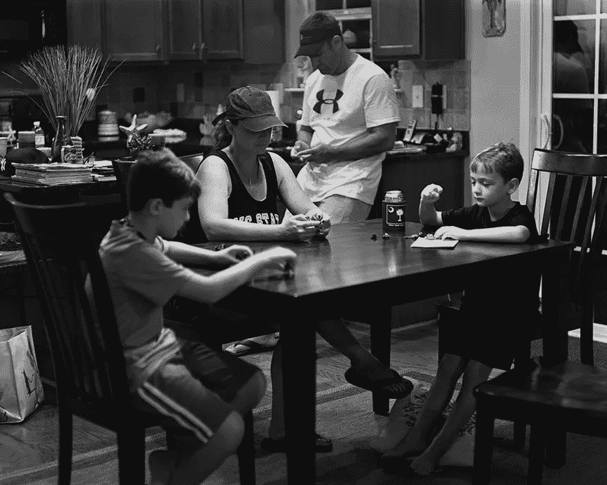

# 屏幕背后:我们的发明、时间、关系和大脑损伤的现实

> 原文：<https://medium.datadriveninvestor.com/behind-the-screens-the-reality-of-our-inventions-time-relationships-brain-damage-d03cf0f20387?source=collection_archive---------22----------------------->

如果你花时间阅读我们在[发酵像素](https://fpix.co/the-lab/)的博客，你会知道我们相信技术以我们还没有开始理解的方式帮助你的业务。

我们从航海家、十字军和水手的时代毕业，他们在广阔的蓝色海洋中寻找新的土地，或者从骆驼背交易香料到无国界经济，在那里，俄罗斯 UX/UI 专家可以与纽约市中心的数字机构合作，而不会眨一下眼睛(或者失眠)。

技术是品牌[新创业机会](https://fpix.co/the-lab/new-age-of-entrepreneurship-unique-opportunities-new-economy/)的催化剂，也是[新商业模式](https://fpix.co/the-lab/entrepreneurship-bold-change-for-a-bold-new-world/)的先兆。

我们写了技术如何为我们消费内容和创造内容铺平了新的道路。你已经读到了我们正处于创业新时代的漩涡之中。

技术正在从根本上改变我们生活、互动、交流、工作、旅行、学习和做生意的方式。

我们预测了[人工智能](https://fpix.co/the-lab/8-technology-predictions-for-2019/)将如何竞争你的工作描述，机器人是否会完全主导制造业，或者无人机是否能比送货人做得更好。

如果我们只是喋喋不休地谈论技术对我们所有人来说是多么了不起，这对我们是不公平的。

每朵玫瑰都有刺。

科技的崛起，商业中的新机遇，以及我们和我们所使用的技术之间不断变化的关系不仅仅是歌舞。

不过，科技也存在一些严重的问题。

智能手机可能会让我们变得愚蠢。

到现在为止，你可能已经失去了方向感(这曾经是我们与生俱来的),这都要感谢谷歌(或苹果)地图。

你不会掸掉旧封皮上的灰尘，也不会很少闻到经典平装本上生锈的旧书页的味道。

我们的大脑有睡得太多的危险。

我们没有发挥我们的创造力，也没有像过去那样坐着思考解决问题的方法。

我们不像过去那样享受高质量的关系。

我们不看别人的眼睛。

在公共场合分享我们的观点的行为已经从生动活泼的，面对面的，在公园散步的辩论演变成了在线论坛上的匿名条目。

我们之间分享的自然需求现在减少了 Instagram 更新。我们只在脸书更新中显示(这也是我们与亲人联系的方式)。

我们中的一些人可以在 Youtube 上拍摄一个演讲视频，但我们在公共演讲艺术上几乎没有取得任何进展，不是吗？

最重要的是，我们乐于摧毁和烧毁我们星球的资源，让位于我们自己版本的天启，而不是预言中神秘的天使和魔鬼之间的激烈战争。

谈到技术，并不是所有的东西都对我们有利。因此，我们需要规范我们对技术的依赖。虽然很好地利用你的手持超级电脑般的智能手机是没问题的，但我们需要后退一点。

技术有什么不好？这是什么:

**技术是反自然的**

自然，我们注定要在地球上行走，为生存而狩猎，并充分利用我们独特的交流能力。人类拥有认知思维、直觉、感觉、感知等等能力。

我们依靠我们的感官给我们提供信息。我们依赖我们的运动大脑进行日常生存。我们的本能、直觉和大脑处理信息的非凡能力是我们生活的核心。

在电脑屏幕上，或者在智能手机的纵向视图上，或者当你抬起手腕偷看智能手表时，所有让我们人类独一无二的东西都在一瞬间消失了。

我们感觉不到。没有本能在起作用。我们不联系(除非有人在脸书上 pings 或者在 Twitter 上向你发推文——这不是我们正在谈论的)。我们不让大脑处理任何事情(除了假新闻和其他垃圾的冲击)。

当你使用技术时，我们的任何感官都没有得到应有的关注。我们根本不会本能地行动。

没有战斗或逃跑。再也没有危险的大熊了。

我们的观念现在动摇了。我们分不清什么是真什么是假。我们失去了联系。

我们不再真正按照我们应该的方式生活。

如果你这样想。技术，以一种扭曲的方式，正带你远离你所属的自然。

**正式来说，你现在是哑巴**

有智能手机吗？你现在比几年前的认知能力和聪明程度都要低。

2010 年，*哈佛商业评论*的前执行编辑尼古拉斯·卡尔写了一本很有影响力的书，名为*The shalls:互联网对我们大脑的影响。在书中，他写道他是如何意识到自己无法集中注意力的，并指出重要的神经科学证据表明，互联网正在把我们变成“分散而肤浅的思考者”*

他特别写道:

“在过去的几年里，我有一种不舒服的感觉，有人或某物一直在修补我的大脑，重新映射神经回路，重新编程记忆。”

在阿肯色大学蒙蒂塞洛分校，研究发现，不带手机上课的学生比带手机的学生分数高出整整一个字母，即使后者的学生不用手机。

《T2 实验心理学杂志》2015 年的一项研究发现，大约 166 名受试者发现，当手机发出哔哔声或嗡嗡声时，他们的注意力会立即转移。

[蒂姆·艾斯丘，](https://www.inc.com/tim-askew/does-smartphone-make-you-stupid.html)雨国际公司的首席执行官，认为我们现在看到了一种威胁，那就是你本该自然而然去做的一切——比如存储信息或记忆东西。

他写道:

*“我们不再为我们的思维和创造过程提供肥沃的土壤”*

仅仅通过携带这些智能手机，你就不会足够努力地思考，你不会让你的大脑发挥出最大潜力，你会冒着失去创造性思维能力的风险，等等。

**关系，迷失在虚无的海洋中**

埃里克·皮克斯吉尔的项目“移除”严肃地提醒我们，我们已经远离了创造和培养人际关系的功能性本质。

看一看 Eric 的一张照片，它被 PS 过，从人们手中拿走了智能手机，向你展示它从外到内的真实样子:

两个孩子，父母。一家人围坐在桌旁。大家没有在一起拥有“家庭时间”，而是迷失在自己毫无意义的虚无世界里。

没有人有什么可以分享的。不说话。没有笑声。

尽管在一起，却似乎有若隐若现的孤独。尽管和你爱的人在一起也很孤独？

只有今天对技术的过度依赖，才能这样对我们。

**脑损伤，从儿童到成人**

花在屏幕上的每一个小时都会对大脑造成严重的伤害，这对于 3 岁以下的小孩来说尤其容易受到伤害。

我们绝对肯定成年人也会受到影响。

你知道吗:

*   在英国，国家临床卓越研究所建议任何年龄的儿童筛查时间超过 2 小时。
*   在美国，2 或 3 岁以下的儿童不应该接触任何屏幕——手机、平板电脑或电视。
*   在法国，向 3 岁以下儿童销售电视节目是违法的。
*   在台湾，父母有法律义务监督孩子的屏幕时间。

为什么对屏幕时间和 3 岁以下的孩子大惊小怪？一项里程碑式的研究发现，如果孩子们每天盯着任何一种电子屏幕超过两个小时，他们就会丧失记忆、注意力、语言技能和注意力。

这项里程碑式的研究关注了 4500 名儿童的调查结果。因为我们还不知道针对成年人的类似研究，我们可以有把握地假设它也影响我们成年人。

科技也对成年人造成了巨大的破坏。你知道睡觉前盯着手机会造成多大的伤害吗？

据[报道，加州大学洛杉矶分校医学院精神病学临床教授 Dan Siegel](https://www.cosmopolitan.com/uk/body/health/news/a33734/damage-done-screens-bedtime/) 博士指出，睡觉前盯着屏幕会在你的大脑中释放一串光子，发出你想保持清醒的信号(尽管事实上你应该睡觉)。这让你继续紧张，不允许你的大脑或身体休息，耗尽你的睡眠模式，等等。

这并不是说你应该把手机扔进下一个垃圾桶。这并不是说你不应该在网上冲浪，在线阅读，在 Kindle 上阅读书籍，或者在脸书上与朋友保持联系。

这是我们生活的好时光，但是我们相信我们不应该因为沉迷而毁掉房子。

我们手边有信息，但如果你能把这些信息与智力、自然认知能力以及我们自主创新和思考的无限能力结合起来，那就太棒了。

你可以使用可靠的内容策略来发展你的业务，但你也可以尽自己的一份力量来提高质量，避免向万维网倾倒垃圾。

社交媒体是让你与他人联系的，只是它不仅限于与“暴民”集会

技术是人类和企业进步的催化剂。这是我们让自己生活更美好的方式。多年来，它帮助了我们这些人，塑造了我们的生活方式，让我们过上了现在这样辉煌的生活。

但是我们需要接受我们对设备上瘾、不停地消费内容、使用我们喜欢的应用程序的倾向。

作为一个社会——对我们个人来说——考虑到可以增强我们能力的同一种技术的风险和缺点，我们非常需要一种细致入微、自我调节的技术方法。

我们需要不断问自己，我们的技术是否符合我们的伦理和道德。

很明显，所有这些都是一个灰色区域，有待讨论，它让每个人对自己的使用和习惯负责。

行业和政府只能帮这么多。

不管怎样，我们都可以自助。我们有自己的答案。

技术很像一把双刃剑。使用它；只是不要把自己束缚于此。