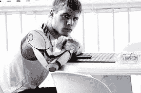

# 看看数字霸主:人工智能 vs 人类智能

> 原文：<https://medium.datadriveninvestor.com/behold-the-digital-overlords-artificial-intelligence-vs-human-intelligence-fddaa2a26a99?source=collection_archive---------8----------------------->

“photo of girl laying left hand on white digital robot” by [Andy Kelly](https://unsplash.com/@askkell?utm_source=medium&utm_medium=referral) on [Unsplash](https://unsplash.com?utm_source=medium&utm_medium=referral)

我喜欢思考很多关于未来的事情，很多时候当我这样做的时候，我会很兴奋。对我们生活中几乎一切皆有可能的时刻的想象创造了这种诱惑，让我 ***浑身发冷(*** LOL)。其他时候，我变得非常沮丧，担心人类的未来，担心我们是否还有一线希望。我很确定我不是唯一一个这样的人，我们很多人都很担心。但是我们应该这样吗？

读完这本书，*作者: [***雷·库兹韦尔***](https://en.wikipedia.org/wiki/Ray_Kurzweil) (你也应该读读)*我得出的结论是，未来如何发展，真的要由我们自己来决定。在他的书中，他描述了三大新兴科技领域，这些领域必将塑造我们的未来，带来新的生活和文化模式:**

*   **机器人:强人工智能**
*   **遗传学**
*   **纳米技术**

**我再来补充一个， ***弦理论*** 。信不信由你，这些是需要研究的主要领域。如果你的职业生涯现在不是以这些为中心，很快就会是了。我有一个律师朋友。她目前正在选修人工智能方面的课程。当我问为什么时，她说她想在 ***机器人法*** 中做一名前沿。她相信，我也相信，在不久的将来，机器将如此真实，你可以与它们产生共鸣，我们将不得不开始担心是否接受它们是人类。最终，就像所有其他产生解决方案的争议话题一样，我们将接受它们，人工智能驱动的机器也将拥有权利，就像我们一样。 ***机器人命关天！！！*****

**如果你不相信，可以在谷歌上搜索一下机器人索菲亚。**

**这些都是可怕的想法，尽管它们给我们带来了更美好、更繁荣的明天的希望。考虑到我们改进技术的指数速度，未来可能会有不同的发展方式:**

## **场景 1**

**现在是 2040 年，人类已经发现了人工智能(或者我们认为我们已经发现了)。机器在为我们工作。我们是神，他们是我们的奴隶，听命于我们。**

## **场景 2**

**现在是 2040 年，机器们发现他们并不真正需要我们，所以他们消灭了我们，或者找到了摆脱我们的方法。简而言之，他们赢了。想想电影**黑客帝国**。**

## **场景 3**

**我们已经找到了与机器共存的方法。我们尊重他们，他们也尊重我们。事实上，我们的共存是在生物层面上，我们自己是部分机器，部分生物。这样，我们就拥有了超出我们想象的能力。谁知道呢，也许我会有一个仿生手臂，在我的大脑里有一个芯片来提升我的智力，我会开始以十倍于光速的速度处理信息。可能性是无限的。**

****

**Human + Machine. This is what I’m talking about. Image taken from [here](https://suxc75rb44-flywheel.netdna-ssl.com/wp-content/uploads/2017/03/teens-629046_1280.jpg).**

**我想我最喜欢这个场景。**

**在场景 3 中，我们没有和机器作战。我所要做的就是想出一些东西，然后它就完成了，传送被解决了，我们可以像在城市间旅行一样进入第 4、5 和 6 维。我们想活多久就能活多久。我们终于明白弦理论了。我们已经找到了一种在质子和电子中编码二进制数字的方法，现在所有的东西(包括你和你街道角落里的那块丑陋的石头)都是一台计算机。**

**在场景 3 中，我们将我们已经很高水平的思维、推理和直觉与机器的高速计算能力相结合。我们不是假人，事实上，人类是最聪明的生物形式。我们处于所有生物食物链的顶端，我们让地球存活了这么久。然而，为了适应许多人认为是厄运的未来，我们必须提高我们的能力。**

**可悲的是:没有人在为未来做准备。我们都只是说说而已。**

**我们可能会对这一宏伟的未来感到困惑或兴奋，但为了保持与社会的相关性并活着，我们必须为此做好准备(无论是个人还是集体)。**

*****长话短说，我们得做好准备！！！*****

**谢谢你。**