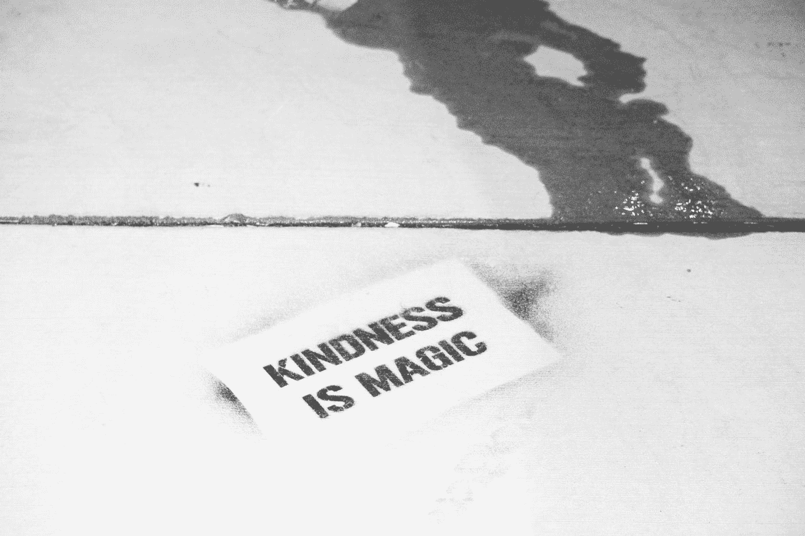

# 真实和善良展现真实的你

> 原文：<https://medium.datadriveninvestor.com/being-authentic-and-kind-reveals-the-real-you-753f1e04510b?source=collection_archive---------6----------------------->

## 表现自然会给个人和职业带来巨大的回报

Photo by [Robert Baker](https://unsplash.com/@vegasphotog?utm_source=medium&utm_medium=referral) on [Unsplash](https://unsplash.com?utm_source=medium&utm_medium=referral)

真实性和善良是[Cherylyn“Cj”Jones](https://twitter.com/CjPhx)的商标，在专业和个人方面都派上了用场。

作为 [SiteLock](https://www.sitelock.com/) 的内部社交媒体专家，她在 [GoDaddy](https://en.wikipedia.org/wiki/GoDaddy) 的社交媒体团队工作了七年多。琼斯是一个获奖的播客和前“妈妈博客”

她与销售和营销专家 Aaron Kilby 谈论了她对所有与社交媒体相关的事情的热爱如何让她参与进来，并乐于帮助他人实现他们的在线目标。

真实和善良是社交媒体的重要组成部分，这是大多数人在互联网上了解你的方式。第一，要真实。任何行为最终都会出来。如果你是一个好人，善良会显露出来。

 [## 跑步摆脱疯狂:锻炼如何提高你的生产力——数据驱动型投资者

### 没有比锻炼更好的方式来开始一天的工作了。我试着一周至少做四天，在…

www.datadriveninvestor.com](https://www.datadriveninvestor.com/2018/10/23/running-to-get-rid-of-the-crazy-how-working-out-increases-your-productivity/) 

琼斯说:“我必须通过社交网络进行交流，同时告诉人们我是谁，我在乎他们。”。“没有实体队列并不总是容易做到的。

“如果我与客户或有影响力的人交流，我需要他们知道他们对我很重要，”她说。

真实需要最少的工作和思考。如果你很懒，真实才是正确的选择。

琼斯说:“保持真实是一项挑战，因为你仍然需要一个过滤器——这取决于你是谁。”。“作为一个给妈妈们提建议的博客写手，我有点保守。

“然而，做我自己更容易，需要更少的过滤，而且——老实说——更可信，”她说。“当你对自己真实时，你的工作、交流和整体幸福感会更健康、更快乐。人们能够也将会注意到这种差异。”

# 当心 TMI

在社交媒体上分享很好。然而，过多的信息要么可以建立深厚的关系，要么适得其反。

“你必须知道你站在哪一边，这取决于你在和谁说话，”琼斯说。“我在 GoDaddy 工作时，我的绰号是‘过度分享’我是个话匣子。"

同理心极大地有助于在线或离线交流。

“当以任何方式与人合作时，同理心可以帮助你更好地沟通，”琼斯说。“它给每一次谈话都带来了理解和关怀。只要记住，你救不了所有人。”

 [## 卓越的客户体验始于快速轻松的微笑

### 成功来自人性和科技的完美结合

medium.datadriveninvestor.com](/great-customer-experience-begins-with-a-quick-and-easy-smile-2d8fe7640796) 

如果你掌握了你说话的方式，你的激情就会迸发出来，这有助于客户在你与他们交谈时放松和倾听。

“顾客总是需要被倾听，”琼斯说。“实践体贴的善意会立即有所帮助。如果你开始任何交流时，记得要友善、社交或其他方式，你会处于一个更好的倾听和帮助的位置。”

代表一个品牌，你应该已经进入了基于共同愿景和目标的安排。这使得真实性成为一种自然状态，而不是一场化妆舞会。

琼斯说:“了解你的业务所传达的信息很重要。“那就用你自己的话来说。我也相信签上我自己的名字，即使我代表公司——总是为我所说的话负责。

“我既代表公司也以个人名义参与社交活动，”她说。“绝对是。”

# 说话有关联

当你对不同的听众讲话时，调整你的演讲来说“他们的语言”那不会改变你是谁或者你说了什么。你用他们能理解的方式真实地表达了自己。

“我愿意认为我在任何时候都是真实的自己，”琼斯说。“我不会为不同的人改变它，除非我亲自了解他们。这又回到了善良和以同样的尊重对待每一个人。我就是这么做的。”

挑战在于当你遇到不开心的时候也开心的人。

“这对每个人来说都是一场斗争，”琼斯说。“消极有时是最大的敌人。你只要尽最大努力继续向上看。”

 [## 掌握生产力可以缓解焦虑

### 一致性是成功在线互动的关键

medium.datadriveninvestor.com](/mastering-productivity-eases-anxiety-97bb78e776fa) 

没有规定你必须回应社交媒体上对你生气的人。作为一个热爱社会秩序的人，让你的蟋蟀为你说话吧。

“总会有巨魔，”琼斯说。“然而，重要的是要知道，仅仅因为有人生气，并不意味着他们是在钓鱼。我不会回应威胁或人身攻击。我以尽可能多的理解和同情来回应愤怒。

她说:“让人们知道他们被倾听，他们的沮丧被理解，这有助于解决问题。”。“就像和他们通电话一样，有些人在社交媒体上‘大喊大叫’。在解决问题之前，听听他们的意见是没问题的。”

让你无法控制的情况或负面媒体顺其自然。成为真实和善良的绿洲并不是一件坏事。

“这可能会让人望而生畏，”琼斯说。“有时候你可以走开，但当这是你的工作时，并不总是可能的。

“永远把注意力放在对话另一方的真实人物身上，”她说。"如果有必要，在发送之前，大声朗读你的回复三到四遍."

**关于作者**

吉姆·卡扎曼是拉戈金融服务公司的经理，曾在空军和联邦政府的公共事务部门工作。你可以在[推特](https://twitter.com/JKatzaman)、[脸书](https://www.facebook.com/jim.katzaman)和[领英](https://www.linkedin.com/in/jim-katzaman-33641b21/)上和他联系。