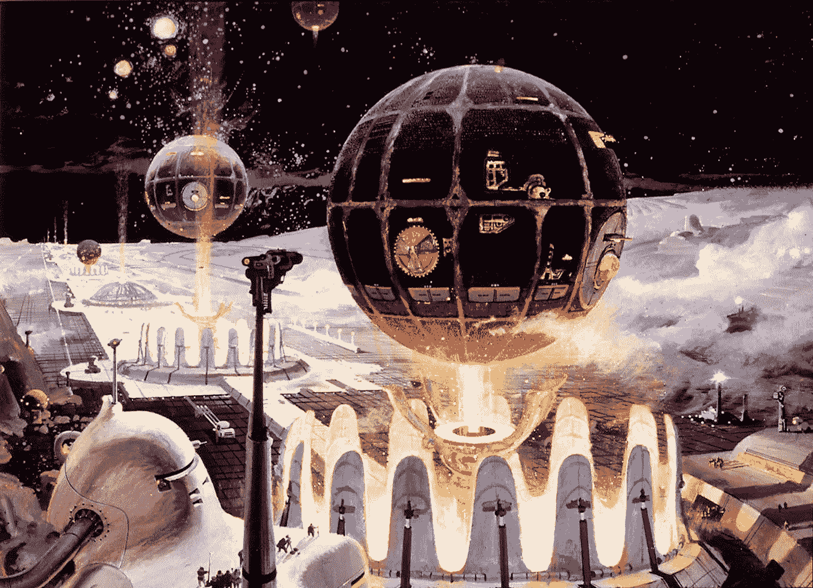
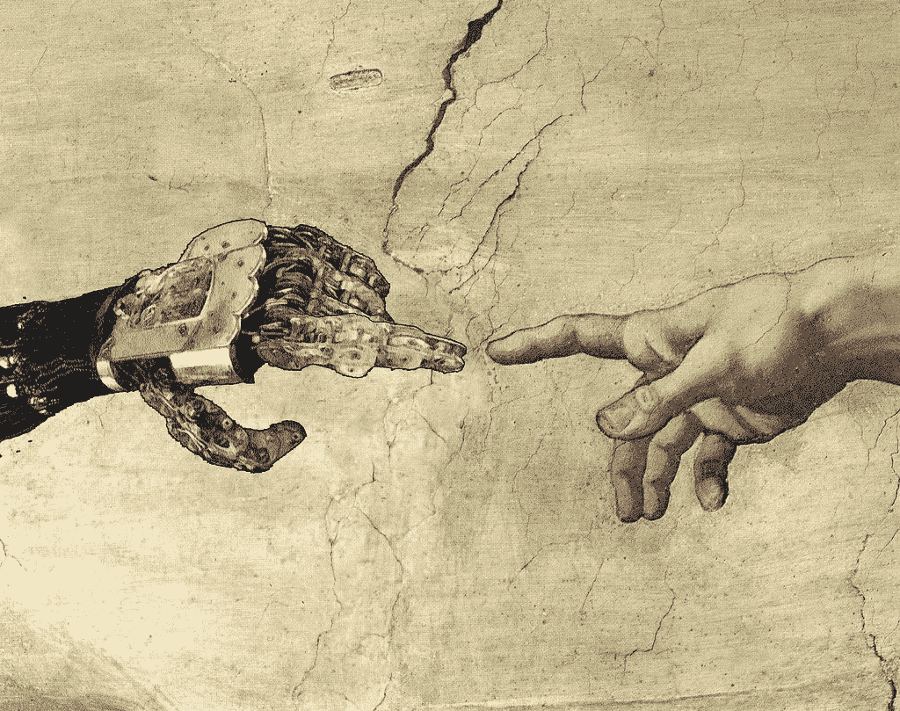

# 在后人类世界做人类

> 原文：<https://medium.datadriveninvestor.com/being-human-in-a-post-human-world-928f240d2b6?source=collection_archive---------0----------------------->

[Starships, Robert McCall](https://www.mccallstudios.com/cosmic-horizons/)

*Ps:也来看看我更新的文章:* [*AI 与机器:新时代*](https://dematerialzd.substack.com/p/man-and-machine-a-new-era)

在过去几十年被称为“第四次工业革命”的全面技术变革中，围绕人工智能(AI)的[炒作](https://www.gartner.com/smarterwithgartner/top-trends-in-the-gartner-hype-cycle-for-emerging-technologies-2017/)达到了[新高度](https://www.bloomberg.com/news/articles/2018-01-25/artificial-intelligence-nears-the-summit-of-hype-in-davos?mc_cid=55761e4545&mc_eid=10fa1c177b)。虽然有些人看到了未来的巨大机遇，但其他人，如斯蒂芬·霍金斯、比尔·盖茨、彼得·泰尔和埃隆·马斯克警告说，未来人工智能将占据上风，使人类陷入与机器的无望竞争中。毫不奇怪，关于技术导致普遍失业的说法——约翰·梅纳德·凯恩斯[称之为](https://assets.aspeninstitute.org/content/uploads/files/content/upload/Intro_Session1.pdf) it 技术失业——再次出现。历史学家、《德乌斯人:明日简史》的作者尤瓦尔·诺亚·哈拉里甚至预见了一个新的“无用阶级”，由“不仅失业，而且无法就业的人”组成。

Elon Musk calls AI “biggest existential threat”. Source: CNBC

与此同时，[有些人在寻找一线希望:纵观历史，构造技术的进步单方面表明，人类社会惊人地善于适应。当原始的肌肉力量被牛、驴和马取代时，我们的灵活性变得重要起来。在先进的生产机器发明之后，我们的智力使我们保持了相关性。在](http://time.com/4940374/joe-kaeser-siemens-robots-jobs/)[通用](http://www.oecd.org/employment/emp/Policy%20brief%20-%20Automation%20and%20Independent%20Work%20in%20a%20Digital%20Economy.pdf)、[旧岗位被新岗位](https://www.mckinsey.com/global-themes/future-of-organizations-and-work/five-lessons-from-history-on-ai-automation-and-employment)取代。因此，普遍失业只不过是一种虚构吗？

随着人工智能越来越边缘化我们的智力，哈拉里和许多其他人认为，这次可能会有所不同。他们描绘了一幅令人不寒而栗的工作场所画面，其特点是人与机器之间无情的竞争。我认为这种说法是有缺陷的，因为它假设人类的认知继续由与机器相同的认知维度来衡量，从而影响我们如何设计我们的工作和工作场所。

因此，这篇文章呼吁对人工智能驱动的未来工作进行不同的叙述。在接下来的文章中，我认为我们需要退后一步，认识到我们作为社会和情感存在的与生俱来的独特人类能力的潜力。我想展示的是，这将让我们重新思考我们与机器和工作的关系，走向一个人类在与智能机器的合作、共生关系中表现出色的未来，智能机器不会取代我们，而是补充我们的能力，反之亦然。这反过来不仅会使我们在经济上不可或缺，还会让我们的工作充满目标，这样我们就不再把工作当作达到目的的手段，而是把它本身当作目的。我相信，这种新的叙事对于实现人工智能的长期机遇，造福个人、组织和我们人类至关重要。

# 我们大脑的自行车:重新思考我们与机器的关系

随着人工智能对我们工作的影响[上升](https://www.ijhrdppr.com/wp-content/uploads/2016/03/IJHRD-Vol-1-No-1-Final.pdf#page=111)，许多[预测](https://www.amazon.com/Homo-Deus-Brief-History-Tomorrow/dp/0062464310/ref=sr_1_1?ie=UTF8&qid=1522485005&sr=8-1&keywords=yuval+noah+harari)同样的[走向](https://www.theguardian.com/commentisfree/2018/jan/16/jobs-left-automation-power)[失业未来](https://www.theguardian.com/news/2018/jan/19/post-work-the-radical-idea-of-a-world-without-jobs)的轨迹将会继续。尽管在结构化和可预测的环境中[主要是](https://www.mckinsey.com/business-functions/digital-mckinsey/our-insights/where-machines-could-replace-humans-and-where-they-cant-yet)体力和低薪工作受到人工智能和[自动化](https://www.mckinsey.com/global-themes/digital-disruption/harnessing-automation-for-a-future-that-works)(约占美国总就业人数的一半)[的威胁，但更多的工作](https://www.sciencedirect.com/science/article/pii/S0040162516302244)将不可避免地[随之而来。](https://www.nytimes.com/2017/06/24/opinion/sunday/artificial-intelligence-economic-inequality.html)

“The intuitive mind is a sacred gift and the rational mind is a faithful servant. We have created a society that honours the servant and has forgotten the gift” – Albert Einstein

然而，这种预测假设人类和机器(即计算机)将继续在迄今为止相同的认知维度上竞争:理性、过程密集型、基于规则的思维。它进一步假设我们是通过理性思维来计算世界的生物，这种范式已经被现代经济学家所加强。我们把理性思维确立为我们的文化所“崇拜”的“[金牛犊](http://engl210-picetti.wikispaces.umb.edu/file/view/Lamott_Bird+by+Bird.pdf)，并宣称它是西方文明的伟大成就之一。“直觉思维是神圣的礼物，理性思维是忠实的仆人。我们创造了一个以仆人为荣而忘记礼物的社会，”[承认](https://ac.els-cdn.com/S0921800905000273/1-s2.0-S0921800905000273-main.pdf?_tid=dc7e1310-0385-11e8-8f3d-00000aab0f6b&acdnat=1517073590_3a59d1fe21f7e5641182dfae1f651563)阿尔伯特·爱因斯坦。因此，在寻求赋予人类认知能力的过程中，我们发明了机器来扩展这一忠实的仆人。史蒂夫·乔布斯将这些机器称为“大脑的自行车”，这是一个著名的说法，电脑是我们理性思维的强大延伸。

Steve Jobs and Bill Gates: Computers are “a bicycle for our minds” Source: [https://apc.io/about/](https://apc.io/about/)

尽管这是 37 年前人机关系的一个令人信服的类比，但计算机现在正处于使人类思维变得多余的边缘。以前被认为是延伸的东西现在变成了成本和效率因素的竞争。因此，只有当工人比机器便宜时，雇主才会雇佣他们。

然而，这些年来，我们没有意识到这种竞赛并没有收获人类智力的全部潜力。存储和分析数据，识别数据模式，尽可能快速有效地回忆和计算大量信息，在结构化环境中执行高度专业化和重复性的任务:机器效率和原始处理能力不是[使我们成为人类的原因](https://www.theguardian.com/technology/2016/jan/20/humans-machines-technology-digital-age)。相反，是我们对文化、价值观、道德、直觉、同理心、创造力和非理性的理解让我们成为如此美丽的生物，并帮助我们的物种茁壮成长。因此，尽管被描绘成理性思考者，我们——首先是——情感和社会动物。

认识到这一点有助于我们认识到，人类和机器根本不存在竞争。史蒂夫·乔布斯的比较意义重大，因为他描述了一种协作、互补和放大的人机关系。如今，人机合作已经越来越成功。例如，国际象棋大师和世界冠军加里·卡斯帕罗夫(Garry Kasparaov)，[声称](https://www.amazon.com/Shaping-Fourth-Industrial-Revolution-Schwab/dp/1944835148/ref=sr_1_2?s=books&ie=UTF8&qid=1522486209&sr=1-2&keywords=Shaping+the+Fourth+Industrial+Revolution)与计算机合作时会玩得更好。在西门子的工厂里，人类已经和智能机器一起工作——麦肯锡公司认为这是未来发展的关键。菲利普·特伊森教授，科幻小说研究者，苏黎世大学德语系系主任，说人类和机器的融合将最终使我们完整，因为它可以平衡我们的情感思维。

因此，想象一下工作的未来，我认为我们反击是不明智的。相反，我们需要重新学习变得更有人情味。为此，创造允许人类和机器这种微妙互动的就业机会——充分利用我们人类的潜力——将是绝对必要的。

# 人类的工作:反思我们的工作

低收入工作自动化的预测速度将不可避免地迫使我们在更广阔的背景下思考工作的作用。如果我们认识到人类和机器智能之间的上述差异以及由此产生的相互协作、完善和扩大的潜力，我相信社会的很大一部分可以重新获得从事有意义工作的机会。

德国哲学家康德声称，我们的存在本身就是目的，他说:“把人类……当作目的，而不仅仅是手段”。这就提出了一个问题，工作占了我们生活的很大一部分，它本身是否也是目的。然而，到目前为止，“所有的 T2 文化都认为工作是达到目的的手段，而不是目的本身”，因为工作是生存的必要手段。

A post-work world. Source: The Guardian

然而，智能机器可能会变得强大，足以提供许多(如果不是所有)生存所需的资源。不可避免的是，我们今天所知道的为我们提供生存手段的工作[将逐渐不复存在](http://www.nytimes.com/2013/02/24/opinion/sunday/douthat-a-world-without-work.html)。我们会因此成为一个以电脑为新奴隶的“[后工作](https://www.theguardian.com/news/2018/jan/19/post-work-the-radical-idea-of-a-world-without-jobs)”世界的“新”雅典人吗？恰恰相反:可以说，这个后工作世界将提供一个机会来重新思考我们的工作场所，以创造新的活动形式，利用我们内在能力的真正潜力。这在细节上是如何实现的？

# 未来顾问的工作:一个例子

让我们以管理顾问的未来工作为例，从“思考”、“行动”和“感知”三个不同的角度来看。

过去，咨询顾问投入“思考”的大部分内容都围绕着分析数据、构建数据驱动的模型、构建信息、开展研究、获取知识以及协调管理任务。现在，这大部分都是由一个私人助理佛罗多，一个智能机器来完成的。他能说并理解笑话——不是因为他理解幽默，而是因为他知道这些笑话很有趣。像其他智能机器人一样，佛罗多从不疲倦，对认可、悲伤或快乐都漠不关心。此外，像所有的机器一样，他坚持明确的规则:机器智能的“[宣言](https://hbr.org/2018/01/is-murder-by-machine-learning-the-new-death-by-powerpoint)”，正如它被称为机器的内部行为准则。那么，咨询师还在做什么？

Could this be Frodo? Photo by [Franck Veschi](https://unsplash.com/@franckveschi?utm_source=medium&utm_medium=referral)

他们把他们的思维投入到制定战略、解决问题、决策和创造性工作中。幸运的是，我们非理性思考的能力让我们人类在创造力上占有优势。它允许我们参与熊彼特所说的“[创造性破坏](http://www.institutomillenium.org.br/wp-content/uploads/2013/01/Capitalismo-socialismo-e-democracia-Joseph-A.-Schumpeter.pdf)”——这是创造性过程的一个关键因素。一般来说，他们处理不确定、复杂和模糊的[事物](https://www.mckinsey.com/business-functions/digital-mckinsey/our-insights/where-machines-could-replace-humans-and-where-they-cant-yet)，需要[直觉判断](http://www.oxfordleadership.com/wp-content/uploads/2016/08/ol-intuitive-intelligence.pdf)以及情感和情境意识。通过所谓的“神经链接”从他们的大脑到云的连接允许他们立即访问所有相关的上下文信息，以进行这些判断。之后，他们再次断开连接——这实际上解放了他们的思想——佛罗多记录并存档了结果。此外，在决定时，他们通常也会咨询佛罗多。他可以根据海量数据给我不偏不倚的建议，用概率预测他们决策的后果。当他熟悉他们的思维方式时，他提醒他们一路上的偏见和逻辑谬误。这可能是有用的；但是特别是当决定涉及到人们的时候，许多人会听从他们的直觉。

在工作中，咨询师大约有 70%的时间花在“表演”上。具体来说，他们与同事合作，与客户打交道，进行一对一的对话并提供反馈。由于我们人类对有希望的想法或新出现的问题有直觉，即使它们一开始看起来可能不合理，我们人类合作的很大一部分围绕着发现和培养这些想法。在会议中(是的，它们仍然存在)，智能机器客观地评估过去的问题，并提供简短的简报，让每个人都在同一页面上。这种基于各种数据点的理性评估，通常有助于避免受到我们个人价值观或观点影响的激烈讨论。

第三个角度是“感知”，即感同身受和富有同情心——这是我们最重要的先天能力之一。为了进一步加强这一点，“神经链接”允许员工连接彼此的大脑，并观察彼此思想的未经过滤的印象——这是理性机器无法理解的。它让他们能够更有效地沟通，因为它防止了将思想转化为语言时发生的信息丢失。此外，智能镜片会评估同事遇到的人的面部表情，以识别情绪和预期行为。佛罗多拒绝这一切——事实上，他根本不理解感情。

最重要的是，该公司和我们社会中的大多数人现在都有了有目的的工作，充满了协作和社交活动以及令人振奋的成就。曾经从事重复和没有灵魂的职业的人们现在在他们的社区中的社会和慈善事业中茁壮成长，这需要大量的人性。最终，我们不是为了生存而工作，而是为了工作而存在。类似于我们的存在，我们的工作最终成为目的本身，让我们再次成为人类。

# 迈向新世界的新叙事

The new narrative: Machines complete humans and vice versa. Source: [*http://engineering.nyu.edu/events/2012/11/07/co-evolution-humans-and-machines*](http://engineering.nyu.edu/events/2012/11/07/co-evolution-humans-and-machines)

通过预测水晶球来预测这个尚不明朗的未来是没有多大用处的。相反，我们需要开始有意识地创造它。经济学家称之为[路径依赖](http://ecsocman.hse.ru/data/018/784/1216/0770book.pdf):结果将取决于我们选择的路径。因此，我们需要一种[的新叙事](https://www.weforum.org/events/world-economic-forum-annual-meeting-2018/sessions/a0Wb000000AlN2bEAF)，将我们的关注点从扩展转移到人类先天能力的互补和放大，从竞争转移到合作，从工作作为手段转移到工作本身作为目的。我们需要重新思考教育、工作场所、收入和财富分配，并就什么能真正为我们的社会创造价值展开辩论。

在第一次工业革命期间，我们开始创造专业化的重复性工作，旨在提高机器效率。展望未来，我们只有通过创造建立在我们先天的、独特的能力上的工作才能成功，这些能力是通过三百万年的进化形成的。如果我们做到了，未来的工作场所和组织可能会在有目的的人与人的关系和人与机器的合作中蓬勃发展，将我们独特的能力、[如](http://www.oxfordleadership.com/wp-content/uploads/2016/08/ol-intuitive-intelligence.pdf)直觉、情商和同理心、创造力和上下文意识与理性的机器智能结合起来。通过与机器不同，我们将获得可持续的优势，并扩大每个人的蛋糕——机器*和*人类。

# 来源

培根，B. (2013 年)。领导力中的直觉智慧。*管理服务*，57(3)，26–29。检索自[http://www . Oxford leadership . com/WP-content/uploads/2016/08/ol-intuitive-intelligence . pdf](http://www.oxfordleadership.com/wp-content/uploads/2016/08/ol-intuitive-intelligence.pdf)

a .贝克特(2018 年 1 月 19 日)。后工作:一个没有工作的世界的激进想法。*守护者。*检索自[https://www . the guardian . com/news/2018/Jan/19/post-work-the-radical-idea of-a world-without jobs](https://www.theguardian.com/news/2018/jan/19/post-work-the-radical-idea-of-a-world-without-jobs)

新泽西州比尔顿(2014 年 11 月 5 日)。人工智能是一种威胁。《纽约时报》。检索自[https://www . nytimes . com/2014/11/06/fashion/artificial-intelligence-as-a-threat . html](https://www.nytimes.com/2014/11/06/fashion/artificial-intelligence-as-a-threat.html)

队长，S. (2017 年 7 月 8 日)。这个 AI 工厂老板告诉机器人和人类如何合作。*快公司。检索自[https://www . fast company . com/3067414/robo-foreman-could-direct-human-and-robo-factory-workers-like](https://www.fastcompany.com/3067414/robo-foremen-could-direct-human-and-robot-factory-workers-alike)*

t . chat field(2016 年 1 月 20 日)。科技时代的人类意味着什么？*守护者。*检索自[https://www . the guardian . com/technology/2016/Jan/20/humans-machines-technology-digital-age](https://www.theguardian.com/technology/2016/jan/20/humans-machines-technology-digital-age)

Chui，m .，Manyika，j .，& Miremadi，M. (2016 年)。机器可以取代人类的地方——以及它们还不能取代人类的地方。*麦肯锡季刊，7* 。检索自[https://www . McKinsey . com/business-functions/digital-McKinsey/our-insights/where-machines-can-replace-human-and-where-they-they-can-not](https://www.mckinsey.com/business-functions/digital-mckinsey/our-insights/where-machines-could-replace-humans-and-where-they-cant-yet)

大卫·h .(2015)。为什么还有这么多工作？工作场所自动化的历史和未来。*经济透视杂志*，29(3)，3–30。从 https://pubs.aeaweb.org/doi/pdf/10.1257%2Fjep.29.3.3[取回](https://pubs.aeaweb.org/doi/pdf/10.1257%2Fjep.29.3.3)

戴维斯，S. (2014 年 12 月 2 日)。霍金对机器的崛起发出警告。*金融时报。*检索自[https://www . ft . com/content/9943 bee 8-7a 25-11e 4-8958-00144 FEA BDC 0](https://www.ft.com/content/9943bee8-7a25-11e4-8958-00144feabdc0)

迪特利，M. (2018 年 1 月 16 日)。机械之声。*共和国。*从[https://www.republik.ch/2018/01/16/aufstieg-der-maschinen](https://www.republik.ch/2018/01/16/aufstieg-der-maschinen)取回

杜瑟河(2013 年 2 月 23 日)。一个没有工作的世界。《纽约时报》。检索自[http://www . nytimes . com/2013/02/24/opinion/Sunday/doutha-a-world-without-work . html](http://www.nytimes.com/2013/02/24/opinion/sunday/douthat-a-world-without-work.html)

埃尔默-德威特出版社(2011 年 12 月 14 日)。史蒂夫·乔布斯把电脑当成大脑的自行车【视频文件】。从 https://www.youtube.com/watch?v=4x8wTj-n33A[取回](https://www.youtube.com/watch?v=4x8wTj-n33A)

菲舍蒂，M. (2011 年 11 月 1 日)。电脑对大脑。*科学美国人。*检索自[https://www . scientific American . com/article/computers-vs-brains/](https://www.scientificamerican.com/article/computers-vs-brains/)

福特，M. (2015)。机器人的崛起:技术和大规模失业的威胁。寰宇一家出版公司。

弗雷，剑桥大学，奥斯本，文学硕士(2017)。就业的未来:工作对计算机化有多敏感？。*技术预测和社会变革*，114，254–280。检索自[https://www . science direct . com/science/article/pii/s 0040162516302244](https://www.sciencedirect.com/science/article/pii/S0040162516302244)

格拉斯格，H. (2014 年 4 月 27 日)。机器人在我们下面。*新苏黎世报。*检索自[https://www . nzz . ch/wissenschaft/technik/roboter-unter-uns-1.18291235](https://www.nzz.ch/wissenschaft/technik/roboter-unter-uns-1.18291235)

纽约州哈拉里市(2017 年 5 月 8 日)。没有工作的世界里生活的意义。*卫报。*检索自[https://www . the guardian . com/technology/2017/may/08/virtual-reality-religion-robots-sapiens-book #评论](https://www.theguardian.com/technology/2017/may/08/virtual-reality-religion-robots-sapiens-book#comments)

j .哈里斯(2018 年 1 月 16 日)。当工作岗位在新世界枯竭时会发生什么？左派肯定有答案。*守护者。*检索自[https://www . the guardian . com/commentis free/2018/Jan/16/jobs-left-automation-power](https://www.theguardian.com/commentisfree/2018/jan/16/jobs-left-automation-power)

Kaeser，J. (2017 年 9 月 14 日)。为什么机器人会改善制造业的工作。*时间。*从[http://time.com/4940374/joe-kaeser-siemens-robots-jobs/](http://time.com/4940374/joe-kaeser-siemens-robots-jobs/)取回

j . Kahn(2018 年 1 月 25 日)。人工智能在达沃斯接近炒作的顶峰。*彭博。*摘自[https://www . Bloomberg . com/news/articles/2018-01-25/artificial-intelligence-nears-the-summit-of-hype-in-Davos？MC _ cid = 55761 e 4545&MC _ Eid = 10 fa1c 177 b](https://www.bloomberg.com/news/articles/2018-01-25/artificial-intelligence-nears-the-summit-of-hype-in-davos?mc_cid=55761e4545&mc_eid=10fa1c177b)

康德，我。(1972 年)。*道德形而上学的奠基*。哈钦森大学图书馆。检索自[http://www . math . snu . AC . kr/~ hi choi/info math/Articles/(Kant)% 20g round work % 20 for % 20 the % 20 metaphic % 20 of % 20 morals . pdf](http://www.math.snu.ac.kr/~hichoi/infomath/Articles/(Kant)%20Groundwork%20for%20the%20Metaphysic%20of%20Morals.pdf)

拉莫特(2007 年)。*一鸟接一鸟:关于写作和生活的一些指示*。锚。

李，K. (2017 年 6 月 24 日)。人工智能的真正威胁。《纽约时报》。检索自[https://www . nytimes . com/2017/06/24/opinion/Sunday/人工智能-经济-不平等. html](https://www.nytimes.com/2017/06/24/opinion/sunday/artificial-intelligence-economic-inequality.html)

Levy，f .和 Murnane，R. J. (2005 年)。新的劳动分工:计算机如何创造下一个就业市场。普林斯顿大学出版社。

s . j . liebowitz 和 s . e . Margolis(1995 年)。路径依赖、锁定和历史。JL 经济学院。&组织。，11205。从 http://ecsocman.hse.ru/data/018/784/1216/0770book.pdf[取回](http://ecsocman.hse.ru/data/018/784/1216/0770book.pdf)

Lund，s .和 Manyika，J. (2017 年 11 月)。人工智能、自动化和就业的五个历史教训。*麦肯锡&公司。*检索自[https://www . McKinsey . com/global-themes/future-of-organizations-and-work/five-lessons-from-history-on-ai-automation-and-employment](https://www.mckinsey.com/global-themes/future-of-organizations-and-work/five-lessons-from-history-on-ai-automation-and-employment)

马尼伊卡，j .，楚，m .，米莱马迪，m .，布欣，j .，乔治，k .，威尔莫特，p .，杜赫斯特，M. (2017)。可行的未来:自动化、就业和生产率。纽约，麦肯锡全球研究所。检索自[https://www . McKinsey . com/global-themes/digital-disruption/harling-automation-for-a-future-the-works](https://www.mckinsey.com/global-themes/digital-disruption/harnessing-automation-for-a-future-that-works)

马克斯-尼夫，文学硕士(2005 年)。跨学科基础。*生态经济学*，53(1)，5–16。检索自[https://AC . els-cdn . com/s 0921800905000273/1-s 2.0-s 0921800905000273-main . pdf？_ tid = dc7e 1310-0385-11e 8-8f3d-00000 aab 0 f 6 b&acdnat = 1517073590 _ 3a 59 D1 Fe 21 f 7 e 5641182 dfae 1 f 651563](https://ac.els-cdn.com/S0921800905000273/1-s2.0-S0921800905000273-main.pdf?_tid=dc7e1310-0385-11e8-8f3d-00000aab0f6b&acdnat=1517073590_3a59d1fe21f7e5641182dfae1f651563)

经合组织。(2016 年 5 月)。数字经济中的自动化和独立工作。关于未来工作的政策简报。检索自[http://www . OECD . org/employment/EMP/Policy % 20 brief % 20-% 20 automation % 20 and % 20 independent % 20 work % 20 in % 20a % 20 digital % 20 economy . pdf](http://www.oecd.org/employment/emp/Policy%20brief%20-%20Automation%20and%20Independent%20Work%20in%20a%20Digital%20Economy.pdf)

罗林森，K. (2015 年 1 月 29 日)。微软的比尔·盖茨坚持认为人工智能是一种威胁。英国广播公司新闻。从[http://www.bbc.com/news/31047780](http://www.bbc.com/news/31047780)取回

里夫金，J. (2004 年)。*工作结束。全球劳动力的减少和后市场时代的到来。纽约塔彻/企鹅出版社，2004 年。*

m .施拉格(2018 年 1 月 23 日)。“被机器学习谋杀”是新的“被 PowerPoint 杀死”吗？哈佛商业评论。检索自[https://HBR . org/2018/01/is-murder-by-machine-learning-the-new-death-by-PowerPoint](https://hbr.org/2018/01/is-murder-by-machine-learning-the-new-death-by-powerpoint)

熊彼特，J. (1942)。创造性破坏。*资本主义、社会主义和民主*，825 页。

施瓦布，K. (2016)。*第四次工业革命*。皇冠商务。纽约。

施瓦布，K. (2018)。*塑造第四次工业革命。世界经济论坛。瑞士。*

西蒙，H. A. (1955)。理性选择的行为模型。*《经济学季刊*》，69(1)，99–118 页。

斯金纳，B. (2017 年 11 月 19 日)。“我们要升级了”。 *SonntagsZeitung。*从[https://desktop.12app.ch/articles/30245364](https://desktop.12app.ch/articles/30245364)取回

WEF。(2018 年 1 月 23 日)。经济叙事的力量。检索自[https://www . we forum . org/events/world-economic-forum-annual-meeting-2018/sessions/a0wb 00000 AlN 2 beaf](https://www.weforum.org/events/world-economic-forum-annual-meeting-2018/sessions/a0Wb000000AlN2bEAF)