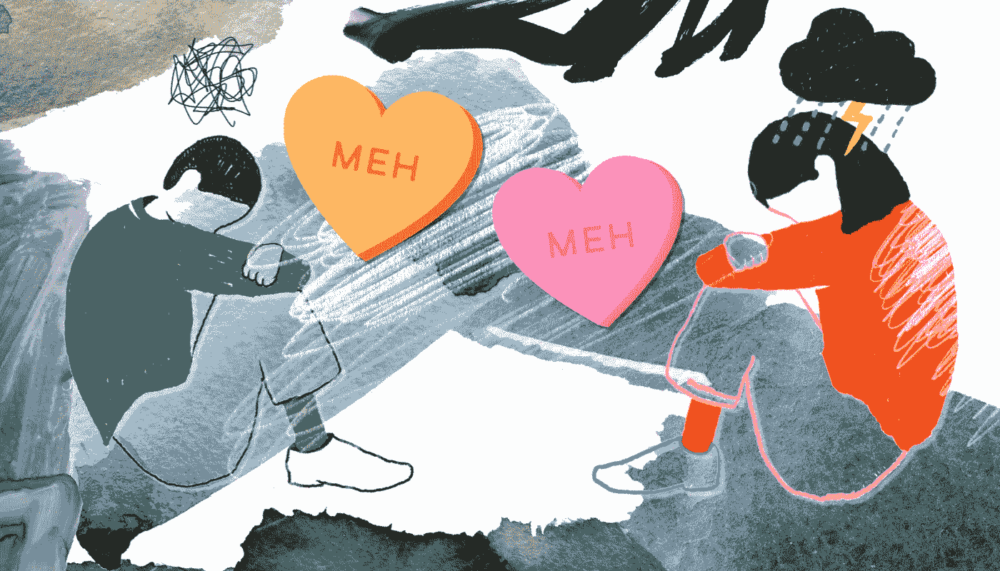

# 一份糟糕的工作就像一段糟糕的感情

> 原文：<https://medium.datadriveninvestor.com/being-in-a-bad-job-is-like-being-in-a-bad-relationship-a6c857400727?source=collection_archive---------6----------------------->

Graphic by Liv Wu

关于这份工作的好与坏，争论不休。你应该留下还是离开？你觉得爱已经不在了，激情已经褪去，你暗自怀疑这有点像虐待关系。

除了如果你错了，如果只是一个坏补丁呢？也许你做这份工作的时间还不够长。也许事情看起来不太对劲，而且可能会有所改善(但是如果事情永远不会改善呢？)也许是你；因为过一段时间后，你过去的每一份工作都开始与这份工作相似。

 [## 为你的职业生涯提供机器人保护——数据驱动型投资者

### 随着生产率的提高和巨大的利润，企业转向自动化来简化他们的…

www.datadriveninvestor.com](https://www.datadriveninvestor.com/2018/11/20/robot-proofing-your-career/) 

如果只有你一个人呢。如果外面没有更好的工作怎么办，毕竟这份工作有牙科福利。这不是报酬最高的工作，但(在某种程度上)稳定，报酬也不错。

因此，当你早上醒来，想到要去工作时，你会感到内心的恐惧。在上班的路上，你幻想去海滩度假，或者逃到世界上没有人认识你的未知地方。你叹了口气，浏览着无尽的快乐脸书和 Instagram 帖子，想知道，只有你是这样吗？*照片上的每个人看起来都很开心。*每个人，除了你身边的通勤者。他们也在看类似的快乐照片，和你一样有渴望的表情。

你用一个鬼脸亲吻你的工作说早上好。你打开电子邮件，它会提醒你在吵架时给伴侣发的短信。你要么愤怒地回应，要么沉默对待，然后向下滚动到下一条。之后你会看猫的视频，因为你能处理的挫折有限。你开始想知道，你们两个是怎么来的？

一开始，你认为这是你的幸福，你唯一的真爱。(或者你对之前不良关系的大逃亡。你俩终于找到了彼此，天造地设的一对！

你看到了对方的简介:HR 专业遇上 HR 业务，完美！

你们有了第一次约会，这是一个特殊的时刻，你们两人通过分享个人经历*(我每个月成功招聘 20 名员工)*、希望*(我们公司今年正在扩张)*和梦想*(我正在寻求职业发展/我们提供丰厚的薪酬)*联系在一起。

勾选所有复选框，签署婚前协议，你就正式了:*如果你没有通知就离开这段关系，你需要支付一个月的工资。你们俩都在网上宣布了你们的成功。*

成为正式员工后，你会被带着参观公寓*(这是咖啡机，这是你放东西的地方)*一切看起来都很棒。室内设计是时尚的，你的桌子是干净的，嘿，甚至有一个冷静的角落。

蜜月的第一个月。你原谅对方的缺点。你认为没有人是完美的，这只是一个古怪的性格特征。你忽略了你耳边低语的声音，也许橱柜里有一具尸体。

然后，当然，事情发生了变化。它变得占有你的时间，询问和跟踪你的一举一动。甚至记录你的击键——以防你用它的属性检查其他人。

它开始礼貌地告诉你，你的想法很愚蠢，你的表现没有达到预期。

它坚持给你发邮件，希望你尽快回复。

你们两个人最初共同的梦想看起来一点也不像现在正在发生的。

你看到这些缺陷永远无法改变，你开始怀疑自己是否会发疯。

你告诉你的朋友它对你做了什么，你的朋友摇摇头。即使是听说了你的故事的陌生人也会用同情的眼神看着你。

你不能离开，因为你的资产是共有的，而且你还有抵押贷款要还，还有很多人要养活。所以你继续你的日常工作，当你俩做爱时，试着不要觉得自己死了。

你不仅在橱柜里发现了一具尸体，还发现了一整支没死的军队。其他喜欢你的人，曾经以为那是他们唯一的真爱，结果却被奴役。你每天早上用一句毫无生气的“你好”来问候对方，痛苦地在空中挥舞着一杯咖啡，然后坐在你的生产工位上祈祷任何事情，一些事情发生，这样你就可以逃离这一切。

一天又一天过去了，这些想法不断在你的脑海中打转。你应该留下，你应该离开，如果，如果，如果…

你会让自己停留在一段糟糕的关系中吗？你会告诉你那些和混蛋约会的朋友再坚持一会儿吗，因为这在他们的约会记录上看起来更好？你会说服自己处于一段糟糕的关系中的经济利益是值得的吗？

如果我们在糟糕的关系中为自己辩护，为什么我们在糟糕的工作中不为自己辩护呢？为什么我们寻找方法和途径来证明我们接受现状，屈服于恐惧和怀疑，而不是投入时间和精力去寻找更好的选择？世上没有完美的工作，但总有工作让我们期待每一天，激励我们成为最好的自己。我们只需要相信我们值得拥有它。

**你**当之无愧。我配得上，也值得拥有。

> 永远记住，你比你相信的更勇敢，比你看起来的更坚强，比你想象的更聪明。—克里斯托弗·罗宾