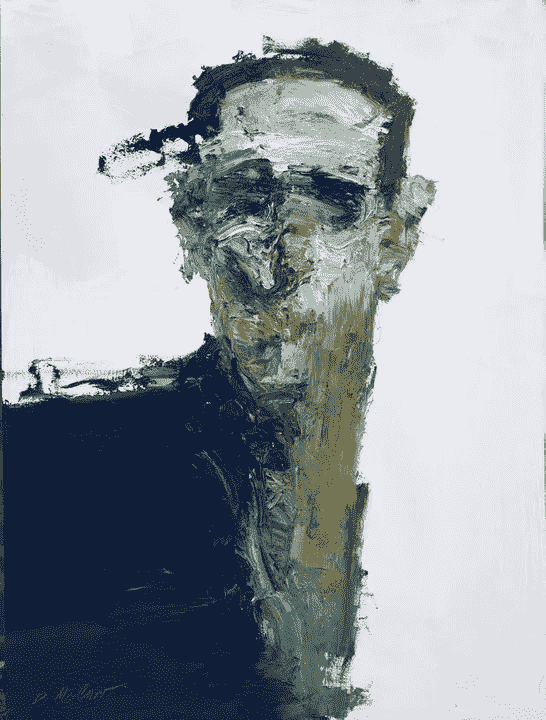
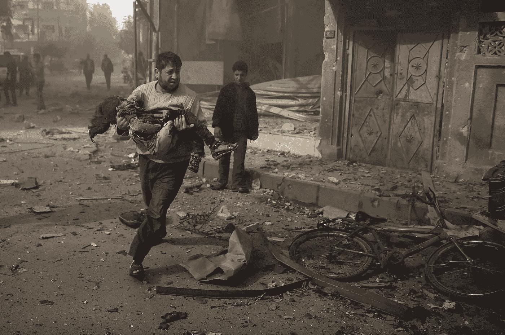

# 是正确的还是正确的？

> 原文：<https://medium.datadriveninvestor.com/being-right-or-correct-d7ed67e21d10?source=collection_archive---------8----------------------->

## “人权”是联合国严肃的议程吗？

人权以及现代其他人文主义成就被宣称为全球所接受，但事实是它们并没有付诸实践。Eric Posner 在 2014 年 12 月发表在《卫报》上的题为“反对人权的案例”的文章中，讨论了人权是否得到了实施，并提供了一些例子和事实，表明人类未能超越条约将人权确立为一个具有法律约束力的框架，以强制执行人权。

([https://www . the guardian . com/news/2014/dec/04/-sp-case-against-human-rights](https://www.theguardian.com/news/2014/dec/04/-sp-case-against-human-rights))

 [## 保护主义、政治和经济动荡|数据驱动的投资者

### 美国股市昨日出现 400 多点的大幅反转，为未来的事情发出了警告信号。市场…

www.datadriveninvestor.com](https://www.datadriveninvestor.com/2018/06/28/protectionism-politics-economic-turmoil/) 

我们应该怀疑人权的正当性吗？波斯纳文章中没有反映出来的其他原因有哪些？

Artwork by Dan McCaw

我认为，在不公正的全球秩序中，人权没有得到很好的落实，这是原因之一。人权基于一个非常基本的观点，即所有人，无论其出生地、国籍或宗教，都享有平等权利。只要看看世界上宏观层面的权力分配就知道了。所有的国家都有平等的权利吗？发达国家无法在国际一级接受和实践平等权利，这也损害了国家一级的有效性。独裁政权中的右翼极端分子经常将这种不公正的权力分配与那些主张人权的人联系起来，因为人权不是一个真正值得相信的概念，而是国际发达国家干预欠发达或发展中国家内政的政治工具。

看看美国、英国和法国在 2018 年 4 月对叙利亚的袭击，这是一个破坏明确国际法的例子，即未经现政府事先许可，任何国家土地上的任何外国军事行为都是战争行为。那么，为什么土耳其现在应该拒绝这样做呢？库尔德人作为在该地区生活了数千年的人，他们的权利被完全忽视，因为国家不遵守它们自己制定的规则。发达国家不受这些协议的约束，这无助于任何国际体系的可持续和建立。通常，这些行动中的许多都是极其小心地进行的，以确保政治/法律上的正确性。一些拥有核武器的国家不是《不扩散条约》的成员国，但它们反对将《不扩散条约》的成员国视为核威胁。事实上，他们**是正确的**，但他们**是不正确的**。未能区分这两者是人权没有变成严肃的国际服从的原因之一，它仍然只是停留在没有实际结果的智力姿态上，并作为发达国家向发展中国家施加压力以接受其要求的手段，这些要求通常是**经济专属特权**。美国作为自由民主的象征之一，只要符合其经济利益，与中东独裁者保持战略伙伴关系是没有问题的。

In another photograph from Douma by Bassam Khabieh, a man carries an injured girl as he rushes away from buildings hit by what activists said were airstrikes by forces loyal to Syria’s President Bashar al-Assad ([https://www.theguardian.com/artanddesign/gallery/2015/nov/14/the-20-photographs-of-the-week#img-11](https://www.theguardian.com/artanddesign/gallery/2015/nov/14/the-20-photographs-of-the-week#img-11))

但事实是，人权仍然是人类的成就之一，即使西方国家没有在国际层面上实践它。这同样适用于前现代人类在精神领域的智慧和成就。我们在建立和实践灵性智慧方面也失败了，但是他们没有错。它们是正确的，但是我们没有利用它们。答案是波斯纳是正确的，因为很明显，我们没能利用我们的成就，尽管我们需要找到根本原因。我认为，其中一个重要因素是政治领导人不相信这一点。同样需要解决环境危机的切实可行的办法。信仰来自社会，它依赖于社会对它的认知。因此，长期但正确的方法是提高社会意识，认识到接受在国际一级坚持人权的代价的重要性，这就是失去控制和与他人分享经济利益。各国自己不会这样做，国际体系也无法强制执行。但是社会能够做到这一点。如果“人权”是有价值的，我们应该接受支付它的费用。