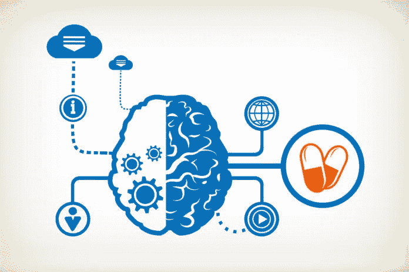

# 社交是一颗容易吞下的药丸

> 原文：<https://medium.datadriveninvestor.com/being-social-is-an-easy-pill-to-swallow-20a90514d3d7?source=collection_archive---------33----------------------->

## 没有衡量标准，很难评估医生和患者的进展

八月和社交媒体似乎不是一种健康的关系。然而，许多医生已经解决并克服了隐私和其他问题，以加强与患者和同行的联系。

十多年来，[Remo-Tito Aguilar](https://twitter.com/bonedoc)博士在博客上发表了关于改善医学教育、病人护理、可持续生态旅游、社会创新和社交媒体研究的文章。他是菲律宾棉兰老岛中南部的整形外科医生。

“考虑到社交媒体和其他在线工具出现在我们屏幕上的速度，十年是一个延伸，”他说。在他的社交同事中，他问他们从使用社交媒体中获得了什么。他们如何帮助人们，推进他们的事业，或许还能挣钱？

“定义任何领域的成功都不是一件容易的事情，”阿吉拉尔说。“衡量社交媒体等工具对成功的影响更加困难。然而，如果我们将成功定义为一个人或一个社会的明显变化，那么成功就是可以衡量的。”

他与其他医疗保健提供商讨论了社交媒体在医疗保健领域取得成功的动机。

“我意识到我的学生比我更懂技术，”[海伦·马丹巴博士](https://twitter.com/helenvmadamba)说。“他们告诉我，他们在路上用手机写博客。我都不知道有这种应用。你每天都能学到新东西。”

作为菲律宾的妇产科培训师和艾滋病倡导者，Madamba 使用社交媒体将人们与其他倡导者联系起来。

社交媒体使得医疗保健和其他问题的传播变得容易。这使得提供、支持和接受事实来对抗互联网上猖獗的投机行为变得至关重要。

“一些社交媒体帮助我联系到支持同样主张的人，”马丹巴说。“通过艾滋病宣传，我们通过脸书将学生领袖、教师艾滋病协调员和医院负责人联系在一起。我们成立了# teach Cebu——旨在提高宿务对艾滋病毒的认识和控制。

她说:“宿务的这群了不起的医科学生领袖正在努力提高人们对艾滋病毒的认识，减少对艾滋病毒携带者的羞辱和歧视。”“通过#TEACHCebu，每个医学院都为他们的学生组织了一个艾滋病毒论坛，并鼓励进行艾滋病毒筛查。”

# 前来救援

更值得注意的是，社交媒体在严峻的形势下大放异彩。

“我们用它来邀请和鼓励人们通过自愿献血来拯救生命——特别是拯救出血的母亲,”Madamba 说。

上网也以一种好的方式降低了压抑。

“许多人发现面对面交谈很困难，”马丹巴说。“社交媒体为他们提供了一个匿名平台来表达自己，并有助于心理健康。”

社交媒体也为 Iris Thiele Isip-Tan 博士提供了很大的专业帮助。她是菲律宾大学医学院的内分泌学家和临床副教授。

“我的脸书主页支持我的倡议，以提高内分泌疾病的健康素养，”谭说。“我用菲律宾语写作。我还在想如何衡量成功。

“上个月，我在推特上和某人谈论研究登革热疫苗的故事，”她说。“就在几天前，我收到一封电子邮件，要求我审查协议。这太令人兴奋了。”

谭特别感谢推特。

她说:“我开办了关于使用 Twitter 为医学教育工作者和医生建立个人学习网络的研讨会。“我在#HealthXPh Twitter 上聊天的经历绝对有帮助。

“我在 2015 年获得了一个教学奖，如果没有 Twitter 上一些乐于助人的人的指导，这是不可能的，”谭说。

# 学生互动

教室里也有更强的纽带。

“我仍然在摸索我作为一名职业学者的新工作——从我的卫生政策研究经验过渡，”[jai Fred f .“Jim”Lopez](https://twitter.com/jaifredlopez)博士说。“我知道社交媒体有助于教育。我用标签来展开讨论，我的学生很喜欢。”

洛佩兹在马尼拉菲律宾大学公共卫生学院教授流行病学。他也从事健康政策和管理方面的研究。

“我内心永远是一名研究者，”他说。“我有一种冲动，要把对研究的热情分享给后代，以及寻求推进公共卫生事业的中层管理人员。”

精神健康提出了一个不同的、微妙的领域来解决，这是 T4 的 Stephanie Eloisa D. Miaco 医生所熟知的。她是来自菲律宾杜马盖地市的精神病学家，倡导如何改善所有人的心理健康服务。

“心理健康及其相应的健康问题曾经是谈论的禁忌话题，”Miaco 说。“随着社交媒体用于加强宣传的出现，我接触过的学生在提出相关问题和提出影响深远的项目方面变得更加积极。

“通过社交媒体，我从心理健康领域的不同领导人那里学到了很多东西，”她说。“有自由互动。几年过去了，我仍然对一个人能在那里成长多少感到惊讶。”

使用社交媒体进行宣传的动机因职业而异。例如，[Aileen Dualan 博士](https://twitter.com/megamomph)在企业界担任 MSD 制药公司的亚太区医疗事务主管。

“社交媒体有着广泛而多样的影响力，”她说。“挑战在于达到正确的目标，并将信号从噪音中分离出来。

“我有能力测量某些参数，”杜亚兰说。“这是实时的，具有即时反馈和永久的足迹。最重要的是自我发现和提高。我记得我开始写博客的时候。我改变了很多，希望从那以后变得更好。”

# 一生的旅程

阿吉拉尔在社交媒体上的探索没有目标。

“社交媒体宣传的持续成功与内在动机和深度参与有关，”他说。“我的个人目标是:终身学习。

阿吉拉尔说:“社会压力和使用社交媒体的便利性有助于巩固我的动机，但这些不可能让我在社交媒体上坚持 10 年。”

不仅仅是社交方面，还有作为动力的影响力。

“社交媒体将不同大陆的人们拉近了距离，”洛佩兹说。“社交媒体让我有机会与世界各地有类似爱好的人进行讨论。令人瞠目结舌！”

谭在创建她的主页时面临着一个伦理困境，她在 TEDx 的一次演讲中讨论了这个问题。

“当每个人都有 Facebook Messenger 或 [Viber](https://www.viber.com/) 时，与人联系就变得容易多了，”马丹巴说。“这是进行在线对话以寻求支持和集思广益的好方法——无论您身在何处，无论是白天还是晚上。

她说:“我鼓励我的学生为他们的电子文件夹创建并个性化他们的博客，而不是在纸上写反思。”"我背上背着沉重的文书工作会轻松些."

如果你在社交媒体上活跃而可信，你就可以很容易地建立影响力。这给了你一个理想的位置去宣传你的信仰。

阿吉拉尔说:“我有一个个人动机——利用社交媒体进行宣传，作为我终身学习的一部分。”“为了同时指导和学习，我无法想象没有社交媒体的便利性的学习。”

Madamba 详细说明了她的社交媒体宣传基础知识:

*   放弃任何让你偏离目标的事情。
*   忠实于你的主张；说到做到。
*   C —检查您的状态。测量。评估。
*   D —不要注入消极；忽略反对者。
*   自我教育，终身学习。

“社交媒体可以让你增加自己的数量，并向任何愿意倾听的人传播你的关键信息，特别是那些需要听到特定信息的人，”马丹巴说。

“当你有一个倡议，你生活和呼吸它，把你的热情投入其中，”她说。“你最大限度地利用你的人脉，使用任何工具或途径来传播关键信息。社交媒体就是这样一种工具。这都是关于个人对个人和 T2 社区的，比如#HealthXPh 和#TEACHCebu

# 对事业的支持

Miaco 欢迎在线影响她的倡议。

她说:“对于重要和紧急的事业，尤其是涉及精神健康的事业，社交媒体的覆盖面最广，获得反馈的方式也最快。”。“许多人都是在线和有线的，并从中受益匪浅。

在她尝试性地开始她的主页的这些年里，谭已经找到了一个家。

“我一直在告诉人们，我是一名 Twitter 福音传播者，”她说。“我的个人学习网络就在那里。我的脸书·佩吉大约六岁了。我试着继续下去。当我不认识的人告诉我我帮助过他们时，我感到很温暖。”

同样，杜亚兰喜欢她结交的社交伙伴。

“我在虚拟世界中‘遇见’伟大的人，更快地找到志同道合的人，找到‘部落’，”她说。“像任何技术一样，社交媒体可能是一把双刃剑。人决定一切。如果我们选择用它来做好事，它就会变好。”

洛佩兹依靠优势进行研究。

他说:“上网可以让参与者立即查找任何事实。”“我鼓励我的学生在推特讨论中利用这一点。现在的孩子真幸运。

“问自己这样一个问题:‘你对什么如此有激情，以至于你想让全世界都知道？’洛佩兹说:“看看其他有类似热情的人在社交媒体上是怎么做的，然后跳起来。”一开始很难，但是值得。"

**关于作者**

吉姆·卡扎曼是拉戈金融服务公司的经理，曾在空军和联邦政府的公共事务部门工作。你可以在[推特](https://twitter.com/JKatzaman)、[脸书](https://www.facebook.com/jim.katzaman)和 [LinkedIn](https://www.linkedin.com/in/jim-katzaman-33641b21/) 上和他联系。

*原载于 2018 年 10 月 10 日*[*www.datadriveninvestor.com*](http://www.datadriveninvestor.com/2018/10/10/being-social-is-an-easy-pill-to-swallow/)*。*