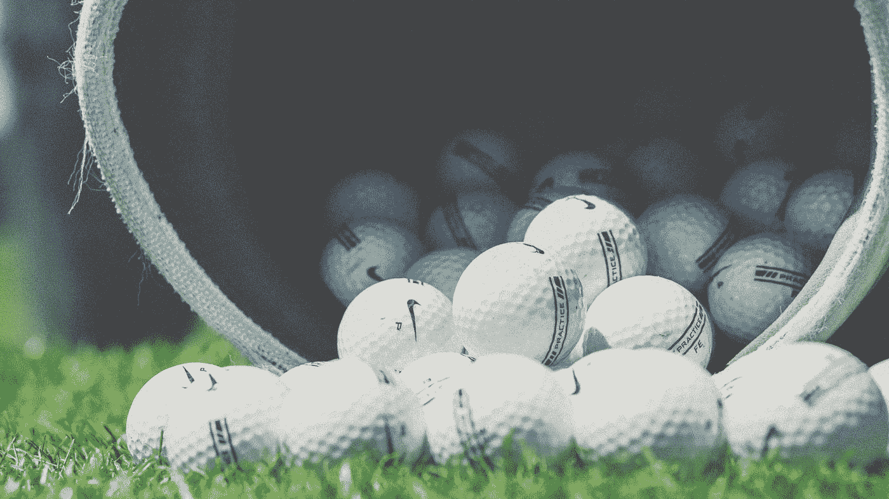
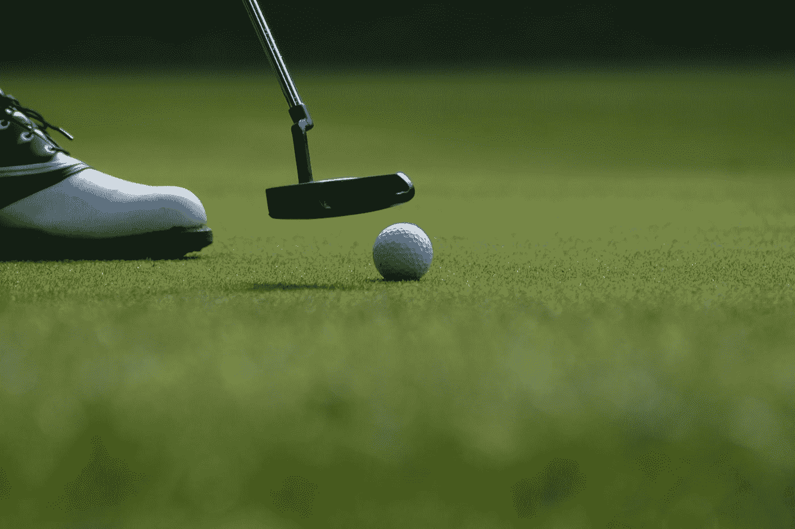
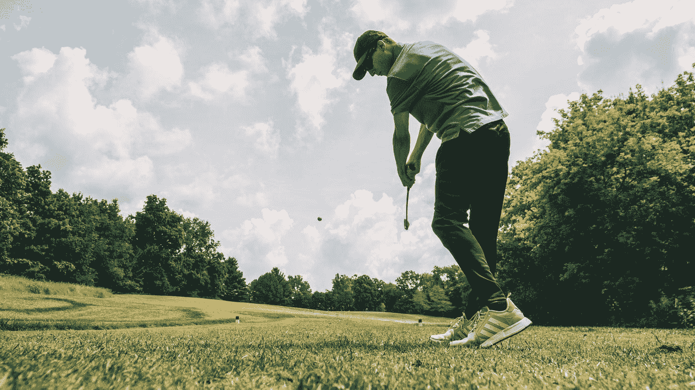

# 本·柯蒂斯——英国公开赛冠军的成功秘诀

> 原文：<https://medium.datadriveninvestor.com/ben-curtis-the-british-opens-secrets-c3ec081612a1?source=collection_archive---------12----------------------->

## 你从 PGA 高尔夫球手身上学到的个人成长

Photo by [Christoph Keil](https://unsplash.com/@t0phu?utm_source=medium&utm_medium=referral) on [Unsplash](https://unsplash.com?utm_source=medium&utm_medium=referral)

作为职业运动员，我喜欢做一个失败者。我想知道本·柯蒂斯是否也知道。证明反对者是错误的是乐趣的一部分，但处于顶端是最难的地方。去问布雷迪。勒布朗。老虎。《腓力比书》MJ。郭瑞华。科比。这个世界，竞争，媒体，压力，竞争，都像一群嗜血的鬣狗一样追着你，它们咯咯的嚎叫，波纹状的皮毛和滴血的尖牙随时准备撕扯你的肉。

最近，坐在我芝加哥的公寓里，我接受了一个[职业运动员播客](https://grandstandcentral.com/category/podcasts/the-post-game-podcast/)对 PGA 高尔夫球手[本·柯蒂斯](https://en.wikipedia.org/wiki/Ben_Curtis_(golfer))的采访。本说的很多话引起了共鸣——从体育智慧到人生经验，再到理解成功与努力和失败之间的区别。他的运动智慧适用于高尔夫球手、企业、初创公司、父母、教练、企业家和数字游民。

 [## 摔倒不是失败。-数据驱动型投资者

### 你只有在放弃的时候才会失败。每个英雄都会倒下，我们活着就是为了失败者出现的时刻；上升到…

www.datadriveninvestor.com](https://www.datadriveninvestor.com/2019/01/17/falling-isnt-failing/) 

*基本上，对所有人。*

本的故事充满了你从与精英中的精英对战中学到的秘密。不，本·柯蒂斯不是高尔夫界的伊万·德拉戈。他不是在顶级高尔夫大学的锻造厂建造的，这些大学使用室内虚拟技术，测量挥杆速度，并每天分析你的挥杆技术。不，本·柯蒂斯是洛基。他是一名高尔夫球手，在凯霍加谷早春和晚秋时节拉着石头，在雪地里凿着球。本不在乎他的遗传密码是什么，也不在乎他的司机带他走了多远，也不在乎他在哪里上学。

## 本·柯蒂斯学会了如何以不同的方式竞争。

Photo by [Tyson Dudley](https://unsplash.com/@ty_dudley?utm_source=medium&utm_medium=referral) on [Unsplash](https://unsplash.com?utm_source=medium&utm_medium=referral)

## 本·柯蒂斯如何走出他的舒适区:

“我的球杆在哪里？”本·柯蒂斯问自己。他刚刚去俱乐部吃了点快餐，当他回来时，他的一半俱乐部都不见了。

*又来了。*

“搞什么——你们知道我的熨斗在哪儿吗？”本会问地勤人员。

“没有。”

“不确定，”他们会傻笑。

“嗯嗯，不在这里，小家伙。你还不如自己去玩。”

十岁的本·柯蒂斯(Ben Curtis)会耸耸肩，去他爷爷的公共米尔克里克高尔夫球场打九洞，但在第一洞，他仍然会想，他的球杆在哪里——他爷爷拿走了吗？地勤人员？

但是年轻的本会摇摇它，一大早就在球场上散步、玩耍，享受新割的青草的香味，看着俄亥俄州的黑松鼠爬上厚厚的枫树树干，天真无邪地叽叽喳喳。他会向在 82 英寸割草机上打滚的父亲挥手。甚至他的母亲也在那里，在收银台旁，看着他在他们家的困扰中进进出出。

## 本的柯蒂斯的家人通过教他如何玩他被处理的那手牌，秘密地让他走出他的舒适区。

这就是本·柯蒂斯如何发展他的独特技能和智力游戏。这让他想起了自己作为新秀参加英国公开赛的感受，想起了小时候没有俱乐部的日子。那一天，全世界都停下来看年轻的本·柯蒂斯在压力下崩溃。

但他没有，至少现在没有。

“只要撞上球道，”本一遍又一遍地对自己说，“只要撞上球道，我们就从那里出发。”在他参加英国公开赛的最后一天，压力是巨大的。每一枪都赌上了数百万美元。

“只要打到球道上就行了。”

本相信自己的直觉，静下心来，让英国开启历史。

Photo by [juan gomez](https://unsplash.com/@jgomez20?utm_source=medium&utm_medium=referral) on [Unsplash](https://unsplash.com?utm_source=medium&utm_medium=referral)

## 最优秀的 PGA 高尔夫球手为了他们喜欢做的事情工作和练习的时间更长，方式也不同。

大多数高尔夫球手、人类和运动员都在发挥他们的潜力，因为这种精神自由游戏(自信地活在当下)和神经紧张(过度思考你的游戏和外部环境)之间的精神振荡——我们从这种极度自信的地方摇摆到令人头疼的崩溃，却不知道为什么或何时或如何停止它。

> 高尔夫是这种振荡的主要例子。

人类、运动员和孩子都倾向于享受小的胜利，而过多考虑在个人成功的大计划中无足轻重的微小失败或错失。站起来。抬起你的头。让最后一场戏过去吧。

*打下一枪。下一刻。让你最后的成功和失败尽快过去。*

## 心理韧性不是听你的猴子思维为你发出的阻力:

最好的高尔夫球手恢复得更快。精神上。身体上。精神上。

当你听到本·柯蒂斯谈论泰格·伍兹和 VJ·辛格如何每天努力发展他们的技艺时，你会明白你可以做些什么来更好地做你想成功的事情。

> *天气太冷了，不能在外面跑步。*
> 
> 我太累了，不想健身了。
> 
> 我不能再打 100 次推杆了。
> 
> *我不想给那 24 个人回邮件。*

Photo by [Mick De Paola](https://unsplash.com/@themick79i?utm_source=medium&utm_medium=referral) on [Unsplash](https://unsplash.com?utm_source=medium&utm_medium=referral)

人类、运动员、父母或老师，他们习惯于枯燥、例行公事和日常工作，最终会因为创造稀有而有价值的技能而获得报酬。

这就是他们伟大的原因。

但是精英中的精英学会了如何用一个发展系统来击败他们的阻力。我们都有****的梦想，但是谁有一个系统来实现这些梦想呢？****

**作为一名有抱负的跑步者，我睡觉时会把鞋子放在前门。作为一名有抱负的作家，我把电脑放在咖啡机旁边。作为一个有抱负的狗爸爸，我把我的皮带挂在前门，这样我的狗就快乐健康了。**

> **"我们没有上升到我们目标的高度，而是倒向了我们习惯的体系."—詹姆斯·克利尔**

**这些是我创造的小系统，以确保我做我想做的日常工作，并成为我生活中的一员。**

> **精英中的精英不会和旅鼠一起奔跑，从悬崖上掉下来。他们走自己的路。抓住他们自己的机会。从自己的失败中吸取教训。为个人发展创造自己的体系。**

# **老虎伍兹和 VJ 辛格专注于日常发展。**

**本告诉我泰格·伍兹的作息从来都不一样，做一件事从来不会超过一个小时。他会在一个地点练习 60 分钟，然后他会去下一个地点。但是 VJ 辛格是不同的，他说。VJ 会连续几个小时打同一个球。本告诉我他会离开去打 18 洞，然后回来，VJ 会在同一个练习场的同一个地点打同一个俱乐部。他总是一成不变。**

****

**Photo by [Erik Brolin](https://unsplash.com/@erik_brolin?utm_source=medium&utm_medium=referral) on [Unsplash](https://unsplash.com?utm_source=medium&utm_medium=referral)**

**恩·柯蒂斯有他自己的发展风格。他的练习场景是打九个洞，并在打这九个洞时练习不同的击球和球杆。然后他会回来，吃午饭，去玩另一个 9。他告诉我他不喜欢连续几个小时击打 7 号铁杆。他不喜欢这样练习。**

> **在一天结束的时候，一个伟大的高尔夫球手，他们技艺的大师，无论他们相信质量还是数量，都相信他们的日常练习将帮助他们在灯光打开时做好准备。**

## ****80/20 帕累托法则**适用于本·柯蒂斯:**

**本说，找出你最大的优势是什么，并使它们变得更强，然后对你最大的 20%的弱点做同样的事情。那些明显的不足会损害你的大部分成果。通过关注你最大的 20%的优势和劣势，你会带来 80%的成果。**

****找到帕累托最佳点，并从那里开始。****

****

**Photo by [Ashley Knedler](https://unsplash.com/@ashkned?utm_source=medium&utm_medium=referral) on [Unsplash](https://unsplash.com?utm_source=medium&utm_medium=referral)**

## **精英中的精英学会更快地放弃错误和失败:**

**本向我讲述了他的情感和失去的感觉。质疑。情绪低落。当血液流动不正常时。感觉不对劲。关了。你的大脑在回想你本该出手的一击。节奏太快，像是波尔卡舞者第一次尝试萨尔萨。人群似乎接近了。当你走过时，你可以听到他们的低语，“你不会再赢了——哦，本·柯蒂斯，他很幸运。”**

**你很易怒。小事情会影响到你——比如当你上杆时，有人晃着他们的钥匙，在他们的口袋里找零钱。那个小孩在人群中哭泣。这些小事加起来，你就失去了冷静。**

> **在 100 万人面前等着击球不到 100 次一定很孤独。但最好的享受是有机会去那里。**

**本·柯蒂斯告诉我，在他赢得英国公开赛后，比赛的外在部分进入了他的脑海。他迷失在过度思考的迷宫中，无法自拔。简单的推杆变得很难。常规芯片是不可能的。他失去了信心。他找了一个新教练，试图改变他的挥杆动作。他试图找回他的魔力。他不能在巡演中听不到窃窃私语，尤其是在大卫·莱特曼的《今夜秀》或柯南的《深夜秀》中津津乐道(相当尴尬)之后。最重要的是，世界开始怀疑，“本·柯蒂斯是谁？”**

**他觉得他必须回答这些问题。**

**本告诉我，事实是，你知道你只需要对自己负责。**