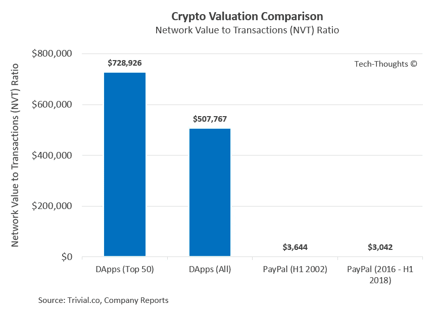
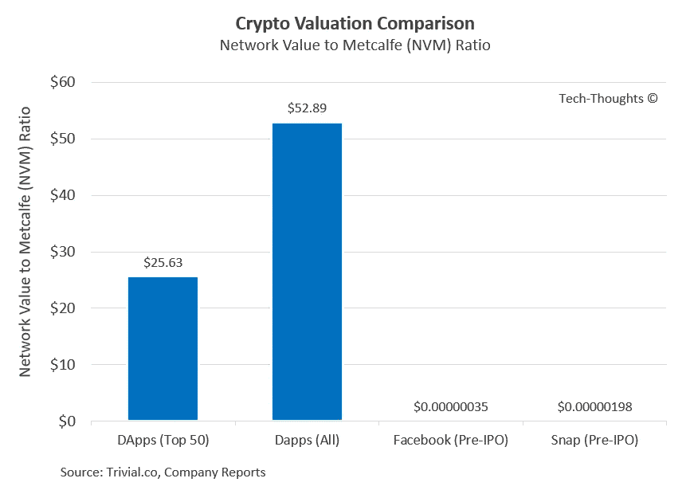

# 基准加密评估

> 原文：<https://medium.datadriveninvestor.com/benchmarking-crypto-valuations-11bc0ab6aaa?source=collection_archive---------13----------------------->

By [Andre Francois](https://unsplash.com/@silverhousehd?utm_source=medium&utm_medium=referral) on [Unsplash](https://unsplash.com?utm_source=medium&utm_medium=referral)

从估值的角度来看，加密资产提出了一个有趣的挑战。它们结合了货币、商品和股票的一些属性，但并不完全符合其中任何一种的定义。缺乏直接的、潜在的效用使得估值尝试变得更加困难。

到目前为止，我已经看到了三种评估加密资产的广泛方法。第一种使用[交换方程(MV=PQ)](https://medium.com/@sall/valuing-cryptoassets-from-the-ground-up-441ad5a9ff03) 假设加密资产是一种交换媒介。这种方法的挑战在于，至少在今天，与区块链协议相关的加密资产(如比特币和以太网)、[并没有真正被用作购买现实世界产品的交易媒介](https://medium.com/@sameer_singh17/defining-and-benchmarking-crypto-adoption-8971f7bc4a0)。它们是一种价值储存手段，但主要是因为它们被视为投机性资产，或者被用作购买基于协议的其他投机性加密资产的交易媒介。换句话说，它们的价值与价值链下游的投机性资产的价值紧密相连，即带有链接加密令牌的分散式应用程序(DApps)。

还有另外两种使用比率的相对估值方法，可用于对下游 DApps 和令牌进行估值。这些以前曾被用于对加密资产进行估值，但这些估值只与其他加密资产进行过比较。然而，这些比率也适用于今天的一些科技公司，这些基准应该作为无价的现实检查。

# 网络价值对交易(NVT)比率

[网络价值与交易(NVT)的比率](https://medium.com/cryptolab/https-medium-com-kalichkin-rethinking-nvt-ratio-2cf810df0ab0)很容易理解。它是加密资产的价值与记录在其上的每日交易总量的简单比率。

NVT 与 DApps 最为相关，在 DApps 中，交易反映了令牌的效用或实际使用情况。虽然今天 NVT 也用来评价协议，但上面的货币供应论点仍然适用，即只有当协议交易本身具有现实世界的效用时才有意义。今天，大多数协议事务要么是推测性的，要么是推测性的使能者，即事务的数量意味着表示推测的规模而不是效用。

NVT 的应用远远超出了加密生态系统。从技术上来说，它可以用来评估任何资产或公司的交易与现实世界的公用事业。PayPal 就是一个很好的例子。幸运的是，Paypal 的交易和估值历史可以追溯到 15 年前。

NVT ratio for DApps is approximately 200x higher than PayPal

PayPal 的 NVT 比率在其历史上一直保持着显著的一致性。然而，加密资产的 NVT 比率大约高 200 倍，即如果我们使用 PayPal 作为基础数据，令牌使用(或交易)需要增加 200 倍才能证明今天的价格是合理的。鉴于 crypto 处于技术采用周期的早期，我通常会期待更高的估值倍数。但不是一个数量级。任何价值数十亿的资产都必须经得起审查。

# 网络价值与 Metcalfe (NVM)比率

第二个比率比 NVT 稍微复杂一点，基于[梅特卡夫定律](https://en.wikipedia.org/wiki/Metcalfe%27s_law)。Metalfe 定律在很大程度上是网络效应的数学表示，并指出网络的价值与其支持的唯一连接数成比例，即大致相当于节点(用户)数量的平方。因此，[网络价值与 metcalfe (NVM)比率](https://medium.com/cryptolab/network-value-to-metcalfe-nvm-ratio-fd59ca3add76)是加密资产的价值与平均每日活跃用户的平方的比率。

由于这一比率是基于网络效应，它可以应用于任何在同质网络参与者之间表现出双向网络效应的产品，如脸书和 Snap 等社交媒体公司。

DApp adoption needs to increase by >3000x to achieve benchmarks set by Facebook and Snap

Facebook 和 Snap 的 IPO 前 NVM 定在 3.5 倍 10^-7 和 19.8 倍 10^-7.之间基于这些基准，令牌的采用需要增加 3000 倍才能证明今天的价格是合理的。同样，社交媒体在技术采用曲线上远远领先于加密的事实可以证明更高的估值倍数是合理的，但在讨论价值数十亿美元的资产时，这不是一个数量级。

即使在应用了适当的障碍后，令牌的采用和使用仍需要增加 100 到 1000 倍，以证明今天的市值是合理的。这与以太坊联合创始人 Vitalik Buterin 的[评论](https://www.bloomberg.com/news/articles/2018-09-08/crypto-growth-nears-ceiling-ethereum-co-founder-buterin-says)形成了鲜明对比:

> 区块链的空间已经到了看得见天花板的地步。如果你在这一点上与普通受过教育的人交谈，他们可能至少听说过一次区块链。这个领域的任何东西都不会再有 1000 倍的增长了。

鉴于目前的估值和功利主义采用水平之间的差距，我礼貌地表示不同意。

最初发表于[科技思想](http://www.tech-thoughts.net)。