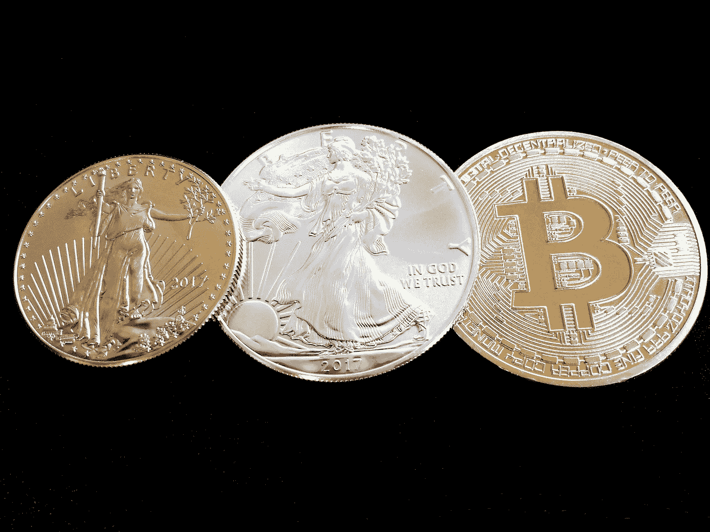

# 弯曲比特币——硬通货的原理

> 原文：<https://medium.datadriveninvestor.com/bending-bitcoin-the-principle-of-hard-money-ad577bdfbc14?source=collection_archive---------0----------------------->

硬通货是在实际讨论中使用的最著名的货币术语之一。从关于政策决定的政治讨论到金融部门的评论性辩论，这个术语经常被听到，以至于普通公民都很熟悉。然而，尽管其大量使用，尽管硬货币的概念对于货币体系的传统财政责任具有非常明确的内涵，但其确切定义仍然非常模糊。虽然对许多人来说，这仅仅是一个实用术语，几乎等同于黄金支持系统，但其概念意义显然不止于此。那么，对于理论讨论来说，很明显，尽管黄金几个世纪以来一直是这个概念最准确的实际代表，但它不可能是它的真正定义。直到今天，尽管充分定义这个术语有其理论价值，但这种精确的定义似乎是完全没有必要的。很长一段时间以来，人们已经确定，假设它仅仅意味着金本位制就足以满足所有实际用途。

然而，近年来，这个词开始被用于新兴的加密货币系统，最引人注目的是比特币。描述新生货币体系的这个术语的新用法引起了对其确切含义的明显混淆，是什么使货币“坚硬”的问题已经变得具有实际意义。这种现状给我们留下了许多问题。首先，什么才是货币体系“硬度”的满意定义。其次，这个术语是否适合描述比特币。最后，如果其他加密货币也值得这样分类。因此，本文的其余部分试图解决上面提到的问题。最后一点，本文将只讨论什么是硬通货的问题。一个更广泛的问题是，一个硬货币体系是否首先是可取的，这超出了本文的范围。关于这个问题，感兴趣的读者可以在我的[上一篇文章](https://medium.com/coinmonks/the-monetary-case-for-bitcoin-778cd51ff272)中找到我的答案。

# 什么是硬通货？

尽管如上所述，在关于这一主题的讨论中似乎没有普遍的精确和一致的定义，但如果我们要认真研究这一问题，我们必须首先提供这样一个定义。从这一点开始，我们将使用如下定义:

> 货币的硬度与通货膨胀，以及随之而来的现有股票价值的稀释成反比，这在经济上是可以实现的。

现在，有几个值得注意的要点需要澄清，以避免对上述定义的常见误解。首先，我们应该注意到，像许多经济术语一样，货币的硬度是一个主观感知的因素，受各种事件(如生产技术的改进，有效的伪造等)的不断变化。).从这个意义上说，这类似于讨论货币的购买力，虽然可以普遍理解，但这是一个相当主观和不断变化的指标。虽然这种考虑肯定不会使它的重要性和有用性无效，但我们应该记住这些限制和不确定性，它们必然伴随着它的使用。

 [## 总部位于瑞士的 ETP 进入加密交易市场|数据驱动的投资者

### 虽然金融市场几乎没有沉闷的时刻，特别是在引入…

www.datadriveninvestor.com](https://www.datadriveninvestor.com/2019/03/10/swiss-based-etp-enters-the-crypto-trading-market/) 

要注意的第二点是关于“经济上可以造成”的确切含义，以及随后的含义。简而言之，问题是在货币价值下降(或生产成本上升，或两者皆有)到生产不再有利可图的程度之前，还能生产多少货币。这里我们可以注意到“商品货币”和法定货币之间的明显区别，前者由市场决定供给，后者由立法决定。由于商品货币的供给是由市场对它的需求(它的价格)决定的，它的生产成本总是倾向于与它的市场价格相匹配，因为如果利润更大，生产者会迅速增加生产，如果无利可图，他们会更快停止生产。另一方面，法定货币的供给，比如我们今天的政府票据，不是由对它的需求来调节的，而是由武断决策的官僚程序来调节的。这两种货币体系之间的主要区别在于，对于前者，财富稀释的风险主要来自生产过程中的技术进步。而对于后者，总是存在任何任意原因造成的大规模稀释的风险。因此，虽然前一类的钱值得额外的努力来研究它的硬度，但后者让我们毫不怀疑它的“容易”。值得一提的是，这种宽松的货币政策绝不是偶然的，而是主要针对政府通过铸币税融资的有意识政策的预期结果，铸币税是受法律保护的货币发行者从市场竞争中获得的垄断利润。讨论法定货币的经济和伦理问题，特别是铸币税，超出了本文的范围。然而，感兴趣的读者可以在 jrg Guido hülsmann 的《货币生产的伦理》中找到这样的讨论。

# 硬通货的(非常)简史

到目前为止，我们为硬通货的概念提供了一个确切的定义，并看到了为什么它必须是通过市场上的公开竞争产生的商品货币。现在，我们将通过研究一些历史货币体系，以及从宽松货币到宽松货币的逐渐转变，继续研究硬通货的原理。

货币的历史，包括盐、贝壳和玻璃珠等著名的例子，充满了生产过程的进步，甚至是某种货币的贸易联系的改善，以及其低劣的货币属性(耐用性、可分性等)。)与另一种货币相比，导致它迅速贬值，最终完全丧失其货币职能。雅浦岛著名的拉伊石案例也许最好地说明了这一过程。这些石头的大小(和价值)从小珠子到一些 3.6 米高的大珠子不等，被当地居民作为货币使用了数百年，如果不是数千年的话。由于在长期的货币使用过程中，它们的生产方法并没有得到很大的改进，因此它们的产量在很多年里保持稳定，从而确立了它们作为硬通货的地方地位。然而，随着 19 世纪末欧洲人的到来，以及他们带来的先进工具和生产方法，生产变得越来越便宜，石头开始迅速贬值，直到它们最终失去了西方货币体系的货币作用。历史上，类似的情况在很多时候和很多地方都有过，比如非洲和美洲的玻璃珠和贝壳，欧洲的盐，等等。

自公元前 1000 年开始作为货币使用以来，贵金属可能是所有货币中最重要的。主要在欧洲和亚洲作为最常见的货币体系使用，后来在发现美洲后迅速传播到所有其他大陆，在欧洲殖民努力的强大影响下，整个世界开始向统一的贵金属货币体系靠拢，即铜、银和金。这种金属货币系统的使用增长很大程度上是由于它们相对优秀的物理货币属性，如耐用性、便携性和可分割性。与历史上所有其他货币商品相比，它们所表现出的货币硬度的影响力丝毫不减，甚至更大。这种使用金属货币的长期趋势可以说在 19 世纪中叶达到了顶峰。在黄金标准盛行的年代，黄金曾经繁荣一时，但在第一次世界大战开始前后，黄金开始衰落。从那以后，不可兑换的法定货币成为了一种强烈的趋势，主要是以纸币、“代币”硬币的形式，以及后来今天的数字货币。

这种从金属本位到纯粹平面本位的转变起源于中国发明的纸币，一种持有人可以根据需要从纸币生产者的储备中兑换成硬币的纸质(或类似材料)纸币。这种纸币作为流通交换媒介的使用始于大约 11 世纪，伴随着纸币“饺子”的出现，并从那时起持续传播到世界各地。这种做法的独特之处当然不在于支付工具采用了新的实物形式，而在于这样一个事实，即尽管所有票据都可以按需赎回，但准备金只保留了赎回所有票据所需资金的一小部分，这就是今天通常所说的部分准备金银行业务。虽然这些纸币形式最初是私人发行的，主要是因为它们更容易携带(因为携带金属硬币变得很重)，但它们很快被国有化，并成为一种新形式的政府融资计划，即铸币税，这是由于其低廉的生产成本和使用这种部分储备技术。对银行业历史的全面考察超出了本文的范围。就我们的目的而言，需要注意的重要一点是，虽然货币的实物形态很久以前就开始向纸币转变，但今天永久不可兑换纸币的概念纯粹是现代的“发明”。虽然它在形式上是相似的，并且可能是由于上述这种古老的习俗而存在的，但它缺乏任何历史先例。

的确，全球向金属货币的趋同，尤其是后来从金属货币向金本位的转变，在很大程度上要归功于政府的政治影响力。然而，为实现向完全不可挽回的法定标准的最新转变而采取的大规模干预措施是前所未有的。可以说，从第一次世界大战开始，随着第二次世界大战的结束而巩固，随着 1971 年尼克松总统的第 11615 号行政命令而成熟，从金属货币到纯粹法定货币的转变在任何可以想象的方面都使全球货币体系国有化和政治化了。其结果是货币进化趋势的倒退，从国际上集中使用最硬的货币，退化到使用最便宜的生产方法，这将为每个国家政府创造尽可能高的铸币税利润。因此，我们毫不惊讶地发现，在过去的一百年里，T2 经历了 50 多次恶性通货膨胀的经济崩溃。过去极为罕见的事件已经成为现代经济的一种流行病，现在几乎是阻止政府过度货币生产的唯一手段。

简而言之，货币的历史向我们展示了货币标准向最硬货币国际趋同的趋势。这种趋势很可能在 19 世纪的金本位制下达到顶峰，并在过去的一百年里被政治力量压制，迫使人们使用最容易的货币——这种货币可以根据他们的意愿无限创造。虽然硬通货的趋势似乎已经完全逆转，但这种趋势逆转可能导致的巨大经济困难和不稳定可能表明这只是暂时的。因此，似乎有一个强有力的理由相信，过去的一百年将只是货币变得更加坚挺的长期趋势中的一次短暂倒退。

然而，上个世纪留给我们的希望很小，这种进步的回归可以表现为金本位的回归。随着向全球在线支付的过渡，对于这种系统的平稳运行的集中可信储备的需求变得比以往任何时候都更加明显。然而，正是这种对中央储备体系的需求，导致了黄金的政治俘获和最终消亡。此外，考虑到过去几十年全球政府权力的巨大扩张，这种中央储备体系的内在风险使得回归黄金似乎是一个不切实际的选择，尽管理论上可能是可取的。尽管关闭这一过去的选择带来了障碍，但技术的进步开辟了一种新的替代方式，即比特币，这是硬通货的数字版本。如果它确实提供了一种安全的替代方案，那么这样一种体系就有真正的潜力成为货币标准的下一次演变，延续货币更硬形式的旧趋势。它正在研究这个前提，我们现在将转向这个前提。

# 作为硬通货的比特币

简而言之，比特币是为了有一个最终的有限供应而建立的，这是由扩大计算能力的公开竞争产生的。根据估计的时间表，该计划被设计为总共生产约 2100 万枚比特币。新比特币的生产需要解决一个密码难题，每个竞争者解决这个难题的概率与其消耗的计算资源直接相关。我们看到，根据理论设计，比特币被设计成硬通货，最终硬度不允许进一步生产，从某种意义上说，造成了绝对稀缺。虽然我们现在已经对比特币货币硬度的理论保证有了基本的了解，但我们必须继续研究这些保证在实践中如何得到保证，以及它们可能面临哪些威胁。

比特币的货币硬度是由其共识规则保证的——这种代码根据交易历史(以区块形式)的有效性接受或拒绝交易历史，符合这套预先确定的规则。这些规则包括，除其他外，对加密挑战的解决方案的要求(工作证明)，确保任何交易花费的比特币都不会超过其发送者拥有的比特币的验证，以及检查比特币的发行是否超过供应限制或在预定时间表之前。每一台已经验证了到目前为止的所有交易历史，并且作为该验证的结果维护了当前 [UTXO 集合](https://en.wikipedia.org/wiki/Unspent_transaction_output)(比特币的当前所有者集合)的机器，被称为*全节点*。整个“比特币网络”是所有完全节点的总和，这些完全节点通过相同的协议规则进行通信，并传播关于新数据(主要是块和交易)的信息。通过遵循相同的验证规则，并通过在它们之间传递所有数据，所有节点都有望达到对当前状态的相同看法——一种共识。

节点可能通过两种可能的方式对当前状态达成不一致——通过具有不同的(或部分的)数据或通过根据不同的共识规则进行验证。前一种情况通常不是问题。它主要包括处于加入网络过程中的节点(在 [IBD](https://bitcoin.org/en/glossary/initial-block-download) )，还没有接收到新块的节点，以及在极少数情况下，两个冲突块彼此独立地被解决并且同时被传播的情况。数据传播的这一领域虽然非常重要，但并不涉及比特币本身的货币硬度，因此在目前的讨论中我们将忽略它。第二种可能的情况——建立不同的共识规则——是通胀风险所在，也是我们现在要研究的。

严格来说，比特币没有“确定”的规则。例如，有第一版比特币软件的原始规则，也有当前比特币核心软件的规则，但由于比特币是一个完全去中心化的项目，所以没有一个*必须*遵循的规则。这实质上意味着(为了方便起见，假设这是最不可能但在技术上仍有可能的情况)如果比特币网络的所有参与者一致修改他们的规则，比如永久通胀，这些将成为新规则。没有控制机构可以阻止用户运行他们想要的任何版本的软件。比特币的这一特性是其作为人造数字资产的本质所固有的，这可能是其与黄金等自然商品的最大区别，因此在评估比特币的实际硬度时需要给予极大关注。

要理解是什么保证了比特币的货币政策和其他共识规则的硬度，我们应该从分析这个网络开始，不是作为一个整体，而是从组成它的各个节点开始。就一个完整的节点而言，它对规则(比特币的“定义”)的控制是绝对的，没有任何程序可以强迫一个节点使用一套特定的规则。基于同样的原因，没有一个节点可以强迫另一个节点接受它的规则。因此，我们会遇到这样一种情况，从第一个比特币软件中作为基础指导的初始共识规则开始，网络中的所有节点必须要么收敛于同一组规则，要么失去与网络其余部分进行交易的能力。例如，如果一个节点决定“凭空”铸造新的比特币，他可能会改变自己的规则以允许这样做，但代价是失去与网络其他部分交易他的“比特币”的能力。如果我们假设两个人以那种方式修改了他们的规则，他们就放弃了除了彼此之外与他人交易的能力。如果我们现在想象 10%的参与者改变了他们的节点以适应新规则，同样的事情也会发生，这个网络可以说分成了两个不同的网络，每个网络以不同的方式定义比特币。

尽管上述案例没什么意思，但它们引发了一个问题:如果 50%，甚至 99%的人修改了他们的规则，会发生什么？换句话说，如果多数人改变了规则，会发生什么，什么会首先定义多数人。比特币本质上是一个通信网络，确定“多数”的最恰当方式是考虑参与者可以与其他人进行通信(交易)的程度。与常见的谬误相反，一个网络可能有多少散列率、市值或总交易量并不重要，有多少节点运行其规则更不重要(因为任何人都可以部署任意多的节点)。与确定加入网络的节点“应该”运行哪些规则相关的唯一度量是它能在多大程度上与其他节点进行交易。更简单地说，他希望(或期望)与之交易的人当中，有多少人会接受他的比特币是有效的。

无法与他人进行交易的威胁(运行不兼容的规则)阻止了参与者(其他节点和挖掘者)任意修改规则。对这种广泛协调的需求使得比特币的改变——从琐碎的漏洞修复到最具争议的改变——如此难以实施。任何修改都意味着失去与网络其余部分(或部分)进行交易的能力的风险。因此，很少使用进行这种修改的理论能力。回到我们的货币硬度主题，最重要的是要理解，每个参与者的比特币硬度取决于网络中足够大的一部分协调并成功执行共识规则变化的能力和可能性，这将增加比特币的供应。需要强调的是，“足够大”意味着失去交易能力将使比特币变得无用的大部分。与比特币规则本身一样，这一衡量标准必然是主观的，但对于这种情况应该不难达成大致一致。

# 比特币的软肋

正如我们现在所看到的，由于比特币的每个用户都可以运行自己的节点，参与者对共识规则执行的影响力只与他个人参与的交易有关。节点必须验证所有交易，不是为了在网络上为其他人实施规则，而是为了能够确定他自己收到的付款是否有效——这是参与者的经济活动，并且是他可以影响其他人使用某些规则的决定的唯一方式。每当一个人接受比特币支付时，这就类似于通过强制执行支付被接受的共识规则来断言比特币的定义。

然而，尽管在我们的分析中，到目前为止，我们一直(有意或无意地)假设每个参与者都在通过用他的完整节点运行某些代码来主动设置他自己的规则，并使用它来验证传入支付的有效性，但这不一定是(事实上通常不是)这样的情况。任何人都完全有可能通过被动地信任另一个实体为他验证交易来委托这种主动规则设置的责任。通过这样做，付款接受者在某种意义上将其在网络上的经济活动，从而对共识规则的影响，委托给另一个人，该另一个人反过来可以使用他喜欢的任何规则。例如，假设我正在使用在线数据块浏览器来验证我是否收到了交易，每当我以这种方式接受交易时，我会将我的经济活动对规则的影响委托给该服务的操作员。例如，如果运营商决定使用允许更大的区块、新的签名方案或(更令人担忧的)改变通货膨胀率的规则，我不仅会被动地接受这些违背我的同意的改变，事实上我还会通过发出我愿意接受使用这些特定规则的交易的信号来主动认可这些改变。

在上一节中，我们已经得出结论，为了削弱比特币的货币硬度，有必要与网络中足够多的活跃经济参与者协调(说服他人执行)共识规则修改，从而导致这种变化，根据理论考虑和实践(尽管短暂且不充分)经验，我们可以认为这是一项非常不切实际的任务。这种协调上的困难不仅仅是因为比特币网络的分散结构，更具体地说，是因为对个体经济活动的规则执行是分散的，或者更准确地说是自主权的。当每个参与者都在积极验证自己的交易时，有必要说服他们中相当一部分人(如果不是几乎所有人)接受修改比特币硬度的新规则集。然而，积极验证其交易的参与者越少，对经济活动的核查就变得越集中，因此就越容易进行这种变革。

虽然从理论上讲，没有什么可以阻止每个参与者使用完整节点，但是运行和使用完整节点存在各种实际障碍。可能这些障碍中最重要的是操作这样一个节点的技术复杂性，这对于许多人来说仍然是一项非常重要的任务。此外，交易历史数据的大小也带来了问题，当交易历史数据增加时，不仅会影响加入网络所需的初始时间，还会提高活动节点所需的硬件要求，使维护成本越来越高。这些问题(以及潜在的各种其他问题)虽然可能是可控的，但如果不加以处理，可能会导致支付验证如此危险的大规模集中化，这可能会抵消比特币理论设计所保证的货币硬度。

因此，比特币硬度的最大风险在于支付验证的集中化。我们看到，从理论上来说，如果网络中有足够大的一部分只使用少数服务提供商来验证他们的交易，那么这些服务提供商就有可能协调比特币供应的变化，同时在经济上积极支持所有使用他们接受比特币支付的人。诚然，只要你运行自己的完整节点，你就能够坚持目前的“硬通货规则”，但如果网络的如此大一部分已经转向(意识到或没有意识到)一套通胀规则，你将失去与它们交易的能力，从而失去使用比特币的效用。在对比特币的硬度得出结论之前，我们应该解决其他加密货币是否可以被称为硬通货的问题，以及比特币与所有加密货币的区别。

# “屎币”呢？

与几乎所有“以区块链为基地”的狗屎硬币不断宣称的相反，它们都不能被视为硬通货。尽管对于分散式区块链如何工作有许多不同的实现方式(PoW/ PoS 等。)，它们都必须依赖于上面讨论的相同的客户端支付验证模型。然而，与比特币不同，它们要么只是嘴上说说，要么甚至完全无视自我主权在确定共识规则中的重要性。也就是说，它们都倾向于集中共识规则的形成和实施。一些项目有某种中央权威，除了很少的例外，大多数关于规则的决策都被委托给它(无论是显式的还是隐式的)。其他人忽视了保持运行尽可能可访问的完整节点的能力的必要性，从而导致支付验证的集中化。还有一些人试图建立一个“治理”过程——使对共识的任意改变成为一种形式。

我应该强调的是，我并不是在说所有的“区块链项目”或分散治理的项目。我反对的是经常听到的各种代币的说法，即它们应该被视为硬通货，而在实践中，它们的供应可以并经常被任意改变。如上所述，货币的硬度与货币通货膨胀成反比，货币通货膨胀会对货币持有者造成经济损失。对于这种依赖于集中式(或半集中式)支付验证或具有一些用于修改共识规则的清晰而简单的过程的数字资产，甚至不能有硬通货的伪装。可能对他们造成的潜在通胀是无限的——一旦你可以修改数字资产的“货币政策”，你可以从中创造多少实际上是没有限制的，它不能被视为比任何法定货币系统更硬的货币。

这里没有声称比特币的当前状态是完美的，或者接近完美。当然，在比特币领域也存在许多不良的验证集中化现象，更令人担忧的是，人们普遍忽视了这种自我主权验证的重要性。然而，主要的区别是比特币“活动家”坚持推广使用完整节点，这种例子是核心开发人员努力保持节点在即使是像 Raspberry Pi 这样薄弱和负担得起的机器上可用，以及许多项目提供了运行完整节点的各种选项，从即插即用机器到完全 DIY 的解决方案。致力于促进和简化比特币全节点使用的生态系统非常重要，并且正在快速增长，社区对这一主题的重视是任何其他项目都无法比拟的。

此外，同样重要的是，作为“同类中的第一个”，比特币不仅是单一资产的基本共识规则，也是一般数字价值传输的基本共识规则。由于比特币原则上是“点对点电子现金系统”的一种协议，甚至(在其最基本的意义上)是一种思想，而且正如我们所见，其规则是由其用户单独和独立决定的，这意味着在某种意义上，这种系统的所有其他实现都可以被视为比特币的版本，但有一套完全修改的规则。考虑到这一点，仅仅是这些其他“比特币”拥有如此不同的规则集和本质上不同的货币政策这一事实，就表明了它们的规则的相对可塑性——这些规则已经以非常不兼容的方式偏离了最初的基本规则，并且没有真正的(货币)原因(如由于错误而发生的紧急变化)。我们可以说，这些其他的硬币仅仅是比特币模式的复制，至少在货币领域，已经证明了它们缺乏硬度，因为它们仅仅是作为与比特币主要协议的任意分歧而产生的。所有这些硬币很可能与比特币和各种其他“用例”有显著差异，但就作为一个硬通货系统而言，它们都是在“比特币标准”下开始亏损的。

# 关于虫子

在结束我们的讨论之前，还有几句话要说。首先，尽管到目前为止我们一直在讨论比特币的硬度来自于执行其编码规则，但我们必须注意另一个警告。比特币是一种软件，就像任何软件一样，它可能并且曾经(可能仍然)有缺陷。虽然这种错误确实可能导致意外的通货膨胀，但它们不太可能对比特币的硬度产生任何严重影响。

为了理解为什么，我们可以将可能的通货膨胀分为次要的(1，10 甚至 10 万比特币——就像[CVE-2018–17144](https://bitcoincore.org/en/2018/09/20/notice/)可能发生的那样)和主要的(像[1840 亿](https://en.bitcoin.it/wiki/Value_overflow_incident)比特币通货膨胀)。小问题可能确实会带来一些通货膨胀，这在技术上可能会破坏有限供应的核心原则，但由于它们可以很快修复，从长远来看，它们对总供应的影响实际上是无关紧要的。用更通俗的话来说，他们可能会在很小程度上增加比特币的存量，但对于即将到来的新硬币预期流量来说，他们不会破坏其担保。

至于重大缺陷，虽然可能会破坏人们对比特币成功的暂时信心，但可以实施追溯性对策来抵消这种明显违反限量供应宪法先例的影响，将会成功维护比特币的信条。为了保护硬币持有者的价值和网络本身的效用，这些措施是绝对必要的。事实上，这正是 2010 年这样一个灾难性错误之后发生的事件过程。正如我们之前得出的结论，网络规则缺乏可延展性，导致其作为货币媒介的硬度。然而，在这里，显然字面上的相反也是正确的；正是网络的进化能力保护了用户，通过他们每个人按照自己的利益单独行动，捍卫了 2100 万的硬性上限。

# 结论

在整篇文章中，我们讨论了硬通货的基本原理以及它与比特币的关系。我们看到，从理论方面来看，通常将比特币描述为“有史以来最难的货币”是当之无愧的，但从实践的角度来看，这种说法的合理性在很大程度上取决于其用户对自我主权的行使——使用完整的节点来验证和接受交易。

# 运行一个完整节点！

对于比特币的硬度，需要尽可能多的经济参与者使用自己的全节点。然而，远比这种自我主权的“集体”必要性更重要的是，还有运行完整节点的“个人”原因。

如上所述，当你不验证自己的交易，而是信任另一方来验证时，你就盲目地接受了该方可能对比特币的定义。很可能他们通过与大多数其他网络参与者不兼容的规则来验证交易。此外，他们可能根本没有真正验证任何东西，只是武断地向你提供虚假数据。当然，至少在比特币的这个阶段，老牌服务提供商不太可能冒着失去客户的风险，向他们提供不正确或误导性的数据(尽管我们已经看到了这样的案例，主要是比特币现金和 Segwit2X 案例)。偶尔使用这种服务的帮助可能很好，特别是对于小额付款。

要记住的主要一点是，通过授权支付验证，你将自己暴露在巨大的风险之下，同时也潜在地削弱了比特币规则的硬度。我不会完全阻止使用这种服务，但对于那些频繁或大量使用比特币的人，以及任何关心自己的隐私并希望获得强大安全性的人，我强烈建议做出这种努力，找到一种适合他们需求的自主全节点解决方案。(请参见下面的指南)。

虽然经常听到使用完整节点的建议，但怎么强调都不为过，这是使用比特币的一个关键部分——因为不使用完整节点，你甚至无法知道你是否真的在使用比特币。

# 如何运行一个比特币全节点

至此，我们解决了*为什么*运行完整节点的根本问题。现在，我们该转向一个同样重要的问题了，那就是*如何*运行一个完整的节点。但是首先，让我们先澄清一些关于运行一个完整节点所需的要求的流行误解。就目前而言，运行一个比特币完整节点所需的最小磁盘空间不超过 10GB。为了说明它有多小，你可以找到一个 16GB 的 SD 卡，价格不到 4 美元。如今，大多数智能手机已经配备了至少 32GB 的内存，对于许多人来说，使用这种 SD 卡可以增加更多内存。的确，存储整个历史(目前大约为 300GB)更可取，但这对于运行一个安全且完全验证的完整节点是不必要的，也不应该成为不使用完整节点的借口。

另一个重要的误解是据称需要强大的计算能力，这种误解通常来自比特币矿工和完整节点之间的混淆。诚然，为了运行一个(有利可图的)比特币挖矿操作，需要有一些昂贵的专门硬件，但这对于运行一个完整的节点来说完全没有必要。要运行一个完整的节点，你可以只使用一个 Raspberry Pi，或者只是你的个人电脑或智能手机。

这里最后要注意的是运行一个完整节点的所谓复杂性。必须承认，现在，运行一个完整的节点可能不是你的祖母能够做到的事情，但过去不是，现在对许多人来说仍然不是，使用智能手机或网络浏览器。虽然目前使用网络浏览器肯定比运行完整的节点更容易，但我们应该记住，目前比特币不仅是新的，而且带来了使用货币的全新范式。几十年来，实施比特币的发明本身被认为是一个不切实际的挑战。相比之下，构建一个用户友好的全节点解决方案生态系统的挑战就显得微不足道了。事实上，我们到目前为止已经让我很有信心，创建一个用户友好的完整节点的挑战不会是一个真正的障碍。这也有助于了解在过去 10 年中，使用完整节点的简单性有了多大的提高。在没有任何预算的情况下，仅仅依靠人们的自愿贡献，已经为各种不同的受众创造了数十种解决方案。

在此，我将列举目前的几种选择。由于我不能保证，我必须指出，这份清单可能包含不完善的选择，并不能代替你自己的研究服务的质量和完整性。

对于任何熟悉电脑基本用法的人来说，最简单的解决方案可能就是使用比特币核心软件。虽然它的界面不是最好的，但它安装和使用简单，是最常见的比特币软件。有关更多信息，请参见以下链接:

*   [比特币核心官方下载页面](https://bitcoincore.org/en/download/)
*   【bitcoin.org 全节点指南

另一个选择是通过另一个 app 使用比特币核心。很少有这样的服务会为你安装和设置比特币核心。这些可能不一定比普通的比特币核心安装简单，但它们都提供了更多的功能，如 Tor 支持/闪电网络设置/硬币混合和其他有用的功能。

*   [节点启动器](https://medium.com/lightning-power-users/windows-macos-lightning-network-284bd5034340?) —比特币和闪电一键设置工具，包含有用的闪电工具和指南。
*   [Wasabi 钱包](https://www.wasabiwallet.io) —内置比特币核心自动安装、CoinJoin 混合、硬件钱包集成的比特币钱包。
*   [比特币-Standup](https://github.com/BlockchainCommons/Bitcoin-Standup) (警告:仍处于早期测试阶段)——MAC OS(可能很快就是 Linux)工具，用于设置比特币全节点，包括通过 Tor 的移动应用程序远程连接的工具。

对于不太懂技术的用户来说，“即插即用”的完整节点可能是最好的解决方案。这些设备的价格通常在 200 美元到 500 美元之间，但是它们配备了所有的硬件、许多很棒的功能以及通常更加人性化的设计。

*   [Nodl](https://www.nodl.it/) —包括一个比特币全节点和对 Lightning node、Tor 和 BTCPay 服务器等各种功能的一键支持(此处还提供 [Samourai Dojo](https://samouraiwallet.com/dojo) 支持[)。](https://shop.nodl.it/en/home/38-nodl-dojo.html)
*   [Casa Node](https://keys.casa/lightning-bitcoin-node/) —比特币全节点，具有用户友好的用户界面，全面的 lightning 支持，并与其他 Casa 产品(如 Lightning 移动钱包和其 multi-sig 钱包的会员资格)集成。
*   [RaspiBlitz](https://raspiblitz.com/) —基于 Raspberry Pi 的比特币全节点，集成 Lightning。
*   MyNode —类似于 Raspiblitz，界面更加友好，集成了 Blockexplorer 和 Electrum Server 等功能，支持硬件钱包。
*   [盒子里的闪电](https://lightninginabox.co/product/lightning-in-a-box/) —预装配置 BTCPayServer 的比特币和闪电节点。
*   [Bt CPI](https://lightninginabox.co/product/btcpi/)——一个类似于闪电的廉价版本，装在盒子里出售。
*   [BitBoxBase](https://shiftcrypto.ch/base/) (尚未发布)——比特币全节点包括硬件钱包安全元素、用户友好钱包、闪电节点和 Tor 支持。

对于那些喜欢动手的技术用户(或者只想省钱构建自己的节点):

*   [RaspiBolt](https://stadicus.github.io/RaspiBolt/) —使用低成本组件创建具有 Lightning 支持的比特币全节点的分步指南。
*   [RaspiBlitz](https://github.com/rootzoll/raspiblitz)—RaspiBlitz 的 DIY 版本。硬件部分的成本应该约为 150 美元，但与预建选项的结果相同。
*   [MyNode](https://mynodebtc.com/)——类似于 RaspiBlitz，它允许您从有序部分构建自己的节点。基本软件是免费提供的，但可以通过一键升级获得更多功能，从而升级到付费高级版。
*   [RoninDojo](https://github.com/RoninDojo/RoninDojo)—DIY[Samourai Dojo](https://samouraiwallet.com/dojo)支持比特币全节点、Tor、惠而浦 coinjoin。

还有几个移动比特币全节点选项:

*   [ABCore](https://github.com/greenaddress/abcore) —带有比特币全节点的安卓应用，使用比特币核心，并提供将其作为安卓应用使用的接口。
*   HTC Exodus——一款 HTC Android 手机，内置比特币全节点，硬件钱包 TEE 元素和更多相关功能。
*   至于今天，没有 iOS 兼容的方式来运行一个完整的节点比特币。然而，应用程序[完全节点化](https://github.com/Fonta1n3/FullyNoded)允许你远程连接到你的节点，并在 iOS 上使用它。

***关于密钥管理的说明:***

值得注意的是，虽然这里介绍的许多解决方案为用户提供了比特币钱包，但许多解决方案(仅或默认)使用“热”钱包，即存储在连接到互联网的机器上的钱包。这被认为是相对不安全的做法。因此，许多用户选择使用硬件钱包(如 Trezor、Ledger 和 ColdCard)。尽管(至少被认为)密钥管理更加安全，但如果不与完整节点一起使用，使用这种硬件钱包的好处会大大削弱。虽然大多数硬件钱包不提供与用户完整节点的(简单)集成，但有一些补充解决方案可以提供这种支持。

*   [比特币核心 HWI](https://github.com/bitcoin-core/HWI) —一个用于与多种类型的硬件钱包进行交互的 UI，同时将它们连接到比特币核心进行验证。
*   [Electrum 个人服务器](https://github.com/chris-belcher/electrum-personal-server) —允许将 Electrum 钱包与比特币全节点集成。支持各种功能，包括硬件钱包集成、multisig 钱包等。
*   [yeti cold](https://yeticold.com/)——(警告:仍在测试阶段)一个自主的、易于使用的多信号设置协议，旨在最小化信任和各种攻击媒介。

特别感谢 Ben Prentice ( [mrcoolbp](https://twitter.com/mrcoolbp) )、Bezant Denier([bezantdenier](https://twitter.com/bezantdenier))、Daniel Wingen([Daniel Wingen](https://twitter.com/danielwingen))、比特币观察者( [festina_lente_2](https://twitter.com/festina_lente_2) )、Thib ( [thibm_](https://twitter.com/thibm_) )、Simon Lutz ( [simonlutz21](https://twitter.com/simonlutz21) )和斯蒂芬妮·冯·扬( [stefanievjan](https://twitter.com/stefanievjan)