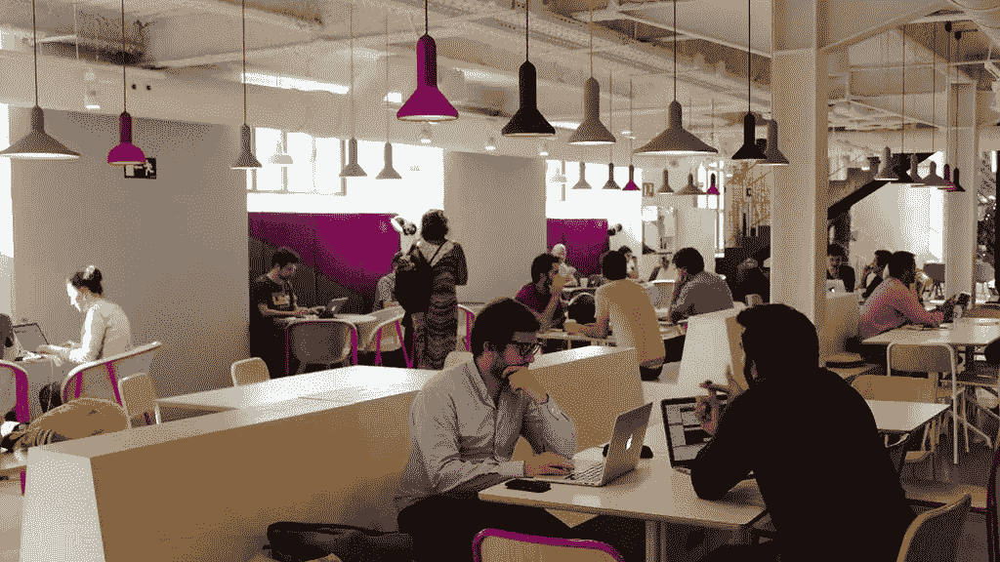
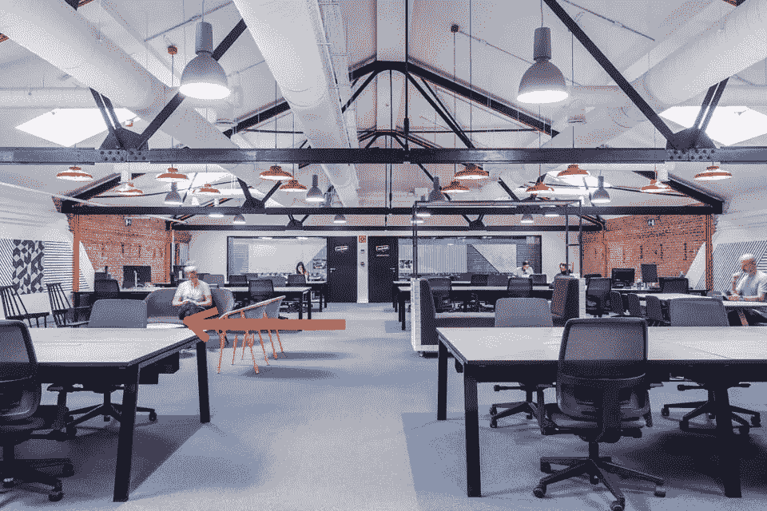
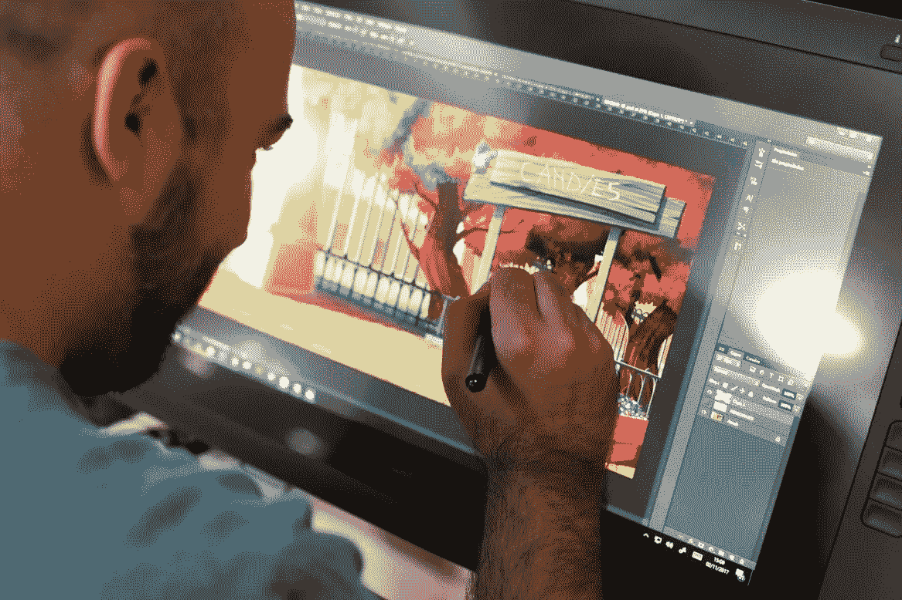
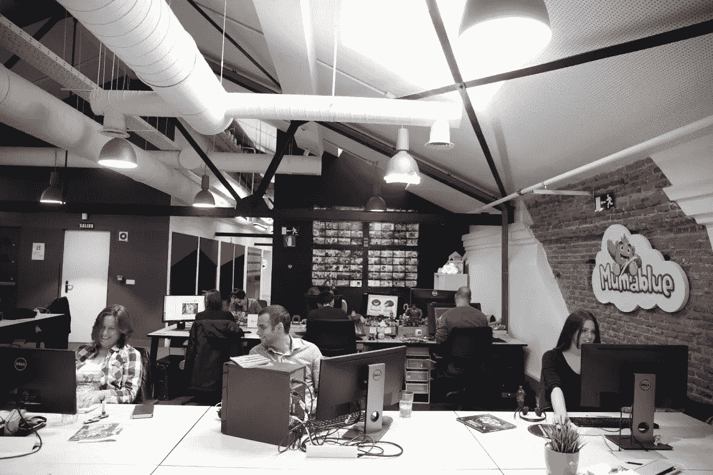

# 合作空间的好处。在谷歌内部工作。

> 原文：<https://medium.datadriveninvestor.com/benefits-of-a-coworking-space-working-inside-google-319cd59af0a1?source=collection_archive---------6----------------------->

在我描述我作为一名初创公司员工的经历的帖子中，我告诉过你这份工作的额外津贴之一就是结识高层人士。我想你应该问问自己:

“这篇文章应该是关于共同工作空间的，为什么这个家伙要谈论了解顶级专业人士？”

好吧，让我告诉你一些事情；在合适的合作场所就像参加全明星赛一样。在这篇文章中，我将讲述我作为一名初创企业成员参加 G[oogle for Startups Campus Residency Program](https://www.campus.co/google-for-startups-residency/)的第一堂课的经历。

所以让我们开始吧！

那是 2017 年春天；我在 Mumablue 呆了将近三个月。我们的创始人是谷歌马德里校园的活跃成员，他来到办公室非常激动地说:

“伙计们，我有个好消息！”

我们都看着她在想(我们公司只有六个人)，“嗯，也许这周五我们要开个披萨派对。”

“我们受邀申请马德里第一届谷歌初创企业常驻项目。”她说。

这句话是我一生中最重要的经历之一的开始。起初，我对校园的了解有限。但说实话，如果它上面有谷歌，听起来是个不错的地方，对吧？

第一步是发送一段推介视频，我有幸成为发表重要演讲的团队成员。我花了大约一个小时录制这首曲子；我精神疲惫，对结果感到紧张。

几天过去了，大约两周后，我们收到了一封电子邮件。主题有“申请”和“居住”两个词；很明显，这封邮件包含了申请的结果。突然，我们的创始人喊道:“我们有资格进入下一轮！”

我感到如释重负。

我们现在不得不去那栋大楼做最后一次演讲，我们当时并不知道，我们将在那里度过接下来的十个月。

你可能会从最后一句话中了解到，我们被邀请成为马德里 2017 届的六家创业公司之一。这是我们团队迄今为止最大的成就。

This is the first thing you see when you enter Campus.

我们搬进来了。建筑令人愉快，环境迷人。咖啡馆是一个巨大的空间，挤满了在笔记本电脑上追逐梦想的人群。那个地方充满了乐观和活力。

我们的位置是三楼右边左边的第一个。嗯，我想你最好自己去看。

That was my table — so many memories.

那是八月，基本上，没有人在我们之前搬进来。这一切都是从九月开始的。

校园工作人员发起了盛大的欢迎日活动。我们收到了欢迎礼包，里面有笔记本、日历，甚至还有一本护照。为什么是护照？你可能会问，这是一个工具，我们可以用它在全球范围内的任何一个谷歌创业者合作场所和合作伙伴场所工作长达一周。

想象一下，能够去特拉维夫的校园，与那里的人们交流你的经验和知识，这难道不是一次丰富的经历吗？

作为该计划的一员，我们获得了许多资源，包括谷歌自己的人。当然，最先与他们分享一些知识的是我们的 IT 团队，当时这个团队只有一个人。

然而，随着时间的推移，我们开始有机会与一些非常有趣的角色交谈。第一个和我的团队一起访问的是一位来自谷歌的 UX 专家，他给了我们一些如何改进我们网站的想法。几天后，一位来自香港的外交代表来到学校，和我们聊了大约 40 分钟。

但是，项目进行了两个月后，我意识到利用这一经历的唯一方法是愿意与人交谈。

按照我的新想法，我认识了谷歌初创公司的高级全球运营主管。这个人的谦逊是我从他身上学到的最重要的东西之一，他为我们进入美国市场的战略提供了许多想法，也让我们与谷歌在出版和玩具领域的高层人士建立了联系。—为什么是玩具和出版？因为 Mumablue 给孩子做个性化的书。-

That’s one of Mumablue’s illustrators drawing one scene of a book.

到了深秋，我们已经和这么多专业人士、投资者和商业领袖谈过了，但整个项目的最佳体验即将开始；是专家峰会的时候了。

专家峰会是一个为期两周的项目，来自全球各地的谷歌员工来到校园，与项目中的初创公司一对一合作。

正如我之前提到的，我们在儿童用品行业，我们有机会和一位产品经理一起工作，他在谷歌工作之前是迪士尼的经理。想象一下这家伙对我们公司的影响。它是无价的。

我们还与一位 UX 的专家合作，她在两周内给了我们她所有的见解，告诉我们如何改进我们的移动网络并使之更上一层楼。你猜怎么着，她的审计指导我们建立了一个全新的网站。然后，一组架构师和工程师帮助我们的 IT 团队解决了一些技术问题，并实现了一些例程，使他们的工作更加高效。

当我们三月份离开校园的时候，我们现在是一个 11 人的团队；一切开始时我们才 6 岁。我们都有过经历，遇到过一些很酷的人，他们为我们的角色增加了价值。

This is one of our last days at Camus. Some of the team members including me. :)

这个经历的好处是，一旦你参与到这个项目中，你将永远是这个社区的一员。我们被邀请参加下一次专家峰会，我们与其他创始人和团队成员的关系是分享知识的一个很好的工具，我们经常被邀请参加一些很棒的讲座和活动，正如我喜欢说的:我们是比我们自己更大的东西的一部分。

我希望这个小故事能够说明在像谷歌创业园区这样的地方是怎样的，以及你如何利用它。根据城市的不同，他们每年有一个课程，请确保您在这里查看这些课程。

总而言之，为了在你的共同工作空间取得成功，你应该记住以下五点:

1.  **与人交谈，不要害羞。**
2.  **去参加活动！**
3.  **回馈社会。**
4.  **成为领导者。(有时也是一个追随者)**
5.  享受其中的每一秒。

感谢阅读。我会在下一篇文章中看到你。