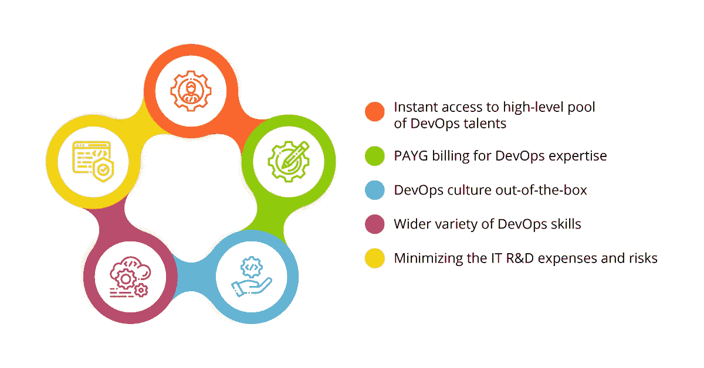

# 外包开发团队的优势

> 原文：<https://medium.datadriveninvestor.com/benefits-of-an-outsourced-devops-team-454ed0cd81de?source=collection_archive---------7----------------------->

为了生存，每个企业都必须有竞争力。利润最大化和费用最小化是确保健康底线的正确方法。最小化费用的最好方法是提供不间断的产品/服务功能，同时消除软件交付生命周期中的所有浪费。这正是 DevOps 实践的意义所在，也是 DevOps 文化不断变得更受欢迎的原因。

然而，许多企业没有建立内部开发运维团队所需的人员或时间，因此他们决定将其 IT 运营外包给声誉良好的托管服务提供商。我们列出了雇用和外包 DevOps 团队的某些预防措施和一些切实的好处。

# 有时 DevOps 外包不是一个选项

首先，在三种不同的情况下，您不应该选择开发运维即服务，而必须尝试建立内部开发运维团队:

## 1.你现有的软件结构是它的卖点

有许多应用程序和服务以某种方式运行。这些包括财务结构的计费软件、遗留软件等。这些通常通过定期发布(半年一次或一年一次)进行更新，以最大限度地减少最终用户的工作量。

如果您的企业提供这样的产品，那么将它迁移到 DevOps rails 将不是一件容易的事情。这里的最佳解决方案是建立一个内部开发运维团队，同时雇佣托管服务提供商进行 IT 基础架构审计并建立卓越中心。这将允许建立一个全面的有能力的 DevOps 专家内部团队来处理这项任务。

然而，结果可能是你的产品可以经历提升和转移，或者从零开始重建，相对容易地成为云原生的。在这种情况下，IT 服务提供商最有可能应对挑战，因此外包是一个可行的替代方案。

## 2.一些企业文化传统很难改变

我们以前一直是这样做的，而且很有效。初级开发人员没有权利，只有责任。一旦开发人员构建了代码，他们就把它扔到墙外，让运营部门头疼。与其恢复备份，不如延迟部署。

所有这些陈述对你的日常生活来说听起来熟悉吗？如果是这样，你可能很难将 DevOps 实践融入到你的公司文化中。此外，老员工通常很难与新员工合作，尤其是如果他们打算打破既定的规则和传统。在这种情况下，选择外包的 DevOps 服务可能比在你的员工中引起骚乱更明智。

## **3。接触众多内部 IT 人员**

当你的公司已经有 150 人，并准备在一年内增加到 500 人时，你必须有一个内部 DevOps 团队，因为你的企业运营的基础设施将非常复杂。现场培训或雇佣 DevOps 工程师将使您能够更好地控制基础设施，并使您的工作面向未来。

## 4.外包开发团队的五大优势

如果上述情况都不适用，你的公司可以通过雇佣外包的 DevOps 专家团队获得巨大的利润。要考虑的好处如下:

***1。即时进入 DevOps 高级人才库***

DevOps 工程师不是神，但他们在基础设施创建和管理、CI/CD 管道构建和软件交付自动化方面的技能是非常有价值的。将这样的人才吸引到一个没有强大 DevOps 文化的公司几乎是不可能的。

唯一能够召集并留住开发运维工程师团队的企业是[托管服务提供商](https://clutch.co/it-services/msp) (MSPs)，因为提供开发运维服务是他们的主要业务。雇佣一个有经验的团队意味着你从第一天就能得到服务，而不是在内部建立和培训所需的团队。

***2。PAYG 计费为 DevOps 专长***

外包的 DevOps 团队在您需要时为您的项目工作，一旦工作完成，您不必为闲置等待付费。也就是说，雇佣一个能更快完成工作的团队只需要花费全职 DevOps 工程师的一小部分成本，而他将需要更多的时间来完成项目。

***3。DevOps 现成的文化***

我们提到了如果您的企业文化与 DevOps 原则不完全一致时可能出现的障碍。外包的 DevOps 团队在生活和呼吸着 DevOps 文化或协作的公司中工作，这样每个团队成员都可以在需要时寻求帮助并提供帮助。这使得这样的团队更加通用和高效，并且客户不必特别关注工作流的这一方面。

***4。更多样的 DevOps 技能***

根据 MSP 的规模，他们可能会派出一个以上的 DevOps 团队，这意味着客户可以为他们的项目获得更广泛的 DevOps 技能。经验不足的团队成员将被分配较简单的任务，而高级基础架构规划将由经验丰富的专家交付。这意味着客户可以获得手头每项任务所需的准确服务，而且可以立即获得。

当与内部团队合作时，这是无法享受的奢侈。如果您的 DevOps 团队不具备某些技能，您需要培训他们或者雇佣额外的员工。

***5。最小化 IT 研发费用和风险***

整个 DevOps 文化以不断的实验为导向，以最大化每个过程的产出并消除所有浪费。有时，实验意味着错误，对于内部 DevOps 团队来说，这意味着公司的时间和金钱损失。这是 R&D 过程中不可避免的风险，要求找到最佳解决方案。

由至少有 5 年历史的 MSP 派出的 DevOps 团队将拥有解决多个项目中多种任务的丰富实践经验。因此，潜在的 R&D 费用由以前的客户支付。每一个新的成功完成的 DevOps 项目都为团队增加了更多的多功能性，因此每个新客户都能获得更好的服务。

# DevOps 外包优势的最终思考

总而言之，除非公司雇佣 DevOps 服务来培训内部团队会更好，否则每个企业都可以从 DevOps 外包的 5 个重要优势中受益。唯一剩下的问题是去哪里寻找这样的团队？从东欧到中国、印度和菲律宾，全球有多个热门的 IT 外包地区。

然而，当企业选择 IT 外包时，质量对于定价同样重要。因此，在彭博、普华永道、福布斯和其他知名专家的年度评级中，东欧地区的国家，如乌克兰、波兰和匈牙利、捷克共和国和罗马尼亚，牢牢占据着最高位置。因此，如果您选择 DevOps 外包，那么从乌克兰、波兰或其他东欧国家订购 [DevOps 服务将会带来诸多实实在在的好处。](https://itsvit.com/blog/20-reasons-order-outsourcing-services-ukraine/)

也就是说，外包 IT 运营可以让你削减开支，同时雇佣一流的服务，将精力集中在核心业务领域。

如果你喜欢这篇文章，请点击拍手按钮！你也可以查看我以前的帖子:

 [## 何时依赖 DevOps 服务

### 一种普遍的误解是，开发运维工作流的中心是通过云实现日常运营的自动化…

medium.com](https://medium.com/datadriveninvestor/when-to-rely-on-devops-services-c08b022f35a2)  [## 数字化转型的三大支柱:云、开发运维、大数据

### 数字化转型是一个整合最新技术的过程，以确保最大的效率和…

medium.com](https://medium.com/datadriveninvestor/3-pillars-of-digital-transformation-cloud-devops-big-data-856e47391524)