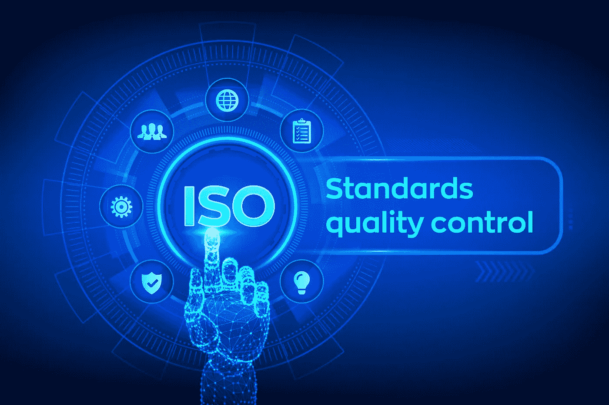
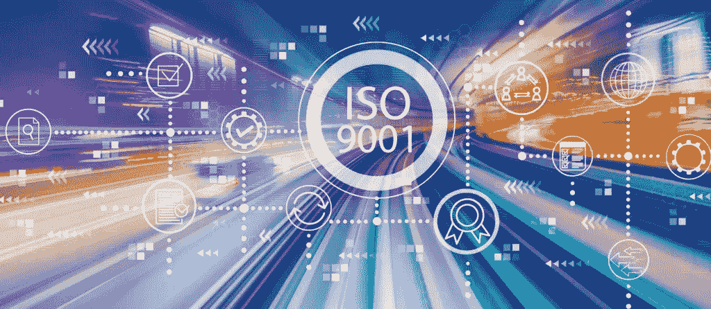
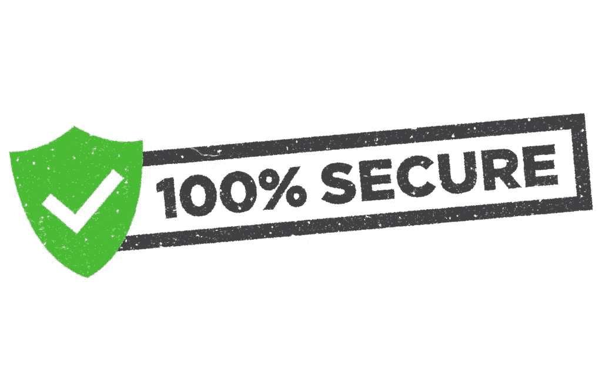

# 为什么公司应该获得 ISO 9001 和 27001 证书:对他们和他们的客户的好处

> 原文：<https://medium.datadriveninvestor.com/benefits-of-iso-9001-and-27001-for-companies-and-their-clients-944ba79be80c?source=collection_archive---------3----------------------->

随着政府机构制定的安全法规不断演变，企业努力不断适应并相互保证他们符合最新的规则和最佳实践。公司做到这一点的方法之一是获得 ISO 20071 和 9001 认证。在本文中，我们将进一步了解 ISO 认证的含义以及获得这些认证的要求。

# 什么是 ISO 9001？

ISO 创建了这一认证，作为全球公司质量管理体系(QMS)的标准。这些规则支配着企业在创造产品并交付给客户时所遵循的所有流程。每个公司都可以根据自己的需求定制质量管理体系，但它仍然必须符合 ISO 9001 规定的国际标准。ISO 9001 认证有许多好处:

 [## 网络安全非营利组织帮助中小企业打击网络犯罪|数据驱动的投资者

### 一个名为全球网络联盟(GCA)的非营利组织发誓要改善…

www.datadriveninvestor.com](https://www.datadriveninvestor.com/2019/02/22/cybersecurity-non-profit-to-help-smes-fight-against-cybercrime/) 

*   提高可信度——当客户看到您获得 ISO 9001 认证时，他们知道您的内部流程是为了满足他们的要求。
*   提高客户满意度——ISO 9001 的主要关注点之一是确定客户的需求，并提供尽可能好的产品。
*   更紧密的流程——ISO 9001 不仅管理单个流程，还管理它们之间的交互方式。这提供了更好的组织水平并加快了交付。

并不是说我们有 ISO 9001 的定义和它的好处，让我们看看一个公司如何获得这样的认证。

# 如何通过 ISO 9001 认证

为了获得该证书，公司必须执行以下步骤:

1.  进行内部审计—这样做是为了让您能够初步了解您当前的规则和流程与 ISO 9001 要求的对比情况。
2.  管理审查—公司的最高管理层将聚在一起评估审计结果，并分配资源以符合 ISO 9001 标准。
3.  纠正措施—在这一阶段，您修复了在审核过程中发现的所有问题。
4.  第一认证阶段 ISO 的审核员将检查您的文档，以确保您符合认证标准。
5.  第二认证阶段——这是审计师对所有行为和活动以及公司实践进行更彻底审查的阶段。

# 什么是 ISO 27001？

该认证针对您的信息安全管理系统(ISMS)。ISMS 是控制信息风险管理流程的所有政策。ISO 27001 为 ISMS 管理层提供了国际标准，以确保所有必要的安全流程都已到位，并且客户数据得到保护。信息安全有许多好处，例如:

*   增强客户信心——客户会信任您的文档和数据
*   更好的业务弹性——ISO 27001 规定的操作可以保护您的业务免受内部和外部威胁。
*   与客户一致的流程——由于 ISO 要求是各地公司的标准，您的流程将与客户的一致，从而进一步增加信任。

记住所有这些，让我们来看看 ISO 27001 认证流程。

# ISO 27001 要求清单

要获得 ISO 27001 认证，公司必须执行以下步骤:

1.  初步评估——这将有助于确定是否符合强制性要求。
2.  二级评估——确定系统的有效性，并确保管理系统已经实施。
3.  认证建议 ISO 将审查为解决步骤 1 和 2 中发现的问题而采取的任何纠正措施。
4.  认证审查和决定——公司的文件将由一个独立的小组审查，并就认证做出决定。
5.  颁发证书——成功完成所有步骤后，公司将获得 ISO 27001 证书。

[Skywell Software LLC](https://skywell.software/) 了解这些认证的重要性以及它给我们的客户带来的信任和安心。这就是为什么我们目前正在通过获得这些证书的过程，以更好地为我们的客户服务，并遵守国际标准。

# 让您的服务更上一层楼

ISO 提供的指南是最佳实践，可确保您的内部流程旨在满足客户的要求，并确保您的安全标准符合国际规范。当公司看到他们的服务提供商已经实施了 ISO 规定的所有要求时，这将增加双方之间的信任度，并帮助您的企业从竞争对手中脱颖而出。

虽然实施所有的 ISO 标准需要时间和资源的投入，但这将会给你的企业带来好处。事实上，现在许多公司都要求潜在的服务提供商拥有 ISO 认证，这将允许您对要求此类认证的公司的报价请求做出回应。更重要的是，它将使你能够改善你的公司和你创造的产品质量，同时提高客户满意度。今天就开始您的 ISO 认证之旅，收获它将为您的企业带来的所有回报。

*最初发布于*[*https://sky well . software*](https://skywell.software/blog/benefits-of-iso-9001-and-27001/)*。*